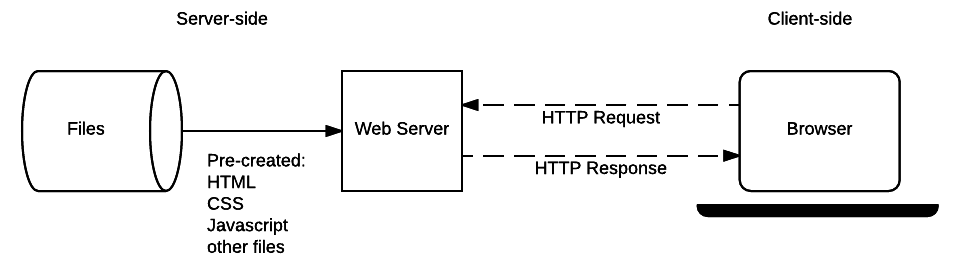
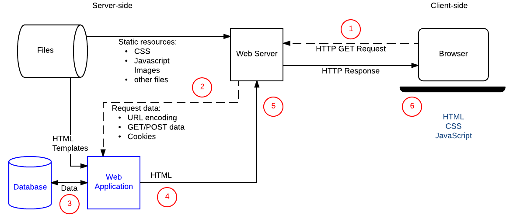

# Introduction to Server-Side Programming 

---

## Table of Contents

1. [What is Server-Side Website Programming?](#1-what-is-server-side-website-programming)
2. [Static Sites vs Dynamic Sites](#2-static-sites-vs-dynamic-sites)
3. [Server-Side vs Client-Side Programming](#3-server-side-vs-client-side-programming)
4. [Programming Languages and Web Frameworks](#4-programming-languages-and-web-frameworks)
5. [What Can You Do on the Server-Side?](#5-what-can-you-do-on-the-server-side)
6. [Real-World Examples of Server-Side Programming](#6-real-world-examples-of-server-side-programming)
7. [Summary — Key Concepts at a Glance](#7-summary--key-concepts-at-a-glance)

---

## 1. What is Server-Side Website Programming?

**Server-side programming** (also called **back-end scripting**) refers to code that runs on a web server — not in the user's browser — and is responsible for determining what content is returned to the client in response to each HTTP request.

Most large-scale websites rely heavily on server-side code to **dynamically display different data when needed**, generally by:

1. Pulling data out of a **database** stored on the server
2. Processing that data with server-side logic
3. Sending the result to the client to be displayed via HTML and JavaScript

### Why server-side programming matters

The most significant benefit of server-side code is that it allows you to **tailor website content for individual users**. This enables:

- Highlighting content that is more relevant based on a user's **preferences and habits**
- Storing personal information to streamline the user experience (e.g. saved payment details, saved addresses)
- **Interacting with users** through notifications, updates via email, SMS, or other channels
- Enabling **much deeper engagement** with users than a static site could ever achieve

> **In summary:** Server-side code decides *what* is sent to the user. Client-side code decides *how* it is displayed.

---

## 2. Static Sites vs Dynamic Sites

### Static sites

A **static site** returns the same hard-coded content from the server whenever a particular resource is requested — regardless of who is asking or what data exists.

**How it works:**
1. The browser sends an HTTP `GET` request specifying the page URL
2. The server retrieves the matching document from its **file system**
3. The server returns an HTTP response with the document and a `200 OK` status
4. If the file cannot be found, an error status is returned (e.g. `404 Not Found`)

**Characteristics:**
- No server-side logic — the server only reads and returns files
- Every user requesting the same URL gets **identical content**
- Content is pre-built and stored as individual files

**Limitation:** Creating a separate static page for every product, article, or user is completely impractical at scale. A site like Amazon with millions of products cannot store millions of individual HTML files.

---

### Dynamic sites

A **dynamic site** generates some or all of its response content **at request time**, based on:
- The specific URL requested
- Information provided by the user
- Data stored in a database
- The user's preferences, session, or stored history

**How it works:**

1. Browser sends an HTTP request to the server
2. The web server receives the request
3. **Static resources** (CSS, JS, images, pre-created PDFs) are handled just like a static site — retrieved directly from the file system and returned
4. **Dynamic requests** are forwarded to the **server-side code (web application)**
5. The web application reads the required data from the **database**
6. It combines that data with **HTML templates** (inserting data into placeholders)
7. The generated HTML is sent back to the browser as the HTTP response

**Why dynamic sites are superior for large-scale content:**
- A database stores information in an **efficient, extensible, modifiable, and searchable** way
- Changing the structure of a page only requires editing **one template** — not thousands of individual files
- Content can be **personalised** to each individual user

---

### Static vs Dynamic — side-by-side comparison

| Feature | Static site | Dynamic site |
|---|---|---|
| Content | Same for every user | Tailored per user or request |
| Storage | Individual HTML files on file system | Data in a database + HTML templates |
| Server-side logic | None | Full server-side code (web application) |
| Scalability | Poor — one file per page | Excellent — one template, unlimited content |
| Personalisation | Not possible | Fully supported |
| Maintenance | High — edit every file individually | Low — edit one template or database record |
| Use case | Small sites, portfolios, documentation | Ecommerce, social media, news, banking, SaaS |

---

## 3. Server-Side vs Client-Side Programming

Server-side and client-side programming are **fundamentally different** in their purpose, environment, languages, and concerns — even though they work together to deliver a complete web experience.

### Purpose and concerns

| | Client-side (front end) | Server-side (back end) |
|---|---|---|
| **Primary concern** | The appearance and behaviour of the page in the browser | What content is returned to the browser in response to requests |
| **Tasks** | Selecting and styling UI components, layouts, navigation, form validation, animations | Validating submitted data, querying databases, authentication, generating responses, business logic |
| **Where it runs** | Inside the user's **web browser** | On the **web server** |
| **Output** | Visual rendering of a web page | HTTP responses containing data, HTML, JSON, files, etc. |

### Languages used

**Client-side languages** are limited to what browsers can execute:
- **HTML** — structure of the page
- **CSS** — styling and layout
- **JavaScript** — interactivity and dynamic behaviour in the browser

**Server-side languages** are far more varied — the developer can choose any language the server supports:
- **PHP** — widely used, especially for CMS platforms like WordPress
- **Python** — popular for web apps, data processing, and APIs (used with Django, Flask)
- **Ruby** — known for rapid development (used with Ruby on Rails)
- **C#** — used in Microsoft/.NET environments (used with ASP.NET)
- **JavaScript (Node.js)** — JavaScript running on the server, not just the browser

> **Note:** JavaScript is the one exception — it can run on **both** the client side (in the browser) and the server side (via Node.js). Every other language listed above is server-side only.

### Operating environment

| | Client-side | Server-side |
|---|---|---|
| **Runs inside** | Web browser | Web server operating system |
| **OS access** | Little to none — sandboxed by the browser | **Full access** to the server operating system |
| **File system access** | Very limited | Complete — can read, write, and manage files |
| **Control over environment** | None — depends on the user's browser | Complete — developer chooses OS, language, version, configuration |

### The browser compatibility problem (client-side only)

Web developers writing client-side code face a significant challenge: **they cannot control what browser the user is using**. Different browsers:
- Support different levels of HTML, CSS, and JavaScript features
- May render pages differently
- May have different bugs and limitations

Handling browser inconsistencies gracefully is one of the core challenges of client-side programming. Server-side developers do not face this problem — they fully control the server environment.

---

## 4. Programming Languages and Web Frameworks

### Choosing a server-side language

Because the developer has full control over the server environment, they can choose **any programming language** they wish — along with a specific version of that language. The choice typically depends on:
- The developer's existing skills and experience
- The nature of the application being built
- Available libraries, frameworks, and community support
- Performance requirements

### Why web frameworks are essential

A **web framework** is a collection of functions, objects, rules, and other code constructs designed to:
- Solve **common, repetitive problems** that every web application faces
- **Speed up development** significantly
- **Simplify** complex tasks that would otherwise require extensive low-level code

> **Example:** Implementing an HTTP server from scratch in Python is genuinely hard. A Python web framework like Django provides one out of the box — along with URL routing, database access, templating, authentication, and much more. You would almost never build a server-side web application without a framework.

### What server-side frameworks provide

| Feature | What it does |
|---|---|
| **HTTP server** | Handles incoming connections, parsing HTTP requests, sending responses |
| **URL routing** | Maps specific URLs to specific handler functions in your code |
| **Session management** | Stores and retrieves data associated with individual users across requests |
| **User authentication** | Tools for user registration, login, logout, and permission management |
| **Database access** | ORM (Object-Relational Mapper) — query databases using code instead of raw SQL |
| **Templating** | Merge data from the database with HTML templates to generate dynamic pages |
| **Form handling** | Parse and validate form data submitted by users |
| **Security** | Built-in protection against common attacks (CSRF, SQL injection, XSS) |

### Client-side vs server-side frameworks — key difference

| | Client-side frameworks | Server-side frameworks |
|---|---|---|
| **Examples** | React, Vue, Angular, Svelte | Django, Flask, Express, Rails, Laravel |
| **Primary purpose** | Simplify layout, UI components, and presentation | Provide core web server functionality (sessions, auth, database, templating) |
| **Optional?** | Yes — small UIs can be hand-coded | Almost never — implementing a full HTTP server from scratch is impractical |

---

## 5. What Can You Do on the Server-Side?

Server-side programming unlocks a vast range of capabilities that are simply impossible with client-side code alone. Below are the most important categories:

---

### 1. Efficient storage and delivery of information

**The problem server-side code solves:**
- Amazon has millions of products. Facebook has billions of posts. Creating a separate static HTML page for each one is completely impractical.

**The server-side solution:**
- Store all the information in a **database**
- Use **one HTML template** to generate any number of pages dynamically
- Return the right data for each request by querying the database at request time

**Additional capabilities:**
- Return data in multiple formats: HTML pages, PDFs, images, **JSON, XML** (for JavaScript-rendered apps and mobile apps)
- Return results of **software tools** or data from external communications services
- Target content to the **type of device** making the request (mobile, desktop, tablet)
- Share and update data with other business systems — e.g. when a product sells online, the inventory database updates automatically

> **Observation:** Search "fish" on Amazon. Millions of results appear — all with a consistent page structure, but unique content. The page structure is a template; the content comes from the database. This is server-side programming at scale.

---

### 2. Customised user experience

Server-side code can store and use information about individual users to deliver a **personalised, convenient experience**.

**Examples:**
- **Ecommerce sites** store credit card and address details so users don't have to re-enter them on every purchase
- **Google Maps** uses your saved and current location to provide routing, and uses your search history to highlight relevant local businesses
- **Streaming services** (Netflix, Spotify) analyse your viewing/listening habits to recommend content you are likely to enjoy
- **News sites** surface articles related to topics you have previously read

**Deeper personalisation through data analysis:**
- A detailed analysis of user habits can **anticipate interests** before the user even searches for something
- Responses, recommendations, and notifications can be **pre-tailored** based on patterns in past behaviour

> **Example:** Search for "football" on Google, then start typing "favorite" — the autocomplete suggestions are influenced by your search history. This is server-side personalisation in action.

---

### 3. Controlled access to content

Server-side programming allows sites to **restrict access** to resources based on who the user is and what they are authorised to see.

**How it works:**
- The server checks the user's **identity and permissions** before deciding what content to return
- Unauthorised users are shown a login page, an error, or a restricted view

**Real-world examples:**
- **Social networks** — users control who can see their posts; only followers/friends see private content
- **Banking websites** — account details, transaction history, and financial tools are only visible after authentication; only the bank can modify certain fields
- **Subscription media** — only paying subscribers can access premium articles, videos, or features
- **Corporate intranets** — internal documents and tools are only accessible to authenticated employees

---

### 4. Session and state management

HTTP is inherently **stateless** — each request is independent and the server does not remember previous requests by default. **Sessions** solve this problem.

A **session** is a mechanism that allows a server to store information associated with a specific user and carry that information across multiple requests.

**What sessions enable:**
- Knowing a user is **logged in** — so they don't have to log in again on every page
- Displaying personalised content — links to **order history**, **saved items**, or **email inbox**
- Remembering **in-progress actions** — e.g. items in a shopping cart that persist between visits
- Saving **game state** — so a user can leave and return to exactly where they left off
- Tracking **usage quotas** — e.g. a news site that allows 5 free articles per month and then redirects to a subscription page

**How sessions are stored:**
- Session data is typically stored on the **server**, with a session identifier sent to the client as a **cookie**
- The cookie is sent back with every subsequent request, allowing the server to look up the associated session data

> **Example:** Visit a newspaper site with a subscription model. After reading several articles, you are redirected to a subscribe page — even if you clear the page and try again. The server is tracking how many articles you have read via session information stored in a cookie.

---

### 5. Notifications and communication

Web servers can initiate **outbound communication** with users — not just respond to inbound requests.

**Channels available:**
- **Email** — registration confirmations, password resets, order confirmations, newsletters, product recommendations
- **SMS** — two-factor authentication codes, delivery updates, alerts
- **Push notifications** — browser or mobile app notifications for messages, updates, or alerts
- **In-app messages** — notifications shown within the website or application itself
- **Automated alerts** — server administrators can receive alerts about low memory, high error rates, or suspicious activity

**Real-world examples:**
- **Facebook and Twitter** send email and SMS notifications for new messages, mentions, and activity
- **Amazon** sends product recommendation emails based on browsing and purchase history
- **Google, Amazon, Instagram** send registration confirmation emails when a new account is created
- **Web servers** send automated warning messages to administrators when system resources are low or unusual activity is detected

---

### 6. Data analysis

Websites collect enormous amounts of data about user behaviour:
- What users **search for**
- What they **buy or click on**
- What they **recommend or share**
- How long they spend on **each page**
- What **device** and **location** they use

Server-side programming can process and analyse this data to:
- **Refine responses** — surface more relevant content based on patterns
- **Improve recommendations** — suggest products, articles, or connections likely to interest the user
- **Personalise advertising** — show ads related to previously viewed products or searches
- **Optimise content ranking** — prioritise content with higher engagement (likes, shares, watch time)

**Real-world examples:**
- **Amazon and Google** advertise products based on previous searches and purchases
- **Facebook's feed algorithm** does not display posts in simple chronological order — it ranks posts based on your likes, interactions, and viewing habits
- **YouTube** recommends videos based on watch history, watch time, and engagement patterns
- **Spotify** generates personalised playlists (Discover Weekly, Daily Mixes) based on listening history

---

## 6. Real-World Examples of Server-Side Programming

| Company / Service | Server-side programming used for |
|---|---|
| **Amazon** | Constructing search results, targeted product recommendations based on browsing and purchase history, streamlining checkout with saved payment details |
| **Banks** | Storing account information, authenticating users, authorising transactions, restricting access to sensitive data |
| **Facebook** | Personalising news feeds, controlling content visibility, sending notifications, ranking posts by engagement |
| **Twitter / X** | Managing timelines, notifications, content moderation, analytics |
| **Instagram** | Content discovery, personalised explore pages, targeted advertising |
| **Wikipedia** | Storing and serving encyclopaedia content dynamically, managing user editing and permissions |
| **Google Maps** | Using saved/current location for routing, surfacing local businesses based on search and visit history |
| **Netflix** | Personalised content recommendations, access control by subscription tier, multi-device session management |

---

## 7. Summary — Key Concepts at a Glance

| Concept | Definition |
|---|---|
| **Server-side programming** | Code that runs on the web server; controls what content is sent to the client |
| **Client-side programming** | Code that runs in the browser; controls how content is displayed and how the user interacts with it |
| **Static site** | Returns the same hard-coded content for every request — no server-side logic |
| **Dynamic site** | Generates content at request time using server-side code, a database, and HTML templates |
| **Web application** | The server-side code that processes HTTP requests and returns HTTP responses |
| **Database** | Stores structured data (products, users, posts) that the web application queries to build responses |
| **HTML template** | An HTML file with placeholders filled by the server with real data at request time |
| **Session** | A mechanism for the server to store and retrieve data associated with a specific user across multiple requests |
| **Cookie** | A small piece of data stored on the client and sent with every request — often used to carry a session ID |
| **Web framework** | A collection of tools and code that handles common server-side tasks (routing, database access, auth, templating) |
| **ORM** | Object-Relational Mapper — lets server-side code query a database using the programming language instead of raw SQL |
| **URL routing** | Mapping specific URLs to specific handler functions in the server-side code |
| **Authentication** | Verifying a user's identity (login) |
| **Authorisation** | Verifying what a confirmed user is allowed to access or do |
| **Personalisation** | Tailoring content, layout, or recommendations to an individual user based on their data and behaviour |
| **Notifications** | Outbound messages from the server to users via email, SMS, push notifications, or in-app messages |

---

