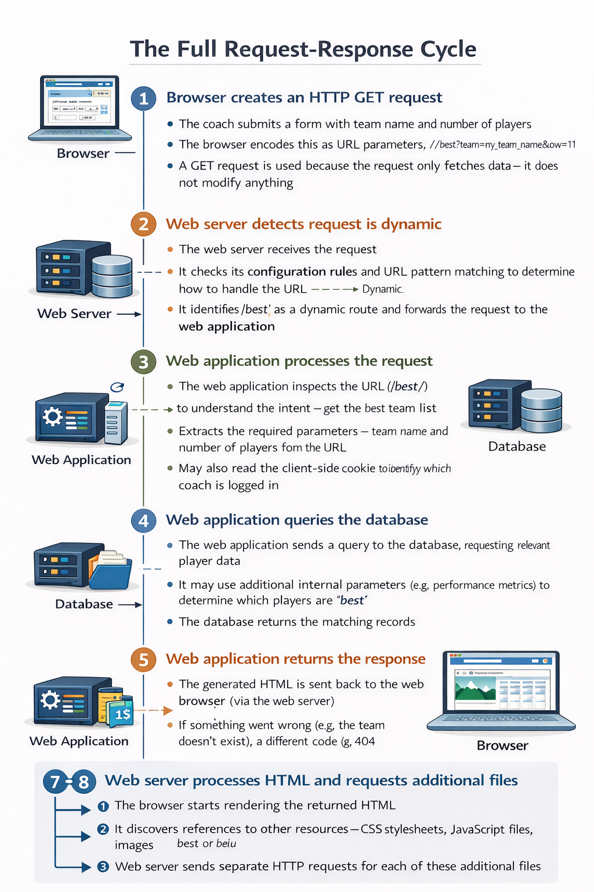

# Client-Server Overview 

---

## Table of Contents

1. [Web Servers and HTTP — A Primer](#1-web-servers-and-http--a-primer)
2. [Anatomy of an HTTP Request](#2-anatomy-of-an-http-request)
3. [Anatomy of an HTTP Response](#3-anatomy-of-an-http-response)
4. [HTTP Methods (Verbs)](#4-http-methods-verbs)
5. [How Data is Encoded in Requests](#5-how-data-is-encoded-in-requests)
6. [GET Request and Response — Real Example](#6-get-request-and-response--real-example)
7. [POST Request and Response — Real Example](#7-post-request-and-response--real-example)
8. [Static Sites](#8-static-sites)
9. [Dynamic Sites](#9-dynamic-sites)
10. [Anatomy of a Dynamic Request — Step by Step](#10-anatomy-of-a-dynamic-request--step-by-step)
11. [What Else Can a Web Application Do?](#11-what-else-can-a-web-application-do)
12. [Web Frameworks — Simplifying Server-Side Programming](#12-web-frameworks--simplifying-server-side-programming)
13. [Summary — Key Concepts at a Glance](#13-summary--key-concepts-at-a-glance)

---

## 1. Web Servers and HTTP — A Primer

Web browsers communicate with web servers using **HTTP — HyperText Transfer Protocol**.

Every interaction between a browser and a server begins with the browser sending an **HTTP Request**. This happens whenever you:
- Click a link on a web page
- Submit a form
- Run a search
- Navigate to a URL

The server processes the request and sends back an **HTTP Response** — which may contain a web page, an image, a file, data (JSON/XML), or simply a status message.

### What an HTTP Request contains

Every HTTP request includes:

1. **A URL** — identifies the target server and the specific resource being requested (e.g. an HTML file, a data point, a tool to run)
2. **A method (verb)** — defines what action is being requested (GET, POST, PUT, DELETE, etc. — see Section 4)
3. **Additional data** (optional) — encoded as URL parameters, POST body data, or cookies

### What an HTTP Response contains

Every HTTP response includes:

1. **A status code** — indicates whether the request succeeded or failed (e.g. `200 OK`, `404 Not Found`, `403 Forbidden`)
2. **A body** — the actual content returned (HTML, JSON, an image, etc.) — only present if the request succeeded and content was requested

### Important note about static and dynamic sites

Both **static** and **dynamic** websites use exactly the same HTTP communication protocol and request/response patterns. The difference is in how the server generates its response — not in how it communicates.

---

## 2. Anatomy of an HTTP Request

An HTTP request is a structured text message divided into two parts: the **header** and the **body**.

### The header
Contains metadata about the request — who is making it, what they can accept, where they came from, and what they are asking for. Key header fields include:

| Header field | Purpose | Example |
|---|---|---|
| **Request line** | The method, target URL, and HTTP version | `GET /en-US/search?q=hello HTTP/1.1` |
| `Host` | The target server domain | `developer.mozilla.org` |
| `User-Agent` | Identifies the browser and OS making the request | `Mozilla/5.0 (Windows NT 10.0...)` |
| `Accept` | What content types the browser can handle | `text/html, application/xhtml+xml` |
| `Accept-Encoding` | What compression formats the browser supports | `gzip, deflate, br` |
| `Accept-Language` | Preferred languages for the response | `en-US,en;q=0.8,es;q=0.6` |
| `Referer` | The page that contained the link to the current request | `https://developer.mozilla.org/en-US/` |
| `Cookie` | Session data about the client — used for login state, permissions, preferences | `sessionid=6ynxs23n521lu21b1t136rhbv7ezngie` |
| `Connection` | Whether to keep the connection alive after the response | `keep-alive` |
| `Content-Length` | Size of the request body (POST requests only) | `432` |
| `Content-Type` | Format of the request body (POST requests only) | `application/x-www-form-urlencoded` |

### The body
- For **GET requests:** the body is typically empty — data is passed via URL parameters instead
- For **POST requests:** the body contains the data being submitted (e.g. form field values)

---

## 3. Anatomy of an HTTP Response

Like a request, an HTTP response has a **header** and a **body**.

### The response header

| Header field | Purpose | Example |
|---|---|---|
| **Status line** | HTTP version and status code | `HTTP/1.1 200 OK` |
| `Server` | The web server software that handled the request | `Apache` |
| `Content-Type` | Format and character encoding of the response body | `text/html; charset=utf-8` |
| `Content-Length` | Size of the response body in bytes | `41823` |
| `Date` | When the response was generated | `Wed, 07 Sep 2016 00:11:31 GMT` |
| `Keep-Alive` | Connection persistence settings | `timeout=5, max=999` |
| `X-Frame-Options` | Security directive — e.g. prevents embedding in iframes | `DENY` |
| `Location` | Used in redirect responses — tells the browser where to go next | `https://developer.mozilla.org/en-US/profiles/hamishwillee` |
| `Cache-Control` / `Vary` | Caching behaviour instructions | `Accept, Cookie, Accept-Encoding` |

### The response body
- For successful `GET` requests: contains the requested resource (HTML, JSON, image binary, etc.)
- For `POST` requests that create or update data: often empty, with a redirect status code (`302 Found`) pointing the browser to a new page
- For failed requests: may contain an error page or be empty

### Common HTTP status codes

| Code | Meaning | When it occurs |
|---|---|---|
| `200 OK` | Request succeeded | Normal successful response |
| `301 Moved Permanently` | Resource has permanently moved | URL has changed; browser should update bookmarks |
| `302 Found` | Temporary redirect | After a successful POST, browser is redirected to another page |
| `403 Forbidden` | Access denied | User is not authorised to view the resource |
| `404 Not Found` | Resource does not exist | The URL points to nothing on the server |
| `500 Internal Server Error` | Server-side error | Something went wrong in the server code |

---

## 4. HTTP Methods (Verbs)

Every HTTP request must include a **method** that tells the server what action to perform. The most important methods are:

| Method | Action | Use case |
|---|---|---|
| `GET` | Retrieve a specific resource | Loading a web page, fetching an image, making a read-only API call |
| `POST` | Create a new resource | Submitting a sign-up form, adding a new record to a database |
| `PUT` | Update an existing resource (or create if it doesn't exist) | Editing a user profile, replacing a document |
| `DELETE` | Remove a specified resource | Deleting an account, removing a post |
| `HEAD` | Get metadata about a resource without downloading its body | Checking if a resource has changed before deciding whether to download it with GET |
| `TRACE`, `OPTIONS`, `CONNECT`, `PATCH` | Less common / advanced operations | Used in specific technical scenarios |

### Important rules about GET

- GET requests should **only retrieve data** — never modify it
- Data is passed in the **URL** (as parameters), not in the body
- URL parameters are **inherently insecure** — users can see and modify them
- Because of this, GET must **never be used for requests that update data on the server**

### Important rules about POST

- POST requests **create or modify data** on the server
- Data is passed in the **request body** — not visible in the URL
- More secure for sensitive information (passwords, personal data) than GET

---

## 5. How Data is Encoded in Requests

When a browser sends additional data alongside a request (e.g. search terms, form input), that data can be encoded in three ways:

### 1. URL parameters (query strings)
Used with **GET requests**. Data is appended to the URL after a `?`, with key-value pairs separated by `&`.

```
http://example.com?name=Fred&age=11
```

- `?` — separates the base URL from the parameters
- `=` — separates each key from its value
- `&` — separates multiple key-value pairs

**Limitations:** Visible in the browser address bar; can be modified by the user; not suitable for sensitive data or data-modifying operations.

### 2. POST body data
Used with **POST requests**. Data is encoded in the **body** of the request — not in the URL. This is how HTML form submissions work when creating or updating server-side data.

```
user-username=hamishwillee&user-fullname=Hamish+Willee&user-location=Australia
```

### 3. Cookies
Small pieces of data stored on the client and sent automatically with every request to the relevant domain. Cookies contain **session data** about the client, including:
- Session IDs — used to identify a logged-in user
- Authentication tokens — used to verify permissions and access to resources
- User preferences

---

## 6. GET Request and Response — Real Example

### The request

When a user searches MDN for "client-server overview", the browser sends:

```http
GET /en-US/search?q=client+server+overview&topic=apps&topic=html HTTP/1.1
Host: developer.mozilla.org
Connection: keep-alive
User-Agent: Mozilla/5.0 (Windows NT 10.0; WOW64) AppleWebKit/537.36 Chrome/52.0
Accept: text/html,application/xhtml+xml,application/xml;q=0.9,image/webp,*/*;q=0.8
Referer: https://developer.mozilla.org/en-US/
Accept-Encoding: gzip, deflate, sdch, br
Accept-Language: en-US,en;q=0.8,es;q=0.6
Cookie: sessionid=6ynxs23n521lu21b1t136rhbv7ezngie; csrftoken=zIPUJsAZv6pcgCBJSCj1zU6pQZbfMUAT
```

**Reading the request:**
- `GET` — method; retrieving data only
- `/en-US/search?q=client+server+overview...` — the target resource URL with search parameters
- `Host: developer.mozilla.org` — the target server
- `Cookie: sessionid=...` — session data identifying the logged-in user
- `User-Agent: Mozilla/5.0` — the browser is Firefox
- `Accept-Encoding: gzip` — the browser can handle compressed responses

### The response

```http
HTTP/1.1 200 OK
Server: Apache
Content-Type: text/html; charset=utf-8
Content-Length: 41823
Date: Wed, 07 Sep 2016 00:11:31 GMT
X-Frame-Options: DENY

<!doctype html>
<html lang="en-US">
  <head>
    ...
```

**Reading the response:**
- `200 OK` — request succeeded
- `Content-Type: text/html; charset=utf-8` — the response is an HTML document encoded in UTF-8
- `Content-Length: 41823` — the response body is approximately 41KB
- `X-Frame-Options: DENY` — the browser is instructed not to embed this page in an iframe on another site (security measure)
- The body contains the actual HTML of the search results page

---

## 7. POST Request and Response — Real Example

### The request

When a user submits updated profile details on MDN, the browser sends:

```http
POST /en-US/profiles/hamishwillee/edit HTTP/1.1
Host: developer.mozilla.org
Content-Length: 432
Content-Type: application/x-www-form-urlencoded
Cookie: sessionid=6ynxs23n521lu21b1t136rhbv7ezngie; csrftoken=zIPUJsAZv6pcgCBJSCj1zU6pQZbfMUAT

csrfmiddlewaretoken=zIPUJsAZv6pcgCBJSCj1zU6pQZbfMUAT&user-username=hamishwillee
&user-fullname=Hamish+Willee&user-location=Australia&user-locale=en-US
```

**Key differences from a GET request:**
- Method is `POST` — data is being created/modified, not just retrieved
- The URL has **no parameters** — the data is in the **body**, not the URL
- `Content-Type: application/x-www-form-urlencoded` — tells the server how the body data is formatted
- `Content-Length: 432` — the body is 432 bytes

### The response

```http
HTTP/1.1 302 FOUND
Server: Apache
Location: https://developer.mozilla.org/en-US/profiles/hamishwillee
Content-Length: 0
```

**Reading the response:**
- `302 Found` — the POST succeeded; the server is redirecting the browser to another page
- `Location: https://developer.mozilla.org/en-US/profiles/hamishwillee` — the browser must now make a **second GET request** to load the updated profile page
- `Content-Length: 0` — the POST response body is empty; the actual content comes from the subsequent GET

> **The POST-Redirect-GET pattern:** After a successful form submission (POST), servers respond with a redirect (302) rather than HTML directly. This prevents the user from accidentally re-submitting the form if they refresh the page.

---

## 8. Static Sites

A **static site** returns the same hard-coded content from the server every time a particular resource is requested, regardless of who is asking or what data exists on the server.

### How static sites work

1. User navigates to a page — browser sends an **HTTP GET request** with the page's URL
2. Server retrieves the matching file from its **file system**
3. Server returns an **HTTP 200 OK** response with the file as the body
4. Browser renders the content

### Characteristics of static sites

- The server only ever needs to process **GET requests** — there is no modifiable data stored server-side
- Responses do **not change** based on URL parameters, cookies, or any other request data
- Every user requesting the same URL receives **identical content**
- Content is stored as individual files (HTML, images, CSS, JS) directly on the server

### Limitations of static sites

- Adding new content requires creating a **new file** manually
- If you have thousands of pages, repeating shared structure (navigation, footer, templates) across all of them becomes extremely **inefficient**
- Changing any structural element (e.g. adding a "related products" section) requires editing **every single page individually**
- Not practical for large, data-driven websites

### When static sites are appropriate

- Small sites with a limited number of pages
- Sites where all users should see exactly the same content
- Marketing pages, documentation, personal portfolios

> **Note:** Even dynamic sites handle requests for static files (CSS, JavaScript, images) in exactly the same way as static sites — the web server simply reads the file and returns it.

---

## 9. Dynamic Sites

A **dynamic site** generates and returns content based on the specific request URL and data — rather than returning the same hard-coded file every time. The response is constructed on the fly for each request.

### How dynamic sites work (conceptual overview)

Instead of storing individual HTML files for each product/article/user, a dynamic site stores **data in a database** and uses **HTML templates** to construct pages at request time.

**Example:** An ecommerce site with 10,000 products does not store 10,000 HTML files. It stores product data in a database and one HTML template. When a product page is requested, the server fetches that product's data and injects it into the template, generating a complete HTML page dynamically.

### Advantages of dynamic sites over static sites

| Advantage | Explanation |
|---|---|
| **Efficient data storage** | A database stores information in an extensible, modifiable, and searchable way — far more efficient than thousands of individual files |
| **Easy structural changes** | Changing the HTML structure only requires editing **one template** — not thousands of individual pages |
| **Personalisation** | The server can tailor content to individual users based on their session, preferences, or permissions |
| **Real-time data** | Content can reflect the very latest data from the database at the moment of each request |
| **Scalability** | Adding new products, articles, or users only requires adding a database record — no new files needed |

### Key components of a dynamic website

| Component | Role |
|---|---|
| **Web server** | Receives HTTP requests; forwards dynamic requests to the web application; serves static files directly |
| **Web application** | Server-side code that processes requests, queries the database, and generates responses |
| **Database** | Stores structured data — products, users, posts, relationships between them |
| **HTML templates** | Page structure with placeholders where dynamic data is inserted at request time |

---

## 10. Anatomy of a Dynamic Request — Step by Step

Using the example of a sports-team manager website, where a coach submits a form to get a suggested "best lineup":



### Visual summary of the flow

```
Browser
  │
  │── HTTP GET /best?team=tigers&show=11 ──▶ Web Server
  │                                              │
  │                                     detects dynamic route
  │                                              │
  │                                              ▼
  │                                        Web Application
  │                                              │
  │                                    queries database
  │                                              │
  │                                              ▼
  │                                          Database
  │                                              │
  │                                    returns player data
  │                                              │
  │                                              ▼
  │                                        Web Application
  │                                              │
  │                                    inserts data into template
  │                                              │
  │◀── HTTP 200 OK + generated HTML ──────────-──┘
  │
  │── HTTP GET /static/style.css ────────▶ Web Server
  │◀── HTTP 200 OK + CSS file ───────────────────┘
```

### Updating data (POST requests in dynamic sites)

When a user **updates** data (rather than just reading it):
- The browser sends a **POST request** instead of GET
- The web application receives the POST, validates the data, and runs an **UPDATE** or **INSERT** operation on the database
- The server typically responds with a **redirect (302)** to a GET request for the updated page — the POST-Redirect-GET pattern

---

## 11. What Else Can a Web Application Do?

A web application's primary job is to receive HTTP requests and return HTTP responses. But server-side code can do much more than simply query a database and return HTML.

### Other tasks a web application might perform

- **Sending emails** — e.g. a confirmation email when a user registers, a password reset email, an order confirmation
- **Logging** — recording activity, errors, and events for monitoring and debugging
- **Data processing** — running calculations, transformations, or analysis on data before returning it
- **Scheduled tasks** — running background jobs (e.g. sending daily newsletter digests, clearing expired sessions)
- **Interacting with external APIs** — fetching data from third-party services (weather, payment processors, social media)
- **File processing** — generating PDFs, processing image uploads, creating CSV exports

### Returning content other than HTML

Server-side code can return many different types of content, not just HTML pages:

| Return type | Use case |
|---|---|
| `text/html` | Standard web pages |
| `application/json` | Data for JavaScript apps and mobile apps (REST API responses) |
| `application/xml` | Structured data exchange |
| `text/csv` | Data exports |
| `application/pdf` | Generated reports and documents |
| Binary data | File downloads (images, audio, video, executables) |

> **Key trend:** Many modern websites fetch content from the server using **JavaScript** (AJAX/fetch API) and update the page dynamically — without reloading the entire page. In these cases, the server returns **JSON data** rather than full HTML pages. This is how single-page applications (SPAs) and most mobile apps work.

---

## 12. Web Frameworks — Simplifying Server-Side Programming

Without a web framework, a developer would have to manually implement every aspect of request handling from scratch. **Web frameworks** provide reusable tools and structures that handle the common, repetitive tasks automatically.

### What web frameworks do

#### 1. URL routing — mapping URLs to handler functions
One of the most important features. A framework lets you define which function should run when a specific URL is requested — keeping code organised and making URL changes easy.

**Example — Django (Python) URL routing:**

```python
# file: best/urls.py
from django.conf.urls import url
from . import views

urlpatterns = [
    # Requests to /best/ are handled by views.index()
    url(r'^$', views.index),
    # Requests to /best/junior/ are handled by views.junior()
    url(r'^junior/$', views.junior),
]
```

- Each URL pattern is mapped to a specific **view function**
- Changing a URL only requires updating the pattern in one place — the handler function does not change
- **Regular expressions (RegEx)** can match dynamic URL patterns (e.g. `/products/42/` where `42` is a variable product ID)

#### 2. Database abstraction via models
Frameworks provide an **ORM (Object-Relational Mapper)** that lets you interact with a database using Python (or whatever language the framework uses) rather than writing raw SQL.

**Example — Django model query:**

```python
# best/views.py
from django.shortcuts import render
from .models import Team

def junior(request):
    list_teams = Team.objects.filter(team_type__exact="junior")
    context = {'list': list_teams}
    return render(request, 'best/index.html', context)
```

- `Team.objects.filter(team_type__exact="junior")` — retrieves all Team records where `team_type` equals `"junior"`
- No SQL required — the framework translates this into the appropriate database query
- Results can be filtered, ordered, and paginated using a simple, readable query syntax

#### 3. Template rendering
Frameworks provide a **templating engine** that merges data with HTML templates to generate complete pages.

- The `render()` function in Django takes the request, a template file, and a context dictionary
- The context contains the data fetched from the database
- The template contains HTML with placeholder variables that are replaced with the actual data
- A complete HTML response is returned

#### 4. Other framework features (typical)
- **Form handling and validation** — parsing submitted form data, checking it is valid
- **Authentication and sessions** — managing user login, logout, and session state
- **Security** — built-in protection against common attacks (CSRF, SQL injection, XSS)
- **Static file management** — serving CSS, JS, and image assets efficiently
- **Middleware** — reusable components that process every request/response (e.g. logging, authentication checks)

### Popular web frameworks

| Language | Framework | Characteristics |
|---|---|---|
| Python | Django | Full-featured, "batteries included", great for large apps |
| Python | Flask | Lightweight and minimal, good for small apps and APIs |
| JavaScript | Express.js | Minimal Node.js framework, very popular for REST APIs |
| Ruby | Ruby on Rails | Convention over configuration, rapid development |
| PHP | Laravel | Full-featured, elegant syntax, large community |
| Java | Spring | Enterprise-grade, highly configurable |

---

## 13. Summary — Key Concepts at a Glance

| Concept | Definition |
|---|---|
| **HTTP** | The protocol browsers and servers use to communicate |
| **HTTP Request** | A message from the browser to the server — includes method, URL, headers, and optional body |
| **HTTP Response** | A message from the server to the browser — includes status code, headers, and optional body |
| **GET** | HTTP method for retrieving data — data passed in URL parameters |
| **POST** | HTTP method for creating/modifying data — data passed in request body |
| **URL parameters** | Key-value pairs appended to a URL after `?` — used with GET requests |
| **Cookies** | Client-side session data sent automatically with every request |
| **Status code** | A 3-digit number indicating the result of a request (200, 302, 404, 500, etc.) |
| **Static site** | Returns the same hard-coded content for every request — no server-side logic |
| **Dynamic site** | Generates content at request time by querying a database and filling HTML templates |
| **Web application** | Server-side code that processes requests, queries databases, and returns responses |
| **Database** | Stores structured data used to generate dynamic content |
| **HTML template** | An HTML file with placeholders that are filled with data at request time |
| **Web framework** | Software that provides tools (routing, ORM, templating) to simplify server-side development |
| **ORM** | Object-Relational Mapper — lets you query a database using code instead of raw SQL |
| **URL routing** | Mapping specific URLs to specific handler functions in the server-side code |
| **POST-Redirect-GET** | A pattern where a POST response redirects (302) to a GET request, preventing duplicate form submissions |

---

