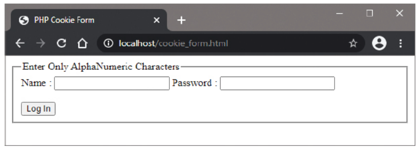

# 10.1: Submitting Cookie Data

## Overview

Cookies are small text files stored on the client's machine that allow web applications to remember user data across multiple pages and visits. They provide a convenient way to persist information without requiring users to repeatedly enter the same data, enhancing user experience and enabling personalized web experiences.

## Understanding Cookies

Cookies serve several important purposes in web development:

- **User Authentication**: Remember login sessions
- **User Preferences**: Store theme choices, language settings
- **Shopping Carts**: Maintain cart contents across sessions
- **Personalization**: Customize content based on user behavior
- **Tracking**: Monitor user activity and analytics

## The PHP setcookie() Function

PHP provides the `setcookie()` function to create cookies on the client's machine. The basic syntax requires three essential arguments:

```php
setcookie(name, value, expiry_time);
```

### Basic Parameters

| Parameter | Description | Required | Example |
|-----------|-------------|-----------|----------|
| `name` | The cookie name (key) | Yes | `"username"` |
| `value` | The cookie value | Yes | `"john_doe"` |
| `expiry_time` | Unix timestamp when cookie expires | Yes | `time() + 3600` |

### Extended Parameters

The `setcookie()` function can accept additional optional parameters:

```php
setcookie(name, value, expiry_time, path, domain, secure, httponly);
```

| Parameter | Description | Default | Example |
|-----------|-------------|----------|----------|
| `path` | Directory path where cookie is available | Current directory | `"/"` |
| `domain` | Domain where cookie is valid | Current domain | `"example.com"` |
| `secure` | HTTPS-only transmission | `false` | `true` |
| `httponly` | HTTP-only (not accessible via JavaScript) | `false` | `true` |

## Working with Form Data and Cookies

When an HTML form submits data using the POST method, PHP automatically assigns the field data to the `$_POST` superglobal array. We can then check for the presence of specific fields using the `isset()` function and store the data in cookies.

### Complete Example: cookie_form.html

```html
<!DOCTYPE html>
<html lang="en">
<head>
    <meta charset="UTF-8">
    <meta name="viewport" content="width=device-width, initial-scale=1.0">
    <title>Cookie Data Form</title>
    <style>
        body {
            font-family: Arial, sans-serif;
            max-width: 600px;
            margin: 0 auto;
            padding: 20px;
            background-color: #f5f5f5;
        }
        .container {
            background: white;
            padding: 30px;
            border-radius: 10px;
            box-shadow: 0 2px 10px rgba(0,0,0,0.1);
        }
        .form-group {
            margin-bottom: 20px;
        }
        .form-group label {
            display: block;
            margin-bottom: 5px;
            font-weight: bold;
            color: #333;
        }
        .form-group input {
            width: 100%;
            padding: 12px;
            border: 2px solid #ddd;
            border-radius: 5px;
            font-size: 16px;
            transition: border-color 0.3s;
        }
        .form-group input:focus {
            outline: none;
            border-color: #007bff;
        }
        .btn {
            background: #007bff;
            color: white;
            padding: 12px 30px;
            border: none;
            border-radius: 5px;
            cursor: pointer;
            font-size: 16px;
            transition: background-color 0.3s;
        }
        .btn:hover {
            background: #0056b3;
        }
        .info {
            background: #e7f3ff;
            padding: 15px;
            border-radius: 5px;
            margin-bottom: 20px;
            border-left: 4px solid #007bff;
        }
        .warning {
            background: #fff3cd;
            padding: 15px;
            border-radius: 5px;
            margin-bottom: 20px;
            border-left: 4px solid #ffc107;
        }
        h1 {
            color: #333;
            text-align: center;
        }
        .requirements {
            background: #f8f9fa;
            padding: 15px;
            border-radius: 5px;
            margin-bottom: 20px;
        }
        .requirements h3 {
            margin-top: 0;
            color: #495057;
        }
    </style>
</head>
<body>
    <div class="container">
        <h1>🍪 Cookie Data Storage Form</h1>
        
        <div class="info">
            <strong>ℹ️ Information:</strong> This form demonstrates how to store user data in cookies for future use across the website.
        </div>
        
        <div class="warning">
            <strong>⚠️ Security Note:</strong> Storing passwords in cookies is not secure. This example is for educational purposes only.
        </div>
        
        <div class="requirements">
            <h3>📋 Form Requirements:</h3>
            <ul>
                <li>Username: Only alphanumeric characters allowed</li>
                <li>Password: Any characters accepted</li>
                <li>Both fields are required</li>
            </ul>
        </div>
        
        <form action="cookie_handler.php" method="POST">
            <div class="form-group">
                <label for="username">Enter Only AlphaNumeric Characters Name:</label>
                <input 
                    type="text" 
                    id="username" 
                    name="username" 
                    required 
                    pattern="[a-zA-Z0-9]+" 
                    title="Only alphanumeric characters are allowed"
                    placeholder="e.g., john123"
                >
            </div>
            
            <div class="form-group">
                <label for="password">Password:</label>
                <input 
                    type="password" 
                    id="password" 
                    name="password" 
                    required 
                    placeholder="Enter your password"
                >
            </div>
            
            <button type="submit" class="btn">Store in Cookies</button>
        </form>
    </div>
</body>
</html>
```

### Cookie Handler Script: cookie_handler.php

```php
<?php
// Set the page title
$page_title = 'Cookie Handler - Data Storage';
?>

<!DOCTYPE html>
<html lang="en">
<head>
    <meta charset="UTF-8">
    <meta name="viewport" content="width=device-width, initial-scale=1.0">
    <title><?php echo $page_title; ?></title>
    <style>
        body {
            font-family: Arial, sans-serif;
            max-width: 800px;
            margin: 0 auto;
            padding: 20px;
            background-color: #f5f5f5;
        }
        .container {
            background: white;
            padding: 30px;
            border-radius: 10px;
            box-shadow: 0 2px 10px rgba(0,0,0,0.1);
        }
        .success {
            background: #d4edda;
            padding: 20px;
            border-radius: 5px;
            margin-bottom: 20px;
            border-left: 4px solid #28a745;
        }
        .error {
            background: #f8d7da;
            padding: 20px;
            border-radius: 5px;
            margin-bottom: 20px;
            border-left: 4px solid #dc3545;
        }
        .cookie-info {
            background: #e2e3e5;
            padding: 20px;
            border-radius: 5px;
            margin: 20px 0;
        }
        .cookie-list {
            list-style: none;
            padding: 0;
        }
        .cookie-list li {
            background: #f8f9fa;
            padding: 10px;
            margin: 5px 0;
            border-radius: 3px;
            border-left: 3px solid #007bff;
        }
        h1, h2 {
            color: #333;
        }
        .btn {
            background: #007bff;
            color: white;
            padding: 10px 20px;
            text-decoration: none;
            border-radius: 5px;
            display: inline-block;
            margin: 10px 5px 0 0;
        }
        .btn:hover {
            background: #0056b3;
        }
        .code {
            background: #f8f9fa;
            padding: 15px;
            border-radius: 5px;
            font-family: monospace;
            margin: 10px 0;
            border: 1px solid #dee2e6;
        }
    </style>
</head>
<body>
    <div class="container">
        <h1>🍪 Cookie Processing Results</h1>
        
        <?php
        // Check if the form was submitted using POST method
        if ($_SERVER['REQUEST_METHOD'] === 'POST') {
            
            // Check if username field is present and not empty
            if (isset($_POST['username']) && !empty($_POST['username'])) {
                
                // Validate username - alphanumeric only
                $username = $_POST['username'];
                
                if (ctype_alnum($username)) {
                    // Set username cookie for 1 hour (3600 seconds)
                    $expiry_time = time() + 3600;
                    setcookie('username', $username, $expiry_time, '/', '', false, true);
                    
                    echo '<div class="success">';
                    echo '✅ Username cookie successfully set!';
                    echo '</div>';
                } else {
                    echo '<div class="error">';
                    echo '❌ Username must contain only alphanumeric characters.';
                    echo '</div>';
                }
            } else {
                echo '<div class="error">';
                echo '❌ Username field is required.';
                echo '</div>';
            }
            
            // Check if password field is present and not empty
            if (isset($_POST['password']) && !empty($_POST['password'])) {
                
                // Store password (note: this is for demonstration only)
                $password = $_POST['password'];
                $expiry_time = time() + 3600;
                setcookie('user_password', $password, $expiry_time, '/', '', false, true);
                
                echo '<div class="success">';
                echo '✅ Password cookie successfully set!';
                echo '</div>';
                
                echo '<div class="warning" style="background: #fff3cd; border-left: 4px solid #ffc107;">';
                echo '⚠️ <strong>Security Warning:</strong> Storing passwords in cookies is not recommended for production applications.';
                echo '</div>';
            } else {
                echo '<div class="error">';
                echo '❌ Password field is required.';
                echo '</div>';
            }
        }
        
        // Display current cookies
        if (!empty($_COOKIE)) {
            echo '<div class="cookie-info">';
            echo '<h2>📋 Currently Stored Cookies</h2>';
            echo '<ul class="cookie-list">';
            
            foreach ($_COOKIE as $name => $value) {
                echo '<li>';
                echo '<strong>' . htmlspecialchars($name) . ':</strong> ' . htmlspecialchars($value);
                echo '</li>';
            }
            
            echo '</ul>';
            echo '</div>';
        } else {
            echo '<div class="cookie-info">';
            echo '<h2>📋 No Cookies Found</h2>';
            echo '<p>No cookies are currently stored on your browser for this website.</p>';
            echo '</div>';
        }
        ?>
        
        <div class="cookie-info">
            <h2>🔍 Cookie Information</h2>
            <p><strong>Cookie Details:</strong></p>
            <ul>
                <li><strong>Expiry Time:</strong> 1 hour from creation</li>
                <li><strong>Path:</strong> Entire website (/)</li>
                <li><strong>Secure:</strong> No (can be sent over HTTP)</li>
                <li><strong>HTTP Only:</strong> Yes (not accessible via JavaScript)</li>
            </ul>
        </div>
        
        <div class="code">
            <h3>💻 Code Explanation</h3>
            <p><strong>Setting Cookies:</strong></p>
            <code>
                setcookie('username', $username, time() + 3600, '/', '', false, true);
            </code>
            <p><strong>Retrieving Cookies:</strong></p>
            <code>
                $username = $_COOKIE['username'];
            </code>
        </div>
        
        <a href="cookie_form.html" class="btn">← Back to Form</a>
        <a href="cookie_test.php" class="btn">Test Cookie Retrieval</a>
    </div>
</body>
</html>
```



## Advanced Cookie Techniques

### Cookie Validation and Sanitization

```php
<?php
// Proper cookie validation
if (isset($_COOKIE['username'])) {
    $username = filter_var($_COOKIE['username'], FILTER_SANITIZE_STRING);
    
    // Additional validation
    if (strlen($username) > 0 && strlen($username) <= 50) {
        echo "Welcome back, " . htmlspecialchars($username) . "!";
    }
}
?>
```

### Multiple Cookie Values

```php
<?php
// Setting multiple cookies
setcookie('user_pref_theme', 'dark', time() + 86400, '/'); // 24 hours
setcookie('user_pref_lang', 'en', time() + 86400, '/'); // 24 hours
setcookie('user_cart_items', '3', time() + 3600, '/'); // 1 hour
setcookie('last_visit', date('Y-m-d H:i:s'), time() + 2592000, '/'); // 30 days
?>
```

### Cookie Arrays

```php
<?php
// Setting cookie arrays
$user_data = [
    'name' => 'John Doe',
    'email' => 'john@example.com',
    'role' => 'user'
];

foreach ($user_data as $key => $value) {
    setcookie("user_data[$key]", $value, time() + 3600, '/');
}
?>
```

## Security Considerations

### 1. Never Store Sensitive Data

```php
<?php
// BAD - Storing passwords in cookies
setcookie('password', $password, time() + 3600);

// GOOD - Storing session tokens instead
$session_token = bin2hex(random_bytes(32));
setcookie('session_token', $session_token, time() + 3600, '/', '', true, true);
?>
```

### 2. Use Secure and HTTPOnly Flags

```php
<?php
// Secure cookie settings
setcookie(
    'session_id',           // name
    $session_id,           // value
    time() + 3600,       // expiry
    '/',                  // path
    'example.com',         // domain
    true,                 // secure (HTTPS only)
    true                  // httponly (not accessible via JavaScript)
);
?>
```

### 3. Validate Cookie Data

```php
<?php
// Always validate cookie data
if (isset($_COOKIE['user_id'])) {
    $user_id = filter_var($_COOKIE['user_id'], FILTER_VALIDATE_INT);
    
    if ($user_id !== false && $user_id > 0) {
        // Proceed with valid user ID
    } else {
        // Handle invalid cookie data
        setcookie('user_id', '', time() - 3600, '/'); // Delete invalid cookie
    }
}
?>
```

### 4. Implement Cookie Expiration

```php
<?php
// Set appropriate expiration times
setcookie('session', $token, time() + 1800, '/');      // 30 minutes
setcookie('preferences', $prefs, time() + 86400, '/');   // 24 hours
setcookie('remember_me', $token, time() + 2592000, '/'); // 30 days
?>
```

## Common Cookie Use Cases

### 1. User Authentication

```php
<?php
// Login script
if (valid_credentials($username, $password)) {
    $session_token = generate_secure_token();
    setcookie('auth_token', $session_token, time() + 3600, '/', '', true, true);
    header('Location: dashboard.admin');
    exit();
}

// Protected page
if (!isset($_COOKIE['auth_token']) || !validate_token($_COOKIE['auth_token'])) {
    header('Location: login.admin');
    exit();
}
?>
```

### 2. Shopping Cart Management

```php
<?php
// Add item to cart
if (isset($_POST['add_to_cart'])) {
    $product_id = $_POST['product_id'];
    $cart = isset($_COOKIE['cart']) ? json_decode($_COOKIE['cart'], true) : [];
    $cart[] = $product_id;
    setcookie('cart', json_encode($cart), time() + 86400, '/');
}

// Display cart
$cart = isset($_COOKIE['cart']) ? json_decode($_COOKIE['cart'], true) : [];
foreach ($cart as $product_id) {
    echo "Product ID: $product_id<br>";
}
?>
```

### 3. User Preferences

```php
<?php
// Save preferences
if (isset($_POST['save_preferences'])) {
    $theme = $_POST['theme'];
    $language = $_POST['language'];
    
    setcookie('theme', $theme, time() + 2592000, '/'); // 30 days
    setcookie('language', $language, time() + 2592000, '/'); // 30 days
}

// Apply preferences
$theme = isset($_COOKIE['theme']) ? $_COOKIE['theme'] : 'light';
echo "<body class='$theme'>";
?>
```

## Cookie Limitations

| Limitation | Description | Typical Value |
|------------|-------------|---------------|
| **Size** | Maximum cookie size | 4KB |
| **Number** | Maximum cookies per domain | 50-100 |
| **Storage** | Stored on client machine | Browser-dependent |
| **Security** | Accessible via JavaScript (unless HTTPOnly) | Varies |
| **Reliability** | Users can disable/delete cookies | User-controlled |

## Best Practices

### 1. Use Descriptive Names

```php
// Good
setcookie('user_session_token', $token, $expiry);
setcookie('shopping_cart_items', $items, $expiry);

// Avoid
setcookie('data1', $value1, $expiry);
setcookie('temp', $value2, $expiry);
```

### 2. Set Appropriate Expiration

```php
// Session cookies (short-lived)
setcookie('session_id', $token, time() + 1800, '/');

// Preference cookies (longer-lived)
setcookie('user_theme', $theme, time() + 2592000, '/');
```

### 3. Always Validate Cookie Data

```php
<?php
// Never trust cookie values
$user_id = isset($_COOKIE['user_id']) ? filter_var($_COOKIE['user_id'], FILTER_VALIDATE_INT) : null;
if ($user_id && $user_id > 0) {
    // Use validated user ID
}
?>
```

### 4. Implement Graceful Degradation

```php
<?php
// Handle cases where cookies are disabled
if (!isset($_COOKIE['preferences'])) {
    // Use default settings
    $theme = 'light';
    $language = 'en';
} else {
    // Use stored preferences
    $theme = $_COOKIE['theme'];
    $language = $_COOKIE['language'];
}
?>
```

## Implementation Steps

1. **Create HTML Form**: Design form with proper validation
2. **Process Form Submission**: Handle POST data securely
3. **Validate Input**: Sanitize and validate all user input
4. **Set Cookies**: Use appropriate expiration and security flags
5. **Handle Cookie Storage**: Provide feedback to users
6. **Test Thoroughly**: Verify cookies work across pages
7. **Consider Alternatives**: Use sessions for sensitive data

## Troubleshooting

### Common Issues

1. **Cookies Not Setting**
   - Check if output exists before setcookie() calls
   - Verify proper parameter order
   - Ensure no whitespace before PHP opening tag

2. **Cookies Not Accessible**
   - Verify path parameter matches current directory
   - Check if domain parameter is set correctly
   - Ensure cookie hasn't expired

3. **Security Warnings**
   - Use HTTPS for secure cookies
   - Set HTTPOnly flag for sensitive data
   - Avoid storing passwords in cookies

## Summary

Cookies provide a powerful mechanism for storing user data across multiple pages and visits. When used properly, they enable:

- **Enhanced User Experience**: Remember preferences and settings
- **Session Management**: Maintain login states
- **Personalization**: Customize content for users
- **Data Persistence**: Store information across sessions

Key considerations:
- Always validate and sanitize cookie data
- Use appropriate security flags (secure, HTTPOnly)
- Set reasonable expiration times
- Never store sensitive information like passwords
- Consider alternatives like sessions for critical data
- Implement graceful fallbacks for disabled cookies

Cookies form an essential part of web development, enabling the rich, personalized experiences users expect from modern web applications.