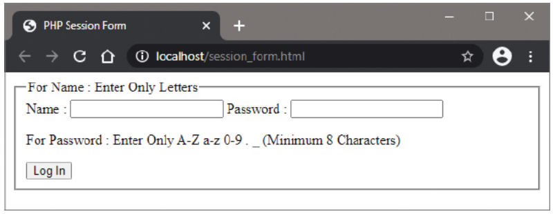

# 10.5: Submitting Session Data

## Overview

Session data storage provides a server-side alternative to cookies for maintaining user state across multiple pages. Unlike cookies that store data on the client's machine, PHP sessions store user data on the server, making them more secure and reliable when users disable cookies.

## Sessions vs Cookies

### Key Differences

| Feature | Cookies | Sessions |
|---------|---------|----------|
| **Storage Location** | Client browser | Server |
| **Security** | Less secure (client-side) | More secure (server-side) |
| **User Control** | User can disable/modify | User cannot access directly |
| **Storage Limits** | ~4KB per cookie | Limited by server resources |
| **Expiration** | Set by developer | Configurable timeout |
| **Cross-Browser** | Works across browsers | Browser-specific |
| **Privacy** | Potential tracking concerns | Better privacy protection |

### Why Use Sessions?

- **Cookie-Disabled Users**: Works even when users disable cookies
- **Security**: Data stored on server, not client machine
- **Privacy**: No tracking concerns for privacy-conscious users
- **Capacity**: Can store more data than cookies
- **Control**: Server has complete control over data lifecycle

## The $_SESSION Superglobal Array

The `$_SESSION` superglobal array stores session variables that persist across multiple pages for a single user session. Each user gets a unique session ID that identifies their session data on the server.

### Session Lifecycle

1. **session_start()**: Initialize session and load existing data
2. **Data Storage**: Store variables in `$_SESSION` array
3. **Data Retrieval**: Access session variables across pages
4. **Session End**: Destroy session or timeout expires

## Complete Implementation

### HTML Form: session_form.html

```html
<!DOCTYPE html>
<html lang="en">
<head>
    <meta charset="UTF-8">
    <meta name="viewport" content="width=device-width, initial-scale=1.0">
    <title>Session Login Form</title>
    <style>
        body {
            font-family: Arial, sans-serif;
            max-width: 600px;
            margin: 0 auto;
            padding: 20px;
            background-color: #f5f5f5;
        }
        .container {
            background: white;
            padding: 30px;
            border-radius: 10px;
            box-shadow: 0 2px 10px rgba(0,0,0,0.1);
        }
        h1 {
            color: #333;
            text-align: center;
            margin-bottom: 30px;
        }
        .form-group {
            margin-bottom: 20px;
        }
        label {
            display: block;
            margin-bottom: 5px;
            font-weight: bold;
            color: #555;
        }
        input[type="text"],
        input[type="password"] {
            width: 100%;
            padding: 12px;
            border: 2px solid #ddd;
            border-radius: 5px;
            font-size: 16px;
            box-sizing: border-box;
            transition: border-color 0.3s;
        }
        input[type="text"]:focus,
        input[type="password"]:focus {
            outline: none;
            border-color: #007bff;
        }
        .validation-hint {
            font-size: 12px;
            color: #666;
            margin-top: 5px;
            font-style: italic;
        }
        .btn {
            background: #007bff;
            color: white;
            padding: 12px 30px;
            border: none;
            border-radius: 5px;
            font-size: 16px;
            cursor: pointer;
            width: 100%;
            transition: background-color 0.3s;
        }
        .btn:hover {
            background: #0056b3;
        }
        .info-box {
            background: #e3f2fd;
            padding: 15px;
            border-radius: 5px;
            margin-bottom: 20px;
            border-left: 4px solid #2196f3;
        }
        .security-note {
            background: #fff3cd;
            padding: 15px;
            border-radius: 5px;
            margin-top: 20px;
            border-left: 4px solid #ffc107;
            font-size: 14px;
        }
    </style>
    <script>
        // Client-side validation
        function validateForm() {
            var name = document.getElementById('name').value;
            var password = document.getElementById('password').value;
            
            // Name validation - letters only
            var nameRegex = /^[a-zA-Z]+$/;
            if (!nameRegex.test(name)) {
                alert('Name must contain only letters (A-Z, a-z)');
                return false;
            }
            
            // Password validation - alphanumeric, dot, underscore, min 8 chars
            var passwordRegex = /^[a-zA-Z0-9._]{8,}$/;
            if (!passwordRegex.test(password)) {
                alert('Password must contain only letters, numbers, dots, and underscores, and be at least 8 characters long');
                return false;
            }
            
            return true;
        }
        
        // Real-time validation feedback
        document.addEventListener('DOMContentLoaded', function() {
            var nameInput = document.getElementById('name');
            var passwordInput = document.getElementById('password');
            
            nameInput.addEventListener('input', function() {
                var nameRegex = /^[a-zA-Z]+$/;
                if (nameRegex.test(this.value)) {
                    this.style.borderColor = '#28a745';
                } else {
                    this.style.borderColor = '#dc3545';
                }
            });
            
            passwordInput.addEventListener('input', function() {
                var passwordRegex = /^[a-zA-Z0-9._]{8,}$/;
                if (passwordRegex.test(this.value)) {
                    this.style.borderColor = '#28a745';
                } else {
                    this.style.borderColor = '#dc3545';
                }
            });
        });
    </script>
</head>
<body>
    <div class="container">
        <h1>🔐 Session Login Form</h1>
        
        <div class="info-box">
            <h3>📋 About Sessions</h3>
            <p>This form uses PHP sessions to store your login data on the server instead of cookies. Sessions are more secure and work even when cookies are disabled.</p>
        </div>
        
        <form action="session_handler.php" method="post" onsubmit="return validateForm()">
            <div class="form-group">
                <label for="name">Name:</label>
                <input type="text" id="name" name="name" required placeholder="Enter your name">
                <div class="validation-hint">For Name: Enter Only Letters (A-Z, a-z)</div>
            </div>
            
            <div class="form-group">
                <label for="password">Password:</label>
                <input type="password" id="password" name="password" required placeholder="Enter your password">
                <div class="validation-hint">For Password: Enter Only A-Z a-z 0-9 . _ (Minimum 8 Characters)</div>
            </div>
            
            <button type="submit" class="btn">Login with Session</button>
        </form>
        
        <div class="security-note">
            <h3>🔒 Security Information</h3>
            <ul>
                <li>Your data is stored on the server, not in your browser</li>
                <li>Sessions are more secure than cookies for sensitive data</li>
                <li>Works even if you have cookies disabled</li>
                <li>Session automatically expires after inactivity</li>
            </ul>
        </div>
    </div>
</body>
</html>
```

### Session Handler: session_handler.php

```php
<?php
// Must be called before any HTML output!
session_start();

// Set the page title
$page_title = 'Session Handler Script';
?>

<!DOCTYPE html>
<html lang="en">
<head>
    <meta charset="UTF-8">
    <meta name="viewport" content="width=device-width, initial-scale=1.0">
    <title><?php echo $page_title; ?></title>
    <style>
        body {
            font-family: Arial, sans-serif;
            max-width: 700px;
            margin: 0 auto;
            padding: 20px;
            background-color: #f5f5f5;
        }
        .container {
            background: white;
            padding: 30px;
            border-radius: 10px;
            box-shadow: 0 2px 10px rgba(0,0,0,0.1);
        }
        .success {
            background: #d4edda;
            padding: 20px;
            border-radius: 5px;
            margin-bottom: 20px;
            border-left: 4px solid #28a745;
            color: #155724;
        }
        .error {
            background: #f8d7da;
            padding: 20px;
            border-radius: 5px;
            margin-bottom: 20px;
            border-left: 4px solid #dc3545;
            color: #721c24;
        }
        .session-info {
            background: #e2e3e5;
            padding: 20px;
            border-radius: 5px;
            margin: 20px 0;
        }
        .session-item {
            background: #f8f9fa;
            padding: 15px;
            margin: 10px 0;
            border-radius: 5px;
            border-left: 4px solid #007bff;
        }
        h1, h2 {
            color: #333;
        }
        .btn {
            background: #007bff;
            color: white;
            padding: 10px 20px;
            text-decoration: none;
            border-radius: 5px;
            display: inline-block;
            margin: 10px 5px 0 0;
        }
        .btn:hover {
            background: #0056b3;
        }
        .btn-danger {
            background: #dc3545;
        }
        .btn-danger:hover {
            background: #c82333;
        }
        .code {
            background: #f8f9fa;
            padding: 15px;
            border-radius: 5px;
            font-family: monospace;
            margin: 10px 0;
            border: 1px solid #dee2e6;
        }
        .validation-steps {
            background: #e2e3e5;
            padding: 15px;
            border-radius: 5px;
            margin: 20px 0;
        }
        .validation-steps h3 {
            margin-top: 0;
            color: #495057;
        }
        .validation-steps ul {
            margin: 10px 0;
        }
        .validation-steps li {
            margin: 5px 0;
            padding: 5px 0;
        }
    </style>
</head>
<body>
    <div class="container">
        <h1>🔐 Session Handler</h1>
        
        <?php
        // Define error handling function
        function reject_session($field_name) {
            echo '<div class="error">';
            echo "❌ Invalid $field_name. Please check the validation requirements.";
            echo '</div>';
            echo '<a href="session_form.html" class="btn">← Back to Form</a>';
            exit();
        }
        
        // Check if form was submitted via POST
        if ($_SERVER['REQUEST_METHOD'] === 'POST') {
            
            // Validate name if present
            if (isset($_POST['name'])) {
                $name = trim($_POST['name']);
                
                // Name validation - letters only
                if (!preg_match('/^[a-zA-Z]+$/', $name)) {
                    reject_session('Name - must contain only letters');
                }
            } else {
                echo '<div class="error">';
                echo '❌ Name field is required.';
                echo '</div>';
                echo '<a href="session_form.html" class="btn">← Back to Form</a>';
                exit();
            }
            
            // Validate password if present
            if (isset($_POST['password'])) {
                $password = trim($_POST['password']);
                
                // Password validation - alphanumeric, dot, underscore, min 8 chars
                if (!preg_match('/^[a-zA-Z0-9._]{8,}$/', $password)) {
                    reject_session('Password - must be at least 8 characters with letters, numbers, dots, and underscores only');
                }
            } else {
                echo '<div class="error">';
                echo '❌ Password field is required.';
                echo '</div>';
                echo '<a href="session_form.html" class="btn">← Back to Form</a>';
                exit();
            }
            
            // Both validations passed - store in session
            $_SESSION['name'] = $name;
            $_SESSION['password'] = $password;
            $_SESSION['login_time'] = time();
            $_SESSION['ip_address'] = $_SERVER['REMOTE_ADDR'];
            
            echo '<div class="success">';
            echo '✅ Session data stored successfully!';
            echo '</div>';
            
            echo '<div class="session-info">';
            echo '<h3>📋 Session Information</h3>';
            
            echo '<div class="session-item">';
            echo '<strong>Session ID:</strong> ' . session_id() . '<br>';
            echo '<strong>Session Status:</strong> Active<br>';
            echo '<strong>Login Time:</strong> ' . date('Y-m-d H:i:s', $_SESSION['login_time']) . '<br>';
            echo '<strong>IP Address:</strong> ' . $_SESSION['ip_address'];
            echo '</div>';
            
            echo '<div class="session-item">';
            echo '<strong>Stored Name:</strong> ' . htmlspecialchars($_SESSION['name']) . '<br>';
            echo '<strong>Password Length:</strong> ' . strlen($_SESSION['password']) . ' characters<br>';
            echo '<strong>Password Hash:</strong> ' . md5($_SESSION['password']);
            echo '</div>';
            
            echo '</div>';
            
            echo '<div class="validation-steps">';
            echo '<h3>✅ Session Storage Steps Completed:</h3>';
            echo '<ul>';
            echo '<li>✅ Session started with session_start()</li>';
            echo '<li>✅ Name validated - letters only</li>';
            echo '<li>✅ Password validated - alphanumeric, dot, underscore, min 8 chars</li>';
            echo '<li>✅ Data stored in $_SESSION superglobal</li>';
            echo '<li>✅ Session variables accessible across pages</li>';
            echo '<li>✅ Session ID assigned to user</li>';
            echo '</ul>';
            echo '</div>';
            
        } else {
            echo '<div class="error">';
            echo '❌ No form submission detected. Please use the login form.';
            echo '</div>';
            echo '<a href="session_form.html" class="btn">← Back to Form</a>';
        }
        ?>
        
        <div class="code">
            <h3>💻 Session Storage Code</h3>
            <p><strong>Session Start (Required):</strong></p>
            <code>
                <?php session_start(); ?>
            </code>
            
            <p><strong>Store Session Variables:</strong></p>
            <code>
                $_SESSION['name'] = $name;
                $_SESSION['password'] = $password;
            </code>
            
            <p><strong>Access Session Variables:</strong></p>
            <code>
                $name = $_SESSION['name'];
                $password = $_SESSION['password'];
            </code>
        </div>
        
        <div class="validation-steps">
            <h3>📋 Session vs Cookies Comparison</h3>
            <table style="width: 100%; border-collapse: collapse;">
                <tr style="background: #f8f9fa;">
                    <th style="padding: 10px; text-align: left; border: 1px solid #dee2e6;">Aspect</th>
                    <th style="padding: 10px; text-align: left; border: 1px solid #dee2e6;">Sessions</th>
                    <th style="padding: 10px; text-align: left; border: 1px solid #dee2e6;">Cookies</th>
                </tr>
                <tr>
                    <td style="padding: 10px; border: 1px solid #dee2e6;">Storage</td>
                    <td style="padding: 10px; border: 1px solid #dee2e6;">Server-side</td>
                    <td style="padding: 10px; border: 1px solid #dee2e6;">Client-side</td>
                </tr>
                <tr>
                    <td style="padding: 10px; border: 1px solid #dee2e6;">Security</td>
                    <td style="padding: 10px; border: 1px solid #dee2e6;">More secure</td>
                    <td style="padding: 10px; border: 1px solid #dee2e6;">Less secure</td>
                </tr>
                <tr>
                    <td style="padding: 10px; border: 1px solid #dee2e6;">User Control</td>
                    <td style="padding: 10px; border: 1px solid #dee2e6;">No user control</td>
                    <td style="padding: 10px; border: 1px solid #dee2e6;">User can disable</td>
                </tr>
                <tr>
                    <td style="padding: 10px; border: 1px solid #dee2e6;">Capacity</td>
                    <td style="padding: 10px; border: 1px solid #dee2e6;">Server resources</td>
                    <td style="padding: 10px; border: 1px solid #dee2e6;">~4KB limit</td>
                </tr>
            </table>
        </div>
        
        <a href="session_view.php" class="btn">👁️ View Session Data</a>
        <a href="session_form.html" class="btn">← Back to Form</a>
        <a href="session_logout.php" class="btn btn-danger">🚪 Logout</a>
    </div>
</body>
</html>
```



## Session Data Techniques

### 1. Basic Session Storage

```php
<?php
// Start session (must be first line)
session_start();

// Store variables
$_SESSION['username'] = 'john_doe';
$_SESSION['email'] = 'john@example.com';
$_SESSION['login_time'] = time();
$_SESSION['user_role'] = 'admin';
?>
```

### 2. Session Data Retrieval

```php
<?php
// Start session
session_start();

// Check if session variable exists
if (isset($_SESSION['username'])) {
    $username = $_SESSION['username'];
    echo "Welcome back, $username!";
} else {
    echo "Please log in first.";
}
?>
```

### 3. Session Validation

```php
<?php
session_start();

// Validate session integrity
function validate_session() {
    if (!isset($_SESSION['login_time'])) {
        return false;
    }
    
    // Check session age (30 minutes timeout)
    $session_age = time() - $_SESSION['login_time'];
    if ($session_age > 1800) {
        session_destroy();
        return false;
    }
    
    // Check IP address (optional security)
    if (isset($_SESSION['ip_address']) && 
        $_SESSION['ip_address'] !== $_SERVER['REMOTE_ADDR']) {
        session_destroy();
        return false;
    }
    
    return true;
}

// Usage
if (validate_session()) {
    echo "Session is valid";
} else {
    echo "Session expired or invalid";
}
?>
```

### 4. Session Security

```php
<?php
session_start();

// Secure session configuration
ini_set('session.cookie_httponly', 1);
ini_set('session.cookie_secure', 1);
ini_set('session.use_only_cookies', 1);

// Regenerate session ID on login
session_regenerate_id(true);

// Store sensitive data with encryption
function encrypt_session_data($data, $key) {
    return openssl_encrypt($data, 'aes-256-cbc', $key, 0, substr(md5($key), 0, 16));
}

function decrypt_session_data($encrypted_data, $key) {
    return openssl_decrypt($encrypted_data, 'aes-256-cbc', $key, 0, substr(md5($key), 0, 16));
}

// Usage
$secret_key = 'your-secret-key';
$_SESSION['encrypted_password'] = encrypt_session_data($password, $secret_key);
?>
```

## Advanced Session Operations

### Session Array Management

```php
<?php
session_start();

// Store complex data structures
$_SESSION['user_profile'] = [
    'name' => 'John Doe',
    'email' => 'john@example.com',
    'preferences' => [
        'theme' => 'dark',
        'language' => 'en',
        'notifications' => true
    ],
    'permissions' => ['read', 'write', 'delete']
];

// Access nested data
$theme = $_SESSION['user_profile']['preferences']['theme'];
$permissions = $_SESSION['user_profile']['permissions'];

// Update nested data
$_SESSION['user_profile']['preferences']['theme'] = 'light';
$_SESSION['user_profile']['permissions'][] = 'admin';
?>
```

### Session Flash Messages

```php
<?php
session_start();

// Set flash message (displays once and disappears)
function set_flash_message($type, $message) {
    $_SESSION['flash'][$type] = $message;
}

// Get and clear flash message
function get_flash_message($type) {
    if (isset($_SESSION['flash'][$type])) {
        $message = $_SESSION['flash'][$type];
        unset($_SESSION['flash'][$type]);
        return $message;
    }
    return null;
}

// Usage
set_flash_message('success', 'Login successful!');
set_flash_message('error', 'Invalid credentials');

// Display and clear
$success_msg = get_flash_message('success');
if ($success_msg) {
    echo '<div class="success">' . $success_msg . '</div>';
}
?>
```

### Session Timeout Management

```php
<?php
session_start();

// Auto-refresh session timeout
function refresh_session_timeout($timeout_minutes = 30) {
    $_SESSION['last_activity'] = time();
    $_SESSION['timeout'] = $timeout_minutes * 60;
}

// Check for session timeout
function check_session_timeout() {
    if (isset($_SESSION['last_activity']) && isset($_SESSION['timeout'])) {
        $elapsed = time() - $_SESSION['last_activity'];
        
        if ($elapsed > $_SESSION['timeout']) {
            session_destroy();
            return false;
        }
        
        // Refresh timeout on activity
        $_SESSION['last_activity'] = time();
    }
    
    return true;
}

// Usage on each page
if (!check_session_timeout()) {
    header('Location: login.php?timeout=1');
    exit();
}
?>
```

## Session Management Best Practices

### 1. Security Measures

```php
<?php
// Secure session initialization
function secure_session_start() {
    // Set secure session parameters
    ini_set('session.cookie_httponly', 1);
    ini_set('session.cookie_secure', 1);
    ini_set('session.use_only_cookies', 1);
    ini_set('session.cookie_samesite', 'Strict');
    
    // Start session
    session_start();
    
    // Regenerate ID on first visit
    if (!isset($_SESSION['initialized'])) {
        session_regenerate_id(true);
        $_SESSION['initialized'] = true;
        $_SESSION['ip_address'] = $_SERVER['REMOTE_ADDR'];
        $_SESSION['user_agent'] = $_SERVER['HTTP_USER_AGENT'];
    }
    
    // Validate session integrity
    if ($_SESSION['ip_address'] !== $_SERVER['REMOTE_ADDR'] ||
        $_SESSION['user_agent'] !== $_SERVER['HTTP_USER_AGENT']) {
        session_destroy();
        throw new Exception('Session tampering detected');
    }
}
?>
```

### 2. Session Cleanup

```php
<?php
// Clean up expired sessions
function cleanup_expired_sessions($session_path) {
    $max_lifetime = ini_get('session.gc_maxlifetime');
    $files = glob($session_path . 'sess_*');
    
    foreach ($files as $file) {
        if (filemtime($file) + $max_lifetime < time()) {
            unlink($file);
        }
    }
}

// Destroy specific session
function destroy_user_session($user_id) {
    // Find and remove session files for specific user
    // Implementation depends on session storage method
}

// Usage
cleanup_expired_sessions(session_save_path());
?>
```

### 3. Session Debugging

```php
<?php
session_start();

// Debug session information
function debug_session() {
    echo '<div style="background: #f8f9fa; padding: 15px; border-radius: 5px;">';
    echo '<h3>🐛 Session Debug Information</h3>';
    
    echo '<p><strong>Session ID:</strong> ' . session_id() . '</p>';
    echo '<p><strong>Session Status:</strong> ' . (session_status() === PHP_SESSION_ACTIVE ? 'Active' : 'Inactive') . '</p>';
    echo '<p><strong>Session Save Path:</strong> ' . session_save_path() . '</p>';
    echo '<p><strong>Session Name:</strong> ' . session_name() . '</p>';
    echo '<p><strong>Session Variables:</strong> ' . count($_SESSION) . '</p>';
    
    echo '<h4>Session Contents:</h4>';
    echo '<pre>';
    print_r($_SESSION);
    echo '</pre>';
    
    echo '<h4>Cookie Information:</h4>';
    echo '<pre>';
    print_r($_COOKIE);
    echo '</pre>';
    
    echo '</div>';
}

// Usage
debug_session();
?>
```

## Implementation Steps

1. **Create HTML Form**: Build session_form.html with proper validation
2. **Implement Session Handler**: Create session_handler.php with validation logic
3. **Add Session Viewer**: Create session_view.php to display stored data
4. **Implement Logout**: Create session_logout.php for session destruction
5. **Add Security**: Implement secure session practices
6. **Test Workflow**: Verify complete session functionality
7. **Document Usage**: Provide clear instructions and examples

## Troubleshooting

### Common Issues

1. **"Headers already sent" Error**
   - Ensure session_start() is called before any HTML output
   - Check for whitespace before PHP opening tag
   - Verify no echo/print statements before session_start()

2. **Session Data Not Persisting**
   - Check if session_start() is called on all pages
   - Verify session.save_path is writable
   - Check session timeout settings

3. **Session Hijacking**
   - Implement IP address validation
   - Use HTTPS for all session communications
   - Regenerate session ID after login

4. **Session Not Destroying**
   - Use session_destroy() after session_start()
   - Clear session cookie manually
   - Use session_unset() to clear all variables

## Summary

Session data storage provides:

- **Server-Side Storage**: Data stored on server, not client
- **Security**: More secure than cookies for sensitive data
- **Cookie Independence**: Works even when cookies are disabled
- **Capacity**: Can store more data than cookies
- **Control**: Server has complete control over data lifecycle

Key requirements:
- **session_start()**: Must be called before any HTML output
- **$_SESSION Superglobal**: Store and access session variables
- **Validation**: Always validate session data before use
- **Security**: Implement proper security measures
- **Timeout**: Handle session expiration appropriately
- **Cleanup**: Properly destroy sessions when no longer needed

This approach provides a robust, secure alternative to cookie-based user data storage, making web applications more reliable and secure for users who disable cookies.