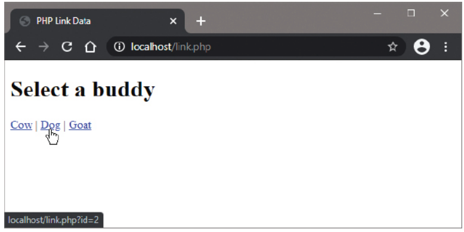
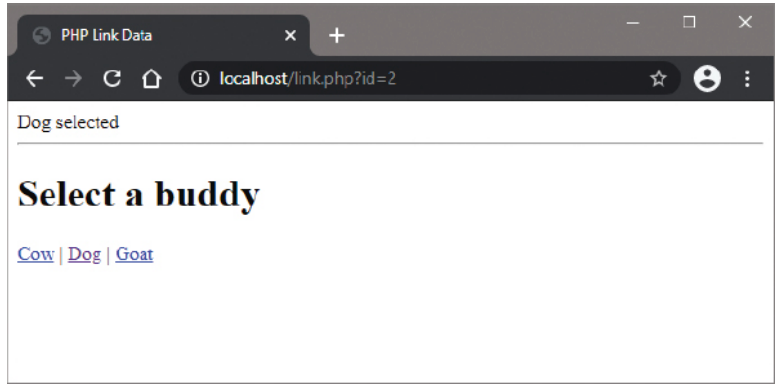

# 9.10: Appending Link Data

## Overview

Appending link data is a technique for passing information between web pages by adding name=value pairs to URLs. This method allows you to send data to PHP scripts without using HTML forms, making it ideal for navigation, filtering, and dynamic content loading.

## PHP Superglobal Variables

PHP provides several predefined "superglobal" variables that are accessible in all scopes of any script:

| Superglobal | Purpose                                | Common Use |
|-------------|----------------------------------------|------------|
| `$_GET` | Stores data submitted via GET method   | URL parameters, query strings |
| `$_POST` | Stores data submitted via POST method  | HTML form submissions |
| `$_REQUEST` | Contains contents of both GET and POST | General data access (avoid usage) |
| `$_SERVER` | Server and execution environment information | Request method, headers, paths |
| `$_SESSION` | Stores user data across multiple pages | User authentication, preferences |

## The $_GET Superglobal

When data is submitted using the GET method, the $_GET array stores values in named array elements. This is commonly used for:

- URL parameters
- Search queries
- Pagination
- Filtering and sorting
- Navigation between pages

### Basic Syntax

```php
$value = $_GET['parameter_name'];
```

## Appending Data to URLs

The most common way to append data to URLs is by adding name=value pairs to the URL in HTML hyperlink anchors:

```html
<a href="script.php?parameter=value">Link Text</a>
```

### Multiple Parameters

You can append multiple parameters using the ampersand (&) separator:

```html
<a href="script.php?param1=value1&param2=value2">Link Text</a>
```

## Complete Example: link.php

Here's a comprehensive example demonstrating URL parameter handling:

```php
<?php
// Set the page title dynamically
$page_title = 'Link Data Example - Animal Selector';
?>

<!DOCTYPE html>
<html lang="en">
<head>
    <meta charset="UTF-8">
    <meta name="viewport" content="width=device-width, initial-scale=1.0">
    <title><?php echo $page_title; ?></title>
    <style>
        body {
            font-family: Arial, sans-serif;
            max-width: 800px;
            margin: 0 auto;
            padding: 20px;
            background-color: #f5f5f5;
        }
        .container {
            background: white;
            padding: 30px;
            border-radius: 10px;
            box-shadow: 0 2px 10px rgba(0,0,0,0.1);
        }
        .selection {
            background: #e8f5e8;
            padding: 20px;
            border-radius: 5px;
            margin: 20px 0;
            border-left: 4px solid #28a745;
        }
        .error {
            background: #f8d7da;
            padding: 20px;
            border-radius: 5px;
            margin: 20px 0;
            border-left: 4px solid #dc3545;
        }
        .links {
            margin: 20px 0;
        }
        .links a {
            display: inline-block;
            margin: 5px 10px;
            padding: 10px 20px;
            background: #007bff;
            color: white;
            text-decoration: none;
            border-radius: 5px;
            transition: background-color 0.3s;
        }
        .links a:hover {
            background: #0056b3;
        }
        .debug {
            background: #f8f9fa;
            padding: 15px;
            border-radius: 5px;
            margin: 20px 0;
            font-family: monospace;
            font-size: 14px;
        }
        h1, h2 {
            color: #333;
        }
        .animal-info {
            display: grid;
            grid-template-columns: 1fr 2fr;
            gap: 20px;
            margin: 20px 0;
        }
        .animal-icon {
            font-size: 60px;
            text-align: center;
        }
        .animal-details h3 {
            color: #28a745;
            margin-bottom: 10px;
        }
    </style>
</head>
<body>
    <div class="container">
        <h1>🐾 Animal Selector Demo</h1>
        <p>Click on the links below to see how URL parameters work in PHP.</p>
        
        <?php
        // Check if the 'id' parameter exists in the URL
        if (isset($_GET['id'])) {
            // Assign the passed value to a variable
            $id = $_GET['id'];
            
            // Validate the input (security measure)
            $id = filter_var($id, FILTER_VALIDATE_INT);
            
            if ($id === false) {
                echo '<div class="error">❌ Invalid ID parameter. Please use a valid number.</div>';
            } else {
                echo '<div class="selection">';
                
                // Output appropriate response based on the value
                switch($id) {
                    case 1:
                        echo '<h2>🐄 Cow Selected</h2>';
                        echo '<div class="animal-info">';
                        echo '<div class="animal-icon">🐄</div>';
                        echo '<div class="animal-details">';
                        echo '<h3>About Cows</h3>';
                        echo '<p>Cows are domesticated cattle raised for milk, meat, and as draft animals. They are herbivores and are known for their gentle nature.</p>';
                        echo '<p><strong>Facts:</strong> Cows can produce up to 6-7 gallons of milk per day!</p>';
                        echo '</div>';
                        echo '</div>';
                        break;
                        
                    case 2:
                        echo '<h2>🐕 Dog Selected</h2>';
                        echo '<div class="animal-info">';
                        echo '<div class="animal-icon">🐕</div>';
                        echo '<div class="animal-details">';
                        echo '<h3>About Dogs</h3>';
                        echo '<p>Dogs are domesticated mammals known as "man\'s best friend." They come in many breeds and are loyal companions.</p>';
                        echo '<p><strong>Facts:</strong> Dogs have been human companions for over 15,000 years!</p>';
                        echo '</div>';
                        echo '</div>';
                        break;
                        
                    case 3:
                        echo '<h2>🐐 Goat Selected</h2>';
                        echo '<div class="animal-info">';
                        echo '<div class="animal-icon">🐐</div>';
                        echo '<div class="animal-details">';
                        echo '<h3>About Goats</h3>';
                        echo '<p>Goats are domesticated animals raised for milk, meat, and fiber. They are curious and intelligent animals.</p>';
                        echo '<p><strong>Facts:</strong> Goats were one of the first animals to be domesticated by humans!</p>';
                        echo '</div>';
                        echo '</div>';
                        break;
                        
                    default:
                        echo '<h2>❓ Unknown Animal</h2>';
                        echo '<p>You selected ID: ' . htmlspecialchars($id) . '</p>';
                        echo '<p>This ID doesn\'t correspond to any known animal in our database.</p>';
                        break;
                }
                
                echo '</div>';
            }
        }
        ?>
        
        <div class="links">
            <h2>Select a Buddy</h2>
            <a href="link.php?id=1">🐄 Cow</a>
            <a href="link.php?id=2">🐕 Dog</a>
            <a href="link.php?id=3">🐐 Goat</a>
        </div>
        
        <?php
        // Debug section to show all GET parameters
        if (!empty($_GET)) {
            echo '<div class="debug">';
            echo '<h3>🔍 Debug Information</h3>';
            echo '<p><strong>Current URL Parameters:</strong></p>';
            echo '<ul>';
            foreach ($_GET as $key => $value) {
                echo '<li><strong>' . htmlspecialchars($key) . ':</strong> ' . htmlspecialchars($value) . '</li>';
            }
            echo '</ul>';
            echo '<p><strong>Full Query String:</strong> ' . htmlspecialchars($_SERVER['QUERY_STRING']) . '</p>';
            echo '</div>';
        }
        ?>
        
        <div class="debug">
            <h3>📚 How This Works</h3>
            <p>When you click on the links above, the browser appends parameters to the URL:</p>
            <ul>
                <li><strong>Cow link:</strong> link.php?id=1</li>
                <li><strong>Dog link:</strong> link.php?id=2</li>
                <li><strong>Goat link:</strong> link.php?id=3</li>
            </ul>
            <p>The PHP script then reads these parameters using the $_GET superglobal array.</p>
        </div>
    </div>
</body>
</html>
```





## Advanced URL Parameter Techniques

### Multiple Parameters Example

```php
<?php
// Handle multiple parameters
if (isset($_GET['category']) && isset($_GET['sort'])) {
    $category = $_GET['category'];
    $sort = $_GET['sort'];
    
    echo "Showing $category products sorted by $sort";
}
?>

<!-- HTML links with multiple parameters -->
<a href="products.php?category=electronics&sort=price">Electronics (Price)</a>
<a href="products.php?category=books&sort=name">Books (Name)</a>
```

### URL Encoding Special Characters

When passing special characters in URLs, they must be properly encoded:

```php
<?php
// Properly encoding URLs
$name = "John Doe";
$encoded_name = urlencode($name);
echo "<a href='profile.php?name=$encoded_name'>View Profile</a>";
// Results in: profile.php?name=John+Doe
?>
```

## Security Considerations

### Always Validate Input

Never trust data from URLs. Always validate and sanitize:

```php
<?php
// Bad practice - no validation
$id = $_GET['id'];

// Good practice - with validation
if (isset($_GET['id']) && is_numeric($_GET['id'])) {
    $id = (int)$_GET['id'];
    // Proceed with valid ID
} else {
    // Handle invalid input
    echo "Invalid ID parameter";
}
?>
```

### Prevent XSS Attacks

Always escape output to prevent Cross-Site Scripting:

```php
<?php
// Bad practice - vulnerable to XSS
echo $_GET['name'];

// Good practice - escaped output
echo htmlspecialchars($_GET['name'], ENT_QUOTES, 'UTF-8');
?>
```

### Use Filter Functions

PHP provides built-in filter functions for validation:

```php
<?php
// Validate email
$email = filter_var($_GET['email'], FILTER_VALIDATE_EMAIL);

// Validate integer
$id = filter_var($_GET['id'], FILTER_VALIDATE_INT);

// Sanitize string
$name = filter_var($_GET['name'], FILTER_SANITIZE_STRING);
?>
```

## The $_REQUEST Superglobal

PHP provides a $_REQUEST superglobal that contains the entire contents of both $_POST and $_GET arrays:

```php
<?php
// This works but should be avoided
$value = $_REQUEST['parameter'];

// Instead, use the specific array
if ($_SERVER['REQUEST_METHOD'] === 'POST') {
    $value = $_POST['parameter'];
} else {
    $value = $_GET['parameter'];
}
?>
```

### Why to Avoid $_REQUEST

1. **Security**: Makes it harder to track data sources
2. **Clarity**: Ambiguous about where data comes from
3. **Conflicts**: Can lead to unexpected behavior if both GET and POST contain same parameter names

## URL Visibility

One important characteristic of GET requests is that the passed name=value pairs are visible in the browser address field:

- **URL Example**: `https://example.com/link.php?id=1&name=John`
- **Visible to users**: Users can see and modify parameters
- **Bookmarked**: URLs can be bookmarked with parameters
- **Shared**: URLs can be shared with others
- **Limited length**: URLs have length restrictions (typically 2048 characters)

## Best Practices

### 1. Use Descriptive Parameter Names

```php
// Good
<a href="products.php?category_id=5&page=2">Products</a>

// Avoid
<a href="products.php?c=5&p=2">Products</a>
```

### 2. Keep URLs Clean and Readable

```php
// Good
<a href="search.php?q=php+tutorial&sort=relevance">Search</a>

// Avoid
<a href="search.php?x=123&y=456&z=789">Search</a>
```

### 3. Handle Missing Parameters Gracefully

```php
<?php
$page = isset($_GET['page']) ? (int)$_GET['page'] : 1;
$category = isset($_GET['category']) ? $_GET['category'] : 'all';
?>
```

### 4. Use SEO-Friendly URLs

```php
// Instead of: article.php?id=123
// Use: article.php?id=123&title=php-tutorial

// Better yet, use URL rewriting
// article/123/php-tutorial
```

## Common Use Cases

### 1. Pagination

```php
<?php
$page = isset($_GET['page']) ? (int)$_GET['page'] : 1;
$limit = 10;
$offset = ($page - 1) * $limit;

// Database query with pagination
$query = "SELECT * FROM products LIMIT $limit OFFSET $offset";
?>

<!-- Pagination links -->
<a href="products.php?page=<?php echo $page - 1; ?>">Previous</a>
<a href="products.php?page=<?php echo $page + 1; ?>">Next</a>
```

### 2. Search and Filtering

```php
<?php
$search = isset($_GET['search']) ? $_GET['search'] : '';
$category = isset($_GET['category']) ? $_GET['category'] : 'all';
$sort = isset($_GET['sort']) ? $_GET['sort'] : 'name';
?>

<!-- Filter form -->
<form method="GET" action="products.php">
    <input type="text" name="search" value="<?php echo htmlspecialchars($search); ?>">
    <select name="category">
        <option value="all">All Categories</option>
        <option value="electronics">Electronics</option>
    </select>
    <button type="submit">Search</button>
</form>
```

### 3. Navigation Menus

```php
<?php
$current_page = isset($_GET['page']) ? $_GET['page'] : 'home';
?>

<nav>
    <a href="index.php?page=home" class="<?php echo $current_page === 'home' ? 'active' : ''; ?>">Home</a>
    <a href="index.php?page=about" class="<?php echo $current_page === 'about' ? 'active' : ''; ?>">About</a>
    <a href="index.php?page=contact" class="<?php echo $current_page === 'contact' ? 'active' : ''; ?>">Contact</a>
</nav>
```

## Implementation Steps

1. **Plan Your URL Structure**: Design clean, readable URLs
2. **Create HTML Links**: Build links with appropriate parameters
3. **Handle Parameters in PHP**: Process $_GET data safely
4. **Validate Input**: Always validate and sanitize received data
5. **Display Results**: Show appropriate content based on parameters
6. **Add Error Handling**: Gracefully handle missing or invalid parameters
7. **Test Thoroughly**: Test with various parameter combinations

## Summary

Appending link data using URL parameters is a fundamental PHP technique for:

- **Navigation**: Moving between pages with context
- **Filtering**: Dynamic content based on user preferences
- **Search**: Passing search queries and filters
- **State Management**: Maintaining application state across requests

Key points to remember:
- Use $_GET for URL parameters
- Always validate and sanitize input
- Avoid $_REQUEST in favor of specific superglobals
- Keep URLs clean and descriptive
- Handle missing parameters gracefully
- Consider security implications of visible parameters

This technique forms the foundation of many dynamic web applications and is essential for creating interactive, user-friendly websites.