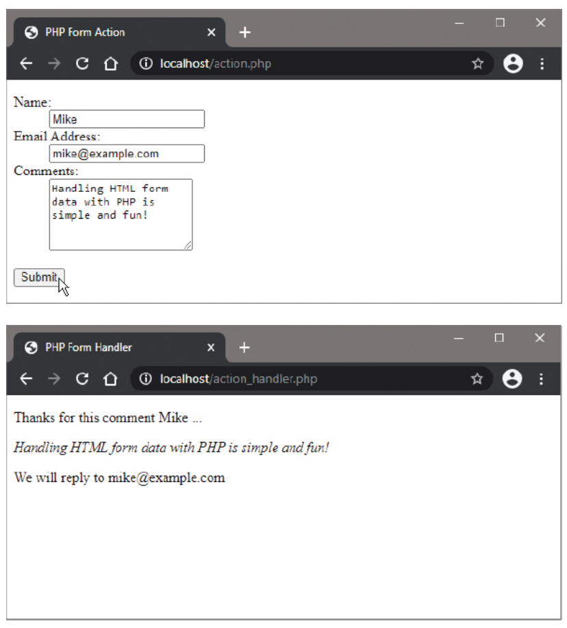

# Performing Actions

## Overview

Processing data submitted from an HTML form on a web page is perhaps the most fundamental task performed by a PHP script. The HTML `<form>` tag's attributes control how and where the form data is processed.

## HTML Form Structure

The HTML `<form>` tag uses two key attributes:

- **`action` attribute**: Nominates the PHP script that will process ("handle") the form data
- **`method` attribute**: Specifies how the data is sent to the script - typically by the POST method

```html
<form action="action_handler.php" method="POST">
    <!-- Form elements go here -->
</form>
```

## PHP Superglobal Variables

PHP provides special "superglobal" array variables to store form data:

### $_POST Array

When using the POST method, PHP creates a `$_POST` array that:
- Creates an array element with the same name as each submitted form element
- Stores the user-entered value in that element
- Is case-sensitive (must use exact capitalization)

**Example**: With this form element:
```html
<input type="text" name="email" value="mike@example.com">
```

PHP creates: `$_POST['email']` containing the entered value.

**Important**: The capitalization must be precise:
- ✅ `$_POST['email']` (correct)
- ❌ `$_POST['Email']` (incorrect)
- ❌ `$_Post['email']` (incorrect)

## Variable Assignment for Easy Access

For easier recognition and use, you can assign form values to PHP variables with the same names:

```php
$name = $_POST['name'];
$mail = $_POST['email'];
$comment = $_POST['comments'];
```

## Complete Form Example

### action.php (The HTML Form)

```html
<!DOCTYPE html>
<html>
<head>
    <title>PHP Form Action</title>
</head>
<body>
    <form action="action_handler.php" method="POST">
        <p>Name: <input type="text" name="name"></p>
        <p>Email Address: <input type="text" name="email"></p>
        <p>Comments: <textarea name="comments"></textarea></p>
        <p><input type="submit" value="Submit"></p>
    </form>
</body>
</html>
```

### action_handler.php (The PHP Processor)

```php
<!DOCTYPE html>
<html>
<head>
    <title>PHP Form Handler</title>
</head>
<body>
    <?php
        // Assign form values to like-named PHP variables
        $name = $_POST['name'];
        $mail = $_POST['email'];
        $comment = $_POST['comments'];
        
        // Display the submitted data
        echo "<h2>Thanks for this comment $name ...</h2>";
        echo "<p>$comment</p>";
        echo "<p>We will reply to $mail</p>";
    ?>
</body>
</html>
```



## Form Submission Methods

### GET Method
- Appends name=value pairs to the URL
- Limited data capacity
- Less secure (data visible in URL)
- Best for requesting information (e.g., retrieving database records)

### POST Method
- Sends data in HTTP request body
- Can submit more data
- More secure (data not visible in URL)
- Best for performing actions (e.g., updating database records)

## Best Practices

1. **Use POST method** for most form submissions involving actions
2. **Validate input data** before processing
3. **Use precise capitalization** when accessing $_POST elements
4. **Assign meaningful variable names** for better code readability
5. **Include proper HTML structure** in both form and handler pages

## Implementation Steps

1. Create the HTML form (`action.php`) with proper form tags and input fields
2. Create the PHP handler script (`action_handler.php`) to process the form data
3. Save both files in the web server's `/htdocs` directory
4. Access `action.php` via HTTP and test the form submission
5. Verify that the handler script correctly displays the submitted data

This fundamental form handling technique forms the basis for most interactive web applications using PHP.