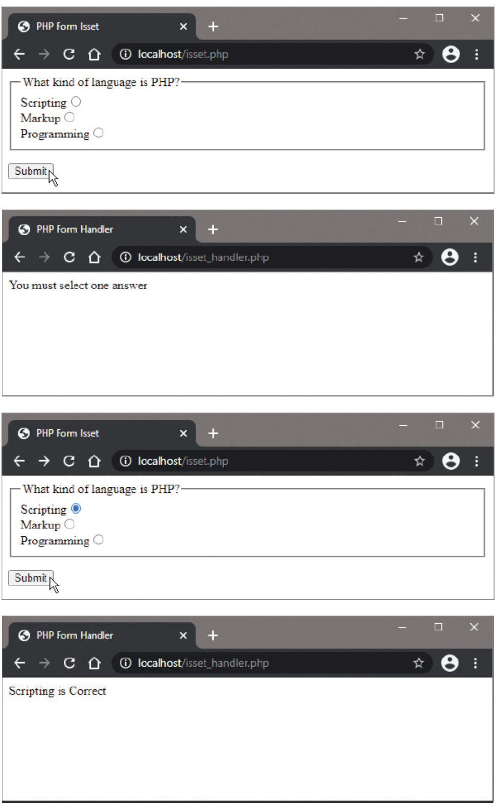

# Checking Set Values

## Overview

PHP can easily ensure that the user has entered data into submitted HTML form fields using the built-in `isset()` function. This function is essential for form validation and preventing errors when processing user input.

## The isset() Function

The `isset()` function checks if a variable has been set and is not NULL:

```php
isset($variable);
```

**Returns:**
- `TRUE` if the variable exists and is not NULL
- `FALSE` if the variable doesn't exist or is NULL

**Key Points:**
- Empty form fields will be NULL unless the user enters a value
- This function is crucial for checking if form fields were completed
- Helps prevent undefined variable errors

## Form Validation with isset()

Conditional tests can be made with the `isset()` function to:
- Indicate where form fields have been left empty
- Provide appropriate responses based on whether fields were completed

## Complete Example: Radio Button Validation

### isset.php (The HTML Form)

```html
<!DOCTYPE html>
<html>
<head>
    <title>PHP isset() Function</title>
</head>
<body>
    <form action="isset_handler.php" method="POST">
        <p>What kind of language is PHP?</p>
        <p>
            <input type="radio" name="definition" value="Scripting"> Scripting<br>
            <input type="radio" name="definition" value="Markup"> Markup<br>
            <input type="radio" name="definition" value="Programming"> Programming
        </p>
        <p><input type="submit" value="Submit"></p>
    </form>
</body>
</html>
```

### isset_handler.php (The PHP Processor)

```php
<!DOCTYPE html>
<html>
<head>
    <title>isset() Handler</title>
</head>
<body>
    <?php
        // Initialize variable with submitted value or NULL if no value submitted
        $definition = isset($_POST['definition']) ? $_POST['definition'] : NULL;
        
        // Output appropriate response according to the variable value
        if ($definition != NULL) {
            if ($definition != 'Scripting') {
                echo "<h2>$definition is Incorrect</h2>";
            } else {
                echo "<h2>$definition is Correct</h2>";
            }
        } else {
            echo '<h2>You must select one answer</h2>';
        }
    ?>
</body>
</html>
```



## Variable Initialization Pattern

A common pattern for handling optional form data:

```php
// Using ternary operator for concise initialization
$variable = isset($_POST['fieldname']) ? $_POST['fieldname'] : NULL;

// Equivalent using if statement
if (isset($_POST['fieldname'])) {
    $variable = $_POST['fieldname'];
} else {
    $variable = NULL;
}
```

## Practical Applications

### 1. Required Field Validation

```php
if (isset($_POST['name']) && !empty($_POST['name'])) {
    // Process the name
} else {
    echo "Name is required";
}
```

### 2. Checkbox Handling

```php
if (isset($_POST['newsletter'])) {
    // User checked the newsletter box
    $subscribe = TRUE;
} else {
    $subscribe = FALSE;
}
```

### 3. Multiple Field Validation

```php
$errors = array();

if (!isset($_POST['name']) || empty($_POST['name'])) {
    $errors[] = "Name is required";
}

if (!isset($_POST['email']) || empty($_POST['email'])) {
    $errors[] = "Email is required";
}

if (empty($errors)) {
    // Process form data
} else {
    // Display errors
    foreach ($errors as $error) {
        echo "<p>$error</p>";
    }
}
```

## Best Practices

1. **Always check isset()** before accessing form data to prevent undefined variable errors
2. **Combine with empty()** when you need to ensure a field has actual content
3. **Use ternary operators** for concise variable initialization
4. **Provide clear feedback** when required fields are missing
5. **Validate all required fields** before processing the form data

## Implementation Steps

1. Create the HTML form (`isset.php`) with radio buttons or other input fields
2. Create the PHP handler script (`isset_handler.php`) with isset() checks
3. Save both files in the web server's `/htdocs` directory
4. Access `isset.php` via HTTP and test submitting the form:
   - Test without selecting any option
   - Test selecting the correct answer
   - Test selecting incorrect answers
5. Verify appropriate responses for each scenario

## Common Use Cases

- **Required field validation**: Ensuring users fill in mandatory fields
- **Conditional processing**: Different actions based on which fields are set
- **Checkbox handling**: Checking if checkboxes were ticked
- **File upload validation**: Verifying if files were actually uploaded
- **Multi-step forms**: Tracking which steps have been completed

The `isset()` function is a fundamental tool for robust form handling and error prevention in PHP applications.