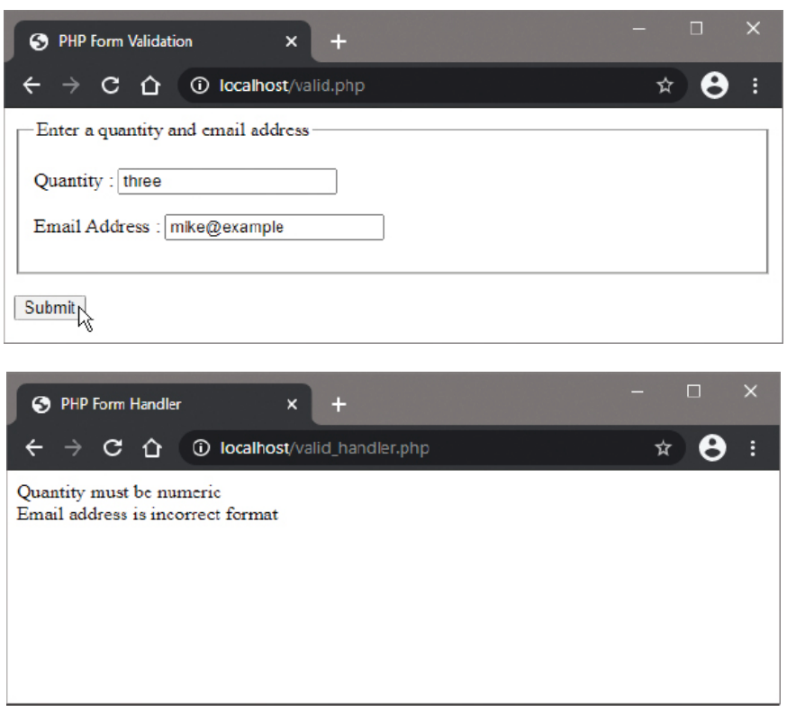

# Validating Form Data

## Overview

As users may inadvertently submit forms with empty fields, or with data in the wrong format, it is essential that PHP scripts ensure required fields are completed and submitted data is valid. Form validation prevents errors, improves data integrity, and provides better user experience.

## PHP Validation Functions

### empty() Function

The `empty()` function checks if a variable is considered "empty":

```php
empty($variable);
```

**Returns TRUE if the variable is:**
- Empty string (`""`)
- Zero (`0` or `"0"`)
- NULL
- FALSE
- Array with no elements

**Use Case:** Ensuring the user has entered something into a text field

### is_numeric() Function

The `is_numeric()` function validates numeric data:

```php
is_numeric($variable);
```

**Returns TRUE only if the value is:**
- An integer or float
- A numeric string

**Use Case:** Ensuring the user has entered data in numeric format

### preg_match() Function

The `preg_match()` function performs pattern matching using regular expressions:

```php
preg_match($pattern, $subject);
```

**Parameters:**
- `$pattern`: Regular expression pattern to search for
- `$subject`: String to search within

**Returns:**
- `1` if pattern matches
- `0` if no match
- `FALSE` if error occurs

**Use Case:** Validating specific data formats like email addresses

## Complete Example: Quantity and Email Validation

### valid.php (The HTML Form)

```html
<!DOCTYPE html>
<html>
<head>
    <title>Form Validation</title>
</head>
<body>
    <form action="valid_handler.php" method="POST">
        <h2>Enter a quantity and email address</h2>
        <p>Quantity: <input type="text" name="quantity"></p>
        <p>Email Address: <input type="text" name="email"></p>
        <p><input type="submit" value="Submit"></p>
    </form>
</body>
</html>
```

### valid_handler.php (The PHP Processor)

```php
<!DOCTYPE html>
<html>
<head>
    <title>Validation Handler</title>
</head>
<body>
    <?php
        // Initialize quantity variable with submitted value or NULL
        if (!empty($_POST['quantity'])) {
            $quantity = $_POST['quantity'];
        } else {
            $quantity = NULL;
            echo 'Quantity field is required<br>';
        }
        
        // Ensure the format is numeric
        if (!is_numeric($quantity)) {
            $quantity = NULL;
            echo 'Quantity must be numeric<br>';
        }
        
        // Initialize email variable with submitted value or NULL
        if (!empty($_POST['email'])) {
            $email = $_POST['email'];
            # Format validation to be inserted here
        } else {
            $email = NULL;
            echo 'You must enter an email address<br>';
        }
        
        // Ensure the email address uses the expected pattern
        $pattern = '/\b[\w.-]+@[\w.-]+\.[A-Za-z]{2,6}\b/';
        if (!preg_match($pattern, $email)) {
            $email = NULL;
            echo 'Email address is incorrect format<br>';
        }
        
        // Output valid submitted data
        if (($quantity != NULL) && ($email != NULL)) {
            echo "<h2>Valid Data Received:</h2>";
            echo "Email: $email<br>";
            echo "Quantity: $quantity";
        } else {
            echo "<h2>Please correct the errors above</h2>";
        }
    ?>
</body>
</html>
```



## Email Validation with Regular Expressions

### The Email Pattern

```php
$pattern = '/\b[\w.-]+@[\w.-]+\.[A-Za-z]{2,6}\b/';
```

**Pattern Breakdown:**
- `\b` - Word boundary (ensures complete match)
- `[\w.-]+` - One or more word characters, dots, or hyphens (username)
- `@` - Literal @ symbol
- `[\w.-]+` - One or more word characters, dots, or hyphens (domain name)
- `\.` - Literal dot
- `[A-Za-z]{2,6}` - 2 to 6 letters (top-level domain)
- `\b` - Word boundary

**Valid Examples:**
- `user@example.com`
- `john.doe@company.org`
- `test-email@domain.co.uk`

**Invalid Examples:**
- `user@domain` (no TLD)
- `user.domain.com` (no @)
- `user@domain.c` (TLD too short)

## Validation Best Practices

### 1. Multiple Validation Steps

```php
// Step-by-step validation with specific error messages
if (empty($_POST['email'])) {
    $errors[] = "Email is required";
} elseif (!preg_match($email_pattern, $_POST['email'])) {
    $errors[] = "Email format is invalid";
}
```

### 2. Sanitize Input

```php
// Remove whitespace and sanitize
$email = trim($_POST['email']);
$email = filter_var($email, FILTER_SANITIZE_EMAIL);
```

### 3. Combined Validation

```php
function validateEmail($email) {
    // Remove whitespace
    $email = trim($email);
    
    // Check if empty
    if (empty($email)) {
        return "Email is required";
    }
    
    // Check format
    $pattern = '/\b[\w.-]+@[\w.-]+\.[A-Za-z]{2,6}\b/';
    if (!preg_match($pattern, $email)) {
        return "Email format is invalid";
    }
    
    // Additional validation
    if (!filter_var($email, FILTER_VALIDATE_EMAIL)) {
        return "Email is not valid";
    }
    
    return true; // Valid
}
```

### 4. Common Validation Patterns

```php
// Phone number (basic)
$phone_pattern = '/^\d{3}-\d{3}-\d{4}$/';

// ZIP code (5 digits)
$zip_pattern = '/^\d{5}$/';

// Username (alphanumeric, 4-20 chars)
$username_pattern = '/^[a-zA-Z0-9]{4,20}$/';

// Password (8+ chars, at least one number and letter)
$password_pattern = '/^(?=.*[A-Za-z])(?=.*\d)[A-Za-z\d]{8,}$/';
```

## Implementation Steps

1. Create the HTML form (`valid.php`) with input fields for validation
2. Create the PHP handler script (`valid_handler.php`) with validation logic
3. Save both files in the web server's `/htdocs` directory
4. Test the form with various inputs:
   - Empty fields
   - Non-numeric quantity
   - Invalid email formats
   - Valid data
5. Verify appropriate error messages and success responses

## Advanced Validation Techniques

### Server-Side vs Client-Side

- **Server-side (PHP)**: More reliable, cannot be bypassed
- **Client-side (JavaScript)**: Instant feedback, better UX
- **Best Practice**: Use both for optimal validation

### Custom Validation Functions

```php
function validateForm($data) {
    $errors = [];
    
    // Validate quantity
    if (empty($data['quantity'])) {
        $errors['quantity'] = "Quantity is required";
    } elseif (!is_numeric($data['quantity'])) {
        $errors['quantity'] = "Quantity must be numeric";
    } elseif ($data['quantity'] <= 0) {
        $errors['quantity'] = "Quantity must be positive";
    }
    
    // Validate email
    if (empty($data['email'])) {
        $errors['email'] = "Email is required";
    } elseif (!filter_var($data['email'], FILTER_VALIDATE_EMAIL)) {
        $errors['email'] = "Email format is invalid";
    }
    
    return $errors;
}
```

## Security Considerations

1. **Never trust user input** - always validate
2. **Use prepared statements** for database operations
3. **Sanitize output** to prevent XSS attacks
4. **Validate file uploads** with type and size checks
5. **Implement rate limiting** to prevent abuse

**Note:** While regular expressions are a powerful tool, the topic is extensive. The email pattern provided can be copied directly for most common email validation needs. For more complex validation requirements, consider using dedicated validation libraries or PHP's built-in filter functions.

Form validation is a critical component of secure and user-friendly web applications, ensuring data integrity and preventing common security vulnerabilities.