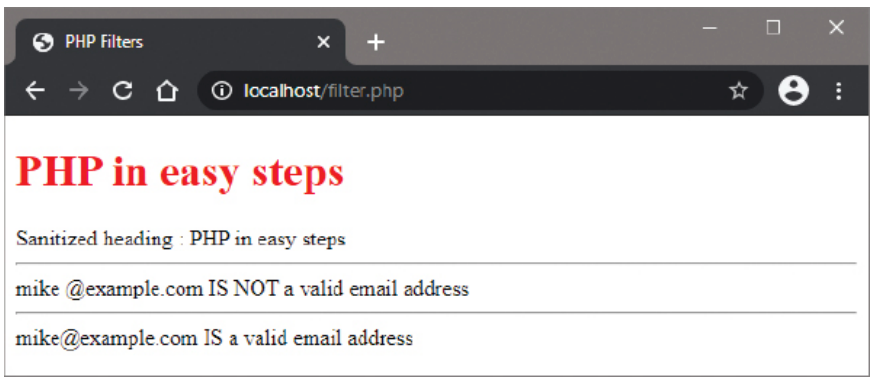

# Filtering Data

## Overview

To validate user input easily, PHP provides a `filter_var()` function that can be used to both validate and "sanitize" input values. This function is essential for security and data integrity in web applications, as submitted user input can break your webpage if not properly handled.

## The filter_var() Function

The `filter_var()` function filters a variable with a specified filter:

```php
filter_var($variable, $filter_constant, $options);
```

**Parameters:**
- `$variable`: The variable to filter
- `$filter_constant`: The filter constant to use
- `$options`: Optional array of options for certain filters

**Returns:**
- **Validation filters**: Return the filtered data if valid, `FALSE` if invalid
- **Sanitization filters**: Return the sanitized data

## Filter Constants

### Validation Filters

Validation filters check if data meets specific criteria:

| Filter Constant | Purpose |
|----------------|---------|
| `FILTER_VALIDATE_BOOLEAN` | Validates boolean values |
| `FILTER_VALIDATE_EMAIL` | Validates email address format |
| `FILTER_VALIDATE_FLOAT` | Validates floating-point numbers |
| `FILTER_VALIDATE_INT` | Validates integer numbers |
| `FILTER_VALIDATE_IP` | Validates IP address format |
| `FILTER_VALIDATE_MAC` | Validates MAC address format |
| `FILTER_VALIDATE_REGEXP` | Validates against regular expression |
| `FILTER_VALIDATE_URL` | Validates URL format |

### Sanitization Filters

Sanitization filters remove or encode unwanted characters:

| Filter Constant | Purpose |
|----------------|---------|
| `FILTER_SANITIZE_EMAIL` | Strip invalid characters from email |
| `FILTER_SANITIZE_ENCODED` | URL-encode string |
| `FILTER_SANITIZE_MAGIC_QUOTES` | Apply addslashes() |
| `FILTER_SANITIZE_NUMBER_FLOAT` | Strip all non-digits and float characters |
| `FILTER_SANITIZE_NUMBER_INT` | Strip all non-integer characters |
| `FILTER_SANITIZE_SPECIAL_CHARS` | HTML-escape special characters '"<>& |
| `FILTER_SANITIZE_STRING` | Strip HTML tags (deprecated in PHP 7.4+) |
| `FILTER_SANITIZE_URL` | Strip invalid characters from URL |
| `FILTER_CALLBACK` | Call a custom filter function |

## Complete Example: Data Sanitization and Validation

### filter.php

```php
<!DOCTYPE html>
<html>
<head>
    <title>Data Filtering</title>
</head>
<body>
    <?php
        // Write a styled HTML page heading
        $hdr = '<h1 style="color:red">PHP in easy steps</h1>';
        echo $hdr;
        
        // Sanitize the page heading by stripping HTML tags
        $sanitized_hdr = filter_var($hdr, FILTER_SANITIZE_STRING);
        echo "<h3>Sanitized heading: $sanitized_hdr</h3>";
        
        // Function to validate email addresses
        function validate($email) {
            if (filter_var($email, FILTER_VALIDATE_EMAIL)) {
                echo "<p><strong>$email IS a valid email address</strong></p>";
            } else {
                echo "<p><strong>$email IS NOT a valid email address</strong></p>";
            }
        }
        
        // Test with invalid email containing space
        $email = 'mike @example.com';
        echo "<h3>Testing invalid email:</h3>";
        validate($email);
        
        // Sanitize the email address
        $sanitized_email = filter_var($email, FILTER_SANITIZE_EMAIL);
        echo "<h3>After sanitization:</h3>";
        validate($sanitized_email);
        
        // Additional examples
        echo "<h3>Additional filter examples:</h3>";
        
        // Integer validation with range
        $age = '25';
        $options = array(
            'options' => array(
                'min_range' => 18,
                'max_range' => 120
            )
        );
        
        if (filter_var($age, FILTER_VALIDATE_INT, $options)) {
            echo "<p>Age $age is valid (18-120)</p>";
        } else {
            echo "<p>Age $age is invalid</p>";
        }
        
        // URL validation
        $url = 'https://www.example.com';
        if (filter_var($url, FILTER_VALIDATE_URL)) {
            echo "<p>URL $url is valid</p>";
        } else {
            echo "<p>URL $url is invalid</p>";
        }
        
        // Sanitize special characters
        $user_input = '<script>alert("XSS")</script>';
        $safe_input = filter_var($user_input, FILTER_SANITIZE_SPECIAL_CHARS);
        echo "<p>Original: $user_input</p>";
        echo "<p>Sanitized: $safe_input</p>";
    ?>
</body>
</html>
```



## Practical Applications

### 1. Email Validation and Sanitization

```php
function processEmail($input) {
    // First sanitize the input
    $email = filter_var($input, FILTER_SANITIZE_EMAIL);
    
    // Then validate the format
    if (filter_var($email, FILTER_VALIDATE_EMAIL)) {
        return $email; // Return clean, valid email
    } else {
        return false; // Invalid email
    }
}

// Usage
$user_email = processEmail('user@domain.com');
if ($user_email) {
    echo "Valid email: $user_email";
} else {
    echo "Invalid email format";
}
```

### 2. Integer Validation with Range

```php
function validateAge($age) {
    $options = array(
        'options' => array(
            'min_range' => 0,
            'max_range' => 150
        )
    );
    
    return filter_var($age, FILTER_VALIDATE_INT, $options);
}

// Usage
$age = validateAge(25);
if ($age !== false) {
    echo "Valid age: $age";
} else {
    echo "Invalid age";
}
```

### 3. URL Validation

```php
function validateURL($url) {
    return filter_var($url, FILTER_VALIDATE_URL);
}

// Usage
$website = validateURL('https://example.com');
if ($website) {
    echo "Valid URL: $website";
} else {
    echo "Invalid URL";
}
```

### 4. Custom Sanitization

```php
function sanitizeInput($input) {
    // Remove HTML tags
    $clean = filter_var($input, FILTER_SANITIZE_STRING);
    
    // Convert special characters to HTML entities
    $clean = filter_var($clean, FILTER_SANITIZE_SPECIAL_CHARS);
    
    return $clean;
}

// Usage
$user_comment = sanitizeInput('<script>alert("hack")</script>');
echo $user_comment; // Safe to display
```

## Advanced Filtering Options

### Filter Flags

```php
// Strip backticks and other special characters
$string = '`Hello` World';
$sanitized = filter_var($string, FILTER_SANITIZE_STRING, FILTER_FLAG_STRIP_BACKTICK);

// Allow only specific tags
$html = '<p><b>Bold</b> <em>Italic</em></p>';
$allowed = filter_var($html, FILTER_SANITIZE_STRING, FILTER_FLAG_ALLOW_STRICT);
```

### Multiple Filters

```php
function sanitizeString($input) {
    // Remove HTML tags
    $clean = filter_var($input, FILTER_SANITIZE_STRING);
    
    // Encode special characters
    $clean = htmlspecialchars($clean, ENT_QUOTES, 'UTF-8');
    
    // Trim whitespace
    $clean = trim($clean);
    
    return $clean;
}
```

## Security Best Practices

### 1. Always Filter User Input

```php
// Get user input
$user_input = $_POST['user_data'];

// Always sanitize before using
$safe_input = filter_var($user_input, FILTER_SANITIZE_STRING);
```

### 2. Validate Before Processing

```php
$email = $_POST['email'];
if (filter_var($email, FILTER_VALIDATE_EMAIL)) {
    // Process valid email
    sendNewsletter($email);
} else {
    // Handle invalid email
    echo "Please provide a valid email address";
}
```

### 3. Use Multiple Layers of Security

```php
function secureInput($input) {
    // Layer 1: Basic sanitization
    $clean = filter_var($input, FILTER_SANITIZE_STRING);
    
    // Layer 2: Special character encoding
    $clean = htmlspecialchars($clean, ENT_QUOTES, 'UTF-8');
    
    // Layer 3: Remove potentially dangerous patterns
    $clean = preg_replace('/<script\b[^<]*(?:(?!<\/script>)<[^<]*)*<\/script>/mi', '', $clean);
    
    return $clean;
}
```

## Common Filter Combinations

### Form Processing

```php
function processFormData($data) {
    $processed = array();
    
    foreach ($data as $key => $value) {
        switch ($key) {
            case 'email':
                $processed[$key] = filter_var($value, FILTER_SANITIZE_EMAIL);
                break;
            case 'age':
                $processed[$key] = filter_var($value, FILTER_SANITIZE_NUMBER_INT);
                break;
            case 'name':
                $processed[$key] = filter_var($value, FILTER_SANITIZE_STRING);
                break;
            case 'website':
                $processed[$key] = filter_var($value, FILTER_SANITIZE_URL);
                break;
            default:
                $processed[$key] = filter_var($value, FILTER_SANITIZE_STRING);
        }
    }
    
    return $processed;
}
```

## Implementation Steps

1. Create the PHP script (`filter.php`) with filtering examples
2. Save the file in the web server's `/htdocs` directory
3. Access the script via HTTP to see the filtering in action
4. Test with different inputs to understand how filters work
5. Apply appropriate filters to all user input in your applications

## Important Security Note

**Submitted user input can break your webpage so should always be validated.** Never trust user input and always apply appropriate filtering and validation before processing or displaying user-provided data.

The `filter_var()` function provides a standardized, reliable way to handle common validation and sanitization tasks, making it an essential tool for secure PHP development.