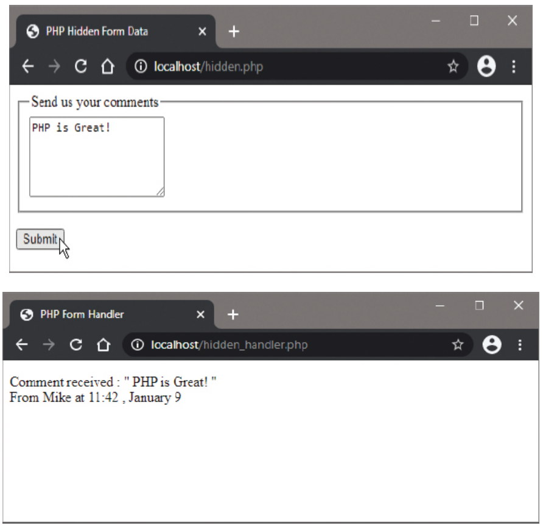

# Sending Hidden Data

## Overview

In addition to data entered by the user into HTML form input fields, data generated by PHP can be submitted using HTML hidden form fields. Like regular input fields, these also send a name=value pair to the form handler script, but here the value is supplied by PHP, not by the user.

## Hidden Form Fields

Hidden form fields allow PHP to pass data between pages without user interaction:

```html
<input type="hidden" name="fieldname" value="php_generated_value">
```

**Key Characteristics:**
- Invisible to the user in the browser
- Still submitted with form data
- Values set by PHP, not user input
- Useful for passing session data, timestamps, user info

## Common Use Cases

Hidden form fields are typically used to submit:
- **Login name** of the current user
- **Timestamp** of form creation/submission
- **Session identifiers**
- **Form tracking data**
- **Pre-filled values** from previous submissions

## Complete Example: Comment Form with Hidden Data

### hidden.php (Form with Hidden Fields)

```php
<!DOCTYPE html>
<html>
<head>
    <title>PHP Hidden Form Data</title>
</head>
<body>
    <?php
        // Define the timezone
        date_default_timezone_set('America/New_York');
        
        // Initialize two variables
        $user = "Mike";
        $time = date("g:i, F j");
        
        // Write a complete form with regular input and hidden fields
        echo '<form action="hidden_handler.admin" method="POST">';
        echo '<h2>Send us your comments</h2>';
        echo '<p><textarea name="comment" rows="4" cols="50"></textarea></p>';
        echo '<input type="hidden" name="user" value="' . $user . '">';
        echo '<input type="hidden" name="time" value="' . $time . '">';
        echo '<p><input type="submit" value="Submit"></p>';
        echo '</form>';
    ?>
</body>
</html>
```

### hidden_handler.php (Processing Hidden Data)

```php
<!DOCTYPE html>
<html>
<head>
    <title>PHP Form Handler</title>
</head>
<body>
    <?php
        // Initialize comment variable with submitted value or NULL
        $comment = (!isset($_POST['comment'])) ? NULL : $_POST['comment'];
        
        // Initialize variables if hidden form field values have been set
        $time = (!isset($_POST['time'])) ? NULL : $_POST['time'];
        $user = (!isset($_POST['user'])) ? NULL : $_POST['user'];
        
        // Output valid submitted data
        if (($comment != NULL) && ($time != NULL) && ($user != NULL)) {
            echo "<h2>Comment received : \"$comment\"</h2>";
            echo "<p>From $user at $time</p>";
        } else {
            echo "<h2>Error: Missing required data</h2>";
        }
    ?>
</body>
</html>
```



## PHP Techniques Used

### 1. Ternary Operator

The ternary operator provides a concise alternative to if-else statements:

```php
// Traditional if-else
if (!isset($_POST['comment'])) {
    $comment = NULL;
} else {
    $comment = $_POST['comment'];
}

// Ternary operator equivalent
$comment = (!isset($_POST['comment'])) ? NULL : $_POST['comment'];
```

**Syntax:** `(condition) ? value_if_true : value_if_false`

### 2. Timestamp Generation

```php
// Set timezone
date_default_timezone_set('America/New_York');

// Format timestamp
$time = date("g:i, F j");
// Example output: "11:42, January 9"

// Common date formats:
date("Y-m-d H:i:s");  // 2024-01-09 11:42:30
date("m/d/Y");        // 01/09/2024
date("h:i A");        // 11:42 AM
```

### 3. Escaping Quotes

Include quotes in output by prefixing with backslash:

```php
echo "<h2>Comment received : \"$comment\"</h2>";
// Output: Comment received : "PHP is Great!"

// Alternative methods:
echo '<h2>Comment received : "' . $comment . '"</h2>';
echo "<h2>Comment received : &quot;$comment&quot;</h2>";
```

## Advanced Hidden Field Techniques

### 1. Dynamic Hidden Fields

```php
<?php
// Generate unique form ID
$form_id = uniqid('form_', true);

// Track form creation time
$created_time = time();

// Store user session data
session_start();
$user_id = $_SESSION['user_id'] ?? 'anonymous';
?>

<input type="hidden" name="form_id" value="<?php echo $form_id; ?>">
<input type="hidden" name="created_time" value="<?php echo $created_time; ?>">
<input type="hidden" name="user_id" value="<?php echo $user_id; ?>">
```

### 2. Security Considerations

```php
<?php
// Hash sensitive data instead of passing it directly
$secret_key = 'your_secret_key';
$user_data = 'sensitive_info';
$hashed_data = hash_hmac('sha256', $user_data, $secret_key);
?>

<input type="hidden" name="data_hash" value="<?php echo $hashed_data; ?>">
```

### 3. Multi-Step Forms

```php
<?php
// Step 1: Collect basic info
if ($_SERVER['REQUEST_METHOD'] === 'POST' && isset($_POST['step1'])) {
    $_SESSION['step1_data'] = $_POST;
    header('Location: step2.admin');
    exit();
}

// Step 2: Include step 1 data as hidden fields
if (isset($_SESSION['step1_data'])) {
    foreach ($_SESSION['step1_data'] as $key => $value) {
        echo '<input type="hidden" name="' . $key . '" value="' . htmlspecialchars($value) . '">';
    }
}
?>
```

## Best Practices

### 1. Data Security

```php
// Always sanitize hidden field values
$value = htmlspecialchars($user_input, ENT_QUOTES, 'UTF-8');
echo '<input type="hidden" name="field" value="' . $value . '">';

// Validate hidden field data on submission
if (isset($_POST['user_id']) && is_numeric($_POST['user_id'])) {
    $user_id = (int)$_POST['user_id'];
}
```

### 2. Timestamp Management

```php
<?php
// Form creation timestamp
$created_at = time();

// Form submission timestamp (in handler)
$submitted_at = time();

// Calculate time difference
$time_diff = $submitted_at - $created_at;

if ($time_diff > 3600) { // 1 hour
    echo "Form expired. Please refresh and try again.";
}
?>
```

### 3. User Tracking

```php
<?php
session_start();

// Track user activity
$_SESSION['last_activity'] = time();
$_SESSION['page_views'] = ($_SESSION['page_views'] ?? 0) + 1;

// Include tracking data in forms
echo '<input type="hidden" name="session_id" value="' . session_id() . '">';
echo '<input type="hidden" name="page_views" value="' . $_SESSION['page_views'] . '">';
?>
```

## Common Patterns

### 1. Form Persistence

```php
<?php
// Preserve user input across form submissions
if ($_SERVER['REQUEST_METHOD'] === 'POST') {
    foreach ($_POST as $key => $value) {
        if ($key !== 'submit') {
            echo '<input type="hidden" name="' . $key . '" value="' . htmlspecialchars($value) . '">';
        }
    }
}
?>
```

### 2. CSRF Protection

```php
<?php
session_start();

// Generate CSRF token
if (empty($_SESSION['csrf_token'])) {
    $_SESSION['csrf_token'] = bin2hex(random_bytes(32));
}

// Include token in form
echo '<input type="hidden" name="csrf_token" value="' . $_SESSION['csrf_token'] . '">';

// Verify token in handler
if (!hash_equals($_SESSION['csrf_token'], $_POST['csrf_token'] ?? '')) {
    die('CSRF token validation failed');
}
?>
```

## Implementation Steps

1. Create the HTML form (`hidden.php`) with PHP-generated hidden fields
2. Create the PHP handler script (`hidden_handler.php`) to process both visible and hidden data
3. Save both files in the web server's `/htdocs` directory
4. Test the form submission to see how hidden data is passed and displayed
5. Verify that timestamps and user data are correctly transmitted

## Important Notes

- **Timestamp Creation**: The timestamp in this example is created when the form gets created, not when the form gets submitted
- **Security**: Never trust hidden field data as it can be manipulated by users
- **Validation**: Always validate hidden field data just like user input
- **Alternatives**: Consider using sessions for sensitive data instead of hidden fields

Hidden form fields provide a simple way to pass PHP-generated data between pages, but should be used carefully and always validated on the server side.