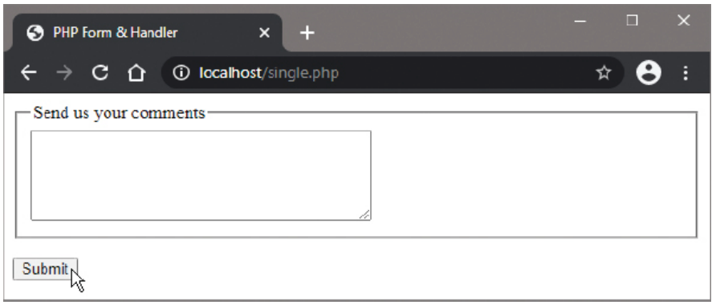

# Handling Submissions

## Overview

The examples so far in this chapter have each used two documents - one to display an HTML form and another to handle the form submission. This procedure can, however, be performed by a single document, using a simple technique to determine whether a form should be displayed or its submission should be handled.

## The $_SERVER Superglobal Array

PHP provides a special "superglobal" `$_SERVER` array variable with a `REQUEST_METHOD` element that stores the type of HTTP request:

```php
$_SERVER['REQUEST_METHOD']
```

**Common Request Methods:**
- **GET**: Standard page request, form display, data retrieval
- **POST**: Form submission, data creation/modification
- **PUT**: Data update
- **DELETE**: Data deletion

## Request Method Detection

When a form uses the POST method for submission, two different types of request are made to the PHP script:

1. **GET Request**: When the page loads initially (displaying the form)
2. **POST Request**: When the form is submitted (processing the data)

This allows us to examine the request method to determine which course of action to take.

## Self-Handling Forms

Using this technique, the name of the same single page is specified as the form handler in the HTML action attribute:

```html
<form action="single.php" method="POST">
    <!-- Form fields -->
</form>
```

**Alternative methods:**
```html
<form action="" method="POST">           <!-- Empty string -->
<form action="<?php echo $_SERVER['PHP_SELF']; ?>" method="POST">  <!-- Dynamic -->
```

## Complete Example: Single-Page Form Handler

### single.php

```php
<!DOCTYPE html>
<html>
<head>
    <title>Single-Page Form Handler</title>
</head>
<body>
    <?php
        // Examine the page request method
        if ($_SERVER['REQUEST_METHOD'] === 'GET') {
            // Display the form when requested by GET method
            echo '<h2>Send us your comments</h2>';
            echo '<form action="single.php" method="POST">';
            echo '<p><textarea name="comment" rows="4" cols="50"></textarea></p>';
            echo '<p><input type="submit" value="Submit"></p>';
            echo '</form>';
        } elseif ($_SERVER['REQUEST_METHOD'] === 'POST') {
            // Handle form submission when requested by POST method
            if (!empty($_POST['comment'])) {
                $comment = $_POST['comment'];
                echo "<h2>Comment: $comment</h2>";
                echo '<p><a href="single.php">Submit another comment</a></p>';
            } else {
                $comment = NULL;
                echo '<h2>You must enter a comment</h2>';
                echo '<p><a href="single.php">Try again</a></p>';
            }
        }
    ?>
</body>
</html>
```




## Advanced Self-Handling Techniques

### 1. Form with Validation and Redisplay

```php
<?php
// Initialize variables
$comment = '';
$error = '';

// Handle form submission
if ($_SERVER['REQUEST_METHOD'] === 'POST') {
    if (!empty($_POST['comment'])) {
        // Process valid comment
        $comment = htmlspecialchars($_POST['comment']);
        echo "<h2>Thank you for your comment:</h2>";
        echo "<p>$comment</p>";
        echo '<p><a href="single.php">Submit another</a></p>';
        exit(); // Stop further execution
    } else {
        $error = 'Please enter a comment';
    }
}
?>

<!-- Display form (GET request or POST with errors) -->
<h2>Send us your comments</h2>
<?php if ($error): ?>
    <p style="color: red;"><?php echo $error; ?></p>
<?php endif; ?>

<form action="single.php" method="POST">
    <p>
        <textarea name="comment" rows="4" cols="50"><?php echo htmlspecialchars($comment); ?></textarea>
    </p>
    <p><input type="submit" value="Submit"></p>
</form>
```

### 2. Multi-Purpose Single Page

```php
<?php
// Determine action based on request method and parameters
$action = $_GET['action'] ?? 'form';

if ($_SERVER['REQUEST_METHOD'] === 'POST') {
    // Handle form submission
    if (isset($_POST['submit_comment'])) {
        handleCommentSubmission();
    } elseif (isset($_POST['submit_contact'])) {
        handleContactSubmission();
    }
} else {
    // Display appropriate content based on action parameter
    switch ($action) {
        case 'form':
            displayCommentForm();
            break;
        case 'contact':
            displayContactForm();
            break;
        default:
            displayHomePage();
    }
}

function handleCommentSubmission() {
    // Process comment
    echo "<h2>Comment submitted successfully!</h2>";
}

function displayCommentForm() {
    // Show comment form
    echo '<form method="POST">';
    echo '<textarea name="comment"></textarea>';
    echo '<input type="submit" name="submit_comment" value="Submit">';
    echo '</form>';
}
?>
```

### 3. Form with File Upload Handling

```php
<?php
$message = '';

if ($_SERVER['REQUEST_METHOD'] === 'POST') {
    if (isset($_FILES['upload']) && $_FILES['upload']['error'] === UPLOAD_ERR_OK) {
        $upload_dir = 'uploads/';
        $file_name = basename($_FILES['upload']['name']);
        $target_path = $upload_dir . $file_name;
        
        if (move_uploaded_file($_FILES['upload']['tmp_name'], $target_path)) {
            $message = "File uploaded successfully: $file_name";
        } else {
            $message = "File upload failed";
        }
    } else {
        $message = "Please select a file to upload";
    }
}
?>

<h2>File Upload</h2>
<?php if ($message): ?>
    <p><?php echo $message; ?></p>
<?php endif; ?>

<form method="POST" enctype="multipart/form-data">
    <p><input type="file" name="upload"></p>
    <p><input type="submit" value="Upload"></p>
</form>
```

## Security Considerations

### 1. CSRF Protection in Self-Handling Forms

```php
<?php
session_start();

// Generate CSRF token
if (empty($_SESSION['csrf_token'])) {
    $_SESSION['csrf_token'] = bin2hex(random_bytes(32));
}

if ($_SERVER['REQUEST_METHOD'] === 'POST') {
    // Verify CSRF token
    if (!hash_equals($_SESSION['csrf_token'], $_POST['csrf_token'] ?? '')) {
        die('CSRF token validation failed');
    }
    
    // Process form data
    processFormData();
}
?>

<form method="POST">
    <input type="hidden" name="csrf_token" value="<?php echo $_SESSION['csrf_token']; ?>">
    <!-- Other form fields -->
</form>
```

### 2. Input Sanitization

```php
<?php
if ($_SERVER['REQUEST_METHOD'] === 'POST') {
    // Sanitize all inputs
    $name = filter_input(INPUT_POST, 'name', FILTER_SANITIZE_STRING);
    $email = filter_input(INPUT_POST, 'email', FILTER_SANITIZE_EMAIL);
    $age = filter_input(INPUT_POST, 'age', FILTER_SANITIZE_NUMBER_INT);
    
    // Validate sanitized inputs
    if (!empty($name) && filter_var($email, FILTER_VALIDATE_EMAIL)) {
        // Process valid data
        processData($name, $email, $age);
    }
}
?>
```

## Best Practices

### 1. Code Organization

```php
<?php
// Functions at the top
function validateForm($data) {
    // Validation logic
}

function processForm($data) {
    // Processing logic
}

// Main logic
if ($_SERVER['REQUEST_METHOD'] === 'POST') {
    // Handle submission
} else {
    // Display form
}
?>
```

### 2. Error Handling

```php
<?php
$errors = [];

if ($_SERVER['REQUEST_METHOD'] === 'POST') {
    // Validate all fields
    if (empty($_POST['name'])) {
        $errors['name'] = 'Name is required';
    }
    
    if (empty($_POST['email'])) {
        $errors['email'] = 'Email is required';
    } elseif (!filter_var($_POST['email'], FILTER_VALIDATE_EMAIL)) {
        $errors['email'] = 'Invalid email format';
    }
    
    if (empty($errors)) {
        // Process form
        processFormData($_POST);
    }
}
?>

<!-- Display errors -->
<?php foreach ($errors as $field => $error): ?>
    <p style="color: red"><?php echo $error; ?></p>
<?php endforeach; ?>
```

### 3. Form State Preservation

```php
<?php
// Initialize form data
$form_data = [
    'name' => '',
    'email' => '',
    'comments' => ''
];

if ($_SERVER['REQUEST_METHOD'] === 'POST') {
    // Preserve submitted data
    $form_data = array_merge($form_data, $_POST);
}
?>

<form method="POST">
    <input type="text" name="name" value="<?php echo htmlspecialchars($form_data['name']); ?>">
    <input type="email" name="email" value="<?php echo htmlspecialchars($form_data['email']); ?>">
    <textarea name="comments"><?php echo htmlspecialchars($form_data['comments']); ?></textarea>
</form>
```

## Implementation Steps

1. Create the PHP script (`single.php`) with request method detection
2. Implement form display logic for GET requests
3. Implement form handling logic for POST requests
4. Add validation and error handling
5. Test the form submission and verify self-handling behavior
6. Add security measures like CSRF protection and input sanitization

## Advantages of Single-Page Forms

- **Simplified file management**: Only one file to maintain
- **Better user experience**: No page redirects for validation errors
- **Easier state management**: Form data can be preserved across submissions
- **Reduced server load**: Fewer HTTP requests for validation

## Disadvantages

- **Complexer code**: Mixed presentation and logic
- **Harder to maintain**: Larger files with multiple responsibilities
- **Potential security risks**: Need careful input validation

## Important Notes

- **Action Attribute**: The form will be handled by the same page on submission if the action attribute specifies an empty string `action=""` - but it is preferable to specify the page name
- **Request Method Detection**: Always check `$_SERVER['REQUEST_METHOD']` before attempting to access POST data
- **Security**: Never trust user input, even in self-handling forms

Self-handling forms provide a clean, efficient way to manage form interactions while maintaining good user experience and code organization.