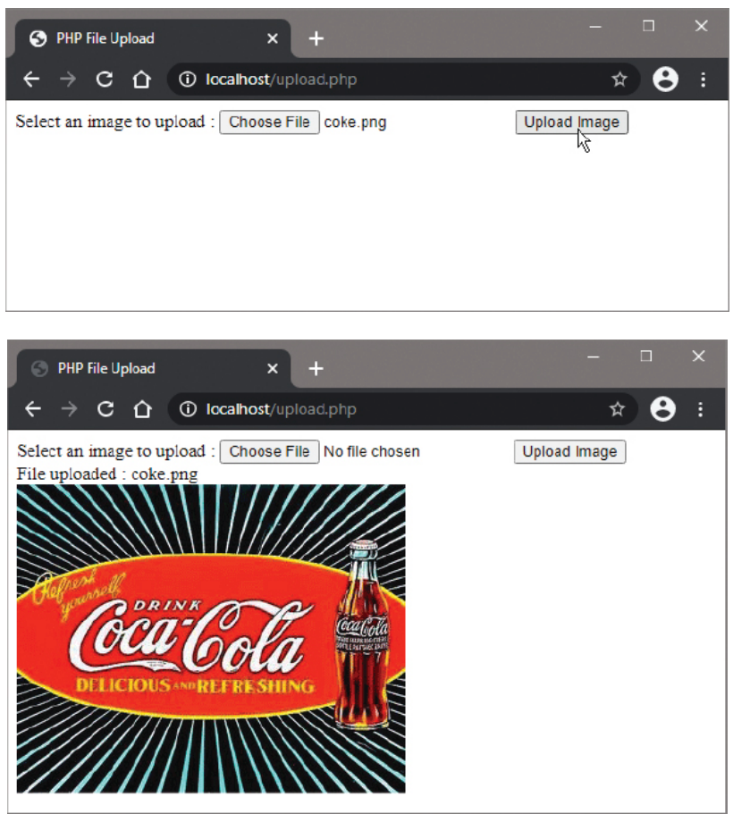

# Uploading Files

## Overview

The PHP `$_FILES` superglobal variable makes it simple to POST file uploads from an HTML form if the `<form>` tag includes an `enctype` attribute set to "multipart/form-data". When submitted, a `$_FILES` associative array is created with keys that include the file name, a generated temporary name (`tmp_name`), and the file size.

## The $_FILES Superglobal Array

The `$_FILES` array contains information about uploaded files:

```php
$_FILES['fieldname']['name']     // Original filename
$_FILES['fieldname']['tmp_name'] // Temporary filename on server
$_FILES['fieldname']['size']     // File size in bytes
$_FILES['fieldname']['type']     // MIME type (if provided by browser)
$_FILES['fieldname']['error']    // Upload error code
```

**Array Structure Example:**
```php
Array
(
    [image] => Array
        (
            [name] => coke.png
            [type] => image/png
            [tmp_name] => /tmp/phpXYZ123
            [error] => 0
            [size] => 15420
        )
)
```

## HTML Form for File Upload

To enable file uploads, the form must include:

```html
<form action="upload.php" method="POST" enctype="multipart/form-data">
    <p>Select an image to upload:</p>
    <p><input type="file" name="image"></p>
    <p><input type="submit" value="Upload"></p>
</form>
```

**Required Attributes:**
- `method="POST"`: Files cannot be uploaded via GET
- `enctype="multipart/form-data"`: Enables binary data transmission

## Complete Example: Image Upload with Validation

### upload.php

```php
<!DOCTYPE html>
<html>
<head>
    <title>File Upload</title>
</head>
<body>
    <form action="upload.php" method="POST" enctype="multipart/form-data">
        <p>Select an image to upload:</p>
        <p><input type="file" name="image"></p>
        <p><input type="submit" value="Upload"></p>
    </form>
    
    <?php
        if ($_SERVER['REQUEST_METHOD'] === 'POST' && isset($_FILES['image'])) {
            // Initialize variables with file information
            $name = $_FILES['image']['name'];
            $temp = $_FILES['image']['tmp_name'];
            $size = $_FILES['image']['size'];
            $error = $_FILES['image']['error'];
            
            // Check for upload errors
            if ($error !== UPLOAD_ERR_OK) {
                echo '<p style="color: red;">Upload error occurred. Error code: ' . $error . '</p>';
                exit();
            }
            
            // Validate file type
            $ext = pathinfo($name, PATHINFO_EXTENSION);
            $ext = strtolower($ext);
            if ($ext != 'png' && $ext != 'jpg' && $ext != 'gif') {
                echo '<p style="color: red;">Format must be PNG, JPG, or GIF</p>';
                exit();
            }
            
            // Validate file size (500KB limit)
            if ($size > 512000) {
                echo '<p style="color: red;">File size must not exceed 500Kb</p>';
                exit();
            }
            
            // Check for duplicate files
            if (file_exists($name)) {
                echo '<p style="color: red;">File ' . htmlspecialchars($name) . ' already uploaded</p>';
                exit();
            }
            
            // Attempt to upload the file
            try {
                if (move_uploaded_file($temp, $name)) {
                    echo '<p style="color: green;">File uploaded: ' . htmlspecialchars($name) . '</p>';
                    echo '';
                } else {
                    echo '<p style="color: red;">File upload failed!</p>';
                }
            } catch (Exception $e) {
                echo '<p style="color: red;">File upload failed: ' . $e->getMessage() . '</p>';
            }
        }
    ?>
</body>
</html>
```



## PHP Functions Used

### 1. pathinfo() Function

Extracts information about file paths:

```php
pathinfo($path, $option)
```

**Options:**
- `PATHINFO_DIRNAME`: Directory name
- `PATHINFO_BASENAME`: Base name (filename with extension)
- `PATHINFO_EXTENSION`: File extension
- `PATHINFO_FILENAME`: Filename without extension

**Usage:**
```php
$ext = pathinfo($name, PATHINFO_EXTENSION);
$ext = strtolower($ext); // Convert to lowercase for consistency
```

### 2. move_uploaded_file() Function

Moves an uploaded file to a new location:

```php
move_uploaded_file($temporary_filename, $destination)
```

**Parameters:**
- `$temporary_filename`: The temporary file name from `$_FILES['file']['tmp_name']`
- `$destination`: The final destination path and filename

**Returns:** `TRUE` on success, `FALSE` on failure

**Important:** This function checks that the file was actually uploaded via HTTP POST, providing security against malicious file manipulation.

### 3. file_exists() Function

Checks if a file or directory exists:

```php
file_exists($filename)
```

**Usage:** Prevents overwriting existing files with the same name.

## File Validation Techniques

### 1. File Type Validation

```php
// Method 1: Extension check
$allowed_extensions = ['png', 'jpg', 'jpeg', 'gif'];
$ext = strtolower(pathinfo($name, PATHINFO_EXTENSION));

if (!in_array($ext, $allowed_extensions)) {
    echo "Invalid file type";
    exit();
}

// Method 2: MIME type check
$allowed_mimes = ['image/png', 'image/jpeg', 'image/gif'];
if (!in_array($_FILES['image']['type'], $allowed_mimes)) {
    echo "Invalid MIME type";
    exit();
}

// Method 3: Getimagesize() check (more secure)
$image_info = getimagesize($temp);
if ($image_info === false) {
    echo "File is not a valid image";
    exit();
}
```

### 2. File Size Validation

```php
// Size in bytes
$max_size = 512000; // 500KB

if ($size > $max_size) {
    echo "File size must not exceed " . ($max_size / 1024) . "KB";
    exit();
}

// Alternative: Display human-readable size
function formatFileSize($bytes) {
    $units = ['B', 'KB', 'MB', 'GB'];
    $bytes = max($bytes, 0);
    $pow = floor(($bytes ? log($bytes) : 0) / log(1024));
    $pow = min($pow, count($units) - 1);
    $bytes /= pow(1024, $pow);
    return round($bytes, 2) . ' ' . $units[$pow];
}
```

### 3. File Name Validation

```php
// Sanitize filename
$safe_name = preg_replace('/[^a-zA-Z0-9._-]/', '', $name);

// Generate unique filename
$unique_name = time() . '_' . $name;
$destination = 'uploads/' . $unique_name;

// Check filename length
if (strlen($name) > 255) {
    echo "Filename too long";
    exit();
}
```

## Upload Error Codes

PHP provides predefined constants for upload errors:

```php
switch ($_FILES['image']['error']) {
    case UPLOAD_ERR_OK:
        echo "File uploaded successfully";
        break;
    case UPLOAD_ERR_INI_SIZE:
        echo "File exceeds upload_max_filesize directive in php.ini";
        break;
    case UPLOAD_ERR_FORM_SIZE:
        echo "File exceeds MAX_FILE_SIZE directive in HTML form";
        break;
    case UPLOAD_ERR_PARTIAL:
        echo "File was only partially uploaded";
        break;
    case UPLOAD_ERR_NO_FILE:
        echo "No file was uploaded";
        break;
    case UPLOAD_ERR_NO_TMP_DIR:
        echo "Missing temporary folder";
        break;
    case UPLOAD_ERR_CANT_WRITE:
        echo "Failed to write file to disk";
        break;
    case UPLOAD_ERR_EXTENSION:
        echo "File upload stopped by PHP extension";
        break;
    default:
        echo "Unknown upload error";
}
```

## PHP Configuration Requirements

The PHP configuration must permit file uploads for this example to work. The configuration file `php.ini`, within the PHP directory, must contain:

```ini
file_uploads = On
```

**Important php.ini Directives:**
```ini
file_uploads = On          ; Enable file uploads
upload_max_filesize = 2M   ; Maximum upload file size
post_max_size = 8M         ; Maximum POST data size
upload_tmp_dir = /tmp      ; Temporary upload directory
max_file_uploads = 20      ; Maximum number of files uploaded simultaneously
```

## Security Considerations

### 1. Directory Structure

```php
// Create dedicated uploads directory
$upload_dir = 'uploads/';
if (!file_exists($upload_dir)) {
    mkdir($upload_dir, 0755, true);
}

// Use full path for destination
$destination = $upload_dir . $name;
```

### 2. File Name Security

```php
// Prevent directory traversal attacks
$name = basename($name); // Remove path information

// Sanitize filename
$name = preg_replace('/[^a-zA-Z0-9._-]/', '', $name);

// Generate unique filename to prevent overwrites
$unique_name = uniqid() . '_' . $name;
```

### 3. File Content Validation

```php
// Verify actual file content matches extension
$finfo = finfo_open(FILEINFO_MIME_TYPE);
$mime_type = finfo_file($finfo, $temp);
finfo_close($finfo);

$allowed_mimes = ['image/png', 'image/jpeg', 'image/gif'];
if (!in_array($mime_type, $allowed_mimes)) {
    echo "File content does not match allowed types";
    exit();
}
```

## Advanced Upload Techniques

### 1. Multiple File Upload

```html
<input type="file" name="images[]" multiple>
```

```php
foreach ($_FILES['images']['name'] as $key => $name) {
    $temp = $_FILES['images']['tmp_name'][$key];
    $size = $_FILES['images']['size'][$key];
    
    // Process each file
    if (move_uploaded_file($temp, 'uploads/' . $name)) {
        echo "Uploaded: $name<br>";
    }
}
```

### 2. Image Processing After Upload

```php
// Create thumbnail after upload
if (move_uploaded_file($temp, $destination)) {
    // Create thumbnail
    $thumb_path = 'thumbs/thumb_' . $name;
    createThumbnail($destination, $thumb_path, 150, 150);
}

function createThumbnail($src, $dest, $width, $height) {
    $image_info = getimagesize($src);
    $image_type = $image_info[2];
    
    switch ($image_type) {
        case IMAGETYPE_JPEG:
            $image = imagecreatefromjpeg($src);
            break;
        case IMAGETYPE_GIF:
            $image = imagecreatefromgif($src);
            break;
        case IMAGETYPE_PNG:
            $image = imagecreatefrompng($src);
            break;
        default:
            return false;
    }
    
    $thumb = imagecreatetruecolor($width, $height);
    imagecopyresampled($thumb, $image, 0, 0, 0, 0, $width, $height, 
                      imagesx($image), imagesy($image));
    
    imagejpeg($thumb, $dest, 90);
    imagedestroy($image);
    imagedestroy($thumb);
    
    return true;
}
```

### 3. Progress Bar for Uploads

```php
// Session-based upload progress
session_start();

if ($_SERVER['REQUEST_METHOD'] === 'POST') {
    $upload_id = uniqid();
    $_SESSION['upload_progress_' . $upload_id] = [
        'files' => $_FILES,
        'total' => array_sum($_FILES['image']['size']),
        'uploaded' => 0
    ];
    
    // Process upload and update progress
}
```

## Implementation Steps

1. **Configure PHP**: Ensure `file_uploads = On` in `php.ini`
2. **Create HTML form** with `enctype="multipart/form-data"`
3. **Handle upload** in PHP using `$_FILES` superglobal
4. **Validate file** (type, size, name)
5. **Move file** with `move_uploaded_file()`
6. **Display result** or error messages
7. **Implement security** measures

## Best Practices

### 1. Use Dedicated Upload Directory

```php
$upload_dir = 'uploads/';
$destination = $upload_dir . $unique_name;
```

### 2. Generate Unique Filenames

```php
$unique_name = time() . '_' . uniqid() . '_' . $name;
```

### 3. Comprehensive Validation

```php
// Check extension, MIME type, and actual file content
if (!isValidImage($temp, $ext)) {
    echo "Invalid image file";
    exit();
}
```

### 4. Proper Error Handling

```php
try {
    if (move_uploaded_file($temp, $destination)) {
        echo "Upload successful";
    } else {
        throw new Exception("Failed to move uploaded file");
    }
} catch (Exception $e) {
    error_log("Upload error: " . $e->getMessage());
    echo "Upload failed. Please try again.";
}
```

## Important Notes

- **PHP Configuration**: The PHP configuration must permit file uploads for this example to work. The configuration file `php.ini`, within the PHP directory, must contain a line `file_uploads = On`
- **pathinfo() Function**: Notice how the `pathinfo()` function provides the file extension part of the filename here
- **move_uploaded_file() Arguments**: The arguments to the `move_uploaded_file()` function specify the (temporary) filename and destination. It could usefully specify a dedicated directory path destination, such as `'uploads/'.$name`
- **Security**: Always validate uploaded files and never trust user-provided filenames or MIME types
- **Permissions**: Ensure the upload directory has proper write permissions for the web server

File uploads are a powerful feature of PHP that enable rich web applications, but require careful security consideration and proper validation to prevent vulnerabilities.