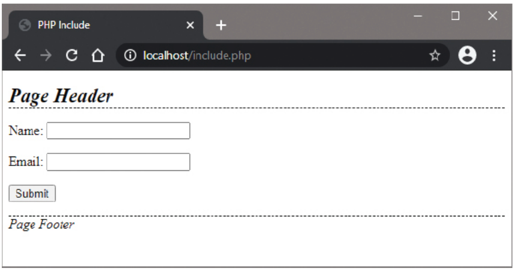

# Surrounding Forms

## Overview

PHP usefully allows multiple files to be incorporated together to create a single web page. This means that dynamic forms can be surrounded by static header and footer content that can be easily reused to create other pages within a website.

## PHP Include Functions

### include() Function

The `include()` function takes the URL of another file to be incorporated within a web page as its argument:

```php
include('filename.admin');
```

**Behavior:**
- When `include()` fails, a warning is sent to the browser but the script continues to run
- Typically used for static HTML files
- Non-fatal error handling

### require() Function

The `require()` function works just like the `include()` function but with a key difference:

```php
require('filename.admin');
```

**Behavior:**
- When `require()` fails, an error is printed and the script is halted
- Typically used for dynamic PHP scripts
- Fatal error handling

### include_once() and require_once()

Variants that ensure files are only included once:

```php
include_once('filename.admin');  // Include only if not already included
require_once('filename.admin');  // Require only if not already required
```

## File Structure Organization

### Recommended Directory Structure

```
/htdocs/
├── includes/
│   ├── header.html
│   ├── footer.html
│   └── style.css
├── include.php
├── other_pages/
│   └── contact.php
└── uploads/
```

**Best Practices:**
- Create an "includes" folder within the `/htdocs` directory
- Store reusable static content files in the includes folder
- Keep main PHP scripts in the root directory
- Organize by functionality (uploads, admin, etc.)

## Complete Example: Form with Header and Footer

### 1. Header Content (header.html)

```html
<!DOCTYPE html>
<html>
<head>
    <title><?php echo $page_title ?? 'Default Title'; ?></title>
    <link rel="stylesheet" href="htdocs/includes/style.css">
</head>
<body>
<header>
    <h1>Page Header</h1>
</header>
```

### 2. Footer Content (footer.html)

```html
    <footer>
        <p>Page Footer</p>
    </footer>
</body>
</html>
```

### 3. CSS Stylesheet (style.css)

```css
/* Header and Footer Styling */
header > h1 {
    border-bottom: 1px dashed black;
    font-style: italic;
    font-size: x-large;
}

footer > p {
    border-top: 1px dashed black;
    font-style: italic;
}

/* Table Styling */
table {
    border-spacing: 5px;
    width: 530px;
}

th {
    color: #FFF;
    background: #000;
    text-align: left;
}

td {
    border-bottom: 1px solid black;
    padding: 3px;
    background: #F0F0F0;
    text-align: left;
    vertical-align: top;
}

/* Error Message Styling */
p#err_msg {
    color: #F00;
    font-weight: bold;
}

/* Form Styling */
form {
    margin: 20px 0;
}

input[type="text"], input[type="email"] {
    padding: 5px;
    margin: 5px 0;
    border: 1px solid #ccc;
    border-radius: 3px;
}

input[type="submit"] {
    padding: 8px 15px;
    background: #333;
    color: #FFF;
    border: none;
    border-radius: 3px;
    cursor: pointer;
}

input[type="submit"]:hover {
    background: #555;
}
```

### 4. Main PHP Script (include.php)

```php
<?php
// Set the page title dynamically
$page_title = 'PHP Include';
?>

<?php include('includes/header.html'); ?>

<main>
    <h2>Contact Form</h2>
    <form action="process.php" method="POST">
        <p>
            <label for="name">Name:</label><br>
            <input type="text" id="name" name="name" required>
        </p>
        <p>
            <label for="email">Email:</label><br>
            <input type="email" id="email" name="email" required>
        </p>
        <p>
            <input type="submit" value="Submit">
        </p>
    </form>
</main>

<?php include('includes/footer.html'); ?>
```



## Dynamic Page Titles

### Method 1: Variable Declaration

```php
<?php
$page_title = 'Contact Page';
include('includes/header.html');
?>
```

### Method 2: Function-Based Approach

```php
<?php
function setPageTitle($title) {
    global $page_title;
    $page_title = $title;
}

setPageTitle('About Us');
include('includes/header.html');
?>
```

### Method 3: Configuration Array

```php
<?php
$config = [
    'page_title' => 'Services',
    'meta_description' => 'Our services page'
];

extract($config); // Creates $page_title and $meta_description variables
include('includes/header.html');
?>
```

## Advanced Include Techniques

### 1. Conditional Includes

```php
<?php
// Include different headers based on user type
if (isset($_SESSION['user_type'])) {
    if ($_SESSION['user_type'] === 'admin') {
        include('includes/admin_header.html');
    } else {
        include('includes/user_header.html');
    }
} else {
    include('includes/public_header.html');
}
?>
```

### 2. Include with Error Handling

```php
<?php
// Safe include with error checking
$header_file = 'includes/header.html';

if (file_exists($header_file)) {
    include($header_file);
} else {
    echo '<header><h1>Default Header</h1></header>';
    error_log("Header file not found: $header_file");
}
?>
```

### 3. Dynamic Content Loading

```php
<?php
// Load content based on URL parameter
$page = $_GET['page'] ?? 'home';

$content_files = [
    'home' => 'content/home.html',
    'about' => 'content/about.html',
    'contact' => 'content/contact.html'
];

if (isset($content_files[$page]) && file_exists($content_files[$page])) {
    include($content_files[$page]);
} else {
    include('content/404.html');
}
?>
```

## Template System Patterns

### 1. Basic Template Pattern

```php
<?php
// template.admin
function renderTemplate($template, $data = []) {
    extract($data);
    include("templates/$template");
}

// Usage
renderTemplate('header.admin', ['page_title' => 'Home']);
renderTemplate('navigation.admin');
renderTemplate('content.admin', ['content' => 'Welcome!']);
renderTemplate('footer.admin');
?>
```

### 2. Master Template Pattern

```php
<?php
// master.admin
class Template {
    private $data = [];
    
    public function set($key, $value) {
        $this->data[$key] = $value;
    }
    
    public function render($template) {
        extract($this->data);
        include("templates/$template");
    }
}

// Usage
$template = new Template();
$template->set('page_title', 'Contact');
$template->set('content', 'Contact form here...');
$template->render('layout.admin');
?>
```

## Security Considerations

### 1. Path Traversal Protection

```php
<?php
// Prevent directory traversal attacks
$page = $_GET['page'] ?? 'home';
$page = basename($page); // Remove path information

$allowed_pages = ['home', 'about', 'contact', 'services'];
if (in_array($page, $allowed_pages)) {
    include("pages/$page.admin");
} else {
    include('pages/404.admin');
}
?>
```

### 2. Include Path Security

```php
<?php
// Set secure include path
set_include_path('/var/www/html/includes');

// Use absolute paths when possible
include('/var/www/html/includes/header.html');
?>
```

### 3. Variable Scope Management

```php
<?php
// Clear sensitive variables before including
$sensitive_data = 'secret';
unset($sensitive_data);

include('public_template.html');
?>
```

## Performance Considerations

### 1. Include Optimization

```php
<?php
// Use absolute paths for better performance
define('ROOT_PATH', $_SERVER['DOCUMENT_ROOT']);
include(ROOT_PATH . '/includes/header.html');

// Use include_once for files that might be included multiple times
include_once(ROOT_PATH . '/includes/functions.admin');
?>
```

### 2. Caching Includes

```php
<?php
// Cache included content (advanced)
function cachedInclude($file, $cache_time = 3600) {
    $cache_file = 'cache/' . md5($file) . '.cache';
    
    if (file_exists($cache_file) && (time() - filemtime($cache_file)) < $cache_time) {
        readfile($cache_file);
    } else {
        ob_start();
        include($file);
        $content = ob_get_clean();
        file_put_contents($cache_file, $content);
        echo $content;
    }
}
?>
```

## Best Practices

### 1. File Organization

```php
<?php
// Constants for include paths
define('INCLUDES_PATH', __DIR__ . '/includes/');
define('TEMPLATES_PATH', __DIR__ . '/templates/');

// Consistent include pattern
include(INCLUDES_PATH . 'header.admin');
include(TEMPLATES_PATH . 'navigation.admin');
include(INCLUDES_PATH . 'footer.admin');
?>
```

### 2. Error Handling

```php
<?php
// Robust include function
function safeInclude($file, $fallback = '') {
    if (file_exists($file)) {
        include($file);
        return true;
    } else {
        if ($fallback) {
            include($fallback);
        }
        error_log("Include failed: $file");
        return false;
    }
}
?>
```

### 3. Documentation

```php
<?php
/**
 * Include header with dynamic title
 * @param string $title Page title
 * @param array $meta Additional meta data
 */
function includeHeader($title, $meta = []) {
    global $page_title, $page_meta;
    $page_title = $title;
    $page_meta = $meta;
    include('includes/header.html');
}
?>
```

## Implementation Steps

1. **Create includes folder** in `/htdocs` directory
2. **Create header.html** with dynamic title placeholder
3. **Create footer.html** with standard footer content
4. **Create style.css** with consistent styling
5. **Create main PHP script** that includes header and footer
6. **Test the page** to verify all content is properly incorporated
7. **Use View Source** to see the combined HTML output

## Important Notes

- **File Paths**: Use relative paths from the main script location
- **Variable Scope**: Variables set before include are available in included files
- **Error Handling**: `include()` continues on error, `require()` stops execution
- **Performance**: `include_once()` and `require_once()` prevent duplicate inclusions
- **Security**: Always validate file paths to prevent directory traversal attacks

## Common Use Cases

### 1. Website Templates

```php
<?php
include('includes/header.admin');
include('content/' . $page . '.admin');
include('includes/footer.admin');
?>
```

### 2. Component Libraries

```php
<?php
include('includes/navigation.admin');
include('includes/sidebar.admin');
include('includes/main_content.admin');
?>
```

### 3. Configuration Files

```php
<?php
require('includes/config.admin');  // Critical - use require
require('includes/database.admin');  // Critical - use require
include('includes/helpers.admin');  // Optional - use include
?>
```

The ability to surround dynamic forms with static content using PHP's include functions provides a powerful foundation for building maintainable, consistent websites with reusable components.