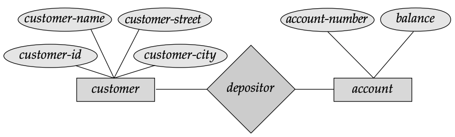

# Data Models

## Overview

Underlying the structure of a database is the **data model** — a collection of conceptual tools for describing:

- **Data** — what information is stored
- **Data Relationships** — how data items relate to each other
- **Data Semantics** — the meaning of the data
- **Consistency Constraints** — rules the data must follow

Data models provide a way to describe the design of a database at the **logical level**. The two most important data models are the **Entity-Relationship Model** and the **Relational Model**.

---

## 1. The Entity-Relationship (E-R) Model

### What is it?
The **Entity-Relationship (E-R) data model** is based on a perception of the real world that consists of:
- A collection of basic objects called **entities**
- **Relationships** among those objects

---

### Entities
> An **entity** is a "thing" or "object" in the real world that is distinguishable from other objects.

**Examples:**
- Each **person** is an entity
- Each **bank account** is an entity

Entities are described in a database by a set of **attributes**.

---

### Attributes
Attributes are the **properties or characteristics** that describe an entity.

**Examples:**

| Entity | Attributes |
|---|---|
| **Account** | `account-number`, `balance` |
| **Customer** | `customer-name`, `customer-street`, `customer-city`, `customer-id` |

> **Note:** The `customer-id` attribute is used to **uniquely identify** customers, since two customers may share the same name, street, and city. In the United States, many enterprises use the **Social Security Number** as a unique customer identifier.

---

### Relationships
> A **relationship** is an association among several entities.

**Example:**  
A `depositor` relationship associates a **customer** with each **account** that they hold.

**Key Terms:**
- **Entity Set** — the set of all entities of the same type (e.g., all customers)
- **Relationship Set** — the set of all relationships of the same type (e.g., all depositor relationships)

---

### E-R Diagram Components

The overall logical structure (schema) of a database can be expressed graphically using an **E-R Diagram**, built from the following components:

| Symbol | Shape | Represents |
|---|---|---|
| **Rectangles** | □ | Entity sets |
| **Ellipses** | ○ | Attributes |
| **Diamonds** | ◇ | Relationships among entity sets |
| **Lines** | — | Links attributes to entity sets and entity sets to relationships |

Each component is labeled with the entity, attribute, or relationship it represents.

---

### Example: Banking E-R Diagram

Consider a banking database with **customers** and **accounts**:

This diagram shows:
- Two entity sets: **customer** and **account**
- One relationship: **depositor** between customer and account

---

### Mapping Cardinalities (Constraints)
The E-R model can also represent **constraints** on relationships, such as **mapping cardinalities** — which express the number of entities to which another entity can be associated via a relationship set.

**Example:**  
If each account must belong to **only one customer**, the E-R model can express that constraint.

---

## 2. The Relational Model

### What is it?
The **relational model** uses a collection of **tables** to represent both data and the relationships among that data.

- Each table has **multiple columns**
- Each column has a **unique name**
- The relational model is an example of a **record-based model** — the database is structured in fixed-format records

---

### Example: Banking Relational Database

#### (a) The Customer Table

| customer-id | customer-name | customer-street | customer-city |
|---|---|---|---|
| 192-83-7465 | Johnson | 12 Alma St. | Palo Alto |
| 019-28-3746 | Smith | 4 North St. | Rye |
| 677-89-9011 | Hayes | 3 Main St. | Harrison |
| 182-73-6091 | Turner | 123 Putnam Ave. | Stamford |
| 321-12-3123 | Jones | 100 Main St. | Harrison |
| 336-66-9999 | Lindsay | 175 Park Ave. | Pittsfield |

#### (b) The Account Table

| account-number | balance |
|---|---|
| A-101 | $500 |
| A-215 | $700 |
| A-102 | $400 |
| A-305 | $350 |
| A-201 | $900 |
| A-217 | $750 |
| A-222 | $700 |

#### (c) The Depositor Table

| customer-id | account-number |
|---|---|
| 192-83-7465 | A-101 |
| 192-83-7465 | A-201 |
| 019-28-3746 | A-215 |
| 677-89-9011 | A-102 |
| 182-73-6091 | A-305 |
| 321-12-3123 | A-217 |
| 336-66-9999 | A-222 |
| 019-28-3746 | A-201 |

**Reading the tables:**
- Customer `192-83-7465` (Johnson) lives at 12 Alma St., Palo Alto and holds accounts **A-101** and **A-201**
- Customers Johnson (`192-83-7465`) and Smith (`019-28-3746`) **share account A-201** (e.g., a shared business venture)

---

### Record-Based Model
- Each table contains **records of a particular type**
- Each record type defines a **fixed number of fields (attributes)**
- Columns of the table correspond to the **attributes of the record type**
- Tables can be stored in files (e.g., using commas to delimit attributes, newline characters to delimit records)
- The relational model **hides low-level implementation details** from developers and users

---

### Relationship to E-R Model
- The relational model operates at a **lower level of abstraction** than the E-R model
- Database designs are often first created using the **E-R model**, then **translated to the relational model**

**Correspondence Example:**

| Relational Model (Table) | E-R Model |
|---|---|
| `customer` table | `customer` entity set |
| `account` table | `account` entity set |
| `depositor` table | `depositor` relationship set |

---

### Potential Problem: Data Duplication
Poorly designed relational schemas can lead to **unnecessarily duplicated information**.

**Example:**  
If `account-number` were stored as an attribute of the customer record, and customer Johnson holds two accounts (A-101 and A-201), Johnson's details (`customer-name`, `customer-street`, `customer-city`) would be **duplicated across two rows** — wasting storage and risking inconsistency.

> Good schema design avoids such redundancy. Distinguishing good designs from bad ones is a key topic in database study.

---

### Significance of the Relational Model
> The relational data model is the **most widely used data model**, and a vast majority of current database systems are based on it.

---

## 3. Other Data Models

### Object-Oriented Data Model
- Extends the E-R model with concepts of:
    - **Encapsulation** — bundling data and methods together
    - **Methods (Functions)** — operations that can be performed on objects
    - **Object Identity** — unique identification of objects
- Has seen **increasing attention** in modern database design

---

### Object-Relational Data Model
- **Combines features** of both the object-oriented model and the relational model
- Offers the structure of relational tables with the flexibility of object-oriented concepts

---

### Semistructured Data Models
- Permit data where **individual data items of the same type may have different sets of attributes**
- This is unlike traditional models where **every data item of a particular type must have the same attributes**
- **XML (Extensible Markup Language)** is widely used to represent semistructured data

---

### Historical Data Models (Now Largely Obsolete)

| Model | Description |
|---|---|
| **Network Data Model** | Preceded the relational model; closely tied to underlying implementation |
| **Hierarchical Data Model** | Also preceded the relational model; similarly tied to implementation details |

Both models **complicated the task of modeling data** and are **little used today**, except in legacy database systems still in service at some organizations.

---

## Summary

| Data Model | Key Concept | Level of Abstraction | Status |
|---|---|---|---|
| **Entity-Relationship (E-R)** | Entities, attributes, relationships | Higher (conceptual) | Widely used for database design |
| **Relational** | Tables with rows and columns | Lower (logical) | Most widely used in practice |
| **Object-Oriented** | Objects, methods, encapsulation | — | Growing attention |
| **Object-Relational** | Hybrid of relational + OO | — | In use |
| **Semistructured (XML)** | Flexible, variable attributes per item | — | Widely used for data exchange |
| **Network / Hierarchical** | Implementation-level structures | Very low | Largely obsolete |

---

