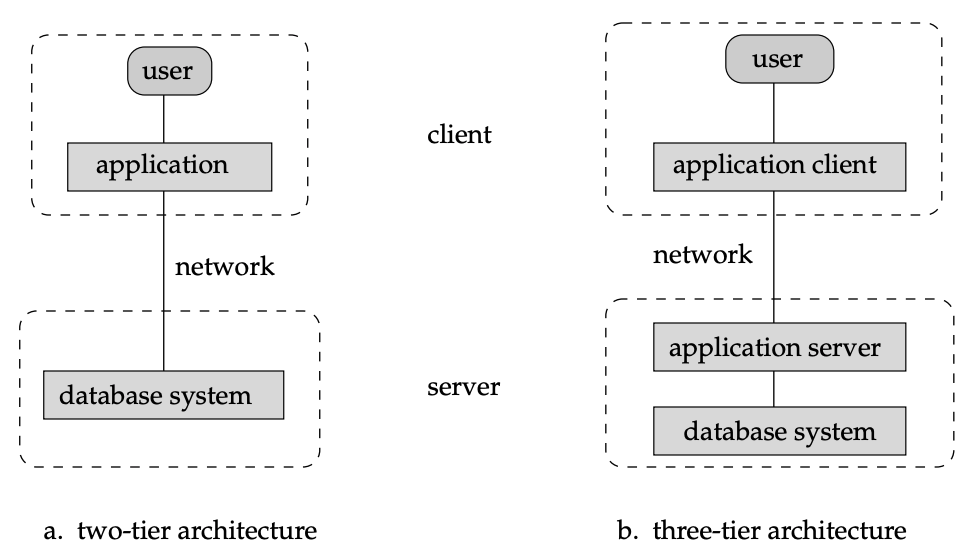

## History of Database Systems: Detailed Study Notes

The evolution of data processing predates modern computing, beginning with the automation of manual tasks. Over the decades, database systems have transitioned from rigid, sequential storage to flexible, high-performance relational architectures.

---

---

## 1. Early Roots (Pre-1950s)
Data processing automation actually began before the invention of the computer.
* **Punched Cards:** Invented by Herman Hollerith, these were used to record and tabulate the 1900 U.S. Census results using mechanical systems. They later became the primary method for entering data into early computers.

## 2. The Era of Sequential Access (1950s – Early 1960s)
During this period, data storage was dominated by **magnetic tapes**.
* **The Process:** Automation focused on tasks like payroll. Because tapes could only be read sequentially, processing involved reading an "old" master tape, merging it with new data (like salary raises from punched cards), and writing the results to a "new" master tape.
* **Limitations:** Data had to be sorted in the exact same order on both the cards and the tapes. Programs were forced to process data linearly, as data sizes far exceeded the capacity of main memory.

## 3. The Birth of Direct Access and the Relational Model (Late 1960s – 1970s)
The introduction of **hard disks** revolutionized the industry by allowing **direct access** to data.
* **Structural Evolution:** Hard disks freed data from sequentiality, enabling the storage of complex structures like lists and trees. This led to the creation of **network** and **hierarchical** databases.
* **Codd’s Relational Model:** In 1970, E.F. Codd published a landmark paper defining the **relational model**. It proposed a way to hide physical implementation details from the programmer using nonprocedural (declarative) queries.

## 4. The Rise of Relational Dominance (1980s)
Initially, relational databases were considered an academic curiosity because they were slower than network/hierarchical systems.
* **System R:** A groundbreaking IBM Research project developed techniques to make relational systems efficient.
* **Commercialization:** Products like Oracle, IBM DB2, Ingres, and DEC Rdb proved that relational systems could be high-performing.
* **Shift in Focus:** By the mid-1980s, the ease of use of relational models (working at a logical level) outweighed the effort of coding procedural queries for older systems.
* **Other Developments:** Research began on **parallel and distributed databases**, as well as early object-oriented models.

## 5. Modern Expansion (1990s – Present)
* **Early 1990s:** Database usage shifted from purely update-intensive transaction processing to query-intensive **decision support**. This period saw the growth of data analysis tools and parallel database products.
* **Late 1990s:** The **World Wide Web** explosion forced databases to support massive transaction rates.
* **New Requirements:** Databases transitioned to **24/7 availability** (eliminating downtime for maintenance) and the integration of Web interfaces to make data accessible globally.

---