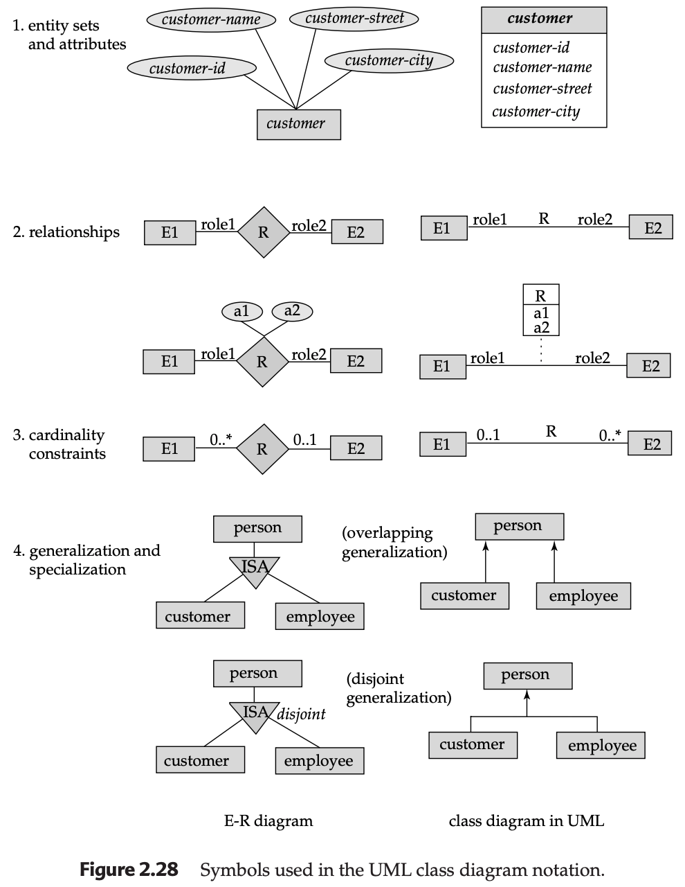

## The Unified Modeling Language (UML)

While Entity-Relationship (E-R) diagrams are excellent for modeling data representation, they only capture one facet of a software system. The **Unified Modeling Language (UML)** serves as a comprehensive standard for specifying, visualizing, and documenting all components of a software system, including user interactions and functional behavior.

### 1. Key Components of UML
UML is a multi-diagram language. Some of its core diagrams include:

* **Class Diagram:** Similar to E-R diagrams, these model the structure of the system by showing its classes, attributes, methods, and the relationships among objects.
* **Use Case Diagram:** Focuses on the "Who" and the "What." It depicts the interaction between external users (actors) and the system, outlining specific tasks like "Withdraw Cash" or "Register for Course."
* **Activity Diagram:** Models the operational workflow of the system, showing the flow of tasks between various components.
* **Implementation Diagram:** Provides a view of the physical system, showing software components and the hardware interconnections that support them.

---

### 2. Class Diagrams vs. E-R Diagrams
Although UML class diagrams and E-R diagrams share a common goal of modeling data, UML introduces several specific notations and object-oriented concepts.

#### A. Entity Sets and Attributes
In UML, entity sets are represented as **boxes**. Unlike E-R diagrams, where attributes are separate ellipses, UML places the attributes **inside the box** below the entity name.

* **From Entity to Object:** UML actually models *objects* rather than just *entities*. Objects include **methods** (functions) that can update attributes or compute values, adding a behavioral layer to the data.

---

#### B. Relationship Sets
Binary relationships in UML are represented by a simple **line** connecting the entity sets, with the relationship name written adjacent to it.

* **Roles:** Role names can be written at either end of the line to clarify the part an entity plays in the relationship.
* **Relationship Attributes:** If a relationship has its own attributes, UML uses a **box** connected to the relationship line by a **dotted line**. This effectively acts like E-R **Aggregation**, allowing the relationship itself to participate in further associations.
* **Non-binary Relationships:** UML does not support ternary or n-ary relationships directly. These must be converted into a series of binary relationships.

---

#### C. Cardinality (Multiplicity) Constraints
UML uses the $l..h$ (lower to higher) notation, where $l$ is the minimum and $h$ is the maximum.
* **Notation:** `1` is equivalent to `1..1`, and `*` is equivalent to `0..*`.
* **The Reversal Rule:** A critical difference is that UML **reverses** the positioning of cardinality compared to E-R diagrams.
    * If a constraint $0..1$ is on the $E_1$ side and $0..*$ is on the $E_2$ side, it means each $E_2$ entity is associated with at most one $E_1$ (Many-to-One from $E_2$ to $E_1$).

---

#### D. Generalization and Specialization
UML represents **ISA** relationships using a line with a **triangle** pointing toward the more general entity set (the superclass).

* **Constraints:** UML explicitly marks whether a generalization is **disjoint** (a person cannot be both a customer and an employee) or **overlapping** (a person can be both).

---

---

### Integration Note for Java/Spring Developers
Since you are working with **Spring Security** and **IntelliJ IDEA**, UML class diagrams are particularly useful because they map directly to your Java classes. In your project:
* The **UML Class** becomes your `@Entity` class.
* The **UML Attributes** become your private fields.
* The **UML Methods** become your service layer logic or getters/setters.
* The **Generalization** maps directly to Java's `extends` keyword.

---