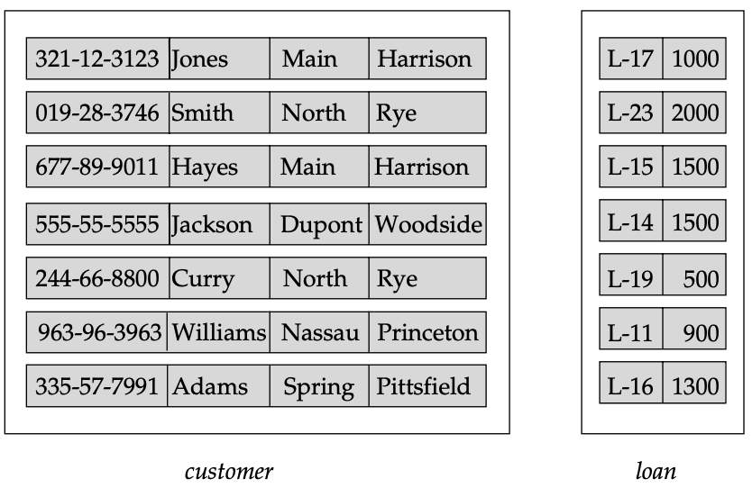
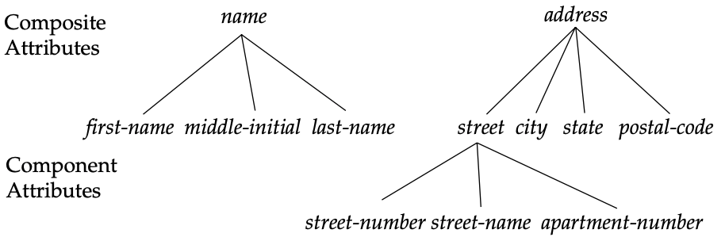
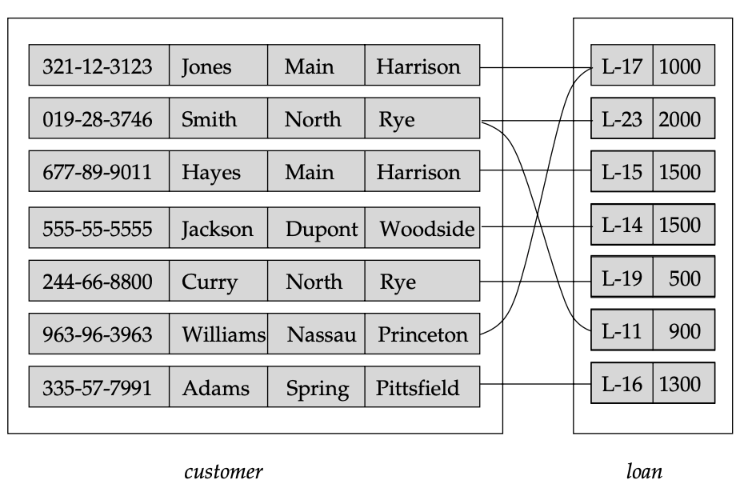
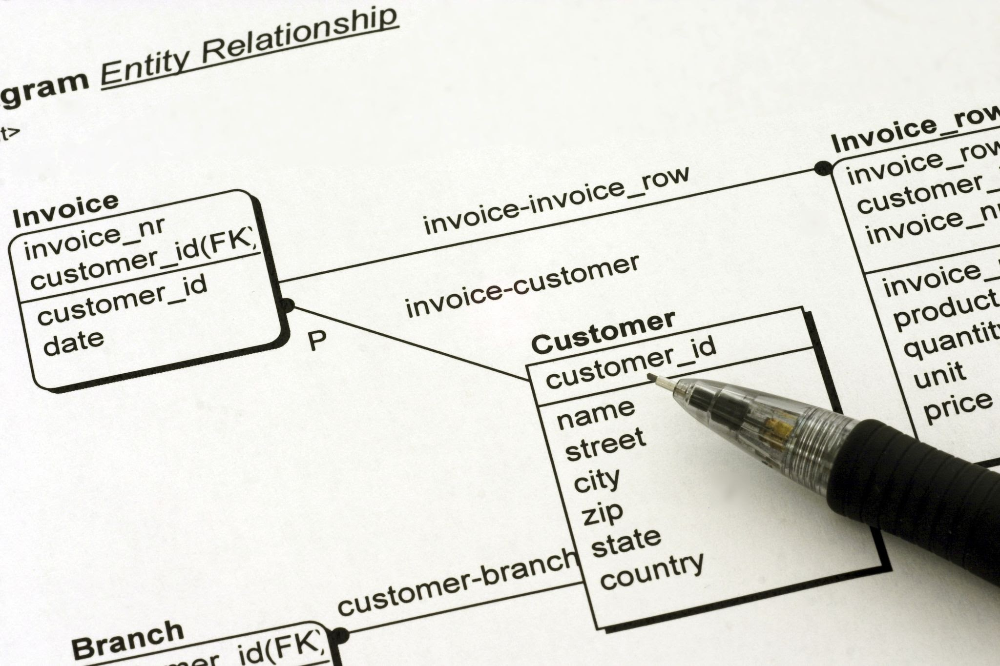

---

## 1. Introduction to Data Modeling
A **data model** is a conceptual toolkit used to describe:
* **Data & Relationships:** What exists and how they connect.
* **Semantics:** The "meaning" of the data.
* **Consistency Constraints:** Rules the data must follow (integrity).

### The Two-Step Design Process
1.  **Entity-Relationship (E-R) Model:** A high-level, "semantic" model. It maps the real-world meanings and interactions of an enterprise into a conceptual schema.
2.  **Relational Model:** A lower-level, table-based model. Most modern databases (H2, MySQL, etc.) are relational. Designers usually start with an E-R diagram and then "translate" it into relational tables.

---

## 2. Entity Sets: The "Objects"
In the E-R model, the world is viewed as a collection of **entities**. An entity is a "thing" distinguishable from all other objects (like a specific user or a specific account).

* **Entity Set:** A collection of entities of the same type (e.g., all `customer` entities).
    * **Extension:** The actual data currently in the set (the rows in a table).
* **Attributes:** These are the properties that describe the entity.
    * **Domain:** The "Data Type" or permitted values for an attribute (e.g., a String of a certain length).

---

## 3. Advanced Attribute Types
For a programmer, understanding how to structure attributes is key to clean database design.

### A. Simple vs. Composite
* **Simple:** Atomic values (e.g., `customer-id`).
* **Composite:** Attributes that can be divided into sub-parts (e.g., `name` divided into `first-name`, `middle-initial`, `last-name`).
    * **Hierarchy:** Composite attributes can be nested (e.g., `address` contains `street`, which further contains `street-number` and `apartment-number`).

### B. Single-valued vs. Multivalued
* **Single-valued:** Only one value per entity (e.g., `loan-number`).
* **Multivalued:** A set of values for one attribute (e.g., an employee with multiple `phone-numbers`). You can set upper/lower bounds on these (e.g., "Max 2 phones").

### C. Derived Attributes
The value is **not stored** physically. Instead, it is computed from **base attributes** (stored attributes).
* *Example:* `age` is derived from `date-of-birth` and the current date.

### D. Null Values
Used when a value is:
1.  **Not Applicable:** (e.g., a person has no middle name).
2.  **Missing:** (The value exists, but we don't have it).
3.  **Unknown:** (We don't know if the value even exists).

---

## 4. Relationship Sets: The "Logic"

## 4.1. Defining the Relationship Set
A **relationship** is a specific association between unique entities. A **relationship set** is the collection of all these associations.

### The Mathematical Model
Formally, if we have $n$ entity sets ($E_1, E_2, \dots, E_n$), a relationship set $R$ is defined as a subset of the Cartesian product of those sets:

$$R \subseteq \{ (e_1, e_2, \dots, e_n) \mid e_1 \in E_1, e_2 \in E_2, \dots, e_n \in E_n \}$$

**What this means for you:**
Every "link" in your database must be a valid tuple where each element exists in its respective "Home" table.
* **Participation:** If customer "Hayes" (from the `customer` set) has loan "L-15" (from the `loan` set), these entities **participate** in the `borrower` relationship set.
* **Relationship Instance:** The specific pair `(Hayes, L-15)` is a single instance of that relationship.

---

## 4.2. Descriptive Attributes (Data on the Link)
Sometimes, data doesn't belong to the "Noun" (the Entity), but to the "Verb" (the Relationship). This is called a **descriptive attribute**.

* **The Concept:** Imagine a `student` entity and a `course` entity. Where do you store the student's grade?
    * It doesn't belong to the `student` (they have many grades).
    * It doesn't belong to the `course` (there are many students).
    * It belongs to the **relationship** `registered-for`.
* **The "Uniqueness Rule":** A relationship instance must be uniquely identifiable by its participating entities **alone**.
    * **The Trap:** If you want to record every time a customer accesses an account (`access-date`), you cannot create multiple relationship instances between the same Customer A and Account B just to have different dates.
    * **The Solution:** You must use a **multivalued attribute** (a list of dates) on that single relationship instance.

---

## 4.3. The "Degree" of a Relationship
The degree refers to how many different entity sets are shaking hands in one relationship.

* **Binary (Degree 2):** The most common. Two entity sets are involved (e.g., `customer` and `loan`).
* **Ternary (Degree 3):** Three entity sets are involved.
    * **Example:** `works-on` involving `employee`, `branch`, and `job`.
    * **Logic:** This tells us that Employee Smith works as a "Teller" (Job) specifically at the "Downtown" (Branch). If you only had binary relationships, you might know Smith is a teller and Smith works at Downtown, but you wouldn't necessarily know he is a teller *at that specific* branch.

---

## 4.4. Roles and Recursive Relationships
An entity's **role** is the specific function it performs in a relationship.

* **Implicit Roles:** In a `borrower` relationship, it's obvious one is the borrower and one is the loan.
* **Recursive (Self-Referencing) Relationships:** This happens when an entity set relates to itself.
    * **Example:** The `works-for` relationship for an `employee` entity set.
    * **Explicit Roles:** Here, you **must** specify roles (e.g., **"Manager"** and **"Worker"**) to distinguish which employee instance is supervising the other. Mathematically, this is an ordered pair: `(manager, worker)`.

---

## 4.5. Implementation: The Developer's Perspective
When you move from this high-level E-R logic to your Spring Boot / JDBC project, the relationship sets usually turn into:

1.  **Foreign Keys:** For simple $1:N$ relationships (e.g., a `loan` has a `customer_id` column).
2.  **Join Tables:** For $M:N$ (Many-to-Many) relationships or Ternary relationships. This is a separate table that contains the Primary Keys of all participating entities.
3.  **Entity Mapping:** In JPA/Hibernate, the "Descriptive Attributes" require you to turn the relationship into its own `@Entity` class (an "Association Class").

---

### Quick Review:
| Feature | Key Requirement |
| :--- | :--- |
| **Identity** | Must be identified by participating entities, not attributes. |
| **Ternary** | Used when an association requires three distinct "types" to be complete. |
| **Recursive** | Requires explicit "Role Names" to clarify the self-association. |
| **Attributes** | Used for data that only exists because the two entities met (e.g., `date`, `grade`, `amount`). |

[SPACE FOR DIAGRAM: Figure 2.3 Relationship set borrower]

## 5. Summary for Developers
To ensure a relationship instance is unique, the database uses the participating entities' identifiers.

> **Important Rule:** 
> 
> You cannot use multiple relationship instances between the same two entities just to store different attribute values (like different access dates). In that case, you must use a **multivalued attribute** on the relationship.

---