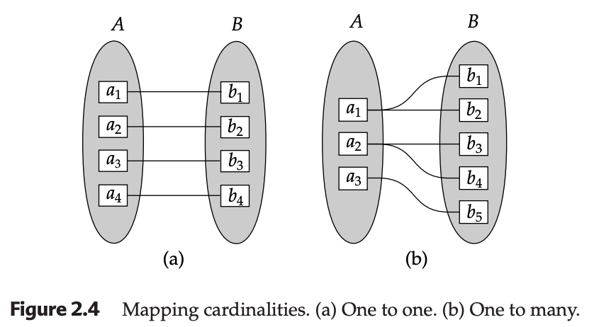
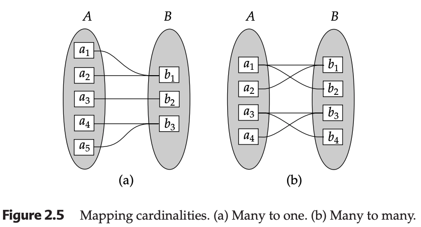

## 2.2 Constraints in E-R Models

In a database, constraints are the rules that ensure the data remains accurate and reflects real-world logic. When designing an **enterprise schema**, we use constraints to define the boundaries of how entities can interact. The two most vital constraints are **Mapping Cardinalities** and **Participation Constraints**.

---

## 1. Mapping Cardinalities (Cardinality Ratios)

Mapping cardinalities express the specific number of entities to which another entity can be associated via a relationship set. While these can apply to any degree, they are most essential for **binary relationship sets** (relationships between two entity sets, $A$ and $B$).

There are four distinct types of mapping cardinalities:

### A. One-to-One (1:1)
* An entity in $A$ is associated with **at most one** entity in $B$.
* An entity in $B$ is associated with **at most one** entity in $A$.
* *Example:* In some systems, a `Manager` entity might be associated with exactly one `Department` to manage, and each `Department` has only one `Manager`.

### B. One-to-Many (1:M)
* An entity in $A$ is associated with **any number** (zero or more) of entities in $B$.
* An entity in $B$ is associated with **at most one** entity in $A$.
* *Example:* A `Customer` can have several `Loans`, but each specific `Loan` belongs to only one `Customer`.

### C. Many-to-One (M:1)
* An entity in $A$ is associated with **at most one** entity in $B$.
* An entity in $B$ is associated with **any number** (zero or more) of entities in $A$.
* *Note:* This is simply the reverse of one-to-many.
* *Example:* Many `Employees` work for one `Department`.

### D. Many-to-Many (M:M)
* An entity in $A$ is associated with **any number** of entities in $B$.
* An entity in $B$ is associated with **any number** of entities in $A$.
* *Example:* In a joint-borrowing scenario, a `Loan` can belong to several `Customers` (partners), and a `Customer` can have several `Loans`.

---

## 2. Participation Constraints

Participation constraints describe the **dependence** of an entity set on a relationship set. It answers the question: "Does every entity in this set *have* to be involved in this relationship?"

### Total Participation (Mandatory)
Participation is **total** if every entity in an entity set $E$ participates in **at least one** relationship in $R$.
* **Logic:** $E$ cannot exist in the database without being linked to $R$.
* **Example:** Every `Loan` entity must be related to at least one `Customer` through the `borrower` relationship. You can't have a "homeless" loan in the system.

### Partial Participation (Optional)
Participation is **partial** if only some entities in $E$ participate in relationships in $R$.
* **Logic:** An entity can exist independently of the relationship.
* **Example:** A person can be a `Customer` of a bank even if they don't have a `Loan`. Therefore, the participation of `customer` in the `borrower` relationship is partial.

---

## Developer's Summary Table

| Constraint Type | Rule | Implementation Hint (JDBC/JPA) |
| :--- | :--- | :--- |
| **1:1** | Unique link both ways | Unique Foreign Key |
| **1:M** | Parent has many children | Foreign Key on the "Many" side |
| **M:M** | Multiple links both ways | Requires a **Join Table** |
| **Total Participation**| Must participate | `NOT NULL` constraint on Foreign Key |
| **Partial Participation**| May participate | `NULL` allowed on Foreign Key |

---

