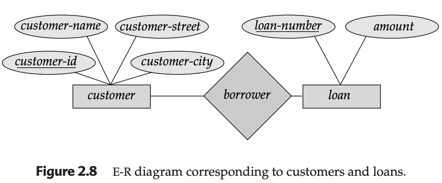
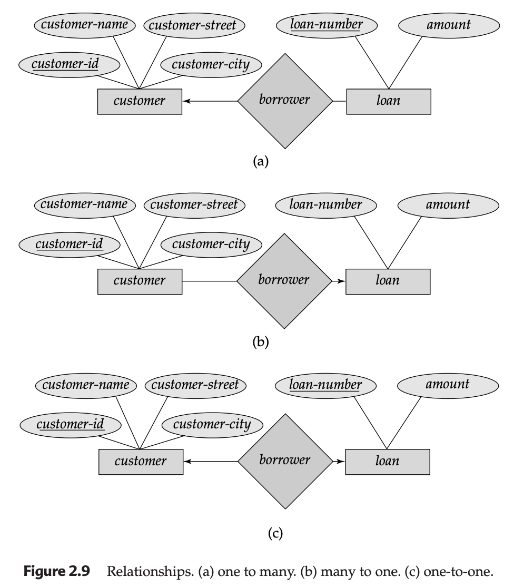
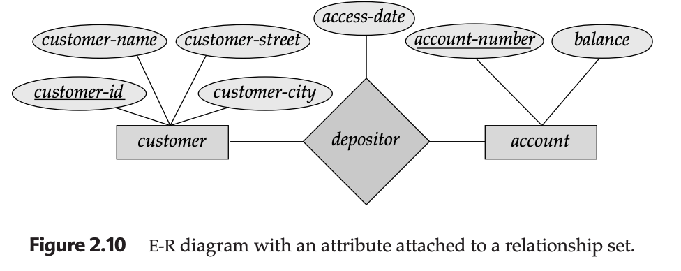
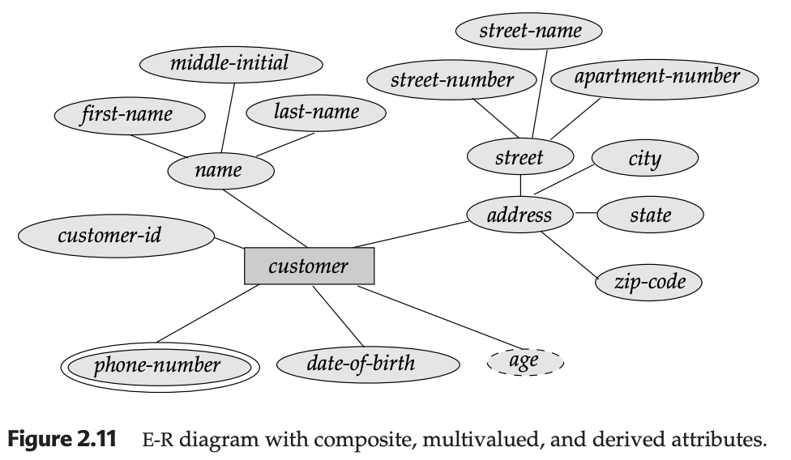
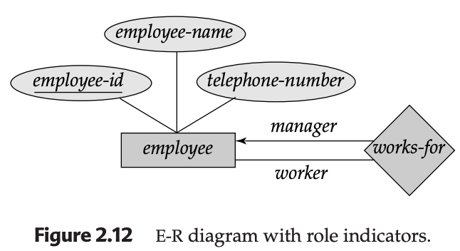
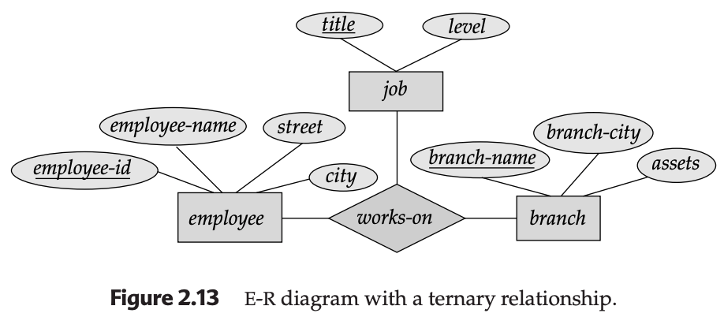
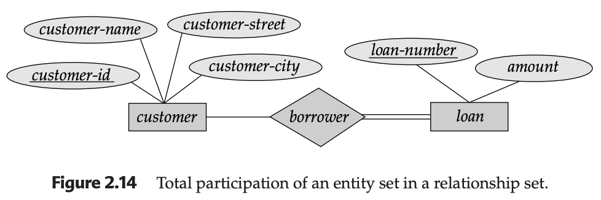
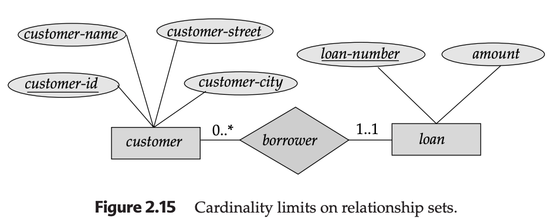

# Entity-Relationship (E-R) Diagram

This section explains the standard graphical notation used to build an **Entity-Relationship (E-R) Diagram**. For a developer, this is the "UML" of databases—it allows you to visualize the logic before implementing it in SQL.

---

### 1. The Basic Components
The E-R diagram uses a specific geometry to represent different architectural parts of your database:
* **Rectangles:** Entity sets (Tables).
* **Ellipses:** Attributes (Columns).
* **Diamonds:** Relationship sets (Associations).
* **Underlined Text:** Primary Key attributes.

* **Explanation:** This is the simplest binary relationship. It shows two tables (`customer` and `loan`) connected by a relationship (`borrower`). The lines show which attributes belong to which entity, and the underlined `customer-id` and `loan-number` are the unique identifiers.

---

### 2. Representing Mapping Cardinalities (Arrows)
We use arrows ($\rightarrow$) to represent "One" and undirected lines (—) to represent "Many."

* **One-to-Many:** An arrow points to the "One" side. (Figure 2.9a)
* **Many-to-One:** An arrow points to the "One" side. (Figure 2.9b)
* **One-to-One:** Arrows point to both sides. (Figure 2.9c)
* **Many-to-Many:** No arrows are used.

* **Explanation:** These diagrams show how constraints are visualized. In (a), one customer can have multiple loans, but each loan points to exactly one customer. In (c), the system enforces a strict 1:1 bond between a customer and a loan.

---

### 3. Descriptive Attributes on Relationships
Sometimes the "link" itself has data. We attach the ellipse directly to the diamond.

* **Explanation:** The `access-date` doesn't belong to the `customer` (they have many dates) or the `account` (it has many visitors). It belongs to the `depositor` diamond because it represents the specific moment that customer interacted with that account.

---

### 4. Advanced Attributes: Composite, Multivalued, and Derived
* **Composite:** A "tree" of attributes (e.g., `address` breaking into `street`, `city`, etc.).
* **Multivalued (Double Ellipse):** An attribute that can hold multiple values (e.g., `phone-number`).
* **Derived (Dashed Ellipse):** A value calculated from other data (e.g., `age` calculated from `date-of-birth`).

* **Explanation:** This diagram demonstrates a "Clean Code" approach. Instead of one giant address string, we see a structured hierarchy. The double-ringed `phone-number` tells the developer "this will likely need a separate table in implementation."

---

### 5. Roles and Ternary Relationships
* **Roles:** Labels on the lines to explain the function of an entity in a recursive relationship.
* **Ternary:** A diamond connecting three rectangles.

* **Explanation:** Figure 2.12 shows how a single `employee` table can relate to itself, identifying who is the "manager" and who is the "worker." Figure 2.13 shows a three-way link between `employee`, `job`, and `branch`.

---

### 6. Participation Constraints (Total vs. Partial)
* **Double Line:** Total participation (The entity **must** be in the relationship).
* **Single Line:** Partial participation (The relationship is optional).

* **Explanation:** The double line from `loan` to `borrower` means you cannot have a loan in the system that isn't attached to a customer. Every loan entity *must* participate in the relationship.

---

### 7. Cardinality Limits (l..h)
For the highest precision, we use the $l..h$ (lower..higher) notation.
* **1..1:** Exactly one.
* **0..*:** Zero or more (Many).

* **Explanation:** This notation is favored by many modern designers because it is unambiguous. `1..1` on the `loan` side means exactly one customer per loan. `0..*` on the `customer` side means a customer can exist without a loan, or they can have fifty.

---