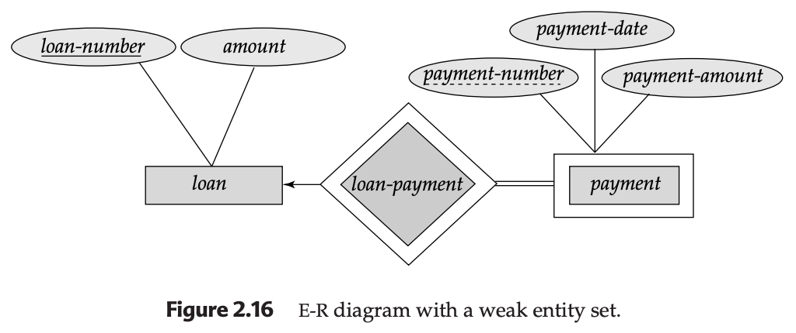

## 2.6 Weak Entity Sets

In database design, not every "object" has enough information to stand on its own. While a **Strong Entity Set** has a primary key that uniquely identifies its members, a **Weak Entity Set** lacks sufficient attributes to form a primary key.

---

### 1. The Concept of Existence Dependence
A weak entity set cannot exist without a "parent." For it to be meaningful, it must be associated with an **Identifying Entity Set** (also known as the **Owner Entity Set**).

* **Existence Dependence:** The weak entity is "existence dependent" on its owner. If the owner entity is deleted, the weak entity becomes orphaned and must also be removed.
* **Identifying Relationship:** This is the link between the weak entity and its owner. It is always **Many-to-One** (many weak entities to one owner) and the participation of the weak entity is always **Total**.

---

### 2. Discriminators and Primary Keys
Since a weak entity set doesn't have a primary key, it uses a **Discriminator** (or **Partial Key**).

* **The Discriminator:** A set of attributes that distinguishes weak entities *that depend on the same strong entity*.
* **Example:** In a `payment` table, `payment-number` (1, 2, 3...) is a discriminator. It isn't unique globally (many loans have a "Payment #1"), but it is unique for one specific loan.
* **Forming the Primary Key:** To uniquely identify a weak entity globally, you combine the **Primary Key of the Owner** + the **Discriminator of the Weak Entity**.
    * *Formula:* `{loan-number, payment-number}`.

---

### 3. E-R Diagram Notation
Weak entity sets have distinct visual markers to separate them from strong ones:
1.  **Double Rectangle:** Denotes the Weak Entity Set.
2.  **Double Diamond:** Denotes the Identifying Relationship.
3.  **Dashed Underline:** Denotes the Discriminator (Partial Key).
4.  **Double Line:** Indicates the total participation of the weak entity in the relationship.

---

### 4. Practical Example: Course Offerings
Consider a University database:
* **Strong Entity:** `Course` (Attributes: `course-id`, `title`).
* **Weak Entity:** `Section` or `Offering`.
* **The Logic:** A section is identified by `semester` and `section-number`. However, "Section 1, Fall 2026" is not unique—many courses have a Section 1 in the Fall.
* **The Identity:** To find the specific classroom, you need the `course-id` + `semester` + `section-number`.

---

### 5. Design Decision: Weak Entity vs. Attribute
Sometimes a designer might consider making a weak entity a "multivalued composite attribute" of the owner.

* **Use an Attribute if:** The object has very few properties and *only* connects to its owner.
* **Use a Weak Entity if:** * The object has many attributes.
    * The object participates in **other** relationships (e.g., a `payment` weak entity also connects to an `account` entity to show where the money came from).

---

---

### Developer's Implementation Note (SQL/JPA)
When implementing a weak entity in a relational database:
1.  The primary key of the `PAYMENT` table will be a **Composite Key** consisting of the `loan_id` (Foreign Key) and the `payment_number`.
2.  In JPA, this is often handled using `@Embeddable` and `@IdClass` or `@EmbeddedId` to map the composite identity.

---