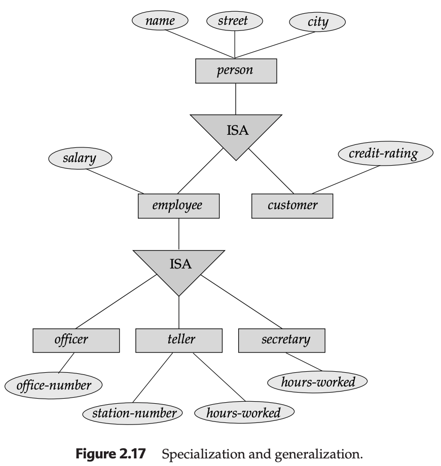
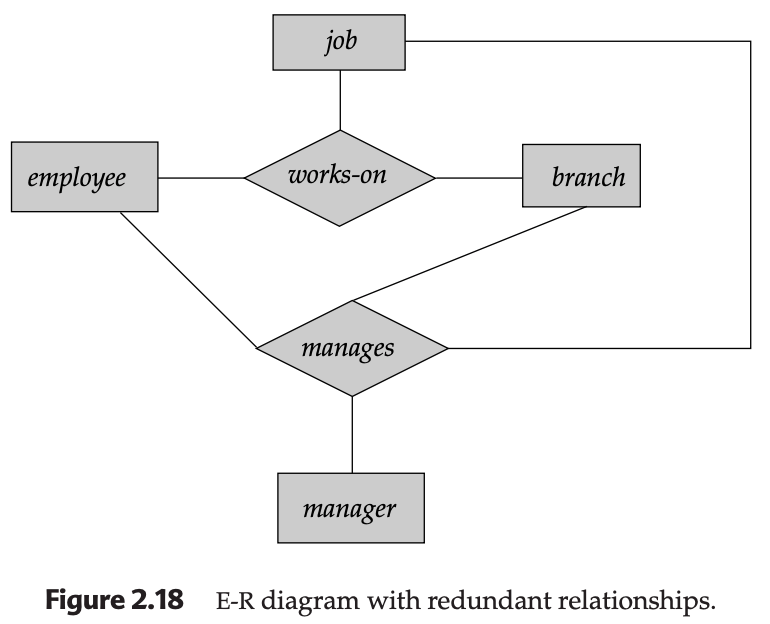
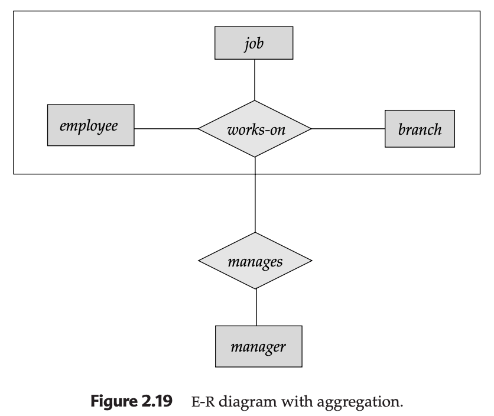
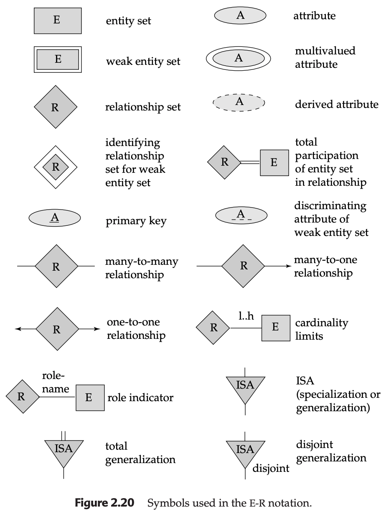
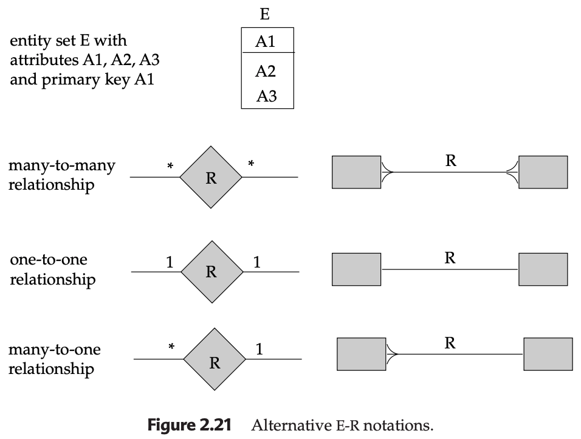

# Extended E-R Features

While the basic E-R model is sufficient for many scenarios, complex real-world enterprises often require **Extended E-R Features**. These features allow for better abstraction, including the concepts of hierarchies and "relationships about relationships."

---

## 1. Specialization and Generalization
These two concepts are two sides of the same coin, focusing on how different levels of entities relate to one another via an **ISA** ("is a") relationship.

### Specialization (Top-Down)
This is the process of identifying subgroupings within an entity set that have distinctive features.
* **Why use it?** When some entities have attributes or participate in relationships that others do not.
* **Example:** Within a `person` entity set, we might specialize into `customer` (who has a `credit-rating`) and `employee` (who has a `salary`).

### Generalization (Bottom-Up)
This is the synthesis of multiple entity sets into a higher-level entity set based on common features.
* **Example:** If you have an `officer` entity and a `teller` entity, you might generalize them into a single `employee` entity to share common attributes like `name` and `address`.

---

## 2. Attribute Inheritance
Inheritance is the "mechanical" benefit of specialization and generalization.
* **The Rule:** A lower-level entity set (subclass) automatically inherits all attributes and relationship participations of its higher-level entity set (superclass).
* **Example:** If `employee` is a subclass of `person`, and `person` has a `street` attribute, the `employee` also has a `street` attribute without it being explicitly drawn in the diagram.

---

## 3. Constraints on Generalization
To keep data consistent, designers place constraints on how entities move between levels.

### Membership Constraints
* **Condition-Defined:** An entity's membership is based on a rule (e.g., if `account-type = "savings"`, it automatically becomes a `savings-account`).
* **User-Defined:** Membership is manually assigned by the database user (e.g., assigning an employee to a specific work team).

### Disjointness and Completeness Constraints
* **Disjoint vs. Overlapping:** * **Disjoint:** An entity can belong to *at most one* lower-level set (e.g., an account is either savings or checking, not both).
    * **Overlapping:** An entity can belong to *multiple* lower-level sets (e.g., a person can be both an employee and a customer).
* **Total vs. Partial:**
    * **Total:** Every high-level entity *must* belong to at least one lower-level set (indicated by a double line to the ISA triangle).
    * **Partial:** Some high-level entities might not belong to any lower-level set (the default case).

---

## 4. Aggregation
Aggregation addresses a major limitation: the inability of the basic E-R model to express **relationships among relationships**.

* **The Problem:** You want to record a `manager` for a specific `works-on` relationship (which involves an `employee`, `branch`, and `job`).
* **The Solution:** We treat the `works-on` relationship as a "higher-level entity." We draw a box around the entire relationship and then link the `manager` to that box.

---

## 5. Summary of Symbols and Alternative Notations

As you move between different database tools (like MySQL Workbench vs. draw.io), you will see different notations.

### Standard Notation (Used in these notes):
* **Triangle (ISA):** Specialization/Generalization.
* **Double Rectangle:** Weak Entity.
* **Double Diamond:** Identifying relationship for a weak entity.

### Alternative Notations (Crow's Foot):
* Many modern tools use "Crow's Foot" notation instead of diamonds to show cardinalities.
* Relationships are represented by lines directly between boxes, where a "three-pronged foot" represents the "Many" side.

---

### Developer's Note for H2/JDBC
When implementing **Inheritance** in SQL, you generally have two choices:
1.  **Single Table:** One big table with all possible attributes and many `NULL` values for irrelevant columns.
2.  **Table per Class:** A `PERSON` table, an `EMPLOYEE` table, and a `CUSTOMER` table, where the lower-level tables have a Foreign Key that is also their Primary Key, pointing back to the `PERSON` table.

---