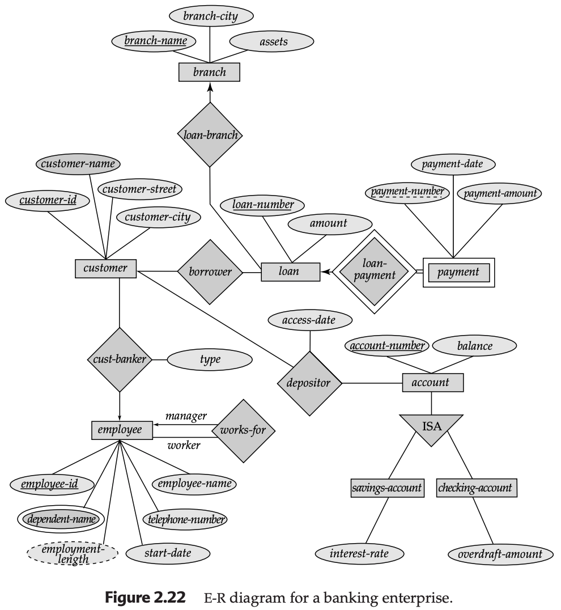

## 2.8 Design of an E-R Database Schema

The E-R model provides a highly flexible framework. However, with flexibility comes the need for critical decision-making. A database designer must choose between various alternatives to ensure the schema accurately reflects the real-world enterprise.

### Key Design Decisions:
* **Attribute vs. Entity Set:** Deciding if a piece of data is a simple property or a complex object requiring its own attributes.
* **Entity vs. Relationship Set:** Determining if an object exists independently or if it serves as a link between other objects.
* **Binary vs. n-ary Relationships:** Evaluating if a complex interaction should be a three-way (ternary) link or broken into pairs of binary links.
* **Strong vs. Weak Entity Sets:** Deciding if an entity can be identified on its own or if it requires an "owner" for its identity.
* **Generalization & Specialization:** Using "is a" (ISA) hierarchies to group common attributes and modularize the design.
* **Aggregation:** Treating a relationship as a higher-level entity so it can participate in other relationships.

---

## 2.8.1 Design Phases

Building a database is a multi-step process that moves from abstract human needs to concrete machine storage.

### Phase 1: User Requirements
The initial step is to fully characterize the data needs of the users. The designer interacts with domain experts to produce a **User Requirements Specification**.

### Phase 2: Conceptual Design
The designer translates requirements into a conceptual schema (using the E-R model). This phase specifies:
* All entity and relationship sets.
* Attributes and primary keys.
* Mapping constraints (cardinality and participation).
* **Functional Requirements:** Reviewing the schema to ensure it supports necessary transactions like updating, retrieving, and deleting data.

### Phase 3: Logical Design
The high-level conceptual schema is mapped onto a specific implementation model. For modern applications, this usually means translating E-R diagrams into **Relational Tables** (the schema you implement in SQL).

### Phase 4: Physical Design
The final phase specifies the physical features of the database, such as file organization, internal storage structures, and indices to optimize performance.

---

## 2.8.2 Database Design for a Banking Enterprise

To illustrate these phases, we examine a bank's data requirements and the specific design decisions made to satisfy them.

### 2.8.2.1 Data Requirements (The "Business Rules")

* **Branches:** Unique names, locations, and assets.
    * **Explanation:** The bank is organized into branches. Each is located in a specific city and identified by a unique name. The bank monitors the assets of each branch.
* **Customers:** Identified by `customer-id`; have accounts and loans; assigned to a personal banker.
    * **Explanation:** The bank stores the customer’s name, street, and city. Customers can hold accounts and take out loans. They may be associated with a banker who acts as a personal advisor or loan officer.
* **Employees:** Identified by `employee-id`; track dependents, managers, and start dates.
    * **Explanation:** The bank stores the name, telephone, and salary of each employee. It also keeps track of the names of the employee's dependents and who their manager is.
* **Accounts:** Two types (Savings and Checking). Multiple customers can share an account.
    * **Explanation:** Accounts have unique numbers and balances. We track the most recent date a specific customer accessed a specific account. Savings accounts have interest rates; checking accounts have overdraft limits.
* **Loans:** Originate at a branch; tracked via loan numbers and payment history.
    * **Explanation:** A loan is identified by a unique number and originates at a specific branch. For each loan, the bank tracks the amount and individual payments (which are identified by a sequential payment number unique to that loan).

---

### 2.8.2.2 Entity Set Designations (Design Logic)

* **Branch Entity Set:** Attributes: `branch-name` (PK), `branch-city`, `assets`.
    * **Decision:** Modeled as a strong entity because it exists independently and has a unique name.
* **Customer Entity Set:** Attributes: `customer-id` (PK), `customer-name`, `customer-street`, `customer-city`.
    * **Decision:** Modeled as a strong entity to keep personal data separate from transaction data.
* **Employee Entity Set:** Attributes: `employee-id` (PK), `employee-name`, `telephone-number`, `salary`, `start-date`, and `employment-length` (derived).
    * **Decision:** `employment-length` is marked as a **derived attribute** (dashed ellipse) because it is calculated from the `start-date`.
* **Account ISA Hierarchy:** Superclass `account` (PK: `account-number`, `balance`) with subclasses `savings-account` (`interest-rate`) and `checking-account` (`overdraft-amount`).
    * **Decision:** This is a **Specialization**. It prevents repeating the `balance` attribute in two different tables.
* **Loan Entity Set:** Attributes: `loan-number` (PK), `amount`.
    * **Decision:** Modeled as a strong entity to serve as the hub for borrower and branch relationships.
* **Payment (Weak Entity Set):** Attributes: `payment-number` (discriminator), `payment-date`, `payment-amount`.
    * **Decision:** Modeled as a **Weak Entity**. Since payment numbers (1, 2, 3) repeat across different loans, they cannot identify a payment globally without the `loan-number`.

---

### 2.8.2.3 Relationship Set Designations (Design Logic)

* **Borrower (Many-to-Many):** Between `customer` and `loan`.
    * **Decision:** M:M is used because a customer can have many loans, and a loan can be shared (jointly held) by many customers.
* **Depositor (Many-to-Many):** Between `customer` and `account`.
    * **Decision:** Includes the attribute `access-date`. This is placed on the relationship because the date depends on *both* the person and the account they visited.
* **Loan-Branch (Many-to-One):** Between `loan` and `branch`.
    * **Decision:** Each loan originates at only one branch, but a branch manages many loans.
* **Cust-Banker (Many-to-One):** Between `customer` and `employee`.
    * **Decision:** Tracks which employee advises which customer. One employee can advise many customers, but a customer has only one primary banker.
* **Works-for (Many-to-One):** Recursive relationship on `employee`.
    * **Decision:** Uses **role indicators** ("manager" and "worker"). An employee has one manager, while a manager supervises many workers.
* **Loan-Payment (One-to-Many):** Between `loan` and `payment`.
    * **Decision:** The **identifying relationship** for the weak entity set `payment`.

---

### 2.8.2.4 The Completed E-R Diagram

The following diagram represents the final conceptual blueprint of the banking system. It uses **double lines** to indicate total participation (e.g., every loan *must* belong to a branch) and the **double diamond** for the identifying relationship of the weak entity set.

---
