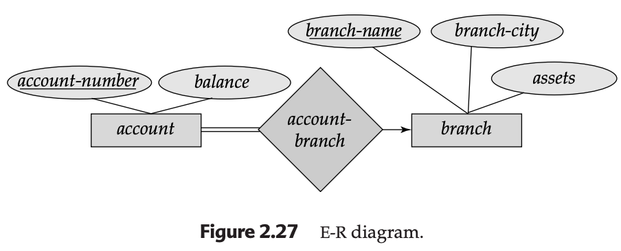

## 2.9 Reduction of an E-R Schema to Tables

The reduction of an E-R schema to a relational database involves transforming abstract entity and relationship sets into a collection of **tables**. Each table consists of unique columns corresponding to attributes, and each row (tuple) represents a specific instance of that set.

Mathematically, a table is a subset of the **Cartesian Product** of the domains ($D$) of its attributes. For a table with $n$ columns, we denote the set of all possible rows as:
$$D_1 \times D_2 \times \dots \times D_{n-1} \times D_n$$

---

### 2.9.1 Tabular Representation of Strong Entity Sets
A strong entity set $E$ with descriptive attributes $a_1, a_2, \dots, a_n$ is represented by a table named $E$ with $n$ distinct columns.

**Mathematical Logic:**
Each row is an **n-tuple** $(v_1, v_2, \dots, v_n)$. If we consider the `loan` entity set with attributes `loan-number` and `amount`:
* Let $D_1$ = set of all loan numbers.
* Let $D_2$ = set of all currency balances.
* The table `loan` is a subset of $D_1 \times D_2$.

**Table: `loan`**

| loan-number (PK) | amount |
| :--- | :--- |
| L-11 | 900 |
| L-17 | 1000 |

* **Explanation:** The row `(L-17, 1000)` indicates that loan L-17 has an amount of 1000. Each column corresponds exactly to an attribute of the entity set.

---

### 2.9.2 Tabular Representation of Weak Entity Sets
Let $A$ be a weak entity set with attributes $\{a_1, a_2, \dots, a_m\}$ that depends on a strong entity set $B$ with primary key $\{b_1, b_2, \dots, b_n\}$.

**Mathematical Logic:**
The table for weak entity $A$ is formed by the **Set Union** of its own attributes and the primary key of the strong entity it depends on:
$$\{a_1, a_2, \dots, a_m\} \cup \{b_1, b_2, \dots, b_n\}$$

**Table: `payment`**

| loan-number (PK) | payment-number (PK) | payment-date | payment-amount |
| :--- | :--- | :--- | :--- |
| L-17 | 5 | 10 May 2026 | 50 |

* **Explanation:** Since `payment-number` is only a discriminator, it cannot be a Primary Key alone. By including `loan-number` from the strong entity `loan`, we create a unique composite primary key.

---

### 2.9.3 Tabular Representation of Relationship Sets
Let $R$ be a relationship set. Its table consists of the union of the primary keys of all participating entity sets $\{a_1, a_2, \dots, a_m\}$, plus any descriptive attributes of the relationship $\{b_1, b_2, \dots, b_n\}$.

**Mathematical Logic:**
$$Schema(R) = (\bigcup_{E_i \in R} PrimaryKey(E_i)) \cup DescriptiveAttributes(R)$$

**Table: `borrower`**

| customer-id (PK) | loan-number (PK) |
| :--- | :--- |
| 019-28-3746 | L-11 |

* **Explanation:** This table represents the M:M relationship between `customer` and `loan`. It contains only the primary keys of the participating entities as no descriptive attributes exist for this set.

#### Redundancy and Combination Rules:

1.  **Redundancy:** Tables for relationships linking a weak entity to its strong entity (e.g., `loan-payment`) are **redundant** because the weak entity table already contains the necessary identifying keys.
2.  **Combination:** In a Many-to-One relationship from $A$ to $B$ with **total participation** of $A$, the tables for $A$ and the relationship $AB$ can be merged into one table to reduce joins.

---

### 2.9.4 Composite Attributes
Composite attributes are handled by "flattening" them into their atomic component attributes.

**Mathematical Logic:**
If attribute $A$ consists of $\{a_1, a_2, \dots, a_n\}$, the table contains columns for each $a_i$. No column is created for $A$ itself.

**Table: `customer` (Flattened Address)**

| customer-id (PK) | customer-name | address-street | address-city |
| :--- | :--- | :--- | :--- |
| 192-83-7465 | Johnson | 123 Alma St | Palo Alto |

* **Explanation:** By breaking `address` into `street` and `city`, we ensure each column contains only atomic values, which is a requirement for the relational model.

---

### 2.9.5 Multivalued Attributes
Multivalued attributes violate the atomic requirement of a standard table and thus require the creation of a **new table**.

**Mathematical Logic:**
For multivalued attribute $M$ of entity set $E$, create table $T$ with:
$$\{C\} \cup \{PK(E)\}$$
Where $C$ is a column representing the values of $M$.

**Table: `employee_dependents`**

| employee-id (PK) | dependent-name (PK) |
| :--- | :--- |
| 1001 | Alice |
| 1001 | Bob |

* **Explanation:** This design follows First Normal Form (1NF). Instead of one row with a list of names, we have multiple rows where each row contains one unique dependent name linked to the employee.

---

### 2.9.6 Tabular Representation of Generalization (ISA)
There are two primary methods for converting ISA hierarchies:

**Method 1: Table per Class**
1. Create a table for the higher-level set $E_h$: $\{PK(E_h), attr(E_h)\}$.
2. Create a table for each lower-level set $E_l$: $\{PK(E_h), attr(E_l)\}$.

**Table: `savings_account`**

| account-number (PK/FK) | interest-rate |
| :---  | :--- |
| A-101 | 3.5 |

**Method 2: Table per Concrete Class**
(Only if the generalization is **disjoint and complete**)
1. Do not create a table for $E_h$.
2. Create tables for $E_l$ containing both local and inherited attributes: $\{attr(E_h), attr(E_l)\}$.

* **Explanation:** Method 1 is generally preferred for its flexibility, as Method 2 can lead to data duplication if the generalization is overlapping.

---

### 2.9.7 Tabular Representation of Aggregation
Aggregation treats a relationship (e.g., `works-on`) as a higher-level entity.

**Mathematical Logic:**
The table for an external relationship `manages` (linking aggregate `works-on` to `manager`) includes:
$$\{PK(Relationship_{internal})\} \cup \{PK(ExternalEntity)\}$$

**Table: `manages`**

| employee-id (PK/FK) | branch-name (PK/FK) | job-title (PK/FK) | manager-id (PK/FK) |
| :--- | :--- | :--- | :--- |

---

### Redundancy & Logic Summary
1.  **Redundant Tables:** We do not create a table for the `loan-payment` relationship because the `payment` table already contains the `loan-number`.
2.  **Combination:** In the `account-branch` relationship (Many-to-One), if participation is total, we simply add `branch-name` as a column inside the `account` table to simplify the design.
3.  **Composite attributes:** These are always "flattened" (e.g., `address` becomes `street`, `city`, `zip`) so every column contains a single, atomic value.

---