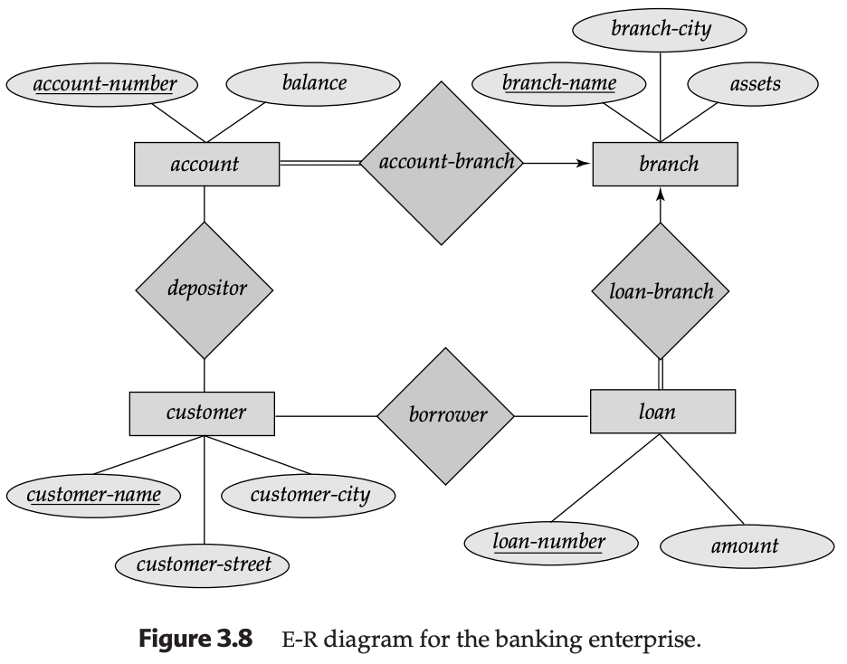
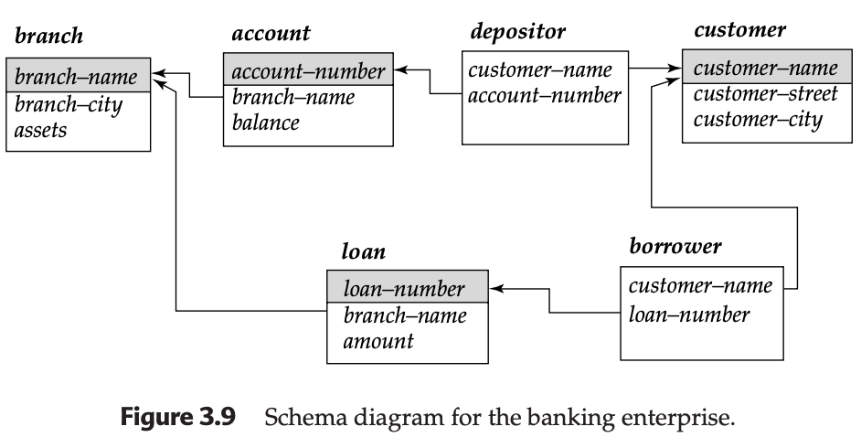

# Structure of Relational Databases

The relational model is the standard for modern data processing due to its simplicity and logical foundations. It represents data as a collection of **tables**, where each table corresponds to a mathematical **relation**. This structure simplifies the developer's task compared to older hierarchical or network models.

---

### 3.1.1 Basic Structure and Mathematical Definition

In the relational model, a **relation** is a set of tuples. Each column in the relation is an **attribute**, and the set of allowed values for each attribute is called its **domain**.

#### The Cartesian Product Formula
Mathematically, a relation is a subset of the **Cartesian product** of a list of domains. If $D_1, D_2, \dots, D_n$ are the domains of $n$ attributes, then the relation $r$ is a subset of:
$$D_1 \times D_2 \times \dots \times D_{n-1} \times D_n$$

**Example: The `account` Relation**
If $D_1$ is the set of all account numbers, $D_2$ the set of branch names, and $D_3$ the set of balances, any row (tuple) must be a 3-tuple $(v_1, v_2, v_3)$ where $v_1 \in D_1, v_2 \in D_2, v_3 \in D_3$.

**Table: `account`**

| account-number | branch-name | balance |
| :--- | :--- | :--- |
| A-101 | Downtown | 500 |
| A-102 | Perryridge | 400 |
| A-201 | Brighton | 900 |
| A-215 | Mianus | 700 |

* **Attribute Atomicity:** Domains must be **atomic**, meaning values are indivisible (e.g., an integer is atomic, but a set of integers is not).
* **Tuple Unordering:** Since a relation is a mathematical set, the order of rows does not matter.
* **Null Values:** A special value used when data is unknown or non-existent.

---

### 3.1.2 Database Schema vs. Instance

* **Database Schema:** The logical design (similar to a `type` or `class` in Java).
* **Database Instance:** A snapshot of the data at a specific moment (similar to the `value` of a variable).

**Notation:**
We use lowercase for the relation name and capitalized names for the schema.
$$Account\text{-}schema = (account\text{-}number, branch\text{-}name, balance)$$
We denote the relation $account$ on that schema as: $account(Account\text{-}schema)$.

**Table: `branch`**

| branch-name | branch-city | assets |
| :--- | :--- | :--- |
| Brighton | Brooklyn | 7100000 |
| Downtown | Brooklyn | 9000000 |
| Redwood | Palo Alto | 2100000 |

**Table: `customer`**

| customer-name | customer-street | customer-city |
| :--- | :--- | :--- |
| Adams | Spring | Pittsfield |
| Johnson | Alma | Palo Alto |
| Smith | North | Rye |

The E-R diagram in Figure 3.8 depicts the banking enterprise that we have just described. The relation schemas correspond to the set of tables that we might generate by the method outlined in Section 2.9. 

Note that the tables for account-branch and loan-branch have been combined into the tables for account and loan respectively. Such combining is possible since the relationships are many to one from account and loan, respectively, to branch, and, further, the participation of account and loan in the corresponding relationships is total, as the double lines in the figure indicate. 

Finally, we note that the customer relation may contain information about customers who have neither an account nor a loan at the bank.

---

### 3.1.3 Keys in the Relational Model

Keys uniquely identify tuples within a relation.

* **Superkey:** A set of one or more attributes that, taken together, allow us to identify a tuple uniquely. If $K$ is a superkey, then for any distinct $t_1, t_2 \in r$, $t_1[K] \neq t_2[K]$.
* **Candidate Key:** A minimal superkey (no proper subset is also a superkey).
* **Primary Key:** The candidate key chosen by the designer to identify tuples.
* **Foreign Key:** An attribute in a "referencing" relation $r_1$ that matches the primary key of a "referenced" relation $r_2$.

#### Mapping E-R Keys to Relations:
| E-R Component | Primary Key Derivation |
| :--- | :--- |
| **Strong Entity** | Primary key of the entity set. |
| **Weak Entity** | Union of the identifying strong entity's PK + weak entity's discriminator. |
| **Relationship** | Union of PKs of participating entities (for M:M). |
| **Multivalued** | PK of the parent entity + the attribute value itself. |

---

### 3.1.4 Schema Diagrams

A schema diagram visualizes the tables, their attributes, and the **foreign key dependencies** (represented by arrows).

**Table: `depositor`**

| customer-name | account-number |
| :--- | :--- |
| Hayes | A-102 |
| Johnson | A-101 |

**Table: `loan`**

| loan-number | branch-name | amount |
| :--- | :--- | :--- |
| L-11 | Round Hill | 900 |
| L-14 | Downtown | 1500 |

**Table: `borrower`**

| customer-name | loan-number |
| :--- | :--- |
| Adams | L-16 |
| Jones | L-17 |

---

### 3.1.5 Query Languages

Query languages are used to request information from the database. They are categorized into:

1.  **Procedural (Relational Algebra):** The user instructs the system to perform a specific sequence of operations.
2.  **Nonprocedural (Tuple/Domain Calculus):** The user describes the desired information without specifying the procedure.

These formal languages provide the foundation for commercial languages like **SQL** (Structured Query Language) and **QBE** (Query-by-Example).

---

## Summary

These relational concepts are the foundation of your JPA (Java Persistence API) mappings. Your @Entity classes define the Schema, while the data in your H2 or MySQL database represents the Instance. Understanding Foreign Keys is especially vital when you start configuring @ManyToOne or @OneToMany relationships in your code.

---

