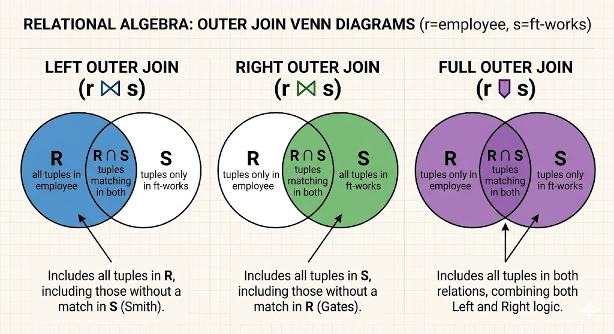

## 3.3 Extended Relational-Algebra Operations

While fundamental operations are sufficient to express any query, the **Extended Relational-Algebra** provides more powerful tools for arithmetic, data summarization, and handling missing information.

---

### 3.3.1 Generalized Projection
Generalized projection extends the standard projection ($\Pi$) by allowing **arithmetic functions** to be used in the projection list.

* **Form:** $\Pi_{F_1, F_2, \dots, F_n}(E)$
* **Renaming:** You can use the **as** clause to name the resulting attributes for clarity.

**Example:** Using the **credit-info** relation to find available credit.

**Table 3.25: credit-info**

| customer-name | limit | credit-balance |
| :--- | :--- | :--- |
| Curry | 2000 | 1750 |
| Hayes | 1500 | 1500 |
| Jones | 6000 | 700 |
| Smith | 2000 | 400 |

**Query:**
$$\Pi_{\text{customer-name, (limit - credit-balance) as credit-available}}(\text{credit-info})$$

**Table 3.26: Result**

| customer-name | credit-available |
| :--- | :--- |
| Curry | 250 |
| Jones | 5300 |
| Smith | 1600 |
| Hayes | 0 |

---

### 3.3.2 Aggregate Functions
Aggregate functions take a collection (multiset) of values and return a single value.
* **Common Functions:** `sum`, `avg`, `count`, `min`, `max`.
* **Distinct Values:** To eliminate duplicates before aggregating, use `-distinct` (e.g., `count-distinct`).

#### The Aggregation Operator ($\mathcal{G}$)
The operation is denoted by the calligraphic letter $\mathcal{G}$.
* **Form:** $_{G_1, G_2, \dots, G_n} \mathcal{G}_{F_1(A_1), F_2(A_2), \dots, F_m(A_m)}(E)$
* $G_1 \dots G_n$: Attributes to group by.
* $F_i(A_i)$: The aggregate function applied to attribute $A_i$.

**Example:** Finding total salary sum per branch using the **pt-works** relation.

**Table 3.27: pt-works**

| employee-name | branch-name | salary |
| :--- | :--- | :--- |
| Adams | Perryridge | 1500 |
| Brown | Perryridge | 1300 |
| Johnson | Downtown | 1500 |
| Rao | Austin | 1500 |

**Query:**
$$_{\text{branch-name}}\mathcal{G}_{\text{sum(salary) as sum-salary, max(salary) as max-salary}}(\text{pt-works})$$

**Table 3.30: Result**

| branch-name | sum-salary | max-salary |
| :--- | :--- | :--- |
| Austin | 3100 | 1600 |
| Downtown | 5300 | 2500 |
| Perryridge | 8100 | 5300 |

---

### 3.3.3 Outer Join

The **Outer Join** operations are essential for maintaining data integrity when joining tables where some records may not have a corresponding match. Below is a demonstration using the relations **$r$ (employee)** and **$s$ (ft-works)**.

---

### Venn Diagram Demonstrations
These diagrams represent the sets of tuples preserved by each operation. The shaded areas indicate which data is included in the final result.

**Left Outer Join ($r \rtimes s$):** Preserves all tuples from the left relation ($r$). If no match is found in $s$, the $s$-attributes are filled with `null`.

**Right Outer Join ($r \ltimes s$):** Preserves all tuples from the right relation ($s$). If no match is found in $r$, the $r$-attributes are filled with `null`.

**Full Outer Join ($r \natural s$):** Preserves all tuples from both $r$ and $s$. It combines the logic of both left and right outer joins, ensuring no data from either side is lost.

---

### Comparison of Join Results
The following table summarizes how each operation behaves using the example of employees (names, streets, cities) and their full-time work data (branch names, salaries).

| Operation | Symbol | Resulting Content | Example Preservation |
| :--- | :---: | :--- | :--- |
| **Natural Join** | $\bowtie$ | Only matching tuples from both tables. | Only Coyote and Rabbit. |
| **Left Outer Join** | $\rtimes$ | All of **Left** + matches from Right. | Includes **Smith** (even without a salary). |
| **Right Outer Join** | $\ltimes$ | All of **Right** + matches from Left. | Includes **Gates** (even without an address). |
| **Full Outer Join** | $\natural$ | **All tuples** from both tables. | Includes Coyote, Rabbit, Smith, and Gates. |

---

### Key Takeaway on Nulls
In these operations, the `null` value acts as a placeholder for missing information.
* In a **Left Outer Join**, the `null` appears in the columns that would have come from the Right table.
* In a **Right Outer Join**, the `null` appears in the columns that would have come from the Left table.
* In a **Full Outer Join**, `null`s can appear in columns from either side, depending on which record lacked a partner.

---

To demonstrate these relational operations effectively, let's establish two sample relations: **employee** and **ft-works**.

### 1. The Source Relations

**Table: employee (r)**

| employee-name | street | city |
| :--- | :--- | :--- |
| Coyote | Toon | Hollywood |
| Rabbit | Tunnel | Carrotville |
| Smith | Revolver | Death Valley |

**Table: ft-works (s)**

| employee-name | branch-name | salary |
| :--- | :--- | :--- |
| Coyote | Mesa | 1500 |
| Rabbit | Mesa | 1300 |
| Gates | Redmond | 5300 |

---

### 2. Join Operations Demonstrated

#### I. Natural Join ($r \bowtie s$)
The natural join returns only the rows where the `employee-name` exists in **both** tables.
* **Result:** Smith and Gates are excluded because they don't have a matching partner in the other table.

| employee-name | street | city | branch-name | salary |
| :--- | :--- | :--- | :--- | :--- |
| Coyote | Toon | Hollywood | Mesa | 1500 |
| Rabbit | Tunnel | Carrotville | Mesa | 1300 |

#### II. Left Outer Join ($r \rtimes s$)
Preserves all rows from the **employee** table. Since **Smith** has no entry in `ft-works`, his work details are filled with `null`.
* **Result:** Includes the matches plus Smith.

| employee-name | street | city | branch-name | salary |
| :--- | :--- | :--- | :--- | :--- |
| Coyote | Toon | Hollywood | Mesa | 1500 |
| Rabbit | Tunnel | Carrotville | Mesa | 1300 |
| **Smith** | **Revolver** | **Death Valley** | **null** | **null** |

#### III. Right Outer Join ($r \ltimes s$)
Preserves all rows from the **ft-works** table. Since **Gates** has no entry in the `employee` table, his personal details are filled with `null`.
* **Result:** Includes the matches plus Gates.

| employee-name | street | city | branch-name | salary |
| :--- | :--- | :--- | :--- | :--- |
| Coyote | Toon | Hollywood | Mesa | 1500 |
| Rabbit | Tunnel | Carrotville | Mesa | 1300 |
| **Gates** | **null** | **null** | **Redmond** | **5300** |

#### IV. Full Outer Join ($r \natural s$)
Combines all tuples from both tables. It pads with `null` wherever a match is missing on either side.
* **Result:** All individuals (Coyote, Rabbit, Smith, and Gates) are included.

| employee-name | street | city | branch-name | salary |
| :--- | :--- | :--- | :--- | :--- |
| Coyote | Toon | Hollywood | Mesa | 1500 |
| Rabbit | Tunnel | Carrotville | Mesa | 1300 |
| **Smith** | **Revolver** | **Death Valley** | **null** | **null** |
| **Gates** | **null** | **null** | **Redmond** | **5300** |

---

### Summary Table of Join Behavior

| Operation | Symbol | Preservation Logic | Key Output |
| :--- | :---: | :--- | :--- |
| **Natural Join** | $\bowtie$ | Intersection only. | Coyote, Rabbit |
| **Left Outer Join** | $\rtimes$ | Left Table (employee) + nulls for missing Right. | Adds **Smith** |
| **Right Outer Join** | $\ltimes$ | Right Table (ft-works) + nulls for missing Left. | Adds **Gates** |
| **Full Outer Join** | $\natural$ | Union of both tables + nulls for all mismatches. | **Everyone** |

### Key Takeaway on Nulls
1. As you noted, `null` acts as a placeholder for "unknown" or "non-existent" data. 
2. In a **Left Outer Join**, the `null` appears in the right-side attributes (salary/branch). 
3. In a **Right Outer Join**, the `null` appears in the left-side attributes (street/city). A **Full Outer Join** allows `null` values to appear in any column depending on which specific tuple lacked a corresponding match.

---
### 3.3.4 Null Values
Since `null` represents "unknown," operations involving them follow specific logic:

#### Arithmetic and Comparisons
* **Arithmetic:** Any operation (e.g., $5 + \text{null}$) returns `null`.
* **Comparisons:** Any comparison (e.g., $5 < \text{null}$) returns **unknown**.

#### Three-Valued Logic (Boolean)
| Operation | Rule |
| :--- | :--- |
| **AND** | (`true` and `unknown`) = `unknown`; (`false` and `unknown`) = `false` |
| **OR** | (`true` or `unknown`) = `true`; (`false` or `unknown`) = `unknown` |
| **NOT** | (`not unknown`) = `unknown` |

#### How Operations Handle Nulls
* **Select ($\sigma$):** Only tuples that evaluate to `true` are included. `false` and `unknown` are excluded.
* **Join:** Since it uses a selection predicate, tuples with `null` in common attributes do not match.
* **Aggregate:** * **Grouping:** `null` values are treated as a single group.
    * **Calculation:** `null` values are **ignored** before the calculation (e.g., `sum` ignores `null`s). If only `null`s exist, the result is `null`.

---