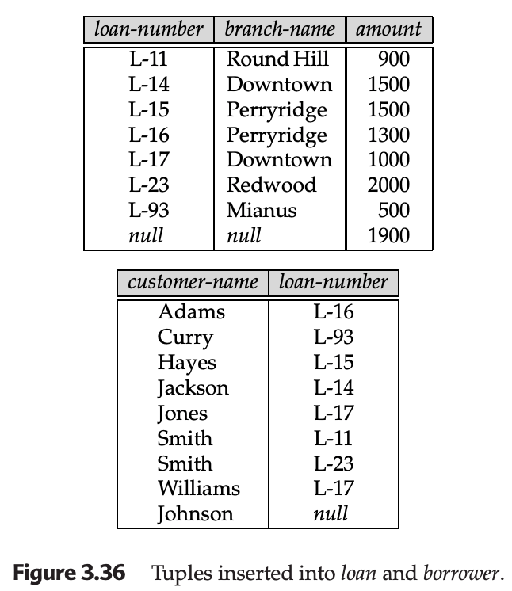

## 3.5 Views

In standard relational algebra, we typically operate on the **logical-model level**, assuming the relations we use are the actual tables stored in the database. However, for security or usability reasons, it is often undesirable to show users the entire logical model.

A **View** is any relation that is not part of the logical model but is made visible to a user as a **virtual relation**.

### 3.5.1 View Definition
A view is defined using the `create view` statement. It requires a name and a relational-algebra query that defines its contents.

**Form:** $$\text{create view } v \text{ as } <\text{query expression}>$$

**Example:** Creating a view named `all-customer` that lists branch names and customer names from both accounts and loans:
$$\text{create view all-customer as}$$
$$\Pi_{\text{branch-name, customer-name}}(\text{depositor} \bowtie \text{account}) \cup \Pi_{\text{branch-name, customer-name}}(\text{borrower} \bowtie \text{loan})$$

#### View vs. Assignment
* **Assignment ($\leftarrow$):** The expression is evaluated **once**. If the underlying tables (e.g., `loan`) are updated later, the assigned relation does not change.
* **View:** A view is dynamic. Whenever the underlying relations are modified, the view reflects those changes because it is recomputed (or treated as a stored query) whenever it is accessed.

#### Materialized Views
A **materialized view** is a view where the result of the query is actually computed and stored.
* **Benefit:** Much faster response times for complex queries.
* **Maintenance:** The system must perform **view maintenance** to ensure the stored data stays up-to-date when the underlying tables change.

---

### 3.5.2 Updates through Views and Null Values

Modifying data through a view is difficult because the database system must translate the change back into modifications of the actual physical relations in the logical model.

#### The Null Value Problem
Suppose a clerk uses the `loan-branch` view, which only shows `loan-number` and `branch-name` while hiding the `amount`. If the clerk attempts to insert a new tuple:

$$\text{loan-branch} \leftarrow \text{loan-branch} \cup \{(\text{"L-37"}, \text{"Perryridge"})\}$$

Because the view is derived from the actual `loan` relation, the system must update the base table. However, since the view provides no value for the `amount` attribute, the system faces a dilemma and must choose one of two approaches:
1.  **Reject the insertion** and return an error message.
2.  **Insert a tuple** with a `null` value into the base relation: $(\text{"L-37"}, \text{"Perryridge"}, \text{null})$.

#### The Join Problem
A more complex issue arises with views involving joins, such as:
$$\text{create view loan-info as } \Pi_{\text{customer-name, amount}}(\text{borrower} \bowtie \text{loan})$$

If a user tries to insert a tuple through this view:
$$\text{loan-info} \leftarrow \text{loan-info} \cup \{(\text{"Johnson"}, 1900)\}$$

The system would have to insert $(\text{"Johnson"}, \text{null})$ into `borrower` and $(\text{null}, \text{null}, 1900)$ into `loan`. As shown in **Figure 3.36**, this does not actually achieve the desired result because the `null` values prevent the two tables from matching on the join attribute (`loan-number`). Consequently, the new data **will not appear** in the view.

---

### Comparison of Modification Methods

| Problem | Description | Typical System Response |
| :--- | :--- | :--- |
| **Missing Attributes** | View doesn't include all columns of the base table. | Insert `null` or Reject. |
| **Join Ambiguity** | View combines multiple tables; it's unclear where to put new data. | Usually Rejected. |
| **Aggregate Views** | View shows a `sum` or `avg`; you can't "un-calculate" a new total. | Strictly Prohibited. |

> **Note:** Because of these complications, most database systems highly restrict or prohibit update operations on views.

---

### 3.5.3 Views Defined Using Other Views
Views can be nested, meaning one view can be part of the query that defines another.

**Example:**
$$\text{create view perryridge-customer as}$$
$$\Pi_{\text{customer-name}}(\sigma_{\text{branch-name} = \text{"Perryridge"}}(\text{all-customer}))$$

#### View Expansion
To understand a query containing nested views, the system uses **view expansion**. This is a non-recursive process where each view name is replaced by its defining expression until only actual database relations remain.

**The Expansion Loop:**
1.  Find any view relation $v_i$ in the expression.
2.  Replace $v_i$ with its defining expression.
3.  Repeat until no view relations remain.

---

### Summary of View Types

| Type | Storage | Update Frequency |
| :--- | :--- | :--- |
| **Virtual View** | Definition stored; data recomputed on query. | Always reflects latest data. |
| **Materialized View** | Data is physically stored. | Requires "view maintenance" to sync. |
| **Recursive View** | Definition refers to itself. | Used in advanced logic (e.g., Datalog). |

---