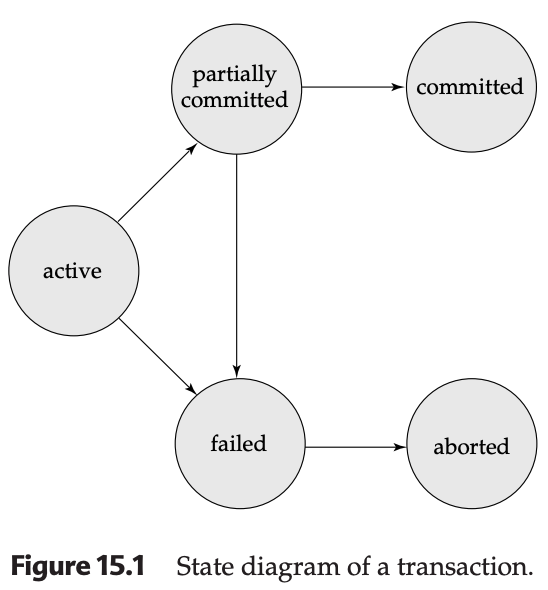

# Transaction States: Life Cycle of a Database Operation

In database management systems, a transaction undergoes several specific stages from the moment it begins until it either successfully finishes or is discarded. Understanding these states is vital for ensuring the **Atomicity** and **Durability** of your data.

---

## 1. The Five States of a Transaction

A transaction must exist in exactly one of the following five states at any given time:

1.  **Active**: The initial state. The transaction stays here while it is executing its internal operations (reads and writes).
2.  **Partially Committed**: This state is reached after the final statement of the transaction has been executed. However, the data may still reside in volatile main memory (RAM), meaning a hardware failure could still cause data loss.
3.  **Failed**: The state entered after the system discovers that normal execution can no longer proceed due to hardware errors, logical bugs, or system crashes.
4.  **Aborted**: The state reached after the transaction has been **rolled back**. The database has been restored to its state prior to the transaction's start.
5.  **Committed**: The final state of successful completion. The system has written enough information to disk to ensure that the updates will persist even in a system failure.

---

## 2. Transition Logic and Termination

A transaction is considered **terminated** only when it has reached either the **Committed** or **Aborted** state.

### From Partially Committed to Committed
A transaction is not "safe" just because it finished its code. The system must move the data from main memory to non-volatile storage (disk). Once the last piece of information is safely on the disk, the transaction moves from **Partially Committed** to **Committed**.

### From Failed to Aborted
When a transaction fails, the database must ensure **Atomicity** by undoing every change the transaction made. This process is called a **rollback**. Once the rollback is complete, the transaction is officially **Aborted**.

---

## 3. Handling Aborted Transactions

Once a transaction is aborted, the system typically chooses one of two paths:
* **Restart**: If the failure was due to a transient hardware or software error (not a logical bug), the system restarts it as a "new" transaction.
* **Kill**: If the error was logical (e.g., bad input, data not found), the application must be rewritten or the input corrected before trying again.

---

## 4. The Challenge of External Writes
External actions (like printing a receipt or dispensing cash from an ATM) present a unique problem because they cannot be "undone" or "erased" from the real world.

* **The Standard Approach**: Most systems wait until the transaction is in the **Committed** state before performing external writes.
* **The Compensating Transaction**: If a committed transaction must be "undone" (e.g., a user wants a refund after a successful transfer), the system cannot simply rollback. Instead, it must execute a **compensating transaction**—a new, separate operation that "cancels out" the first (adding $20 back if $20 was mistakenly subtracted).
    * *Note: Creating these is usually the responsibility of the user/programmer, not the database system itself.*

---

## Interview Prep: Key Insights

* **"Terminated" vs. "Committed":** A common trick question. A transaction can be "terminated" by being aborted. "Committed" only refers to successful completion.
* **The "Vulnerable" State:** The **Partially Committed** state is the most vulnerable. The logic is finished, but the data isn't "durable" on the disk yet.
* **Atomicity in Action:** If an interviewer asks how a DB handles a crash during a transaction, explain the **Aborted** state and the **Rollback** mechanism—this is how Atomicity is physically implemented.
* **Compensating Transactions:** Be ready to explain why we need them. Once a state is **Committed**, it is permanent (Durability). You cannot "undo" it; you can only "offset" it with a new transaction.

### Summary Table for Tutorials

| State | Definition | Next Possible State(s) |
| :--- | :--- | :--- |
| **Active** | Executing operations | Partially Committed, Failed |
| **Partially Committed** | Finished code, data in RAM | Committed, Failed |
| **Failed** | Error detected | Aborted |
| **Aborted** | Rollback complete | Restarted or Killed |
| **Committed** | Data safe on disk | None (Final) |

---