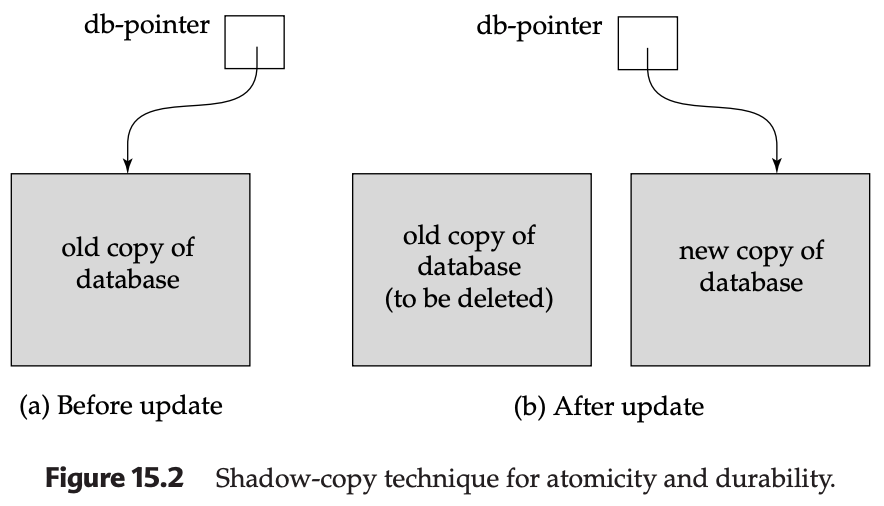

# Implementation of Atomicity and Durability

The **recovery-management component** of a database system is responsible for ensuring that transactions adhere to the ACID properties, specifically **Atomicity** (all-or-nothing) and **Durability** (persistence after success). One simple conceptual model for this is the **Shadow Copy Scheme**.

---

## 1. The Shadow Copy Mechanism
This scheme assumes the database is a single file on a disk and that only one transaction is active at a time. It relies on a single disk-based pointer called the `db-pointer`.

### Step-by-Step Execution:
1.  **Copying**: A transaction creates a complete replica of the database file.
2.  **Updating**: All writes are performed on the **new copy**. The original file (the "shadow copy") remains untouched.
3.  **Flushing**: If the transaction finishes, the OS is commanded to "flush" all pages of the new copy from memory to the physical disk.
4.  **Committing**: The `db-pointer` is updated to point to the new file.
5.  **Cleanup**: The old database file is deleted.

---

## 2. Handling Failures

The shadow copy scheme provides a robust (though basic) way to handle different failure types:

### Transaction Failure (Abort)
If a transaction fails or is aborted *before* the `db-pointer` is updated, the system simply deletes the new, modified copy. Because the shadow copy was never touched, the database remains in its original state, ensuring **Atomicity**.

### System Failure (Crash)
* **Crash before pointer update**: Upon restart, the system reads the `db-pointer`, which still points to the old, consistent data. The half-finished new copy is ignored.
* **Crash after pointer update**: Since the `db-pointer` is only updated *after* the OS has confirmed all new data is written to the disk, the system restarts and sees the fully updated database. This ensures **Durability**.

---

## 3. The Role of Atomic Hardware
The success of this entire scheme depends on the **atomicity of the pointer write**. If the system crashed while writing only half of the `db-pointer` bytes, the pointer would become garbage.

* **Sector Atomicity**: Most disk systems guarantee that writing a single **disk sector** (or block) is atomic.
* **Implementation**: By storing the `db-pointer` at the very beginning of a block, the system ensures that it is either fully updated or not updated at all, preventing corruption.

---

## 4. Real-World Analogy: Text Editors
Many modern text editors use a variation of this logic to prevent file corruption:
* **The Session**: Opening, editing, and saving a file is treated as a transaction.
* **The Swap**: Instead of overwriting your file directly, the editor writes to a hidden temporary file.
* **The Rename**: When you click "Save," the editor uses an atomic `rename` command. The filesystem renames the new file to the original filename, effectively deleting the old version in one atomic step.

---

## 5. Summary Table: Pros and Cons

| Advantages | Disadvantages |
| :--- | :--- |
| **Simple Logic**: Very easy to implement. | **Extremely Inefficient**: Copying a 1TB database for a single small update is too slow. |
| **No Complex Recovery**: No need for complex logs or undo/redo operations. | **No Concurrency**: Only one transaction can be active at a time; otherwise, copies would conflict. |
| **Reliable**: Strong protection against data corruption. | **Storage Heavy**: Requires double the disk space during the transaction. |

---

## Interview Prep: Key Concepts

* **What is the "Shadow" in Shadow Copy?** It is the original, unmodified version of the database that serves as the fallback if a transaction fails.
* **When is a transaction officially "Committed"?** At the exact moment the updated `db-pointer` is successfully written to the disk.
* **Why isn't this used in high-performance DBs like SQL Server or Oracle?** Because those systems must handle thousands of concurrent transactions and cannot afford to copy the entire database for every small change. They instead use more advanced techniques like **Write-Ahead Logging (WAL)**.

---