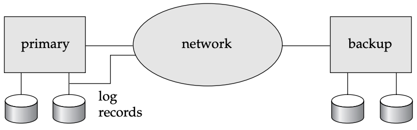

# 17.10 Remote Backup Systems

## Overview

Traditional transaction-processing systems (centralized or client–server) are **vulnerable to environmental disasters** such as fire, flooding, or earthquakes. Modern systems increasingly need to function despite system failures or environmental disasters, requiring **high availability** — the time for which the system is unusable must be **extremely small**.

---

## Architecture

### Primary and Remote Backup Sites

| Component | Description |
|---|---|
| **Primary site** | The main site where transaction processing takes place |
| **Remote backup site** | A geographically separated site where all data from the primary is replicated; also called the **secondary site** |

> The remote backup site must be **physically separated** from the primary — for example, located in a different state — so that a disaster at the primary does **not** damage the remote backup site.

### Synchronisation

> The remote backup site is kept synchronised with the primary by **sending all log records from the primary site to the remote backup site** over a network.

### System Architecture Diagram


```
          (Figure 17.10 — Architecture of remote backup system)
```

---

## Failure and Recovery

### When the Primary Site Fails

```
Primary site FAILS
        │
        ▼
Remote backup site takes over
        │
        ▼
Performs RECOVERY using:
  - Its (possibly outdated) copy of the data from the primary
  - Log records received from the primary
        │
        ▼
Recovery actions that would have been performed at the primary
are now performed at the backup site
(Standard recovery algorithms apply, with minor modifications)
        │
        ▼
Remote backup site begins processing new transactions
(becomes the new primary)
```

### Availability Benefit

> Availability is greatly increased over a single-site system, since the system can **recover even if all data at the primary site are lost**.

> The performance of a remote backup system is also **better** than that of a distributed system with two-phase commit.

---

## Design Issues

### 1. Detection of Failure

> It is essential that the remote backup correctly detect when the primary has failed. **Failure of communication lines** can fool the backup into believing the primary has failed.

**Solution — Multiple Independent Communication Links:**

```
PRIMARY SITE ─────── Network connection ──────── BACKUP SITE
             ─────── Modem / telephone line ─────
             ─────── Manual operator override ───
             (different telecommunication providers for each)
```

- Multiple links with **independent modes of failure** are maintained
- If one link fails, others can still confirm the primary's status
- Manual intervention by operators (communicating over the telephone system) can serve as a final backup

---

### 2. Transfer of Control

> When the primary fails, the **backup site takes over** and becomes the new primary. When the original primary recovers, control can be managed in two ways:

| Scenario | Process |
|---|---|
| **Old primary becomes remote backup** | Old primary receives redo logs from the old backup site, applies them locally to catch up with updates, then acts as the new remote backup |
| **Old primary resumes primary role** | Old backup site pretends to have failed → old primary takes over as primary again |

**Simplest transfer procedure:**
```
Old primary recovers
        │
        ▼
Receives redo logs from the backup site (updates made while primary was down)
        │
        ▼
Applies redo logs locally (catches up)
        │
        ▼
Takes on the role of remote backup site
```

---

### 3. Time to Recover

> If the log at the remote backup **grows large**, recovery will take a long time when the backup takes over.

**Solution — Periodic Checkpointing at the Backup Site:**

```
Remote backup site periodically:
  - Processes redo log records received
  - Performs a checkpoint
  - Deletes earlier (now unnecessary) parts of the log
```

This **significantly reduces** the delay before the backup site can take over.

**Hot-Spare Configuration:**

> In a **hot-spare configuration**, the remote backup site **continually processes redo log records** as they arrive, applying updates locally in real time.

```
Log records arrive at backup site
        │
        ▼
Backup site applies updates IMMEDIATELY (in real time)
        │
        ▼
Primary site FAILS
        │
        ▼
Backup site completes recovery by rolling back INCOMPLETE transactions only
        │
        ▼
Backup site is ready to process new transactions — ALMOST INSTANTLY
```

> Takeover is **almost instantaneous** in a hot-spare configuration.

---

### 4. Time to Commit — Durability Levels

> To ensure that committed transactions are durable, a transaction must not be declared committed until its log records have **reached the backup site**. This introduces potential commit delays.

Systems may permit **lower degrees of durability** to reduce wait times. There are three durability schemes:

---

#### Scheme 1 — One-Safe

> A transaction commits as soon as its commit log record is written to **stable storage at the primary site only**.

```
Transaction commits  →  Log record written to PRIMARY stable storage  →  COMMIT declared
(Log record may NOT yet have reached the backup site)
```

| Property | Detail |
|---|---|
| **Commit speed** | Fastest |
| **Durability** | Weakest |
| **Problem** | Updates of a committed transaction may not have reached the backup site before it takes over → updates appear **lost** |
| **Recovery complication** | Lost updates cannot be merged directly — they may conflict with later updates at the backup site; **human intervention** may be required |

---

#### Scheme 2 — Two-Very-Safe

> A transaction commits as soon as its commit log record is written to **stable storage at BOTH the primary and the backup site**.

```
Transaction commits
        │
        ▼
Log record written to PRIMARY stable storage
        │     AND
        ▼
Log record written to BACKUP stable storage
        │
        ▼
COMMIT declared
```

| Property | Detail |
|---|---|
| **Commit speed** | Slowest |
| **Durability** | Strongest — data loss probability is very low |
| **Problem** | If **either** the primary or backup site is down, transaction processing **cannot proceed** → availability is **less** than a single-site system |

---

#### Scheme 3 — Two-Safe

> Behaves like **two-very-safe** when both primary and backup are active. If only the primary is active, behaves like **one-safe**.

```
Both sites active?
    YES → behave like Two-Very-Safe (commit after both confirm)
    NO  → behave like One-Safe (commit after primary confirms)
```

| Property | Detail |
|---|---|
| **Commit speed** | Slower than one-safe, faster than two-very-safe |
| **Durability** | Better than one-safe; avoids the lost-transaction problem |
| **Availability** | Better than two-very-safe |
| **Verdict** | Benefits generally **outweigh** the cost; the recommended scheme |

---

### Durability Scheme Comparison

| Feature | One-Safe | Two-Very-Safe | Two-Safe |
|---|---|---|---|
| **When commit declared** | After primary writes log | After both primary AND backup write log | After both (if both active); after primary only (if backup down) |
| **Commit speed** | Fastest | Slowest | Moderate |
| **Data loss risk** | High | Very low | Low |
| **Availability** | High | **Lower than single-site** | High |
| **Lost transaction problem** | Yes | No | No (avoids it) |
| **Human intervention needed?** | Possibly | No | No |
| **Recommended?** | Only for low-stakes apps | Only when data loss is unacceptable | ✅ Generally preferred |

---

## Alternative High-Availability Approaches

### Commercial Shared-Disk Systems

> Some commercial systems provide **fault tolerance intermediate** between centralized and remote backup systems.

| Feature | Description |
|---|---|
| **CPU failure handling** | Failure of one CPU does not cause system failure — other CPUs take over |
| **Recovery actions** | Rollback of transactions running on the failed CPU; recovery of locks held by those transactions |
| **Data transfer** | Not required — data resides on a **shared disk** accessible to all CPUs |
| **Disk protection** | Use **RAID disk organisation** to safeguard data from disk failure |

### Distributed Databases with Replication

> Another approach is to use a **distributed database** with data **replicated at more than one site**.

- Transactions must update **all replicas** of any data item they modify
- Studied in detail in **Chapter 19**

---

### High-Availability Approach Comparison

| Approach | Failure Handled | Data Transfer Needed | Availability Level |
|---|---|---|---|
| **Single-site system** | Software/hardware crash only | N/A | Low (vulnerable to disasters) |
| **Remote backup system** | Environmental disasters + site failure | Log records over network | High |
| **Shared-disk system** | CPU failure | None (shared disk) | Intermediate |
| **Distributed with replication** | Site failure + network partitions | All updates to all replicas | High |

---

## Key Terms

| Term | Definition |
|---|---|
| **High availability** | The property that a system's downtime is extremely small, even in the presence of failures |
| **Primary site** | The main site where transaction processing takes place in a remote backup system |
| **Remote backup site** | A geographically separated site that maintains a replica of the primary's data and takes over if the primary fails; also called the secondary site |
| **Hot-spare configuration** | A remote backup configuration where the backup continuously applies redo log records in real time, enabling near-instantaneous takeover |
| **One-safe** | A durability scheme where a transaction commits after its log record is written to stable storage at the primary site only |
| **Two-very-safe** | A durability scheme where a transaction commits only after its log record is written to stable storage at both the primary and backup sites |
| **Two-safe** | A durability scheme that uses two-very-safe when both sites are active, and one-safe when only the primary is active |
| **Transfer of control** | The process by which the backup site assumes the role of primary after the primary fails, and optionally reverts control when the primary recovers |
| **Shared-disk system** | A fault-tolerant system where multiple CPUs share a common disk, so CPU failures do not result in data loss or system unavailability |
| **RAID** | Redundant Array of Independent Disks — a disk organisation strategy that protects against disk failure through redundancy |

---