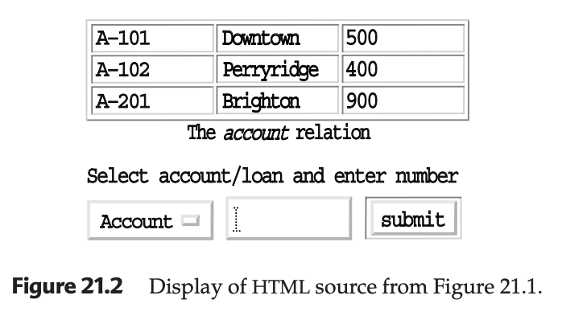
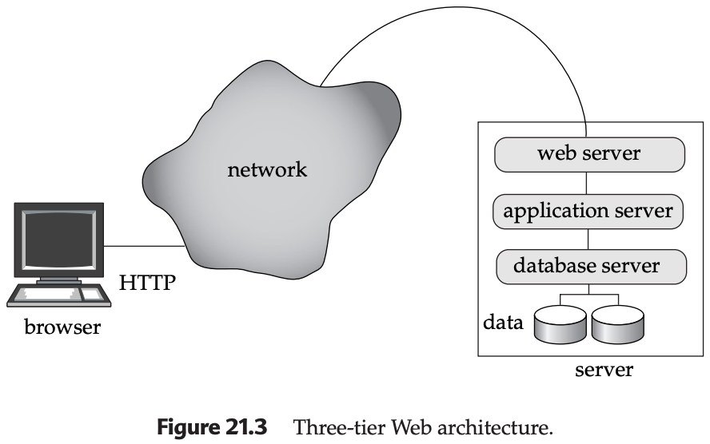
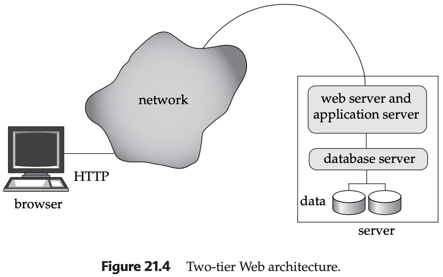

# Web Interfaces to Databases

## Overview

Practically all use of databases occurs from within application programs. Correspondingly, almost all user interaction with databases is indirect, via application programs. Database systems have long supported tools such as form and GUI builders, which help in rapid development of applications that interface with users. In recent years, the Web has become the most widely used user interface to databases.

## 21.1.1 Motivation

The Web has become important as a front end to databases for several reasons:

- **Universal Front End**: Web browsers provide a universal front end to information supplied by back ends located anywhere in the world. The front end can run on any computer system, and there is no need for a user to download any special-purpose software to access information.

- **Widespread Access**: Today, almost everyone who can afford it has access to the Web.

- **Electronic Commerce**: With the growth of information services and electronic commerce on the Web, databases used for information services, decision support, and transaction processing must be linked with the Web.

- **Convenient Transaction Processing**: The HTML forms interface is convenient for transaction processing. The user can fill in details in an order form, then click a submit button to send a message to the server.

### Limitations of Static Web Documents

Presenting only static (fixed) documents on a Web site has limitations:

- **No User Tailoring**: Fixed Web documents do not allow the display to be tailored to the user. For instance, a newspaper may want to tailor its display on a per-user basis.

- **Data Obsolescence**: When the company data are updated, the Web documents become obsolete if they are not updated simultaneously.

**Solution**: Generate Web documents dynamically from a database. When a document is requested, a program gets executed at the server site, which runs queries on a database and generates the requested document based on the query results.

### Benefits of Web Interfaces

- **Attractive Formatting**: HTML allows text to be neatly formatted, with important information highlighted.

- **Hyperlinks**: Links to other documents can be associated with regions of the displayed data, useful for browsing data.

- **Sophisticated User Interfaces**: Browsers can fetch programs along with HTML documents and run them on the browser in safe mode, allowing sophisticated user interfaces without downloading and installing software.

## 21.1.2 Web Fundamentals

### 21.1.2.1 Uniform Resource Locators (URLs)

A uniform resource locator (URL) is a globally unique name for each document that can be accessed on the Web.

**Example URL**:
```
http://www.bell-labs.com/topic/book/db-book
```

**URL Components**:
1. **Protocol**: "http" indicates the document is to be accessed by the HyperText Transfer Protocol
2. **Machine Name**: Unique name of a machine that has a Web server
3. **Path Name**: Path name of the file on the machine or unique identifier of the document

**URL Variants**:
- **HTTPS**: Secure HTTP using SSL/TLS encryption
- **FTP**: File Transfer Protocol for file downloads
- **mailto**: Email protocol links
- **file**: Local file system access

**Dynamic URL Example**:
```
http://www.google.com/search?q=silberschatz
```
This specifies that the program `search` on the server `www.google.com` should be executed with the argument `q=silberschatz`.

**URL Encoding**:
- Special characters are URL-encoded (e.g., space becomes `%20`, `&` becomes `%26`)
- Query parameters separated by `&` character
- Maximum URL length varies by browser (typically 2048 characters)

**RESTful URLs**:
```
GET /api/accounts/101      // Retrieve account A-101
POST /api/accounts         // Create new account
PUT /api/accounts/101      // Update account A-101
DELETE /api/accounts/101   // Delete account A-101
```

### 21.1.2.2 HyperText Markup Language (HTML)

HTML is used to create Web documents. Figure 21.1 shows an example of HTML source code:

```html
<html>
<head>
    <title>Bank Query Form</title>
</head>
<body>
    <h3>The account relation</h3>
    <table border="1">
        <tr>
            <th>A-101</th>
            <th>Downtown</th>
            <th>500</th>
        </tr>
        <tr>
            <th>A-102</th>
            <th>Perryridge</th>
            <th>400</th>
        </tr>
        <tr>
            <th>A-201</th>
            <th>Brighton</th>
            <th>900</th>
        </tr>
    </table>
    
    <p>Select account/loan and enter number</p>
    <form action="BankQuery" method="get">
        <select name="type">
            <option value="account">Account</option>
            <option value="loan">Loan</option>
        </select>
        <input type="text" name="number">
        <input type="submit" value="submit">
    </form>
</body>
</html>
```

**Figure 21.2: Display of HTML source from Figure 21.1**

The rendered HTML page displays:

### The account relation



### HTML Features

- **Forms**: Allow user input through various input types
- **Stylesheets**: CSS (Cascading Stylesheets) can alter display attributes and provide uniform look across pages
- **Tables**: For structured data display
- **Multimedia**: Images, audio, video embedding
- **Semantic Elements**: Header, footer, nav, section, article (HTML5)
- **Accessibility**: ARIA attributes for screen readers

### HTML Form Elements and Attributes

**Input Types**:
```html
<input type="text" name="username" placeholder="Enter username" required>
<input type="password" name="password" minlength="8">
<input type="email" name="email" multiple>
<input type="number" name="age" min="18" max="120" step="1">
<input type="date" name="birthdate">
<input type="checkbox" name="newsletter" value="yes" checked>
<input type="radio" name="gender" value="male">
<input type="file" name="document" accept=".pdf,.doc">
<input type="hidden" name="csrf_token" value="abc123">
<input type="submit" value="Submit Form">
<input type="reset" value="Clear Form">
<input type="button" value="Click Me" onclick="validateForm()">
```

**Form Attributes**:
```html
<form action="/process" method="post" enctype="multipart/form-data" target="_blank">
    <fieldset>
        <legend>Account Information</legend>
        <label for="account-number">Account Number:</label>
        <input type="text" id="account-number" name="account" required>
        
        <label for="account-type">Account Type:</label>
        <select id="account-type" name="type" size="3" multiple>
            <option value="checking">Checking</option>
            <option value="savings" selected>Savings</option>
            <option value="credit">Credit</option>
        </select>
        
        <label for="comments">Comments:</label>
        <textarea id="comments" name="comments" rows="4" cols="50" maxlength="500"></textarea>
        
        <button type="submit" formaction="/submit" formmethod="post">Submit</button>
        <button type="submit" formaction="/draft">Save as Draft</button>
    </fieldset>
</form>
```

**Form Validation**:
- **HTML5 Validation**: `required`, `pattern`, `min`, `max`, `step`
- **Custom Validation**: JavaScript validation functions
- **Server-Side Validation**: Essential for security and data integrity

**Form Methods**:
- **GET**: Parameters sent in URL, limited length, bookmarkable
- **POST**: Parameters sent in request body, no length limit, more secure

**File Upload**:
```html
<form action="/upload" method="post" enctype="multipart/form-data">
    <input type="file" name="files" multiple accept="image/*,.pdf">
    <input type="submit" value="Upload Files">
</form>
```

### 21.1.2.3 Client-Side Scripting and Applets

Embedding program code in documents allows Web pages to be active, carrying out activities such as animation by executing programs at the local site.

**Benefits**:
- Flexible interaction with users beyond HTML forms
- Faster interaction compared to server-side processing
- Rich user interfaces

**Security Concerns**:
- Malicious code could perform harmful actions
- Need for safe execution environments

**Java Applets**:
- Platform-independent bytecode
- Safe mode execution (no access to local files, system programs, or external network connections)
- Can display data and connect to the originating server

**Client-Side Scripting Languages**:
- **JavaScript**: Most widely used client-side scripting language
- **Special-purpose languages**: For animation (Flash, Shockwave), 3D modeling (VRML)

## 21.1.3 Web Servers and Sessions

### Web Server Architecture

A Web server is a program that:
- Accepts requests from Web browsers
- Sends back results as HTML documents
- Communicates via HTTP (HyperText Transfer Protocol)

### Three-Tier Web Architecture



**Components**:
1. **Web Server**: Handles HTTP requests
2. **Application Server**: Contains business logic
3. **Database Server**: Manages data storage

**Disadvantages**:
- Increased system overhead
- CGI interface starts new process for each request

### Two-Tier Web Architecture



**Advantages**:
- Reduced overhead
- Application program runs within the Web server
- Better performance for high-volume sites

### HTTP and Sessions

**HTTP Protocol Details**:

**HTTP Methods**:
- **GET**: Retrieve data, safe and idempotent
- **POST**: Submit data for processing, not idempotent
- **PUT**: Update/replace resource, idempotent
- **DELETE**: Remove resource, idempotent
- **HEAD**: Get headers only (like GET without body)
- **OPTIONS**: Get allowed methods for resource
- **PATCH**: Partial modification of resource

**HTTP Status Codes**:
- **2xx Success**: 200 OK, 201 Created, 204 No Content
- **3xx Redirection**: 301 Moved Permanently, 302 Found, 304 Not Modified
- **4xx Client Error**: 400 Bad Request, 401 Unauthorized, 403 Forbidden, 404 Not Found
- **5xx Server Error**: 500 Internal Server Error, 503 Service Unavailable

**HTTP Headers**:
```http
Request Headers:
Host: www.example.com
User-Agent: Mozilla/5.0
Accept: text/html,application/xhtml+xml
Accept-Language: en-US,en;q=0.9
Cookie: sessionid=abc123; userid=456
Content-Type: application/x-www-form-urlencoded
Content-Length: 42

Response Headers:
Content-Type: text/html; charset=UTF-8
Content-Length: 1234
Set-Cookie: sessionid=def789; HttpOnly; Secure
Cache-Control: no-cache
Expires: Thu, 01 Dec 1994 16:00:00 GMT
```

**HTTP Characteristics**:
- **Connectionless**: No continuous connection between client and server
- **Stateless**: Each request is independent
- **Request-Response**: Client initiates, server responds
- **Text-based**: Human-readable protocol

**Session Management**:
- **Need**: Services require session information (authentication, user preferences)
- **Solution**: Use cookies to maintain session state
- **Alternatives**: URL rewriting, hidden form fields, local storage

**Cookies**:
- Small piece of text containing identifying information
- Server sends cookie to client after authentication
- Browser automatically sends cookie with subsequent requests
- Server uses cookie to identify ongoing sessions
- Can be stored permanently for user identification on return visits

**Cookie Attributes**:
```http
Set-Cookie: sessionid=abc123; Expires=Wed, 09 Jun 2021 10:18:14 GMT; 
           Path=/; Domain=.example.com; HttpOnly; Secure; SameSite=Strict
```
- **Expires**: Cookie expiration date
- **Path**: URL path for which cookie is valid
- **Domain**: Domain for which cookie is valid
- **HttpOnly**: Not accessible via JavaScript
- **Secure**: Only sent over HTTPS
- **SameSite**: CSRF protection (Strict, Lax, None)

**Session Management Techniques**:
1. **Cookie-based Sessions**: Most common approach
2. **URL Rewriting**: Append session ID to URLs
3. **Hidden Form Fields**: Session ID in hidden inputs
4. **Local Storage**: Client-side storage (modern approach)

**Session Security**:
- Use HTTPS to protect session cookies
- Implement session timeout
- Regenerate session IDs on authentication
- Use secure, HttpOnly cookies
- Implement CSRF protection

## 21.1.4 Servlets

In a two-tier Web architecture, the application runs as part of the Web server itself. Java servlets provide an API for communication between the Web server and application programs.

### Servlet Lifecycle

**Servlet Lifecycle Methods**:
1. **init()**: Called once when servlet is first loaded
2. **service()**: Called for each request (dispatches to doGet/doPost)
3. **destroy()**: Called when servlet is unloaded
4. **doGet()**: Handles HTTP GET requests
5. **doPost()**: Handles HTTP POST requests

**Servlet Lifecycle Example**:
```java
public class BankQueryServlet extends HttpServlet {
    private Connection dbConnection;
    
    // Initialize servlet - called once
    @Override
    public void init() throws ServletException {
        super.init();
        try {
            // Initialize database connection
            String dbUrl = getServletContext().getInitParameter("databaseUrl");
            String username = getServletContext().getInitParameter("dbUsername");
            String password = getServletContext().getInitParameter("dbPassword");
            
            dbConnection = DriverManager.getConnection(dbUrl, username, password);
            log("Database connection established");
        } catch (SQLException e) {
            throw new ServletException("Database connection failed", e);
        }
    }
    
    // Handle GET requests
    @Override
    public void doGet(HttpServletRequest request, HttpServletResponse response)
        throws ServletException, IOException {
        
        String type = request.getParameter("type");
        String number = request.getParameter("number");
        
        // Validate input parameters
        if (type == null || number == null || number.trim().isEmpty()) {
            response.sendError(HttpServletResponse.SC_BAD_REQUEST, 
                               "Missing required parameters");
            return;
        }
        
        try {
            String balance = queryDatabase(type, number);
            generateResponse(response, type, number, balance);
        } catch (SQLException e) {
            log("Database query failed: " + e.getMessage(), e);
            response.sendError(HttpServletResponse.SC_INTERNAL_SERVER_ERROR, 
                               "Database error occurred");
        }
    }
    
    // Handle POST requests
    @Override
    public void doPost(HttpServletRequest request, HttpServletResponse response)
        throws ServletException, IOException {
        doGet(request, response); // Delegate to doGet for simplicity
    }
    
    // Database query method
    private String queryDatabase(String type, String number) throws SQLException {
        String query;
        if ("account".equals(type)) {
            query = "SELECT balance FROM accounts WHERE account_number = ?";
        } else if ("loan".equals(type)) {
            query = "SELECT amount FROM loans WHERE loan_number = ?";
        } else {
            throw new IllegalArgumentException("Invalid type: " + type);
        }
        
        try (PreparedStatement stmt = dbConnection.prepareStatement(query)) {
            stmt.setString(1, number);
            ResultSet rs = stmt.executeQuery();
            
            if (rs.next()) {
                return rs.getString(1);
            } else {
                return "Not found";
            }
        }
    }
    
    // Generate HTML response
    private void generateResponse(HttpServletResponse response, 
                                 String type, String number, String balance) 
        throws IOException {
        
        response.setContentType("text/html;charset=UTF-8");
        PrintWriter out = response.getWriter();
        
        out.println("<!DOCTYPE html>");
        out.println("<html>");
        out.println("<head>");
        out.println("<title>Bank Query Result</title>");
        out.println("<style>");
        out.println("body { font-family: Arial, sans-serif; margin: 40px; }");
        out.println(".result { background: #f0f8ff; padding: 20px; border-radius: 5px; }");
        out.println(".error { background: #ffe6e6; padding: 20px; border-radius: 5px; }");
        out.println("</style>");
        out.println("</head>");
        out.println("<body>");
        out.println("<h2>Bank Query Result</h2>");
        
        if ("Not found".equals(balance)) {
            out.println("<div class='error'>");
            out.println("<p>No " + type + " found with number: " + number + "</p>");
            out.println("</div>");
        } else {
            out.println("<div class='result'>");
            out.println("<h3>Balance on " + type + " " + number + " = " + balance + "</h3>");
            out.println("</div>");
        }
        
        out.println("<p><a href='javascript:history.back()'>Back to query form</a></p>");
        out.println("</body>");
        out.println("</html>");
    }
    
    // Cleanup - called when servlet is destroyed
    @Override
    public void destroy() {
        super.destroy();
        try {
            if (dbConnection != null && !dbConnection.isClosed()) {
                dbConnection.close();
                log("Database connection closed");
            }
        } catch (SQLException e) {
            log("Error closing database connection: " + e.getMessage(), e);
        }
    }
}
```

### Advanced Servlet Features

**Session Management in Servlets**:
```java
public class LoginServlet extends HttpServlet {
    @Override
    protected void doPost(HttpServletRequest request, HttpServletResponse response) 
        throws ServletException, IOException {
        
        String username = request.getParameter("username");
        String password = request.getParameter("password");
        
        // Authenticate user
        if (authenticateUser(username, password)) {
            // Create or get existing session
            HttpSession session = request.getSession(true);
            
            // Store user information in session
            session.setAttribute("username", username);
            session.setAttribute("loginTime", new Date());
            session.setAttribute("lastAccess", new Date());
            
            // Set session timeout (in seconds)
            session.setMaxInactiveInterval(1800); // 30 minutes
            
            // Redirect to protected resource
            response.sendRedirect("dashboard.jsp");
        } else {
            response.sendError(HttpServletResponse.SC_UNAUTHORIZED, 
                               "Invalid username or password");
        }
    }
    
    private boolean authenticateUser(String username, String password) {
        // Database authentication logic here
        return true; // Simplified for example
    }
}
```

**File Upload Handling**:
```java
@MultipartConfig
public class FileUploadServlet extends HttpServlet {
    @Override
    protected void doPost(HttpServletRequest request, HttpServletResponse response) 
        throws ServletException, IOException {
        
        try {
            // Get uploaded file
            Part filePart = request.getPart("document");
            String fileName = filePart.getSubmittedFileName();
            
            // Validate file type
            if (!isValidFileType(fileName)) {
                response.sendError(HttpServletResponse.SC_BAD_REQUEST, 
                                   "Invalid file type");
                return;
            }
            
            // Save file to server
            String uploadPath = getServletContext().getRealPath("/uploads");
            File uploadDir = new File(uploadPath);
            if (!uploadDir.exists()) {
                uploadDir.mkdir();
            }
            
            String filePath = uploadPath + File.separator + fileName;
            filePart.write(filePath);
            
            // Store file information in database
            saveFileInfo(fileName, filePath);
            
            response.setContentType("text/html");
            PrintWriter out = response.getWriter();
            out.println("<h3>File uploaded successfully: " + fileName + "</h3>");
            
        } catch (Exception e) {
            log("File upload failed: " + e.getMessage(), e);
            response.sendError(HttpServletResponse.SC_INTERNAL_SERVER_ERROR, 
                               "File upload failed");
        }
    }
    
    private boolean isValidFileType(String fileName) {
        String allowedTypes = ".pdf,.doc,.docx,.txt,.jpg,.png";
        return allowedTypes.contains(fileName.substring(fileName.lastIndexOf('.')));
    }
    
    private void saveFileInfo(String fileName, String filePath) {
        // Database logic to save file information
    }
}
```

**Database Connection Pooling**:
```java
public class DatabaseConnectionPool {
    private static final int MAX_POOL_SIZE = 10;
    private static final List<Connection> connectionPool = new ArrayList<>();
    private static final List<Connection> usedConnections = new ArrayList<>();
    
    public static Connection getConnection() throws SQLException {
        if (connectionPool.isEmpty()) {
            if (usedConnections.size() < MAX_POOL_SIZE) {
                connectionPool.add(createNewConnection());
            } else {
                throw new SQLException("Connection pool exhausted");
            }
        }
        
        Connection connection = connectionPool.remove(connectionPool.size() - 1);
        usedConnections.add(connection);
        return connection;
    }
    
    public static void releaseConnection(Connection connection) {
        usedConnections.remove(connection);
        connectionPool.add(connection);
    }
    
    private static Connection createNewConnection() throws SQLException {
        String url = "jdbc:mysql://localhost:3306/bankdb";
        String user = "bankuser";
        String password = "bankpass";
        return DriverManager.getConnection(url, user, password);
    }
}
```

### Servlet Features

**Request Handling**:
- Each request results in a new thread
- Multiple requests handled in parallel
- Form parameters accessed via `request.getParameter()`

**Response Generation**:
- HTML output sent via `HttpServletResponse`
- Content type set with `setContentType()`

**Session Management**:
- `request.getSession(true)` creates new session if needed
- Returns existing session object for current browser session
- Can store (attribute-name, value) pairs in `HttpSession` object

**Database Integration**:
- JDBC used for database communication
- Generic functions can display any JDBC ResultSet
- JDBC metadata calls provide column information

## 21.1.5 Server-Side Scripting

Server-side scripting provides an easier method for creating Web applications compared to traditional programming languages.

### Scripting Languages

**Popular Options**:
- **Server-Side JavaScript** (Netscape)
- **JScript** (Microsoft)
- **JavaServer Pages (JSP)** (Sun)
- **PHP Hypertext Preprocessor (PHP)**
- **ColdFusion Markup Language (CFML)**
- **Zope's DTML**
- **VBScript, Perl, Python** (via ASP)

### PHP Examples

**Basic PHP Database Query**:
```php
<?php
// Database connection parameters
$host = 'localhost';
$dbname = 'bankdb';
$username = 'bankuser';
$password = 'bankpass';

// Create database connection
try {
    $pdo = new PDO("mysql:host=$host;dbname=$dbname", $username, $password);
    $pdo->setAttribute(PDO::ATTR_ERRMODE, PDO::ERRMODE_EXCEPTION);
} catch(PDOException $e) {
    die("Database connection failed: " . $e->getMessage());
}

// Get form parameters
$type = $_GET['type'] ?? '';
$number = $_GET['number'] ?? '';

// Validate input
if (empty($type) || empty($number)) {
    die("Missing required parameters");
}

// Prepare and execute query
try {
    if ($type === 'account') {
        $stmt = $pdo->prepare("SELECT balance FROM accounts WHERE account_number = ?");
    } elseif ($type === 'loan') {
        $stmt = $pdo->prepare("SELECT amount FROM loans WHERE loan_number = ?");
    } else {
        die("Invalid type specified");
    }
    
    $stmt->execute([$number]);
    $result = $stmt->fetch(PDO::FETCH_ASSOC);
    
    $balance = $result ? array_values($result)[0] : 'Not found';
    
} catch(PDOException $e) {
    die("Database query failed: " . $e->getMessage());
}
?>

<!DOCTYPE html>
<html>
<head>
    <title>Bank Query Result</title>
    <style>
        body { font-family: Arial, sans-serif; margin: 40px; }
        .result { background: #f0f8ff; padding: 20px; border-radius: 5px; }
        .error { background: #ffe6e6; padding: 20px; border-radius: 5px; }
    </style>
</head>
<body>
    <h2>Bank Query Result</h2>
    
    <?php if ($balance === 'Not found'): ?>
        <div class="error">
            <p>No <?php echo htmlspecialchars($type); ?> found with number: <?php echo htmlspecialchars($number); ?></p>
        </div>
    <?php else: ?>
        <div class="result">
            <h3>Balance on <?php echo htmlspecialchars($type); ?> <?php echo htmlspecialchars($number); ?> = <?php echo htmlspecialchars($balance); ?></h3>
        </div>
    <?php endif; ?>
    
    <p><a href="javascript:history.back()">Back to query form</a></p>
</body>
</html>
```

**PHP Session Management**:
```php
<?php
session_start();

// Login processing
if ($_SERVER['REQUEST_METHOD'] === 'POST') {
    $username = $_POST['username'] ?? '';
    $password = $_POST['password'] ?? '';
    
    // Authenticate user
    if (authenticateUser($username, $password)) {
        $_SESSION['username'] = $username;
        $_SESSION['login_time'] = time();
        $_SESSION['last_activity'] = time();
        
        // Regenerate session ID for security
        session_regenerate_id(true);
        
        header('Location: dashboard.php');
        exit;
    } else {
        $error = 'Invalid username or password';
    }
}

function authenticateUser($username, $password) {
    // Database authentication logic
    global $pdo;
    
    $stmt = $pdo->prepare("SELECT id, password_hash FROM users WHERE username = ?");
    $stmt->execute([$username]);
    $user = $stmt->fetch(PDO::FETCH_ASSOC);
    
    if ($user && password_verify($password, $user['password_hash'])) {
        return true;
    }
    return false;
}
?>
```

### JavaServer Pages (JSP) Examples

**JSP Database Query**:
```jsp
<%@ page import="java.sql.*, javax.naming.*, javax.sql.*" %>
<%@ page contentType="text/html;charset=UTF-8" %>

<%
// Get form parameters
String type = request.getParameter("type");
String number = request.getParameter("number");

// Validate input
if (type == null || number == null || number.trim().isEmpty()) {
    response.sendError(HttpServletResponse.SC_BAD_REQUEST, "Missing required parameters");
    return;
}

Connection conn = null;
PreparedStatement stmt = null;
ResultSet rs = null;
String balance = "Not found";

try {
    // Get database connection from connection pool
    Context ctx = new InitialContext();
    DataSource ds = (DataSource) ctx.lookup("java:/comp/env/jdbc/BankDB");
    conn = ds.getConnection();
    
    // Prepare query
    String query;
    if ("account".equals(type)) {
        query = "SELECT balance FROM accounts WHERE account_number = ?";
    } else if ("loan".equals(type)) {
        query = "SELECT amount FROM loans WHERE loan_number = ?";
    } else {
        throw new IllegalArgumentException("Invalid type: " + type);
    }
    
    stmt = conn.prepareStatement(query);
    stmt.setString(1, number);
    rs = stmt.executeQuery();
    
    if (rs.next()) {
        balance = rs.getString(1);
    }
    
} catch (Exception e) {
    log("Database error: " + e.getMessage(), e);
    response.sendError(HttpServletResponse.SC_INTERNAL_SERVER_ERROR, "Database error");
    return;
} finally {
    // Clean up resources
    if (rs != null) rs.close();
    if (stmt != null) stmt.close();
    if (conn != null) conn.close();
}
%>

<!DOCTYPE html>
<html>
<head>
    <title>Bank Query Result</title>
    <style>
        body { font-family: Arial, sans-serif; margin: 40px; }
        .result { background: #f0f8ff; padding: 20px; border-radius: 5px; }
        .error { background: #ffe6e6; padding: 20px; border-radius: 5px; }
    </style>
</head>
<body>
    <h2>Bank Query Result</h2>
    
    <% if ("Not found".equals(balance)) { %>
        <div class="error">
            <p>No <%= type %> found with number: <%= number %></p>
        </div>
    <% } else { %>
        <div class="result">
            <h3>Balance on <%= type %> <%= number %> = <%= balance %></h3>
        </div>
    <% } %>
    
    <p><a href="javascript:history.back()">Back to query form</a></p>
</body>
</html>
```

**JSP with Custom Tags**:
```jsp
<%@ taglib uri="http://java.sun.com/jsp/jstl/sql" prefix="sql" %>
<%@ taglib uri="http://java.sun.com/jsp/jstl/core" prefix="c" %>
<%@ page contentType="text/html;charset=UTF-8" %>

<sql:setDataSource var="dataSource" driver="com.mysql.jdbc.Driver"
                   url="jdbc:mysql://localhost:3306/bankdb"
                   user="bankuser" password="bankpass" />

<sql:query dataSource="${dataSource}" var="accounts">
    SELECT account_number, branch_name, balance FROM accounts
    WHERE balance > 500
    ORDER BY balance DESC
</sql:query>

<!DOCTYPE html>
<html>
<head>
    <title>Account List</title>
    <style>
        table { border-collapse: collapse; width: 100%; }
        th, td { border: 1px solid #ddd; padding: 8px; text-align: left; }
        th { background-color: #f2f2f2; }
    </style>
</head>
<body>
    <h2>Accounts with Balance > 500</h2>
    
    <table>
        <tr>
            <th>Account Number</th>
            <th>Branch Name</th>
            <th>Balance</th>
        </tr>
        
        <c:forEach var="row" items="${accounts.rows}">
            <tr>
                <td><c:out value="${row.account_number}" /></td>
                <td><c:out value="${row.branch_name}" /></td>
                <td><c:out value="${row.balance}" /></td>
            </tr>
        </c:forEach>
    </table>
    
    <p>Total accounts: ${accounts.rowCount}</p>
</body>
</html>
```

### Server-Side Scripting Process

1. **Embedding**: Scripts embedded within HTML documents
2. **Execution**: Server executes scripts before delivering Web page
3. **Generation**: Scripts generate text that is added to the page
4. **Cleanup**: Source code removed from page before sending to client
5. **Database Access**: Scripts can contain SQL code executed against database

### Scripting Language Comparison

| Language | Syntax | Database Support | Performance | Learning Curve |
|----------|--------|------------------|-------------|----------------|
| PHP | C-style | Excellent | Good | Easy |
| JSP | Java | Excellent | Excellent | Moderate |
| ASP.NET | C#/VB | Excellent | Excellent | Moderate |
| Python | Python | Good | Good | Easy |
| Ruby | Ruby | Good | Good | Easy |

### Benefits

- **Easier Development**: Faster application creation
- **Simplified Syntax**: Less code required for common tasks
- **Database Integration**: Direct SQL execution within scripts
- **Multiple Options**: Various languages with different programming styles
- **Rapid Prototyping**: Quick development and testing
- **Built-in Functions**: Many web-specific functions available
- **Template Processing**: Easy separation of logic and presentation

## 21.1.6 Improving Performance

Web sites may be accessed by millions of people globally, requiring optimization for low response times.

### Caching Techniques

**Connection Pooling**:
- Creating new JDBC connections is expensive (several milliseconds)
- Solution: Maintain pool of open JDBC connections
- Each request uses connection from pool
- Benefits: Reduced connection overhead, improved scalability

**Query Result Caching**:
- Many requests execute identical queries
- Cache results of earlier queries
- Reuse results if underlying data hasn't changed
- Cache invalidation strategies: time-based, event-based, manual

**Web Page Caching**:
- Cache final Web page sent in response to request
- Reuse page for identical subsequent requests
- Avoids cost of recomputing the page
- HTTP caching headers: Cache-Control, ETag, Last-Modified

**Application-Level Caching**:
```java
// Example of in-memory cache
public class AccountCache {
    private static final Map<String, Account> cache = new ConcurrentHashMap<>();
    private static final long CACHE_DURATION = 300000; // 5 minutes
    
    public static Account getAccount(String accountNumber) {
        Account cached = cache.get(accountNumber);
        if (cached != null && !isExpired(cached)) {
            return cached;
        }
        
        Account account = queryDatabase(accountNumber);
        if (account != null) {
            cache.put(accountNumber, account);
        }
        return account;
    }
    
    private static boolean isExpired(Account account) {
        return System.currentTimeMillis() - account.getCacheTime() > CACHE_DURATION;
    }
}
```

### Database Optimization

**Indexing Strategy**:
- Create indexes on frequently queried columns
- Composite indexes for multi-column queries
- Avoid over-indexing (impacts write performance)
- Regular index maintenance and analysis

**Query Optimization**:
```sql
-- Bad: Full table scan
SELECT * FROM accounts WHERE branch_name = 'Downtown';

-- Good: Uses index on branch_name
CREATE INDEX idx_branch_name ON accounts(branch_name);
SELECT account_number, balance FROM accounts WHERE branch_name = 'Downtown';

-- Better: Covering index
CREATE INDEX idx_branch_covering ON accounts(branch_name, account_number, balance);
```

**Database Connection Management**:
- Use connection pooling (HikariCP, DBCP, C3P0)
- Configure appropriate pool size
- Implement connection timeout and retry logic
- Monitor connection pool metrics

**Batch Processing**:
```java
// Batch insert example
public void batchInsertAccounts(List<Account> accounts) throws SQLException {
    String sql = "INSERT INTO accounts (account_number, branch_name, balance) VALUES (?, ?, ?)";
    
    try (Connection conn = dataSource.getConnection();
         PreparedStatement stmt = conn.prepareStatement(sql)) {
        
        conn.setAutoCommit(false);
        
        for (Account account : accounts) {
            stmt.setString(1, account.getAccountNumber());
            stmt.setString(2, account.getBranchName());
            stmt.setBigDecimal(3, account.getBalance());
            stmt.addBatch();
        }
        
        int[] results = stmt.executeBatch();
        conn.commit();
        
        log("Batch insert completed: " + results.length + " records");
    }
}
```

### Web Server Optimization

**Load Balancing**:
- Distribute traffic across multiple servers
- Algorithms: Round Robin, Least Connections, IP Hash
- Session affinity for stateful applications
- Health checks and failover mechanisms

**Content Delivery Network (CDN)**:
- Cache static assets globally
- Reduce latency for geographically distributed users
- Offload traffic from origin server
- Handle DDoS protection

**Compression**:
```xml
<!-- Tomcat compression configuration -->
<Connector port="8080" protocol="HTTP/1.1"
           compression="on"
           compressionMinSize="2048"
           noCompressionUserAgents="gozilla, traviata"
           compressableMimeType="text/html,text/xml,text/plain,text/css,text/javascript,application/json" />
```

**HTTP/2 and HTTPS**:
- Multiplexing: Multiple requests over single connection
- Header compression: Reduced overhead
- Server push: Proactive resource delivery
- TLS optimization: Session resumption, perfect forward secrecy

### Performance Monitoring

**Key Metrics**:
- Response time: Average, 95th percentile, 99th percentile
- Throughput: Requests per second
- Error rate: HTTP 4xx, 5xx responses
- Resource utilization: CPU, memory, disk I/O
- Database metrics: Query time, connection pool usage

**Monitoring Tools**:
- **APM**: New Relic, Dynatrace, AppDynamics
- **Logging**: ELK Stack (Elasticsearch, Logstash, Kibana)
- **Metrics**: Prometheus, Grafana
- **Profiling**: JProfiler, YourKit

### Materialized Views

Cached query results and Web pages are forms of materialized views:
- Can be discarded if underlying data changes
- Can be recomputed when data changes
- Can be incrementally updated
- Example: IBM Web server tracks data dependencies and recomputes pages when data changes

**Materialized View Implementation**:
```sql
-- Create materialized view for account summaries
CREATE MATERIALIZED VIEW account_summary_mv AS
SELECT 
    branch_name,
    COUNT(*) as account_count,
    SUM(balance) as total_balance,
    AVG(balance) as avg_balance
FROM accounts
GROUP BY branch_name;

-- Refresh strategy
-- 1. On demand
REFRESH MATERIALIZED VIEW account_summary_mv;

-- 2. Scheduled (requires job scheduler)
-- Refresh every hour during business hours
```

### Performance Optimization Summary

| Technique | Purpose | Benefit | Implementation Complexity |
|-----------|---------|---------|--------------------------|
| Connection Pooling | Reduce connection overhead | Faster database access | Medium |
| Query Result Caching | Avoid redundant queries | Reduced database load | High |
| Web Page Caching | Avoid page regeneration | Faster response times | Low |
| Materialized Views | Maintain cached data consistency | Data freshness with performance | High |
| Database Indexing | Improve query performance | Faster data retrieval | Medium |
| Load Balancing | Distribute workload | Better scalability | High |
| CDN | Reduce content delivery latency | Global performance improvement | Medium |
| Compression | Reduce data transfer size | Faster page loads | Low |

## 21.1.7 Security Considerations

Web applications face numerous security threats that must be addressed to protect sensitive data and maintain system integrity.

### Common Security Vulnerabilities

**SQL Injection**:
- **Threat**: Malicious SQL code injected through input parameters
- **Impact**: Data theft, modification, or deletion
- **Prevention**: Parameterized queries, input validation

```java
// Vulnerable code
String sql = "SELECT * FROM accounts WHERE account_number = '" + accountNumber + "'";

// Secure code
String sql = "SELECT * FROM accounts WHERE account_number = ?";
PreparedStatement stmt = conn.prepareStatement(sql);
stmt.setString(1, accountNumber);
```

**Cross-Site Scripting (XSS)**:
- **Threat**: Malicious scripts injected into web pages
- **Impact**: Session hijacking, data theft
- **Prevention**: Output encoding, Content Security Policy

```jsp
<!-- Vulnerable code -->
<p>Welcome, <%= request.getParameter("username") %></p>

<!-- Secure code -->
<p>Welcome, <c:out value="${param.username}" /></p>
```

**Cross-Site Request Forgery (CSRF)**:
- **Threat**: Unauthorized actions performed on behalf of authenticated user
- **Impact**: Unauthorized transactions, data modification
- **Prevention**: CSRF tokens, SameSite cookies

```java
// CSRF token generation
String csrfToken = UUID.randomUUID().toString();
request.getSession().setAttribute("csrf_token", csrfToken);

// Token validation in form processing
String sessionToken = (String) request.getSession().getAttribute("csrf_token");
String requestToken = request.getParameter("csrf_token");

if (!csrfToken.equals(requestToken)) {
    response.sendError(HttpServletResponse.SC_FORBIDDEN, "CSRF token mismatch");
    return;
}
```

### Authentication and Authorization

**Secure Authentication**:
- Use strong password policies
- Implement multi-factor authentication
- Use secure password hashing (bcrypt, Argon2)
- Implement account lockout policies

```java
// Secure password hashing
public class PasswordUtil {
    private static final int BCRYPT_ROUNDS = 12;
    
    public static String hashPassword(String plainPassword) {
        return BCrypt.hashpw(plainPassword, BCrypt.gensalt(BCRYPT_ROUNDS));
    }
    
    public static boolean verifyPassword(String plainPassword, String hashedPassword) {
        return BCrypt.checkpw(plainPassword, hashedPassword);
    }
}
```

**Role-Based Access Control**:
```java
// Authorization check example
public class AuthorizationFilter implements Filter {
    
    @Override
    public void doFilter(ServletRequest request, ServletResponse response, 
                        FilterChain chain) throws IOException, ServletException {
        
        HttpServletRequest httpRequest = (HttpServletRequest) request;
        HttpServletResponse httpResponse = (HttpServletResponse) response;
        
        String userRole = (String) httpRequest.getSession().getAttribute("userRole");
        String requestedResource = httpRequest.getRequestURI();
        
        if (!isAuthorized(userRole, requestedResource)) {
            httpResponse.sendError(HttpServletResponse.SC_FORBIDDEN, 
                                 "Access denied");
            return;
        }
        
        chain.doFilter(request, response);
    }
    
    private boolean isAuthorized(String role, String resource) {
        // Implement role-based access control logic
        return true; // Simplified for example
    }
}
```

### Data Protection

**Encryption at Rest**:
- Database encryption (TDE, column-level encryption)
- File system encryption
- Backup encryption

**Encryption in Transit**:
- HTTPS/TLS for all communications
- Certificate management
- Secure cipher suites

**Sensitive Data Handling**:
```java
// Data masking for logs
public class DataMasking {
    public static String maskAccountNumber(String accountNumber) {
        if (accountNumber == null || accountNumber.length() < 4) {
            return "****";
        }
        return "****" + accountNumber.substring(accountNumber.length() - 4);
    }
    
    public static String maskEmail(String email) {
        if (email == null || !email.contains("@")) {
            return "****@****.com";
        }
        String[] parts = email.split("@");
        String username = parts[0];
        String domain = parts[1];
        
        String maskedUsername = username.length() > 2 ? 
            username.substring(0, 2) + "****" : "****";
        String maskedDomain = domain.length() > 2 ? 
            "****" + domain.substring(domain.length() - 2) : "****";
        
        return maskedUsername + "@" + maskedDomain;
    }
}
```

### Security Headers

**HTTP Security Headers**:
```java
// Set security headers in servlet
response.setHeader("X-Frame-Options", "DENY");
response.setHeader("X-Content-Type-Options", "nosniff");
response.setHeader("X-XSS-Protection", "1; mode=block");
response.setHeader("Strict-Transport-Security", "max-age=31536000; includeSubDomains");
response.setHeader("Content-Security-Policy", "default-src 'self'; script-src 'self' 'unsafe-inline'");
```

### Security Best Practices

**Input Validation**:
- Validate all input data (type, length, format)
- Use allow-lists rather than block-lists
- Sanitize input before processing

**Error Handling**:
- Don't expose sensitive information in error messages
- Log security events for monitoring
- Implement graceful error handling

**Session Security**:
- Use secure, HttpOnly cookies
- Implement session timeout
- Regenerate session IDs on authentication
- Destroy session on logout

**Regular Security Audits**:
- Code reviews for security vulnerabilities
- Penetration testing
- Dependency vulnerability scanning
- Security configuration reviews

### Compliance Requirements

**Data Protection Regulations**:
- **GDPR**: EU data protection requirements
- **PCI DSS**: Payment card industry standards
- **HIPAA**: Healthcare information protection
- **SOX**: Financial reporting requirements

**Security Standards**:
- **OWASP Top 10**: Common web application security risks
- **ISO 27001**: Information security management
- **NIST Cybersecurity Framework**: Security best practices

## 21.1.8 Web Server Configuration

Proper web server configuration is essential for security, performance, and reliability of web applications.

### Apache HTTP Server Configuration

**Basic Virtual Host Configuration**:
```apache
<VirtualHost *:80>
    ServerName www.example.com
    ServerAdmin admin@example.com
    DocumentRoot /var/www/example.com/public_html
    
    # Error and access logs
    ErrorLog ${APACHE_LOG_DIR}/example.com_error.log
    CustomLog ${APACHE_LOG_DIR}/example.com_access.log combined
    
    # Security headers
    Header always set X-Frame-Options DENY
    Header always set X-Content-Type-Options nosniff
    Header always set X-XSS-Protection "1; mode=block"
    Header always set Strict-Transport-Security "max-age=31536000; includeSubDomains"
    
    # SSL configuration
    RewriteEngine On
    RewriteCond %{HTTPS} off
    RewriteRule ^(.*)$ https://%{HTTP_HOST}%{REQUEST_URI} [R=301,L]
</VirtualHost>

<VirtualHost *:443>
    ServerName www.example.com
    DocumentRoot /var/www/example.com/public_html
    
    # SSL configuration
    SSLEngine on
    SSLCertificateFile /etc/ssl/certs/example.com.crt
    SSLCertificateKeyFile /etc/ssl/private/example.com.key
    SSLCertificateChainFile /etc/ssl/certs/example.com-bundle.crt
    
    # SSL security settings
    SSLProtocol all -SSLv3 -TLSv1 -TLSv1.1
    SSLCipherSuite HIGH:!aNULL:!MD5
    SSLHonorCipherOrder on
    
    # Security headers
    Header always set X-Frame-Options DENY
    Header always set X-Content-Type-Options nosniff
    Header always set X-XSS-Protection "1; mode=block"
    Header always set Strict-Transport-Security "max-age=31536000; includeSubDomains"
    Header always set Content-Security-Policy "default-src 'self'; script-src 'self' 'unsafe-inline'"
</VirtualHost>
```

**Performance Optimization**:
```apache
# Enable compression
LoadModule deflate_module modules/mod_deflate.so
<Location />
    SetOutputFilter DEFLATE
    SetEnvIfNoCase Request_URI \
        \.(?:gif|jpe?g|png)$ no-gzip dont-vary
    SetEnvIfNoCase Request_URI \
        \.(?:exe|t?gz|zip|bz2|sit|rar)$ no-gzip dont-vary
</Location>

# Enable caching
<IfModule mod_expires.c>
    ExpiresActive On
    ExpiresByType text/css "access plus 1 month"
    ExpiresByType application/javascript "access plus 1 month"
    ExpiresByType image/png "access plus 1 month"
    ExpiresByType image/jpg "access plus 1 month"
    ExpiresByType image/gif "access plus 1 month"
    ExpiresByType image/ico "access plus 1 month"
</IfModule>

# Connection settings
KeepAlive On
MaxKeepAliveRequests 100
KeepAliveTimeout 5

# Worker configuration for high traffic
<IfModule mpm_worker_module>
    ServerLimit         16
    StartServers        3
    MinSpareThreads     75
    MaxSpareThreads     250
    ThreadsPerChild     25
    MaxRequestWorkers   400
    MaxConnectionsPerChild 0
</IfModule>
```

**Java Application Integration**:
```apache
# Load mod_jk for Tomcat integration
LoadModule jk_module modules/mod_jk.so
JkWorkersFile conf/workers.properties
JkLogFile logs/mod_jk.log
JkLogLevel info
JkLogStampFormat "[%a %b %d %H:%M:%S %Y]"

# Mount Java applications
JkMount /bankapp/* worker1
JkMount /bankapp worker1

# Static files served by Apache
JkUnMount /bankapp/*.css worker1
JkUnMount /bankapp/*.js worker1
JkUnMount /bankapp/*.jpg worker1
JkUnMount /bankapp/*.png worker1
JkUnMount /bankapp/*.gif worker1
```

### Nginx Configuration

**Basic Server Configuration**:
```nginx
server {
    listen 80;
    server_name example.com www.example.com;
    
    # Redirect to HTTPS
    return 301 https://$server_name$request_uri;
}

server {
    listen 443 ssl http2;
    server_name example.com www.example.com;
    
    root /var/www/example.com;
    index index.html index.php;
    
    # SSL configuration
    ssl_certificate /etc/ssl/certs/example.com.crt;
    ssl_certificate_key /etc/ssl/private/example.com.key;
    ssl_protocols TLSv1.2 TLSv1.3;
    ssl_ciphers ECDHE-RSA-AES256-GCM-SHA512:DHE-RSA-AES256-GCM-SHA512:ECDHE-RSA-AES256-GCM-SHA384:DHE-RSA-AES256-GCM-SHA384;
    ssl_prefer_server_ciphers off;
    ssl_session_cache shared:SSL:10m;
    ssl_session_timeout 10m;
    
    # Security headers
    add_header X-Frame-Options DENY always;
    add_header X-Content-Type-Options nosniff always;
    add_header X-XSS-Protection "1; mode=block" always;
    add_header Strict-Transport-Security "max-age=31536000; includeSubDomains" always;
    add_header Content-Security-Policy "default-src 'self'; script-src 'self' 'unsafe-inline'" always;
    
    # Logging
    access_log /var/log/nginx/example.com_access.log;
    error_log /var/log/nginx/example.com_error.log;
    
    # Performance settings
    client_max_body_size 10M;
    client_body_timeout 60s;
    client_header_timeout 60s;
    
    # Gzip compression
    gzip on;
    gzip_vary on;
    gzip_min_length 1024;
    gzip_types text/plain text/css text/xml text/javascript application/javascript application/xml+rss application/json;
    
    # Cache static files
    location ~* \.(jpg|jpeg|png|gif|ico|css|js)$ {
        expires 1y;
        add_header Cache-Control "public, immutable";
    }
    
    # PHP processing
    location ~ \.php$ {
        include snippets/fastcgi-php.conf;
        fastcgi_pass unix:/var/run/php/php7.4-fpm.sock;
    }
    
    # Security - deny access to hidden files
    location ~ /\. {
        deny all;
    }
}
```

**Load Balancing Configuration**:
```nginx
upstream backend {
    least_conn;
    server backend1.example.com:8080 weight=3 max_fails=3 fail_timeout=30s;
    server backend2.example.com:8080 weight=2 max_fails=3 fail_timeout=30s;
    server backend3.example.com:8080 weight=1 max_fails=3 fail_timeout=30s backup;
    
    # Health check
    check interval=5000 rise=2 fall=5 timeout=1000 type=http;
    check_http_send "GET /health HTTP/1.0\r\n\r\n";
    check_http_expect_alive http_2xx http_3xx;
}

server {
    listen 80;
    server_name example.com;
    
    location / {
        proxy_pass http://backend;
        proxy_set_header Host $host;
        proxy_set_header X-Real-IP $remote_addr;
        proxy_set_header X-Forwarded-For $proxy_add_x_forwarded_for;
        proxy_set_header X-Forwarded-Proto $scheme;
        
        # Timeout settings
        proxy_connect_timeout 30s;
        proxy_send_timeout 30s;
        proxy_read_timeout 30s;
    }
}
```

### Tomcat Configuration

**Server Configuration (server.xml)**:
```xml
<Server port="8005" shutdown="SHUTDOWN">
    <Listener className="org.apache.catalina.startup.VersionLoggerListener" />
    <Listener className="org.apache.catalina.core.AprLifecycleListener" SSLEngine="on" />
    <Listener className="org.apache.catalina.core.JreMemoryLeakPreventionListener" />
    <Listener className="org.apache.catalina.mbeans.GlobalResourcesLifecycleListener" />
    
    <GlobalNamingResources>
        <Resource name="jdbc/BankDB" auth="Container"
                  type="javax.sql.DataSource"
                  driverClassName="com.mysql.jdbc.Driver"
                  url="jdbc:mysql://localhost:3306/bankdb?useSSL=true&amp;useUnicode=true&amp;characterEncoding=UTF-8"
                  username="bankuser" password="bankpass"
                  maxTotal="20" maxIdle="10" maxWaitMillis="10000"
                  validationQuery="SELECT 1" testOnBorrow="true" />
    </GlobalNamingResources>
    
    <Service name="Catalina">
        <Connector port="8080" protocol="HTTP/1.1"
                   connectionTimeout="20000"
                   redirectPort="8443"
                   compression="on"
                   compressionMinSize="2048"
                   noCompressionUserAgents="gozilla, traviata"
                   compressableMimeType="text/html,text/xml,text/plain,text/css,text/javascript,application/json" />
        
        <Connector port="8443" protocol="org.apache.coyote.http11.Http11NioProtocol"
                   maxThreads="150" SSLEnabled="true">
            <SSLHostConfig>
                <Certificate certificateKeystoreFile="conf/localhost-rsa.jks"
                             type="RSA" />
            </SSLHostConfig>
        </Connector>
        
        <Engine name="Catalina" defaultHost="localhost">
            <Realm className="org.apache.catalina.realm.LockOutRealm">
                <Realm className="org.apache.catalina.realm.UserDatabaseRealm"
                       resourceName="UserDatabase" />
            </Realm>
            
            <Host name="localhost" appBase="webapps"
                  unpackWARs="true" autoDeploy="true">
                
                <Valve className="org.apache.catalina.valves.AccessLogValve" 
                       directory="logs" prefix="localhost_access_log" 
                       suffix=".txt" pattern="%h %l %u %t &quot;%r&quot; %s %b" />
                
                <Valve className="org.apache.catalina.valves.RemoteAddrValve" 
                       allow="127\\.0\\.0\\.1|::1|0:0:0:0:0:0:0:1" />
            </Host>
        </Engine>
    </Service>
</Server>
```

**Web Application Configuration (web.xml)**:
```xml
<?xml version="1.0" encoding="UTF-8"?>
<web-app xmlns="http://xmlns.jcp.org/xml/ns/javaee"
         xmlns:xsi="http://www.w3.org/2001/XMLSchema-instance"
         xsi:schemaLocation="http://xmlns.jcp.org/xml/ns/javaee 
         http://xmlns.jcp.org/xml/ns/javaee/web-app_4_0.xsd"
         version="4.0">
    
    <display-name>Bank Application</display-name>
    
    <!-- Database resource reference -->
    <resource-ref>
        <description>Bank Database</description>
        <res-ref-name>jdbc/BankDB</res-ref-name>
        <res-type>javax.sql.DataSource</res-type>
        <res-auth>Container</res-auth>
    </resource-ref>
    
    <!-- Session configuration -->
    <session-config>
        <session-timeout>30</session-timeout>
        <cookie-config>
            <http-only>true</http-only>
            <secure>true</secure>
        </cookie-config>
        <tracking-mode>COOKIE</tracking-mode>
    </session-config>
    
    <!-- Security constraints -->
    <security-constraint>
        <web-resource-collection>
            <web-resource-name>Secure Area</web-resource-name>
            <url-pattern>/admin/*</url-pattern>
        </web-resource-collection>
        <auth-constraint>
            <role-name>admin</role-name>
        </auth-constraint>
        <user-data-constraint>
            <transport-guarantee>CONFIDENTIAL</transport-guarantee>
        </user-data-constraint>
    </security-constraint>
    
    <!-- Login configuration -->
    <login-config>
        <auth-method>FORM</auth-method>
        <form-login-config>
            <form-login-page>/login.jsp</form-login-page>
            <form-error-page>/login-error.jsp</form-error-page>
        </form-login-config>
    </login-config>
    
    <!-- Security roles -->
    <security-role>
        <role-name>admin</role-name>
    </security-role>
    <security-role>
        <role-name>user</role-name>
    </security-role>
    
    <!-- Error pages -->
    <error-page>
        <error-code>404</error-code>
        <location>/error404.jsp</location>
    </error-page>
    <error-page>
        <error-code>500</error-code>
        <location>/error500.jsp</location>
    </error-page>
    
    <!-- Filters -->
    <filter>
        <filter-name>SecurityFilter</filter-name>
        <filter-class>com.example.SecurityFilter</filter-class>
    </filter>
    <filter-mapping>
        <filter-name>SecurityFilter</filter-name>
        <url-pattern>/*</url-pattern>
    </filter-mapping>
    
    <!-- Welcome files -->
    <welcome-file-list>
        <welcome-file>index.jsp</welcome-file>
        <welcome-file>index.html</welcome-file>
    </welcome-file-list>
    
</web-app>
```

### Configuration Management Best Practices

**Environment-Specific Configurations**:
- Use separate configuration files for different environments (dev, test, prod)
- Store sensitive credentials in environment variables or secure vaults
- Implement configuration validation at startup
- Use configuration templates with parameter substitution

**Monitoring and Logging**:
- Configure comprehensive logging with appropriate log levels
- Implement log rotation to prevent disk space issues
- Set up centralized log aggregation
- Monitor configuration changes and deployments

**Backup and Recovery**:
- Regular backups of configuration files
- Document configuration procedures
- Implement configuration version control
- Test disaster recovery procedures

---