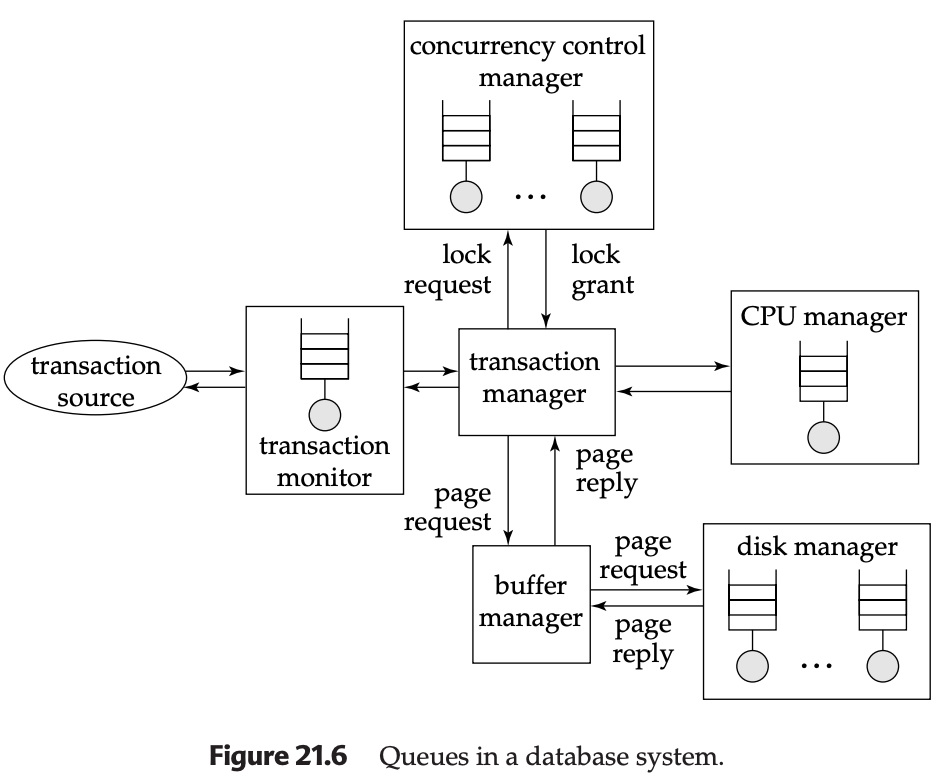

# 21.2 Performance Tuning

Tuning the performance of a system involves adjusting various parameters and design choices to improve its performance for a specific application. Various aspects of a database-system design—ranging from high-level aspects such as the schema and transaction design, to database parameters such as buffer sizes, down to hardware issues such as number of disks—affect the performance of an application. Each of these aspects can be adjusted so that performance is improved.

## 21.2.1 Location of Bottlenecks

The performance of most systems (at least before they are tuned) is usually limited primarily by the performance of one or a few components, called **bottlenecks**. 

### Understanding Bottlenecks

For instance, a program may spend 80 percent of its time in a small loop deep in the code, and the remaining 20 percent of the time on the rest of the code; the small loop then is a bottleneck. Improving the performance of a component that is not a bottleneck does little to improve the overall speed of the system; in the example, improving the speed of the rest of the code cannot lead to more than a 20 percent improvement overall, whereas improving the speed of the bottleneck loop could result in an improvement of nearly 80 percent overall, in the best case.

### Bottleneck Elimination Process

When tuning a system, we must first try to discover what are the bottlenecks, and then to eliminate the bottlenecks by improving the performance of the components causing them. When one bottleneck is removed, it may turn out that another component becomes the bottleneck. In a well-balanced system, no single component is the bottleneck. If the system contains bottlenecks, components that are not part of the bottleneck are underutilized, and could perhaps have been replaced by cheaper components with lower performance.

### Database Systems as Queueing Systems

For simple programs, the time spent in each region of the code determines the overall execution time. However, database systems are much more complex, and can be modeled as **queueing systems**. A transaction requests various services from the database system, starting from entry into a server process, disk reads during execution, CPU cycles, and locks for concurrency control. Each of these services has a queue associated with it, and small transactions may spend most of their time waiting in queues—especially in disk I/O queues—instead of executing code.

**Figure 21.6: Queues in a database system**



The diagram illustrates various components and their interactions within a database system, highlighting where queues can form:

- **Transaction Source**: Origin of transactions
- **Transaction Monitor**: Receives transactions and manages queue
- **Transaction Manager**: Central orchestration component
- **Concurrency Control Manager**: Handles lock requests and grants
- **CPU Manager**: Manages CPU processing queue
- **Buffer Manager**: Handles page requests and replies
- **Disk Manager**: Manages disk I/O operations

### Queue Theory and Utilization

As a result of the numerous queues in the database, bottlenecks in a database system typically show up in the form of long queues for a particular service, or, equivalently, in high utilizations for a particular service.

**Request Arrival Patterns**:
- If requests are spaced exactly uniformly, and the time to service a request is less than or equal to the time before the next request arrives, then each request will find the resource idle and can therefore start execution immediately without waiting
- Unfortunately, the arrival of requests in a database system is never so uniform, and is instead random

**Utilization Impact on Queue Length**:
- If a resource, such as a disk, has a low utilization, then, when a request is made, the resource is likely to be idle, in which case the waiting time for the request will be 0
- Assuming uniformly randomly distributed arrivals, the length of the queue (and correspondingly the waiting time) go up exponentially with utilization
- As utilization approaches 100 percent, the queue length increases sharply, resulting in excessively long waiting times

### Utilization Guidelines

The utilization of a resource should be kept low enough that queue length is short. As a rule of the thumb:
- **70% utilization**: Considered good
- **90%+ utilization**: Considered excessive, will result in significant delays

**Queue Length Formula** (simplified):
For M/M/1 queueing systems:
- Average queue length = ρ²/(1-ρ)
- Average waiting time = ρ/(μ(1-ρ))
- Where ρ = utilization, μ = service rate

## 21.2.2 Tunable Parameters

Database administrators can tune a database system at three levels:

### Level 1: Hardware Level

**Options for tuning at hardware level**:
- **Add disks or use RAID system** if disk I/O is a bottleneck
- **Add more memory** if the disk buffer size is a bottleneck
- **Move to faster processor** if CPU use is a bottleneck

**Hardware Considerations**:
- Disk I/O bandwidth limitations
- Memory capacity and speed
- CPU processing power
- Network bandwidth for distributed systems

### Level 2: Database System Parameters

**Common tunable parameters**:
- **Buffer size**: Size of database buffer pool
- **Checkpointing intervals**: Frequency of checkpoint operations
- **Log buffer size**: Size of transaction log buffer
- **Lock timeout values**: Maximum wait time for locks
- **Sort memory size**: Memory allocated for sorting operations
- **Connection pool size**: Number of database connections

**Automatic Tuning Features**:
- Well-designed database systems perform as much tuning as possible automatically
- Example: Automatic buffer size adjustment by observing page-fault rates
- Adaptive query optimization
- Self-tuning memory management

### Level 3: Schema and Transactions

**High-level tuning options**:
- **Schema design**: Table structure and relationships
- **Index creation**: Strategic index placement
- **Transaction design**: Optimizing transaction logic
- **Query optimization**: Rewriting queries for better performance

**System Independence**:
- Tuning at this level is comparatively system independent
- Focuses on logical design rather than physical implementation
- Can be applied across different database platforms

### Interaction Between Levels

The three levels of tuning interact with one another; we must consider them together when tuning a system. For example:
- Tuning at a higher level may result in the hardware bottleneck changing from disk system to CPU
- Schema changes may affect I/O patterns
- Index additions may impact CPU usage

## 21.2.3 Tuning of Hardware

Even in a well-designed transaction processing system, each transaction usually has to do at least a few I/O operations, if the data required by the transaction is on disk.

### Disk I/O Bottlenecks

**Current Disk Performance Characteristics**:
- **Access time**: ~10 milliseconds
- **Transfer rate**: ~20 MB per second
- **Random I/O capacity**: ~100 operations per second (1 KB each)

**Transaction Throughput Calculation**:
If each transaction requires 2 I/O operations:
- Single disk supports at most 50 transactions per second
- To support n transactions per second: need n/50 disks
- Data must be striped across multiple disks

**Key Insight**: The limiting factor is not disk capacity but random access speed (limited by disk arm movement).

### Memory vs. Disk Trade-offs

**Benefits of More Memory**:
- Reduces number of disk I/O operations
- Keeps frequently used data in memory
- Improves response time

**Cost-Benefit Analysis**:
- Reduction of 1 I/O per second saves: (price per disk drive) / (accesses per second per disk)
- If a page is accessed n times per second, saving = n × above value
- Storing a page in memory costs: (price per MB of memory) / (pages per MB of memory)

**Break-even Point Formula**:
```
n × (price per disk drive) / (accesses per second per disk) = (price per MB of memory) / (pages per MB of memory)
```

### The 5-Minute Rule

Current disk technology and memory/disk prices give a value of n around 1/300 times per second (once in 5 minutes) for randomly accessed pages.

**5-Minute Rule**: 
> If a page is used more frequently than once in 5 minutes, it should be cached in memory.

**Implications**:
- Buy enough memory to cache all pages accessed at least once in 5 minutes on average
- For less frequently accessed data, buy enough disks to support required I/O rate
- The rule has remained stable despite dramatic price changes over decades

### Sequential Access Optimization

For sequentially accessed data:
- More pages can be read per second (assuming 1 MB read at a time)
- **1-Minute Rule**: Sequentially accessed data should be cached if used at least once in 1 minute

### Response Time Considerations

The rules of thumb take only I/O operations into account and don't consider factors such as response time. Some applications need to keep even infrequently used data in memory to support response times less than or comparable to disk access time.

### RAID Configuration Tuning

**RAID 1 vs. RAID 5 Performance**:

**RAID 5 Performance Impact**:
- Requires 2 reads + 2 writes for single random write
- Total I/O operations: r + 4w per second
- Where r = random reads, w = random writes

**RAID 1 Performance**:
- Requires r + w I/O operations per second
- Better for write-intensive applications

**RAID Selection Guidelines**:
- **RAID 5**: Useful only for very large, "cold" data with low I/O rates
- **RAID 1**: Better for applications with moderate-high I/O rates
- Calculate required disks: (r + w)/100 for RAID 1, (r + 4w)/100 for RAID 5

## 21.2.4 Tuning of the Schema

Within the constraints of the chosen normal form, it is possible to partition relations vertically.

### Vertical Partitioning

**Example**: Account relation schema:
```
account(account-number, branch-name, balance)
```
Where account-number is a key.

**Partitioned Schema**:
```
account-branch(account-number, branch-name)
account-balance(account-number, balance)
```

**Performance Characteristics**:
- Logically equivalent since account-number is a key
- Different performance characteristics based on access patterns

**When to Use Partitioning**:
- Most accesses look at only account-number and balance → use account-balance
- Faster access due to smaller tuple size
- More tuples fit in buffer
- Particularly beneficial if branch-name attribute is large

**When to Avoid Partitioning**:
- Most accesses require both balance and branch-name
- Avoid join cost between account-balance and account-branch
- Lower storage overhead (no replication of account-number)

### Denormalization

**Denormalized Relation Example**:
- Precomputed join of account and depositor
- Branch-names and balances repeated for every account holder
- Faster queries at the cost of update complexity

**Trade-offs**:
- **Benefits**: Query speed improvement for frequent joins
- **Costs**: Update consistency maintenance overhead
- **Best for**: Read-heavy workloads with predictable query patterns

### Materialized Views Alternative

**Advantages over Denormalization**:
- Redundant data consistency maintained by database system
- No programmer intervention required
- Automatic view maintenance
- Better reliability and maintainability

### Clustered File Organizations

**Clustering Strategy**:
- Store records that match in joins on the same disk page
- Reduces I/O for join operations
- Eliminates need for materialization
- Requires careful physical design planning

## 21.2.5 Tuning of Indices

Index tuning is crucial for optimizing database performance.

### Query Performance Optimization

**Creating Appropriate Indices**:
- Identify frequently queried columns
- Create indices on WHERE clause columns
- Consider composite indices for multi-column queries
- Use covering indices to avoid table access

**Index Selection Guidelines**:
- Analyze query workload patterns
- Prioritize high-frequency queries
- Consider selectivity of columns
- Balance read vs. write operations

### Update Performance Considerations

**Too Many Indices Impact**:
- Each index must be updated on INSERT/UPDATE/DELETE
- Increased transaction time
- Potential for index contention
- Additional storage requirements

**Index Removal Strategy**:
- Monitor index usage statistics
- Remove unused or rarely used indices
- Consider index consolidation
- Evaluate impact on query performance

### Index Type Selection

**B-Tree Indices**:
- Best for range queries
- Support equality and range searches
- Good for ordered access
- Default choice for most scenarios

**Hash Indices**:
- Excellent for equality queries
- Not suitable for range queries
- Faster than B-tree for exact matches
- Memory-based implementation

**Specialized Index Types**:
- **Full-text indices**: For text search
- **Spatial indices**: For geographic data
- **Bitmap indices**: For low-cardinality data
- **XML indices**: For XML data

### Clustered Index Selection

**Clustered Index Benefits**:
- Physically stores data sorted on index columns
- Reduces I/O for range queries
- Improves cache locality
- Only one per table

**Selection Criteria**:
- Choose index benefiting most queries/updates
- Consider range query patterns
- Evaluate join column usage
- Analyze access frequency

### Tuning Wizards and Tools

**Automated Index Selection**:
- Analyze historical query workload
- Estimate performance impact of different indices
- Provide recommendations based on cost estimates
- Support "what-if" analysis scenarios

**Workload Analysis**:
- Query frequency and cost analysis
- Update operation impact assessment
- Storage requirement calculations
- Performance improvement predictions

## 21.2.6 Using Materialized Views

Materialized views can greatly speed up certain types of queries, particularly aggregate queries.

### Benefits of Materialized Views

**Query Performance Improvement**:
- Precomputed results for complex queries
- Eliminate expensive join operations
- Speed up aggregate calculations
- Reduce query response time

**Example Use Case**:
- Total loan amount at each branch
- Frequent SUM operations on loan amounts
- Precomputed aggregation by branch
- Significant performance gains for reporting queries

### Maintenance Overhead

**Space Overhead**:
- Additional storage for view data
- Index storage for view indices
- Backup and recovery space requirements

**Time Overhead**:
- View maintenance during updates
- Transaction processing time increase
- Potential for update bottlenecks

### View Maintenance Strategies

**Immediate View Maintenance**:
- Views updated as part of same transaction
- Strong consistency guarantees
- Slower update transactions
- Better data consistency

**Deferred View Maintenance**:
- Views updated later (periodically or on query)
- Reduced burden on update transactions
- Potential for temporary inconsistency
- Better update performance

### Materialized View Selection

**Manual Selection Process**:
1. Examine query workload patterns
2. Identify frequently executed expensive queries
3. Determine which queries need speed improvement
4. Choose appropriate views to materialize
5. Consider update/acceptance trade-offs

**Selection Criteria**:
- Query frequency and cost
- Update frequency and cost
- Storage availability
- Consistency requirements

### Automated Selection Tools

**Database System Support**:
- Microsoft SQL Server: Index and view selection tools
- RedBrick Data Warehouse: Automated tuning
- Oracle: Materialized view advisor
- IBM DB2: Design advisor

**Automated Selection Process**:
- Analyze workload history
- Estimate costs and benefits
- Use greedy heuristics for selection
- Consider space constraints
- Optimize for maximum benefit

**Greedy Heuristic Algorithm**:
1. Estimate benefits of materializing different views
2. Select view with maximum benefit per unit space
3. Recompute benefits of remaining views
4. Repeat until space exhausted or maintenance cost too high
5. Consider maintenance overhead in selection

### "What-If" Analysis

**Interactive View Selection**:
- User can pick specific views
- Optimizer estimates performance impact
- Shows total workload cost changes
- Individual query/update cost analysis
- Supports informed decision making

## 21.2.7 Tuning of Transactions

Transaction performance can be improved through two main approaches:
- Improve set orientation
- Reduce lock contention

### Query Optimization Techniques

**Modern Optimizer Capabilities**:
- Advanced query transformation
- Automatic optimization of poorly written queries
- Less need for manual query tuning
- Better handling of complex queries

**Areas Still Requiring Attention**:
- Complex nested subqueries
- Specific optimizer limitations
- Platform-specific optimizations
- Execution plan analysis

### Set Orientation Improvements

**Embedded SQL Optimization**:
- Combine multiple similar calls into single query
- Reduce communication overhead in client-server systems
- Use set-oriented operations instead of row-by-row processing

**Example Scenario**:
```sql
-- Inefficient: Multiple queries for each department
SELECT SUM(amount) FROM expenses WHERE department = 'HR';
SELECT SUM(amount) FROM expenses WHERE department = 'IT';
SELECT SUM(amount) FROM expenses WHERE department = 'Finance';

-- Efficient: Single query with GROUP BY
SELECT department, SUM(amount) 
FROM expenses 
GROUP BY department;
```

**Benefits of Set Orientation**:
- Single scan of relation instead of multiple scans
- Reduced communication costs
- Better optimizer utilization
- Improved performance in client-server environments

### Stored Procedures

**Communication Cost Reduction**:
- Queries stored and precompiled at server
- Reduced network traffic
- Better performance for frequent operations
- Encapsulation of business logic

**Benefits**:
- Lower SQL compilation overhead
- Reduced client-server communication
- Better security through encapsulation
- Reusable execution plans

### Lock Contention Reduction

**Mixed Workload Issues**:
- Small update transactions during business hours
- Large analytical queries running concurrently
- Potential for blocking and performance degradation

**Multiversion Concurrency Control**:
- Queries execute on data snapshots
- Updates can proceed concurrently
- Minimal impact on query performance
- Available in systems like Oracle

**Alternative Strategies**:
- Schedule large queries during low-activity periods
- Use weaker consistency levels when acceptable
- Implement read replicas for analytical queries
- Consider eventual consistency models

### Long Transaction Management

**Problems with Long Transactions**:
- System log can become full before completion
- Block deletion of old log parts
- Increased recovery time after crashes
- Potential for transaction rollback

**Minibatch Transactions**:
- Break large updates into smaller transactions
- Process ranges of data in chunks
- Example: Update salaries by employee-id ranges

**Minibatch Considerations**:
- **Consistency Issues**: Concurrent updates may affect results
- **Failure Recovery**: Some employees updated, others not
- **Completion Strategy**: Execute remaining transactions after recovery
- **Transaction Boundaries**: Careful design required

### Transaction Size Guidelines

**Update Limits**:
- Many systems impose strict limits on updates per transaction
- Even without limits, smaller transactions are preferable
- Consider impact on logging and recovery
- Balance between efficiency and recoverability

## 21.2.8 Performance Simulation

To test the performance of a database system even before it is installed, we can create a performance-simulation model of the database system.

### Simulation Model Components

**Service Modeling**:
Each service shown in Figure 21.6 is modeled in the simulation:
- CPU processing
- Disk I/O operations
- Buffer management
- Concurrency control
- Network communication

**Model Abstraction**:
- Capture key aspects like service time
- Model average processing times
- Include queue behavior for each service
- Parallel operation of subsystems

### Simulation Parameters

**Service Time Modeling**:
- Disk access time from average disk access time
- CPU processing time from instruction count
- Network latency from bandwidth and distance
- Lock wait time from contention estimates

**Queue Modeling**:
- Each service has associated queue
- Requests queued as they arrive
- Service policies (FIFO, priority, etc.)
- Parallel subsystem operation

### Experiment Types

**Load Testing Experiments**:
- Vary transaction arrival rates
- Test under different load conditions
- Identify performance thresholds
- Find breaking points

**Sensitivity Analysis**:
- Vary service times for each component
- Test performance sensitivity
- Identify critical components
- Optimize resource allocation

**Parameter Tuning**:
- Test different system configurations
- Optimize buffer sizes
- Tune connection pools
- Evaluate index strategies

### Simulation Benefits

**Pre-Installation Testing**:
- Identify performance issues before deployment
- Test different hardware configurations
- Optimize system parameters
- Reduce deployment risks

**Cost-Effective Optimization**:
- Avoid expensive hardware purchases
- Test configuration changes virtually
- Compare different approaches
- Make informed decisions

### Simulation Implementation

**Model Building Process**:
1. Identify system components
2. Determine service characteristics
3. Define queue behavior
4. Set up parallel operation
5. Validate model accuracy

**Experiment Design**:
- Define test scenarios
- Set performance metrics
- Plan data collection
- Analyze results

**Tool Options**:
- Custom simulation programs
- Commercial simulation tools
- Database-specific simulators
- General-purpose modeling tools

### Limitations and Considerations

**Model Accuracy**:
- Simplifications may miss important details
- Real-world behavior can be more complex
- Validation against real systems is important
- Regular model updates needed

**Resource Requirements**:
- Simulation can be computationally intensive
- Requires detailed system knowledge
- Needs significant setup time
- Expert interpretation of results required

---

**Key Takeaways for Performance Tuning**:

1. **Identify Bottlenecks First**: Use queue theory and monitoring to find real performance constraints
2. **Holistic Approach**: Consider hardware, parameters, and design together
3. **5-Minute Rule**: Cache frequently accessed data (more than once per 5 minutes)
4. **Balance I/O and CPU**: Ensure neither disk nor CPU becomes the limiting factor
5. **Test and Measure**: Use simulation and real-world testing to validate tuning decisions
6. **Monitor Continuously**: Performance tuning is an ongoing process, not a one-time activity