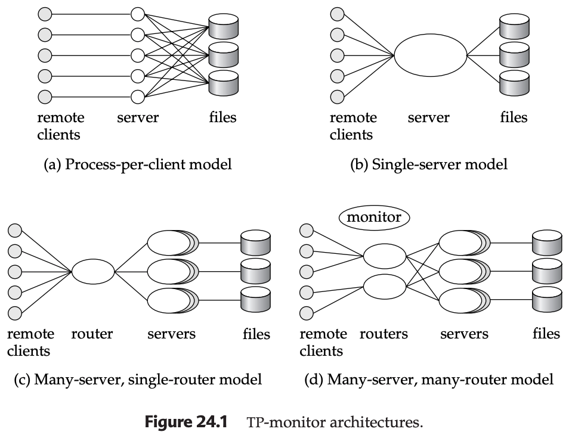
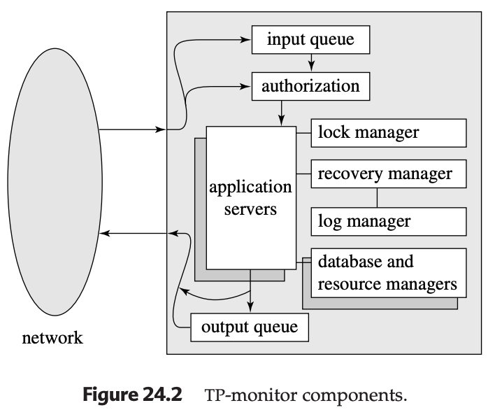

# Transaction-Processing Monitors

## Overview

Transaction-processing monitors (TP monitors) are systems developed in the 1970s and 1980s to support a large number of remote terminals from a single computer. The term "TP monitor" initially stood for "teleprocessing monitor" but has evolved to provide core support for distributed transaction processing.

### Context from Previous Chapters

In Chapters 15, 16, and 17, the concept of a transaction was introduced as a program unit that accesses—and possibly updates—various data items, and whose execution ensures the preservation of the ACID properties (Atomicity, Consistency, Isolation, Durability). Various schemes were discussed for ensuring ACID properties in environments where failure can occur and where transactions may run concurrently. This chapter goes beyond those basic schemes to cover advanced transaction-processing concepts.

### Historical Context

-   Originally developed in the 1970s and 1980s in response to a need to support a large number of remote terminals (such as airline-reservation terminals) from a single computer
-   The term "TP monitor" initially stood for "teleprocessing monitor"
-   TP monitors have since evolved to provide the core support for distributed transaction processing
-   IBM's CICS (Customer Information Control System) was one of the earliest TP monitors and has been very widely used
-   Current-generation TP monitors include:
    -   Tuxedo and Top End (both now from BEA Systems)
    -   Encina (from Transarc, which is now a part of IBM)
    -   Transaction Server (from Microsoft)

---

## TP-Monitor Architectures

Large-scale transaction processing systems are built around client-server architectures. Four main architectural models exist:

### 1. Process-per-Client Model (Figure 24.1a)

-   **Description**: One way to build large-scale transaction processing systems is to have a server process for each client; the server performs authentication, and then executes actions requested by the client
-   **Problems with Memory Utilization**:
    -   Per-process memory requirements are high
    -   Even if memory for program code is shared by all processes, each process consumes memory for:
        -   Local data
        -   Open file descriptors
        -   Operating-system overhead (such as page tables to support virtual memory)
-   **Problems with Processing Speed**:
    -   The operating system divides up available CPU time among processes by switching among them; this technique is called multitasking
    -   Each context switch between one process and the next has considerable CPU overhead
    -   Even on today's fast systems, a context switch can take hundreds of microseconds

### 2. Single-Server Model (Figure 24.1b)

-   **Description**: The problems of the process-per-client model can be avoided by having a single-server process to which all remote clients connect
-   **How It Works**:
    -   Remote clients send requests to the server process, which then executes those requests
    -   This model is also used in client-server environments, where clients send requests to a single-server process
    -   The server process handles tasks that would normally be handled by the operating system, such as user authentication
-   **Multithreading Implementation**:
    -   To avoid blocking other clients when processing a long request for one client, the server process is multithreaded
    -   The server process has a thread of control for each client
    -   It implements its own low-overhead multitasking
    -   It executes code on behalf of one client for a while, then saves the internal context and switches to the code for another client
    -   Unlike the overhead of full multitasking, the cost of switching between threads is low (typically only a few microseconds)
-   **Examples**: IBM CICS (original version), Novel's NetWare file servers
-   **Success Factors**: Systems based on the single-server model successfully provided high transaction rates with limited resources
-   **Limitations**:
    -   Since all the applications run as a single process, there is no protection among them
    -   A bug in one application can affect all the other applications as well
    -   It would be best to run each application as a separate process
    -   Such systems are not suited for parallel or distributed databases, since a server process cannot execute on multiple computers at once
    -   Concurrent threads within a process can be supported in a shared-memory multiprocessor system, but this is a serious drawback in large organizations where parallel processing is critical for handling large workloads and distributed data are becoming increasingly common

### 3. Many-Server, Single-Router Model (Figure 24.1c)

-   **Description**: One way to solve the problems of the single-server model is to run multiple application-server processes that access a common database, and to let the clients communicate with the application through a single communication process that routes requests
-   **How It Works**:
    -   Multiple application-server processes access a common database
    -   Clients communicate with the application through a single communication process (router) that routes requests
-   **Advantages**:
    -   Supports independent server processes for multiple applications
    -   Each application can have a pool of server processes, any one of which can handle a client session
    -   The request can be routed to the most lightly loaded server in a pool
    -   Each server process can itself be multithreaded, so that it can handle multiple clients concurrently
    -   The communication process can handle the coordination among the processes
    -   Application servers can run on different sites of a parallel or distributed database
-   **Usage in Web Servers**:
    -   This architecture is also widely used in Web servers
    -   A Web server has a main process that receives HTTP requests
    -   It then assigns the task of handling each request to a separate process (chosen from among a pool of processes)
    -   Each of the processes is itself multithreaded, so that it can handle multiple requests

### 4. Many-Server, Many-Router Model (Figure 24.1d)

-   **Description**: A more general architecture has multiple processes, rather than just one, to communicate with clients
-   **How It Works**:
    -   The client communication processes interact with one or more router processes
    -   The router processes route their requests to the appropriate server
-   **Features**:
    -   A controller process starts up the other processes, and supervises their functioning
    -   More general and scalable architecture than previous models
-   **Examples**: Tandem Pathway (a later-generation TP monitor that uses this architecture)
-   **Usage in High-Performance Systems**: Very high performance Web server systems also adopt such an architecture

---

## TP-Monitor Components

A TP monitor does more than simply pass messages to application servers. The detailed structure of a TP monitor includes (Figure 24.2): 

### Core Components

-   **Queue Manager**: Manages incoming messages; when messages arrive, they may have to be queued
-   **Authorization**: Handles client authentication and security
-   **Application Server Management**: Handles server startup and routing of messages to servers
-   **Network**: Handles communication between components
-   **Lock Manager**: Provides concurrency control facilities
-   **Recovery Manager**: Handles system recovery after failures
-   **Log Manager**: Manages transaction logs
-   **Application Servers**: Execute business logic and handle client requests
-   **Database and Resource Managers**: Provide access to data and other resources

### Key Features and Functions

#### Durable Queues

-   The queue may be a durable queue, whose entries survive system failures
-   Using a durable queue helps ensure that once received and stored in the queue, the messages will be processed eventually, regardless of system failures

#### ACID Transaction Support

-   TP monitors often provide logging, recovery, and concurrency-control facilities
-   These allow application servers to implement the ACID transaction properties directly if required

#### Persistent Messaging

-   TP monitors also provide support for persistent messaging
-   Persistent messaging provides a guarantee that the message will be delivered if (and only if) the transaction commits
-   This is related to the concept discussed in Section 19.4.3

#### Presentation Facilities (Historical)

-   Many TP monitors also provided presentation facilities to create menus/forms interfaces for dumb clients such as terminals
-   These facilities are no longer important since dumb clients are no longer widely used

---

## Application Coordination Using TP Monitors

### Resource Manager Concept

Applications today often have to interact with multiple systems. Modern TP monitors provide support for the construction and administration of such large applications, built up from multiple subsystems:

#### Types of Subsystems

-   **Multiple databases**: Applications may need to access data from different database systems
-   **Legacy systems**: Special-purpose data-storage systems built directly on file systems
-   **Communication subsystems**: Applications may need to communicate with users or other applications at remote sites
-   **Other resource types**: Any system that provides transactional access to resources

#### Resource Manager Abstraction

-   It is important to be able to coordinate data accesses, and to implement ACID properties for transactions across such systems
-   A TP monitor treats each subsystem as a **resource manager** that provides transactional access to some set of resources
-   The interface between the TP monitor and the resource manager is defined by a set of transaction primitives

### X/Open Distributed Transaction Processing Standard

-   The resource-manager interface is defined by the X/Open Distributed Transaction Processing standard
-   Many database systems support the X/Open standards and can act as resource managers
-   TP monitors—as well as other products, such as SQL systems, that support the X/Open standards—can connect to the resource managers

#### Transaction Primitives

The interface includes transaction primitives such as:

-   **Begin transaction**: Start a new transaction
-   **Commit transaction**: Make the changes of a transaction permanent
-   **Abort transaction**: Roll back the changes of a transaction
-   **Prepare to commit transaction**: Used for two-phase commit protocol

#### Additional Services

-   Of course, the resource manager must also provide other services, such as supplying data, to the application
-   In addition, services provided by a TP monitor, such as persistent messaging and durable queues, act as resource managers supporting transactions

### Two-Phase Commit Coordination

The TP monitor can act as coordinator of two-phase commit for transactions that access these services as well as database systems.

#### Example Scenario

When a queued update transaction is executed:

-   An output message is delivered
-   The request transaction is removed from the request queue
-   Database updates occur

#### Coordination Mechanism

-   Two-phase commit between the database and the resource managers for the durable queue and persistent messaging helps ensure that, regardless of failures, either all these actions occur, or none occurs
-   This provides atomicity across multiple resource managers

### System Administration Functions

TP monitors can be used to administer complex client–server systems consisting of multiple servers and a large number of clients.

#### Coordination Activities

-   **System checkpoints and shutdowns**: The TP monitor coordinates activities such as system checkpoints and shutdowns
-   **Security and authentication**: It provides security and authentication of clients
-   **Server pool administration**: It administers server pools by adding servers or removing servers without interruption of the system

#### Failure Control

The TP monitor controls the scope of failures:

-   **Server failure detection**: If a server fails, the TP monitor can detect this failure
-   **Transaction abortion**: It can abort the transactions in progress
-   **Transaction restart**: It can restart the transactions
-   **Node failure handling**: If a node fails, the TP monitor can migrate transactions to servers at other nodes, again backing out incomplete transactions
-   **Node recovery**: When failed nodes restart, the TP monitor can govern the recovery of the node's resource managers

### Replicated Systems Support

TP monitors can be used to hide database failures in replicated systems; remote backup systems (Section 17.10) are an example of replicated systems.

#### How It Works

-   Transaction requests are sent to the TP monitor
-   The TP monitor relays the messages to one of the database replicas (the primary site, in case of remote backup systems)
-   If one site fails, the TP monitor can transparently route messages to a backup site
-   This masks the failure of the first site from the clients

### Transactional RPC Interface

In client–server systems, clients often interact with servers via a remote-procedure-call (RPC) mechanism.

#### RPC Mechanism

-   A client invokes a procedure call, which is actually executed at the server
-   The results are sent back to the client
-   As far as the client code that invokes the RPC is concerned, the call looks like a local procedure-call invocation

#### Transactional RPC

-   TP monitor systems, such as Encina, provide a transactional RPC interface to their services
-   In such an interface, the RPC mechanism provides calls that can be used to enclose a series of RPC calls within a transaction
-   Thus, updates performed by an RPC are carried out within the scope of the transaction
-   These updates can be rolled back if there is any failure