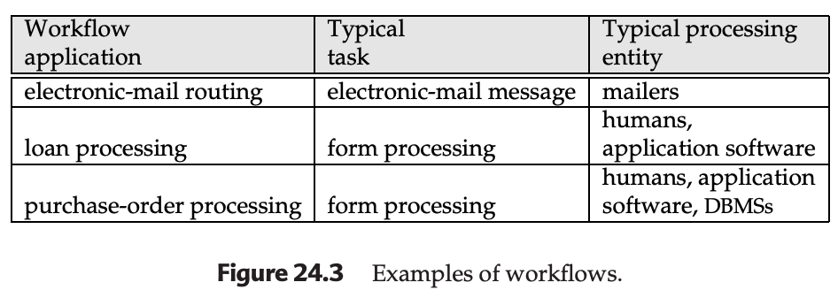
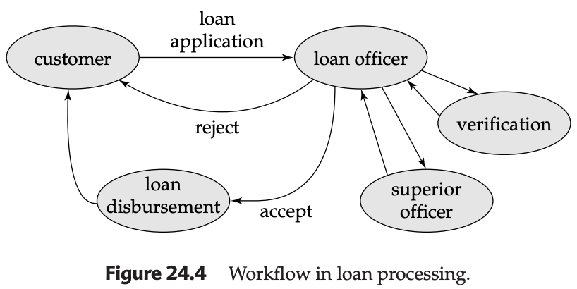

# Transactional Workflows

## Overview

A workflow is an activity in which multiple tasks are executed in a coordinated way by different processing entities. A task defines some work to be done and can be specified in a number of ways, including a textual description in a file or electronic-mail message, a form, a message, or a computer program.

### Task Definition and Processing Entities
- **Task**: Defines some work to be done
- **Specification Methods**:
  - Textual description in a file or electronic-mail message
  - A form
  - A message
  - A computer program
- **Processing Entity**: The entity that performs the tasks may be:
  - A person (human)
  - A software system (e.g., a mailer, an application program, or a database-management system)

### Alternative Terminology
Other terms used in the database and related literature to refer to workflows include:
- Task flow
- Multisystem applications

Workflow tasks are also sometimes called **steps**.

---

## Examples of Workflows

### Electronic-Mail System (Figure 24.3)

- **Workflow**: Electronic-mail routing
- **Typical Application**: Electronic-mail
- **Typical Processing Entity**: Electronic-mail message mailers
- **How It Works**: The delivery of a single mail message may involve several mailer systems that receive and forward the mail message, until the message reaches its destination, where it is stored
- **Tasks**: Each mailer performs a task—forwarding the mail to the next mailer—and the tasks of multiple mailers may be required to route mail from source to destination
- **Coordination**: The coordination of multiple mailer tasks ensures the message reaches its destination through the network

### Loan Processing (Figure 24.4)

- **Workflow**: Loan processing
- **Typical Application**: Loan processing
- **Typical Processing Entity**: Humans, application software
- **Processing Entities**: Humans (customer, loan officer, verification employee, superior officers)
- **Tasks**:
  1. Customer fills out a loan application form
  2. Loan officer checks the form
  3. Employee verifies the data in the form using sources such as credit-reference bureaus
  4. When all required information is collected, loan officer decides to approve or reject the loan
  5. If approved, the decision may need approval by one or more superior officers
  6. If approved, the loan is disbursed
- **Coordination**: In a bank that has not automated loan processing, coordination is typically carried out by passing the loan application, with attached notes and other information, from one employee to the next
- **Workflow Diagram**: The workflow shows the flow from customer through loan officer, verification, superior officer, to either loan disbursement or rejection

### Other Examples (Figure 24.3)
- **Expense Voucher Processing**:
  - Typical Application: Form processing
  - Typical Processing Entity: Form processing
- **Purchase-Order Processing**:
  - Typical Application: Purchase-order processing
  - Typical Processing Entity: Humans, application software, DBMSs
- **Credit-Card Transaction Processing**:
  - Typical Application: Credit-card transaction processing
  - Typical Processing Entity: Various processing entities depending on the system

---

## Workflow Automation

### Motivation for Automation
- Today, all information related to a workflow is more than likely to be stored in digital form on one or more computers
- With the growth of networking, information can be easily transferred from one computer to another
- Hence, it is feasible for organizations to automate their workflows

### Example: Automated Loan Processing
To automate the tasks involved in loan processing:
- Store the loan application and associated information in a database
- The workflow itself then involves handing of responsibility from one human to the next
- May involve programs that can automatically fetch the required information
- Humans can coordinate their activities by means such as electronic mail

### Two Key Activities for Workflow Automation
We have to address two activities, in general, to automate a workflow:

1. **Workflow Specification**: Detailing the tasks that must be carried out and defining the execution requirements
2. **Workflow Execution**: Must be done while providing the safeguards of traditional database systems related to computation correctness and data integrity and durability

### Example of Safeguard Requirements
- It is not acceptable for a loan application or a voucher to be lost, or to be processed more than once, because of a system crash
- These safeguards ensure reliability and correctness of workflow execution

### Transactional Workflows Concept
The idea behind transactional workflows is to use and extend the concepts of transactions to the context of workflows. This approach brings transactional properties (atomicity, consistency, isolation, durability) to workflow management.

### Complicating Factors
Both activities are complicated by the fact that many organizations use several independently managed information-processing systems that, in most cases, were developed separately to automate different functions. Workflow activities may require:
- Interactions among several such systems, each performing a task
- Interactions with humans

### Workflow Systems
A number of workflow systems have been developed in recent years. Here, we study properties of workflow systems at a relatively abstract level, without going into the details of any particular system. This abstract approach allows us to understand the fundamental concepts that apply across different workflow management implementations.

---

## Workflow Specification

### Abstract View of a Task
Internal aspects of a task do not need to be modeled for the purpose of specification and management of a workflow. In an abstract view of a task, a task may:
- Use parameters stored in its input variables
- Retrieve and update data in the local system
- Store its results in its output variables
- Be queried about its execution state

This abstract view allows the workflow management system to manage tasks without needing to understand their internal implementation details.

### Workflow State
At any time during the execution, the workflow state consists of:
- The collection of states of the workflow's constituent tasks
- The states (values) of all variables in the workflow specification

The workflow state is dynamic and changes as tasks progress through their execution lifecycle.

### Task Coordination Approaches
The coordination of tasks can be specified either statically or dynamically.

#### Static Specification
- **Definition**: Defines the tasks—and dependencies among them—before the execution of the workflow begins
- **Example**: The tasks in an expense-voucher workflow may consist of:
  - Approvals of the voucher by a secretary
  - Approval by a manager
  - Approval by an accountant (in that order)
  - Finally, delivery of a check
- **Dependencies**: May be simple—each task has to be completed before the next begins
- **Advantage**: Simple to understand and implement
- **Limitation**: Less flexible when workflow needs to adapt to changing conditions

#### Generalized Static Specification with Preconditions
- **Definition**: All possible tasks in a workflow and their dependencies are known in advance, but only those tasks whose preconditions are satisfied are executed
- **Advantage**: More flexible than simple static specification while still being predictable
- **Precondition Dependencies**:
  - **Execution states of other tasks**: For example:
    - "Task ti cannot start until task tj has ended"
    - "Task ti must abort if task tj has committed"
  - **Output values of other tasks**: For example:
    - "Task ti can start if task tj returns a value greater than 25"
    - "The manager-approval task can start if the secretary-approval task returns a value of OK"
  - **External variables modified by external events**: For example:
    - "Task ti cannot be started before 9 AM"
    - "Task ti must be started within 24 hours of the completion of task tj"
- **Complex Preconditions**: Dependencies can be combined by regular logical connectors (or, and, not) to form complex scheduling preconditions
- **Flexibility**: Allows workflows to respond to various conditions while maintaining a predefined structure

#### Dynamic Scheduling
- **Example**: An electronic-mail routing system
- **How It Works**: The next task to be scheduled for a given mail message depends on:
  - What the destination address of the message is
  - Which intermediate routers are functioning
- **Advantage**: Highly flexible and can adapt to runtime conditions
- **Challenge**: More complex to implement and verify
- **Use Case**: Particularly useful in environments where the workflow path cannot be predetermined

---

## Failure-Atomicity Requirements of a Workflow

### Traditional Notion vs. Workflow Requirements
- **Traditional Notation**: The traditional notion of failure atomicity would require that a failure of any task results in the failure of the workflow
- **Workflow Reality**: A workflow can, in many cases, survive the failure of one of its tasks—for example, by executing a functionally equivalent task at another site
- **Designer Specification**: The workflow designer may specify the failure-atomicity requirements of a workflow according to the semantics of the workflow
- **Flexibility**: This flexibility allows workflows to be more resilient and adaptable to real-world conditions where complete failure is not always necessary or desirable

### System Guarantee
The system must guarantee that every execution of a workflow will terminate in a state that satisfies the failure-atomicity requirements defined by the designer. This guarantee is essential for ensuring reliable and predictable workflow behavior.

### Termination States
- **Acceptable Termination States**: Those states that satisfy the failure-atomicity requirements defined by the designer
- **Nonacceptable Termination States**: All other execution states of a workflow, in which the failure-atomicity requirements may be violated
- **State Classification**: The system must ensure that workflows always end in acceptable termination states, never in nonacceptable states

### Types of Acceptable Termination States
An acceptable termination state can be designated as:
- **Committed**: An execution state in which the objectives of a workflow have been achieved
- **Aborted**: A valid termination state in which a workflow has failed to achieve its objectives

Both committed and aborted states are considered acceptable as long as they meet the workflow's failure-atomicity requirements.

### Aborted Acceptable Termination
- If an aborted acceptable termination state has been reached, all undesirable effects of the partial execution of the workflow must be undone in accordance with that workflow's failure-atomicity requirements
- This ensures that even when a workflow fails to achieve its objectives, it does not leave the system in an inconsistent or undesirable state
- The cleanup process may involve compensating transactions, rollback operations, or other corrective actions

### Failure Recovery Requirement
A workflow must reach an acceptable termination state even in the presence of system failures. If a workflow was in a nonacceptable termination state at the time of failure, during system recovery it must be brought to an acceptable termination state (whether aborted or committed). This requirement ensures that system failures do not leave workflows in undefined or inconsistent states.

### Example: Loan-Processing Workflow
- **Final State Options**: Either the loan applicant is told that a loan cannot be made or the loan is disbursed
- **Failure Scenario**: In case of failures such as a long failure of the verification system, the loan application could be returned to the loan applicant with a suitable explanation
- **Aborted Acceptable Termination**: The outcome of returning the application with explanation would constitute an aborted acceptable termination
- **Committed Acceptable Termination**: Either the acceptance or the rejection of the loan
- **Key Point**: Both outcomes (acceptance or rejection) are considered committed acceptable termination states because they represent definitive decisions that achieve the workflow's objectives

### Task Commitment and Compensation
- **Early Commitment**: In general, a task can commit and release its resources before the workflow reaches a termination state
- **Problem**: If the multitask transaction later aborts, its failure atomicity may require that we undo the effects of already completed tasks (for example, committed subtransactions)
- **Solution**: Execute compensating tasks (as subtransactions) to undo the effects of committed tasks
- **Compensation Semantics**: Requires that a compensating transaction eventually complete its execution successfully, possibly after a number of resubmissions
- **Resource Management**: Early commitment allows for better resource utilization but requires careful compensation mechanisms to maintain atomicity

### Example: Expense-Voucher-Processing Workflow
- A department-budget balance may be reduced on the basis of an initial approval of a voucher by the manager
- If the voucher is later rejected (whether because of failure or for other reasons), the budget may have to be restored by a compensating transaction
- **Compensation Process**: The compensating transaction would increase the department-budget balance back to its original value, effectively undoing the initial approval's effect
- **Importance**: This ensures that partial workflow executions do not lead to inconsistent financial states

---

## Execution of Workflows

### Control Mechanisms
The execution of the tasks may be controlled by:
- A human coordinator: A person who manually coordinates task execution and dependencies
- A software system called a workflow-management system: An automated system that manages workflow execution

The choice between these approaches depends on the complexity of the workflow, the required reliability, and the available technology.

### Workflow-Management System Components
A workflow-management system consists of:
- **Scheduler**: A program that processes workflows by submitting various tasks for execution, monitoring various events, and evaluating conditions related to intertask dependencies
- **Task Agents**: Controls the execution of a task by a processing entity; each task agent is responsible for managing the execution of tasks assigned to a specific processing entity
- **State Query Mechanism**: A mechanism to query the state of the workflow system; allows monitoring and debugging of workflow execution

These components work together to ensure that workflows are executed correctly and efficiently.

### Scheduler Functions
The scheduler performs several critical functions:
- Submit a task for execution (to a task agent): Initiates task execution by assigning it to an appropriate task agent
- Request that a previously submitted task be aborted: Allows for cancellation of tasks when necessary
- Enforce the scheduling dependencies in accordance with the workflow specifications: Ensures that tasks are executed in the correct order and under the right conditions
- Ensure that tasks reach acceptable termination states: Monitors task execution and takes corrective action if tasks fail or encounter errors

### Multidatabase Transactions Context
In the case of multidatabase transactions:
- The tasks are subtransactions: Each task represents a subtransaction that executes on a local database
- The processing entities are local database management systems: Each local DBMS handles the execution of its assigned subtransactions

This context is important for understanding how workflow management integrates with distributed database systems.

### Architectural Approaches
There are three architectural approaches to the development of a workflow-management system:

#### 1. Centralized Architecture
- **Description**: Has a single scheduler that schedules the tasks for all concurrently executing workflows
- **Usage**: Used in workflow systems where the data are stored in a central database
- **How It Works**:
  - The scheduler notifies various agents (such as humans or computer programs) that a task has to be carried out
  - Keeps track of task completion
- **Advantage**: It is easier to keep track of the state of a workflow with a centralized approach than it is with a fully distributed approach
- **Disadvantage**: May become a single point of failure and a performance bottleneck for large-scale systems
- **Scalability**: Limited by the capacity of the single scheduler

#### 2. Partially Distributed Architecture
- **Description**: Has one scheduler instantiated for each workflow
- **When Appropriate**: When the issues of concurrent execution can be separated from the scheduling function, this option is a natural choice
- **Advantage**: Better scalability than centralized architecture while maintaining some centralized control
- **Trade-off**: Balances between centralized control and distributed execution
- **Use Case**: Suitable for systems where workflows are largely independent of each other

#### 3. Fully Distributed Architecture
- **Description**: Has no scheduler, but the task agents coordinate their execution by communicating with one another to satisfy task dependencies and other workflow execution requirements
- **Implementation**: The simplest workflow-execution systems follow this approach and are based on messaging
- **Messaging Implementation**:
  - May be implemented by persistent messaging mechanisms to provide guaranteed delivery
  - Some implementations use e-mail for messaging; such implementations provide many of the features of persistent messaging, but generally do not guarantee atomicity of message delivery and transaction commit
- **How It Works**:
  - Each site has a task agent that executes tasks received through messages
  - Execution may involve presenting messages to humans, who have then to carry out some action
  - When a task is completed at a site, and needs to be processed at another site, the task agent dispatches a message to the next site
  - The message contains all relevant information about the task to be performed
- **Use Case**: Particularly useful in networks that may be disconnected for part of the time, such as dial-up networks
- **Advantage**: Highly scalable and resilient to network failures
- **Challenge**: More complex to implement and verify correctness

### Scheduler Safety Requirements
The scheduler must guarantee that a workflow will terminate in one of the specified acceptable termination states. This is a critical requirement for ensuring reliable workflow execution.

#### Pre-Execution Safety Check
- **Ideal Behavior**: Before attempting to execute a workflow, the scheduler should examine that workflow to check whether the workflow may terminate in a nonacceptable state
- **Unsafe Specification Rejection**: If the scheduler cannot guarantee that a workflow will terminate in an acceptable state, it should reject such specifications without attempting to execute the workflow
- **Importance**: Prevents workflows from entering states from which they cannot recover to an acceptable termination state

#### Safety Check Example
Consider a workflow consisting of two tasks represented by subtransactions S1 and S2, with the failure-atomicity requirements indicating that either both or neither of the subtransactions should be committed:
- **Problem**: If S1 and S2 do not provide prepared-to-commit states (for a two-phase commit), and further do not have compensating transactions, then it is possible to reach a state where one subtransaction is committed and the other aborted, and there is no way to bring both to the same state
- **Conclusion**: Such a workflow specification is unsafe, and should be rejected
- **Implication**: The scheduler must be able to analyze workflow specifications to identify such unsafe conditions

#### Practical Considerations
- Safety checks such as the one described may be impossible or impractical to implement in the scheduler
- In such cases, it becomes the responsibility of the person designing the workflow specification to ensure that the workflows are safe
- **Design Responsibility**: Workflow designers must understand the capabilities and limitations of the underlying systems to create safe workflow specifications
- **Documentation**: Proper documentation of system capabilities is essential for effective workflow design

---

## Recovery of a Workflow

### Objective
The objective of workflow recovery is to enforce the failure atomicity of the workflows. This ensures that workflows maintain their integrity even in the face of system failures.

### Recovery Requirements
The recovery procedures must make sure that, if a failure occurs in any of the workflow-processing components (including the scheduler), the workflow will eventually reach an acceptable termination state (whether aborted or committed). This requirement is fundamental to ensuring reliable workflow execution in distributed environments where failures are inevitable.

### Recovery Strategies

#### Forward Recoverability
- The scheduler could continue processing after failure and recovery, as though nothing happened
- **Advantage**: Allows the workflow to progress without starting over
- **Challenge**: Requires careful state management to ensure consistency
- **Use Case**: Suitable when the failure did not corrupt critical state information

#### Global Abort
- The scheduler could abort the whole workflow (that is, reach one of the global abort states)
- **Advantage**: Simpler to implement and ensures consistent state
- **Disadvantage**: May waste work already completed
- **Use Case**: Appropriate when recovery is complex or when the workflow cannot be safely continued

### Subtransaction Handling
In either case, some subtransactions may need to be:
- Committed: To finalize certain operations that must persist even if the workflow aborts
- Submitted for execution (for example, compensating subtransactions): To undo the effects of previously committed subtransactions

This handling ensures that the workflow can reach an acceptable termination state regardless of the recovery strategy chosen.

### Local Recovery Assumption
We assume that the processing entities involved in the workflow have their own local recovery systems and handle their local failures. This assumption simplifies the workflow recovery problem by allowing the workflow management system to focus on workflow-level recovery rather than individual component recovery.

### Execution-Environment Context Recovery
To recover the execution-environment context, the failure-recovery routines need to restore:
- The state information of the scheduler at the time of failure
- The information about the execution states of each task

Therefore, the appropriate status information must be logged on stable storage. This logging is essential for enabling recovery after failures and ensuring that the workflow can be brought to a consistent state.

### Message Queue Considerations
We also need to consider the contents of the message queues. When one agent hands off a task to another, the handoff should be carried out exactly once:
- **If the handoff happens twice**: A task may get executed twice, leading to duplicate work and potential inconsistencies
- **If the handoff does not occur**: The task may get lost, leading to incomplete workflow execution

This exactly-once semantics is critical for ensuring reliable workflow execution in distributed systems.

### Persistent Messaging Solution
Persistent messaging (Section 19.4.3) provides exactly the features to ensure positive, single handoff. By using persistent messaging, workflow systems can guarantee that tasks are handed off exactly once, even in the presence of failures, which is essential for maintaining workflow integrity.

---

## Workflow Management Systems

### Hand-Coded Workflows
Workflows are often hand coded as part of application systems. This approach requires significant programming effort and may lead to inconsistencies across different applications. Hand-coded workflows are typically tightly integrated with specific applications and may be difficult to modify or extend.

### Enterprise Resource Planning (ERP) Systems
- Enterprise resource planning (ERP) systems help coordinate activities across an entire enterprise
- They have numerous workflows built into them to manage various business processes
- **Examples of ERP Workflows**: Order processing, inventory management, financial reporting, human resources processes
- **Integration**: ERP systems provide integrated workflow management across different functional areas of an organization
- **Advantage**: Consistent workflow management across the enterprise
- **Limitation**: May be inflexible and difficult to customize for specific organizational needs

### Goal of Workflow Management Systems
The goal of workflow management systems is to:
- Simplify the construction of workflows: Provide high-level tools and languages for specifying workflows without requiring extensive programming
- Make them more reliable: Ensure that workflows execute correctly and handle failures gracefully
- Permit workflows to be specified in a high-level manner: Allow business analysts and domain experts to specify workflows without deep technical knowledge
- Execute workflows in accordance with the specification: Ensure that the actual execution matches the specified behavior

By achieving these goals, workflow management systems enable organizations to automate business processes more effectively and with greater reliability.

### Commercial Workflow Management Systems
There are a large number of commercial workflow management systems available in the market, each with different strengths and capabilities.

#### General-Purpose Systems
- **FlowMark from IBM**: A general-purpose workflow management system that can be used for a wide variety of workflow types
- **Characteristics**: Flexible, configurable, and suitable for diverse applications
- **Use Cases**: Document management, business process automation, enterprise application integration

#### Specialized Systems
- Systems specific to particular workflows, such as:
  - Order processing systems: Designed specifically for managing order fulfillment workflows
  - Bug/failure reporting systems: Specialized for tracking and resolving software defects
  - Healthcare workflow systems: Tailored for medical processes and patient care
  - Financial transaction systems: Optimized for banking and financial workflows
- **Advantage**: Optimized for specific domains with pre-built templates and best practices
- **Limitation**: Less flexible and may not be suitable for general-purpose workflow management

### Cross-Organizational Workflows
In today's world of interconnected organizations, it is not sufficient to manage workflows only within an organization. Workflows that cross organizational boundaries are becoming increasingly common due to globalization, outsourcing, and business partnerships.

#### Example: Cross-Organizational Order Processing
- An order placed by an organization and communicated to another organization that fulfills the order
- In each organization there may be a workflow associated with the order
- It is important that the workflows be able to interoperate, in order to minimize human intervention
- **Challenges**: Different organizations may use different workflow systems, data formats, and business rules
- **Benefits**: Improved efficiency, reduced errors, faster processing times, better customer service

#### Interoperability Requirements
- Standardized message formats for exchanging workflow information
- Common protocols for workflow coordination across organizational boundaries
- Mechanisms for handling different organizational policies and constraints
- Security and privacy considerations for cross-organizational data exchange

### Workflow Management Coalition Standards
The Workflow Management Coalition has developed standards for interoperation between workflow systems. These standards are essential for enabling different workflow management systems to work together seamlessly.

#### XML-Based Standards
- Current standardization efforts use XML as the underlying language for communicating information about the workflow
- **Advantages of XML**:
  - Platform-independent and widely supported
  - Human-readable and self-describing
  - Extensible and flexible
  - Well-suited for representing structured workflow information
- **Standard Components**:
  - Workflow process definition languages
  - Interoperability protocols for workflow engine communication
  - Data exchange formats for workflow-related information
- **Impact**: These standards enable organizations to choose workflow management systems from different vendors while still maintaining interoperability
- **Future Directions**: Continued evolution of standards to support emerging technologies and business requirements
- See the bibliographical notes for more information on specific standards and their implementations
