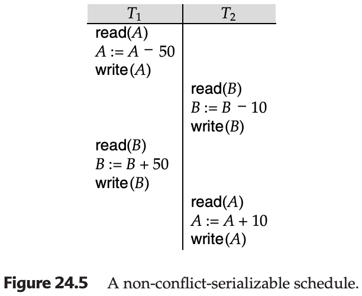

# Long-Duration Transactions

## Overview

The transaction concept developed initially in the context of data-processing applications, in which most transactions are noninteractive and of short duration. Although the techniques presented here and earlier in Chapters 15, 16, and 17 work well in those applications, serious problems arise when this concept is applied to database systems that involve human interaction.

### Traditional Transaction Context
- **Original Application**: Data-processing applications
- **Transaction Characteristics**: Noninteractive and of short duration
- **Suitability**: Techniques from Chapters 15, 16, and 17 work well in these applications

### Problem with Human Interaction
- **New Context**: Database systems that involve human interaction
- **Serious Problems**: Traditional transaction concepts create serious problems when applied to interactive systems
- **Need for Adaptation**: Transaction techniques must be modified to accommodate long-duration interactive transactions

---

## Key Properties of Long-Duration Transactions

Such transactions have these key properties:

### 1. Long Duration
- **Human Interaction**: Once a human interacts with an active transaction, that transaction becomes a long-duration transaction from the perspective of the computer
- **Relative Speed**: Human response time is slow relative to computer speed
- **Design Applications**: In design applications, the human activity may involve hours, days, or an even longer period
- **Dual Perspective**: Transactions may be of long duration in human terms, as well as in machine terms

### 2. Exposure of Uncommitted Data
- **Uncommitted Data**: Data generated and displayed to a user by a long-duration transaction are uncommitted, since the transaction may abort
- **User Impact**: Users may be forced to read uncommitted data
- **Transaction Impact**: Other transactions may also be forced to read uncommitted data
- **Cooperation**: If several users are cooperating on a project, user transactions may need to exchange data prior to transaction commit

### 3. Subtasks
- **Subtask Structure**: An interactive transaction may consist of a set of subtasks initiated by the user
- **Selective Abort**: The user may wish to abort a subtask without necessarily causing the entire transaction to abort
- **Granularity**: Provides finer-grained control over transaction execution
- **Flexibility**: Allows users to correct errors at the subtask level without losing all work

### 4. Recoverability
- **Unacceptable Abort**: It is unacceptable to abort a long-duration interactive transaction because of a system crash
- **Recovery Requirement**: The active transaction must be recovered to a state that existed shortly before the crash
- **Work Preservation**: Relatively little human work should be lost
- **User Experience**: System crashes should not cause significant loss of user effort

### 5. Performance
- **Interactive Definition**: Good performance in an interactive transaction system is defined as fast response time
- **Contrast with Noninteractive**: This definition is in contrast to that in a noninteractive system, in which high throughput (number of transactions per second) is the goal
- **Resource Efficiency**: Systems with high throughput make efficient use of system resources
- **User as Resource**: In the case of interactive transactions, the most costly resource is the user
- **User Optimization**: If the efficiency and satisfaction of the user is to be optimized, response time should be fast (from a human perspective)
- **Predictability**: In those cases where a task takes a long time, response time should be predictable (that is, the variance in response times should be low), so that users can manage their time well

### Incompatibility with Traditional Techniques
In Sections 24.5.1 through 24.5.5, we shall see why these five properties are incompatible with the techniques presented thus far, and shall discuss how those techniques can be modified to accommodate long-duration interactive transactions.

---

## Nonserializable Executions

The properties that we discussed make it impractical to enforce the requirement used in earlier chapters that only serializable schedules be permitted. Each of the concurrency-control protocols of Chapter 16 has adverse effects on long-duration transactions:

### Two-Phase Locking
- **Wait Mechanism**: When a lock cannot be granted, the transaction requesting the lock is forced to wait for the data item in question to be unlocked
- **Wait Duration**: The duration of this wait is proportional to the duration of the transaction holding the lock
- **Short-Duration Case**: If the data item is locked by a short-duration transaction, we expect that the waiting time will be short (except in case of deadlock or extraordinary system load)
- **Long-Duration Case**: If the data item is locked by a long-duration transaction, the wait will be of long duration
- **Consequences**: Long waiting times lead to both longer response time and an increased chance of deadlock

### Graph-Based Protocols
- **Early Lock Release**: Graph-based protocols allow for locks to be released earlier than under the two-phase locking protocols
- **Deadlock Prevention**: They prevent deadlock
- **Ordering Constraint**: However, they impose an ordering on the data items
- **Locking Requirement**: Transactions must lock data items in a manner consistent with this ordering
- **Over-Locking**: As a result, a transaction may have to lock more data than it needs
- **Lock Holding**: Furthermore, a transaction must hold a lock until there is no chance that the lock will be needed again
- **Consequence**: Thus, long-duration lock waits are likely to occur

### Timestamp-Based Protocols
- **No Waiting**: Timestamp protocols never require a transaction to wait
- **Transaction Abort**: However, they do require transactions to abort under certain circumstances
- **Long-Duration Impact**: If a long-duration transaction is aborted, a substantial amount of work is lost
- **Noninteractive Impact**: For noninteractive transactions, this lost work is a performance issue
- **Interactive Impact**: For interactive transactions, the issue is also one of user satisfaction
- **User Dissatisfaction**: It is highly undesirable for a user to find that several hours' worth of work have been undone

### Validation Protocols
- **Similar to Timestamp**: Like timestamp-based protocols, validation protocols enforce serializability by means of transaction abort
- **Conclusion**: Thus, it appears that the enforcement of serializability results in long-duration waits, in abort of long-duration transactions, or in both
- **Theoretical Support**: There are theoretical results, cited in the bibliographical notes, that substantiate this conclusion

### Recovery Issues
Further difficulties with the enforcement of serializability arise when we consider recovery issues.

#### Cascading Rollback
- **Problem**: We previously discussed the problem of cascading rollback, in which the abort of a transaction may lead to the abort of other transactions
- **Undesirability**: This phenomenon is undesirable, particularly for long-duration transactions

#### Lock Holding Trade-off
- **Avoiding Cascading Rollback**: If locking is used, exclusive locks must be held until the end of the transaction, if cascading rollback is to be avoided
- **Increased Wait Time**: This holding of exclusive locks, however, increases the length of transaction waiting time
- **Dilemma**: Thus, it appears that the enforcement of transaction atomicity must either lead to an increased probability of long-duration waits or create a possibility of cascading rollback

### Alternative Concepts
These considerations are the basis for the alternative concepts of correctness of concurrent executions and transaction recovery that we consider in the remainder of this section.

---

## Concurrency Control

### Fundamental Goal
The fundamental goal of database concurrency control is to ensure that concurrent execution of transactions does not result in a loss of database consistency.

### Serializability Approach
- **Concept**: The concept of serializability can be used to achieve this goal, since all serializable schedules preserve consistency of the database
- **Limitation**: However, not all schedules that preserve consistency of the database are serializable

### Example: Non-Serializable but Correct Schedule
For an example, consider again a bank database consisting of two accounts A and B, with the consistency requirement that the sum A + B be preserved. Although the schedule of Figure 24.5 is not conflict serializable, it nevertheless preserves the sum of A+B.

#### Schedule Details (Figure 24.5)

This schedule is not conflict serializable but preserves the consistency constraint A + B.

### Important Points About Correctness Without Serializability
The example illustrates two important points about the concept of correctness without serializability:
- **Correctness depends on the specific consistency constraints for the database**
- **Correctness depends on the properties of operations performed by each transaction**

### Automatic Analysis Limitation
In general it is not possible to perform an automatic analysis of low-level operations by transactions and check their effect on database consistency constraints.

### Simpler Techniques
However, there are simpler techniques:

#### Database Split
- **Approach**: Use the database consistency constraints as the basis for a split of the database into subdatabases on which concurrency can be managed separately
- **Benefit**: Reduces complexity by managing smaller, independent portions

#### Extended Operations
- **Approach**: Treat some operations besides read and write as fundamental low-level operations, and to extend concurrency control to deal with them
- **Benefit**: Allows more semantic information to be used in concurrency control

### Multiversion Concurrency Control
The bibliographical notes reference other techniques for ensuring consistency without requiring serializability. Many of these techniques exploit variants of multiversion concurrency control (see Section 17.6).

#### Space Overhead
- **Traditional Applications**: For older data-processing applications that need only one version, multiversion protocols impose a high space overhead to store the extra versions
- **New Applications**: Since many of the new database applications require the maintenance of versions of data, concurrency-control techniques that exploit multiple versions are practical

---

## Nested and Multilevel Transactions

### Transaction as Collection of Subtasks
A long-duration transaction can be viewed as a collection of related subtasks or subtransactions.

### Benefits of Structuring
By structuring a transaction as a set of subtransactions, we are able to:
- **Enhance Parallelism**: Since it may be possible to run several subtransactions in parallel
- **Deal with Failure**: It is possible to deal with failure of a subtransaction (due to abort, system crash, and so on) without having to roll back the entire long-duration transaction

### Definition of Nested/Multilevel Transaction
A nested or multilevel transaction T consists of:
- A set T = {t1, t2, ..., tn} of subtransactions
- A partial order P on T

### Subtransaction Abort Behavior
- **Independent Abort**: A subtransaction ti in T may abort without forcing T to abort
- **Recovery Options**: Instead, T may either restart ti or simply choose not to run ti
- **Commit Semantics**: If ti commits, this action does not make ti permanent (unlike the situation in Chapter 17)
- **Commit to Parent**: Instead, ti commits to T, and may still abort (or require compensation—see Section 24.5.4) if T aborts

### Partial Order Constraint
An execution of T must not violate the partial order P. That is, if an edge ti → tj appears in the precedence graph, then tj → ti must not be in the transitive closure of P.

### Nesting Depth
Nesting may be several levels deep, representing a subdivision of a transaction into subtasks, subsubtasks, and so on.

### Lowest Level
At the lowest level of nesting, we have the standard database operations read and write that we have used previously.

### Multilevel Transactions
If a subtransaction of T is permitted to release locks on completion, T is called a multilevel transaction.

#### Saga
When a multilevel transaction represents a long-duration activity, the transaction is sometimes referred to as a saga.

### Nested Transactions
Alternatively, if locks held by a subtransaction ti of T are automatically assigned to T on completion of ti, T is called a nested transaction.

### Practical Value
Although the main practical value of multilevel transactions arises in complex, long-duration transactions, we shall use the simple example of Figure 24.5 to show how nesting can create higher-level operations that may enhance concurrency.

### Example: Enhanced Concurrency Through Nesting
We rewrite transaction T1, using subtransactions T1,1 and T1,2, which perform increment or decrement operations:
- **T1 consists of**:
  - T1,1, which subtracts 50 from A
  - T1,2, which adds 50 to B

Similarly, we rewrite transaction T2, using subtransactions T2,1 and T2,2, which also perform increment or decrement operations:
- **T2 consists of**:
  - T2,1, which subtracts 10 from B
  - T2,2, which adds 10 to A

### Execution Flexibility
- **No Ordering**: No ordering is specified on T1,1, T1,2, T2,1, and T2,2
- **Correctness**: Any execution of these subtransactions will generate a correct result
- **Schedule Correspondence**: The schedule of Figure 24.5 corresponds to the schedule of these subtransactions

---

## Compensating Transactions

### Problem: Exposure of Uncommitted Updates
To reduce the frequency of long-duration waiting, we arrange for uncommitted updates to be exposed to other concurrently executing transactions. Indeed, multilevel transactions may allow this exposure.

### Cascading Rollback Potential
However, the exposure of uncommitted data creates the potential for cascading rollbacks.

### Compensating Transaction Concept
The concept of compensating transactions helps us to deal with this problem.

### Transaction Division
Let transaction T be divided into several subtransactions t1, t2, ..., tn.

### Lock Release
After a subtransaction ti commits, it releases its locks.

### Abort Scenario
Now, if the outer-level transaction T has to be aborted, the effect of its subtransactions must be undone.

### Undo Strategy
Suppose that subtransactions t1, ..., tk have committed, and that tk+1 was executing when the decision to abort is made:
- **Active Subtransaction**: We can undo the effects of tk+1 by aborting that subtransaction
- **Committed Subtransactions**: However, it is not possible to abort subtransactions t1, ..., tk, since they have committed already

### Compensating Transaction Execution
Instead, we execute a new subtransaction cti, called a compensating transaction, to undo the effect of a subtransaction ti.

### Requirement
Each subtransaction ti is required to have a compensating transaction cti.

### Execution Order
The compensating transactions must be executed in the inverse order ctk, . . . , ct1.

### Examples of Compensation

#### Example 1: Bank Account Schedule
- **Context**: Consider the schedule of Figure 24.5, which we have shown to be correct, although not conflict serializable
- **Lock Release**: Each subtransaction releases its locks once it completes
- **Failure Scenario**: Suppose that T2 fails just prior to termination, after T2,2 has released its locks
- **Compensation**: We then run a compensating transaction for T2,2 that subtracts 10 from A and a compensating transaction for T2,1 that adds 10 to B

#### Example 2: B+-Tree Insert
- **Context**: Consider a database insert by transaction Ti that, as a side effect, causes a B+-tree index to be updated
- **Modification**: The insert operation may have modified several nodes of the B+-tree index
- **Other Transactions**: Other transactions may have read these nodes in accessing data other than the record inserted by Ti
- **Compensation**: As in Section 17.9, we can undo the insertion by deleting the record inserted by Ti
- **Result**: The result is a correct, consistent B+-tree, but is not necessarily one with exactly the same structure as the one we had before Ti started
- **Conclusion**: Thus, deletion is a compensating action for insertion

#### Example 3: Travel Reservation
- **Context**: Consider a long-duration transaction Ti representing a travel reservation
- **Subtransactions**: Transaction T has three subtransactions:
  - Ti,1, which makes airline reservations
  - Ti,2, which reserves rental cars
  - Ti,3, which reserves a hotel room
- **Failure Scenario**: Suppose that the hotel cancels the reservation
- **Compensation**: Instead of undoing all of Ti, we compensate for the failure of Ti,3 by deleting the old hotel reservation and making a new one

### Crash Recovery
If the system crashes in the middle of executing an outer-level transaction, its subtransactions must be rolled back when it recovers. The techniques described in Section 17.9 can be used for this purpose.

### Semantic Requirements
Compensation for the failure of a transaction requires that the semantics of the failed transaction be used.

#### Simple Operations
- **Examples**: For certain operations, such as incrementation or insertion into a B+-tree, the corresponding compensation is easily defined

#### Complex Transactions
- **Application Programmer Responsibility**: For more complex transactions, the application programmers may have to define the correct form of compensation at the time that the transaction is coded
- **User Interaction**: For complex interactive transactions, it may be necessary for the system to interact with the user to determine the proper form of compensation

---

## Implementation Issues

### Implementation Difficulties
The transaction concepts discussed in this section create serious difficulties for implementation. We present a few of them here, and discuss how we can address these problems.

### System Crash Survival
Long-duration transactions must survive system crashes.

#### Recovery Actions
We can ensure that they will by:
- Performing a redo on committed subtransactions
- Performing either an undo or compensation for any short-duration subtransactions that were active at the time of the crash

#### Partial Solution
However, these actions solve only part of the problem.

### Internal System Data Recovery
In typical database systems, such internal system data as lock tables and transactions timestamps are kept in volatile storage.

#### Requirement for Long-Duration Transactions
For a long-duration transaction to be resumed after a crash, these data must be restored.

#### Logging Requirement
Therefore, it is necessary to log not only changes to the database, but also changes to internal system data pertaining to long-duration transactions.

### Logging Complexities
Logging of updates is made more complex when certain types of data items exist in the database.

#### Large Data Items
- **Examples**: A data item may be a CAD design, text of a document, or another form of composite design
- **Physical Size**: Such data items are physically large
- **Logging Problem**: Thus, storing both the old and new values of the data item in a log record is undesirable

### Approaches to Reduce Overhead
There are two approaches to reducing the overhead of ensuring the recoverability of large data items:

#### 1. Operation Logging
- **Definition**: Only the operation performed on the data item and the data-item name are stored in the log
- **Alternative Name**: Operation logging is also called logical logging
- **Inverse Operation Requirement**: For each operation, an inverse operation must exist
- **Recovery Process**: We perform undo using the inverse operation, and redo using the operation itself
- **Difficulty**: Recovery through operation logging is more difficult, since redo and undo are not idempotent
- **Multi-Page Complication**: Using logical logging for an operation that updates multiple pages is greatly complicated by the fact that some, but not all, of the updated pages may have been written to the disk, so it is hard to apply either the redo or the undo of the operation on the disk image during recovery
- **Hybrid Approach**: Using physical redo logging and logical undo logging, as described in Section 17.9, provides the concurrency benefits of logical logging while avoiding the above pitfalls

#### 2. Logging and Shadow Paging
- **Approach**: Logging is used for modifications to small data items, but large data items are made recoverable via a shadow-page technique (see Section 17.5)
- **Shadowing Benefit**: When we use shadowing, only those pages that are actually modified need to be stored in duplicate
- **Efficiency**: Reduces storage overhead for large data items

### Overall Complexity
Regardless of the technique used, the complexities introduced by long-duration transactions and large data items complicate the recovery process.

### Noncritical Data Exemption
Thus, it is desirable to allow certain noncritical data to be exempt from logging, and to rely instead on offline backups and human intervention.
