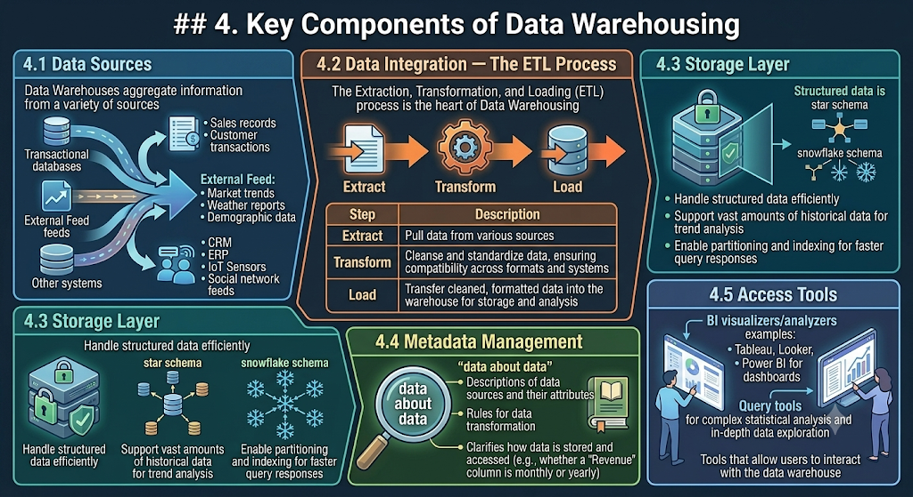

# Data Warehousing & Business Intelligence 

---
## 1. Introduction

Databases are commonly used for **Online Transaction Processing (OLTP)** — such as bank transactions — but they can also be used to **derive business intelligence** to identify trends and patterns that help businesses make better decisions.

- Companies today collect **huge amounts of information daily**
- This information is stored in **data warehouses**
- Data warehouses are used to **generate reports** using software like **IBM Cognos®**
- Companies struggling to set up their own data warehouses are increasingly attracted to **data warehouse appliances**

---

## 2. Is Data Warehousing (DWH) Different from Business Intelligence (BI)?

Both terms are often used interchangeably, but they serve **distinctly different purposes**:

| Concept | Primary Focus |
|---|---|
| **Data Warehousing (DWH)** | Collecting, organizing, and storing large volumes of structured and unstructured data from multiple sources in a central repository |
| **Business Intelligence (BI)** | Analyzing the data stored in warehouses using BI tools and delivering actionable insights via dashboards, reports, and visualizations |

> While they are closely connected, BI is a fundamentally different scale and format of data, requiring different priorities, tools, goals, and approaches.

---

## 3. What is a Data Warehouse?

A **data warehouse** is a dedicated data management system designed to store and organize large volumes of **historical data from multiple sources**.

- Unlike **OLTP systems** (which handle real-time operations), data warehouses support **Online Analytical Processing (OLAP)** — focusing on in-depth analysis and long-term storage

### 3.1 Key Characteristics of a Data Warehouse

#### Central Repository
- Serves as a **central hub** where data from various sources converges (transactional databases, data lakes, APIs, external feeds)
- Eliminates data silos — businesses can access all needed data without jumping between systems

#### Non-Volatile
- Once data is loaded, it **remains unchanged**
- This historical accuracy is useful for comparisons (e.g., last year's vs. this year's sales performance)

#### Integrated
- Data from different sources — structured or unstructured — is **transformed and standardized** for consistency
- Example: customer names formatted differently across systems ("John Doe" vs. "Doe, John") are reconciled

#### Time-Variant
- Keeps **snapshots of data over time**, providing a historical record for trend analysis and knowledge discovery
- Example: time-stamped sales data can reveal seasonal purchasing behaviors to optimize inventory

---

## 4. Key Components of Data Warehousing



### 4.1 Data Sources
Data warehouses aggregate information from a variety of sources:
- **Transactional databases** — day-to-day operations (sales records, customer transactions)
- **External feeds** — third-party data (market trends, weather reports, demographic data)
- **Other systems** — CRM, ERP, IoT sensors, social network feeds

### 4.2 Data Integration — The ETL Process
The **Extract, Transform, Load (ETL)** process is the heart of data warehousing:

| Step | Description |
|---|---|
| **Extract** | Pull data from various sources |
| **Transform** | Cleanse and standardize data, ensuring compatibility across formats and systems |
| **Load** | Transfer cleaned, formatted data into the warehouse for storage and analysis |

### 4.3 Storage Layer
Once integrated, data is securely housed in the storage layer, which is designed to:
- Handle structured data efficiently using schemas like the **star or snowflake schema**
- Support vast amounts of **historical data** for trend analysis
- Enable **partitioning and indexing** for faster query responses

### 4.4 Metadata Management
Metadata = *"data about data"*
- Includes descriptions of data sources and their attributes
- Contains rules for data transformation
- Clarifies how data is stored and accessed (e.g., whether a "Revenue" column is monthly or yearly)

### 4.5 Access Tools
Tools that allow users to interact with the data warehouse:
- **BI visualizers/analyzers** (e.g., Tableau, Looker, Power BI) for intuitive dashboards
- Query tools for **complex statistical analysis** and in-depth data exploration

---

## 5. What is Business Intelligence?

**Business Intelligence (BI)** outlines the strategies, processes, and tools businesses use to **analyze data and extract meaningful insights**. It covers:
- Statistical analysis
- Data storytelling
- Driving data-informed decisions

### 5.1 Key Features of Business Intelligence

#### Data Visualization
- Reshapes complex datasets into **easily understandable visual formats**
- Dashboards present critical information through **charts, graphs, and heatmaps**
- Example: a sales manager views a dashboard highlighting revenue by region

#### Predictive Analytics
- Leverages **statistical models and historical data** to identify trends and forecast future outcomes
- Example: predicting high demand during holiday seasons to prompt proper inventory planning

#### Data Mining
- Sifts through massive amounts of raw data to **uncover hidden patterns and relationships**
- Finds new opportunities for growth and innovation not immediately obvious from surface data

#### Real-Time Reporting
- Provides **up-to-date insights** critical in fast-paced industries
- Example: logistics providers monitoring delivery status in real time to optimize routes and avoid delays

---

## 6. Key Components of Business Intelligence

### 6.1 BI Tools
Specialized tools like **Tableau, Power BI, and Looker** allow businesses to:
- Create **dashboards** simplifying complex datasets into charts and graphs
- **Automate reporting** — schedule and deliver regular reports to keep teams informed
- Drill into specifics (e.g., regional sales performance, product trends)

### 6.2 Data Pipelines
Connect and integrate data from siloed systems into a cohesive BI framework:
- Extract data from multiple sources (CRMs, ERPs, transactional databases)
- Shape raw data into **analysis-ready, unified form**
- Load processed data into cloud BI solutions or data warehouses for centralized access

### 6.3 Statistical Analysis
The backbone of in-depth analysis within BI systems:
- Examining **trends and patterns** in business operations
- Identifying **correlations** between variables (e.g., how weather impacts sales)
- Supporting knowledge discovery and **predictive modeling**

### 6.4 Cloud BI Solutions
Cloud-hosted BI solutions provide a flexible and cost-effective way to manage data:
- **Scale** storage and analytics capabilities as needed
- Access data from **any location globally**
- **Reduce infrastructure costs** compared to on-premises systems

### 6.5 Actionable Insights Delivery
BI systems turn data into insights that drive business decisions:
- Provide **recommendations** based on trends and patterns
- Generate **alerts for anomalies** (e.g., sudden drops in customer engagement)
- Align insights with BI purposes such as improving efficiency or increasing profitability

---

## 7. Data Warehouse Appliances

Companies struggling to set up data warehouses are increasingly attracted to **data warehouse appliances**.

### What is an Appliance?
> An appliance consists of **hardware and software that has been tightly integrated and tested** to perform a given function or functions.

### IBM Smart Analytics System
- One of the leading appliances for **Data Warehousing and Business Intelligence**
- Pre-integrated hardware and software solution
- Reduces the complexity of setting up a data warehouse from scratch
- Allows businesses to focus on **generating insights** rather than managing infrastructure

---

## 8. Benefits of Integrating Data Warehousing and BI

When DWH and BI systems are integrated, businesses unlock key advantages:

| Benefit | Description |
|---|---|
| **Streamlined Data Access** | All data in one central repository — organized, accessible, and ready for analysis |
| **Better Decision-Making** | Historical data turned into clear, actionable insights for planning ads, forecasting sales, shaping personas, etc. |
| **Scalability** | Cloud data warehouses scale easily as business data grows without impacting performance |
| **Cost Savings** | Combining structured and unstructured data in one system eliminates duplication and streamlines processes |
| **Predictive Insights** | Spotting trends and risks proactively, keeping businesses one step ahead in competitive markets |

---

## 9. Summary

```
Data Warehousing & Business Intelligence
├── Data Warehouse (DWH)
│   ├── Purpose: Store & organize large volumes of historical data
│   ├── Characteristics
│   │   ├── Central Repository
│   │   ├── Non-Volatile (data unchanged once loaded)
│   │   ├── Integrated (standardized across sources)
│   │   └── Time-Variant (historical snapshots)
│   └── Components
│       ├── Data Sources (DBs, APIs, CRM, ERP, IoT)
│       ├── ETL Process (Extract → Transform → Load)
│       ├── Storage Layer (star/snowflake schema)
│       ├── Metadata Management
│       └── Access Tools (Tableau, Power BI, Looker)
│
├── Business Intelligence (BI)
│   ├── Purpose: Analyze data and deliver actionable insights
│   ├── Key Features
│   │   ├── Data Visualization (dashboards, charts, heatmaps)
│   │   ├── Predictive Analytics
│   │   ├── Data Mining
│   │   └── Real-Time Reporting
│   └── Components
│       ├── BI Tools (Tableau, Power BI, Looker)
│       ├── Data Pipelines
│       ├── Statistical Analysis
│       ├── Cloud BI Solutions
│       └── Actionable Insights Delivery
│
├── Data Warehouse Appliances
│   └── IBM Smart Analytics System (pre-integrated HW + SW)
│
└── DWH + BI Integration Benefits
    ├── Streamlined Access
    ├── Better Decisions
    ├── Scalability
    ├── Cost Savings
    └── Predictive Insights
```

---

*Sources: Database Fundamentals, Chapter 10 — Technology Trends and Databases; Data Warehousing and Business Intelligence: Full Guide*