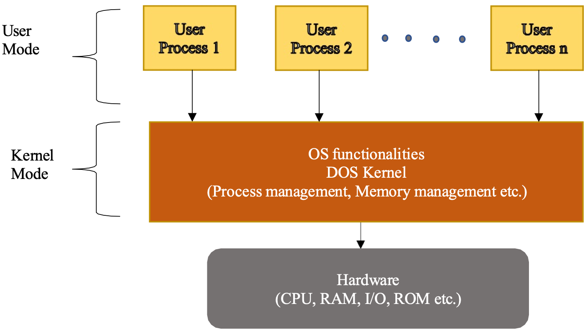
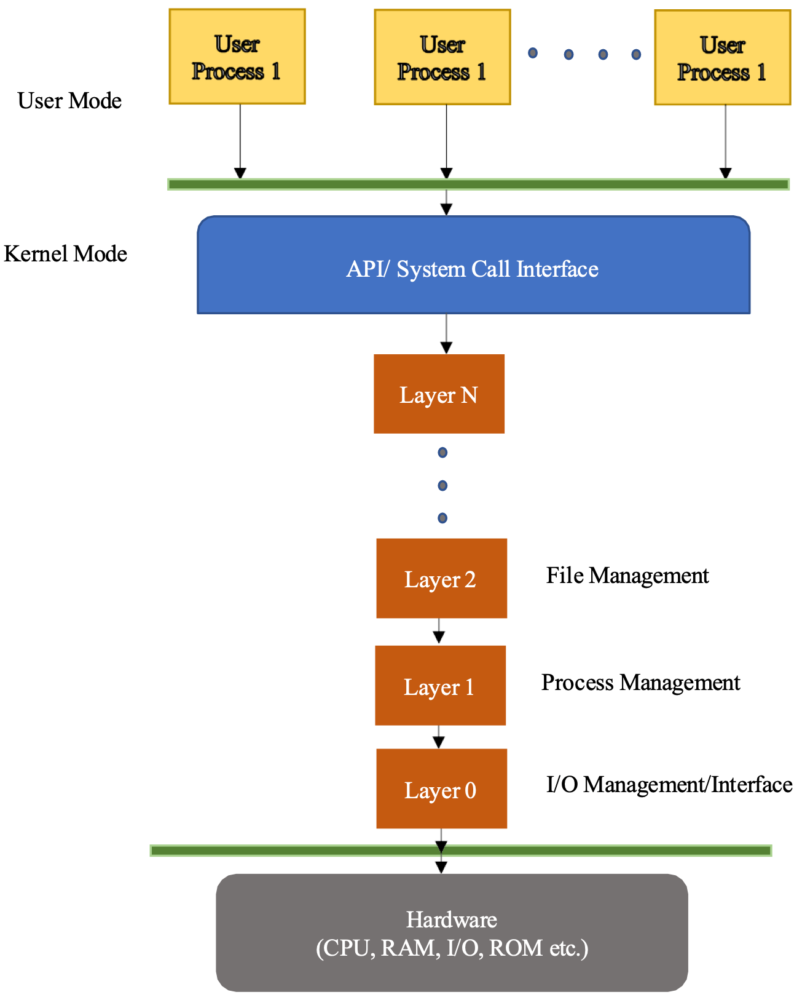
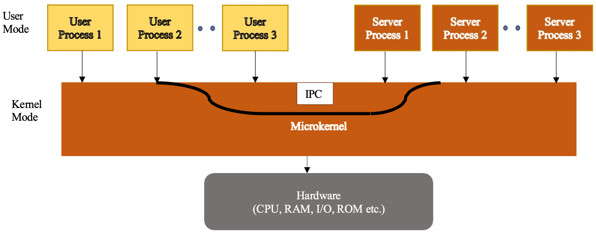
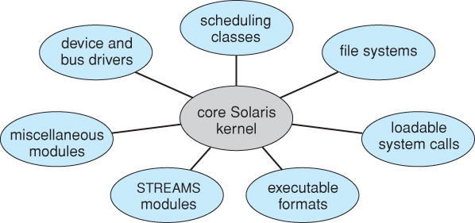
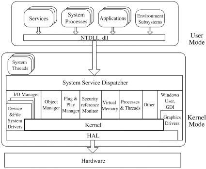

# OS Structures 

## Learning Objectives

By the end of this topic, you should be able to:

- Explain why operating systems need structure.
- Describe the simple, or monolithic, OS structure.
- Explain the layered OS structure.
- Describe the microkernel OS structure.
- Explain how module-based operating systems work.
- Describe hybrid OS structures and identify examples.
- Compare the strengths and weaknesses of different OS structures.

---

## 1. Introduction to OS Structures

A general-purpose operating system is a very large and complex program. For example, Windows 11 has roughly 50 million lines of code. Because an operating system is so large, it needs a proper structure to organize its different functions.

The structure of an OS describes how its components are arranged and how they communicate with one another. A good OS structure makes the system easier to design, test, update, maintain, and extend.

Operating systems perform many major functions, including:

- Process management.
- Memory management.
- Device management.
- File management.
- Input/output management.
- Networking.
- Security.
- User interface support.

If these functions are not organized properly, the OS becomes difficult to understand and maintain. Different OS structures solve this problem in different ways.

The five OS structures discussed are:

1. Simple, or monolithic, structure.
2. Layered structure.
3. Microkernel structure.
4. Modules.
5. Hybrid structure.

---

## 2. Simple, or Monolithic, OS Structure

The simple OS structure is also known as the monolithic structure. It was commonly used in earlier computers, when systems usually had one CPU, small RAM, and only a few input/output devices.

Because early computer systems were less complex, a simple OS structure could manage system functions effectively. In a monolithic operating system, all major OS components are kept together in one large unit.

### Main Idea of Monolithic Structure

In a monolithic structure, all operating system functionalities are housed under one single unit. There is no clear division into separate modules.

Examples of OS functions inside the single monolithic unit include:

- Process management.
- Memory management.
- Device management.
- File management.
- Input/output management.

When the CPU needs to fetch data or perform a task for a program, the request is handled by the main OS program. Since the OS components are all grouped together, communication between them is direct and fast.

Figure 2.2 shows the monolithic structure of MS-DOS. The user mode sits above the kernel mode. Inside kernel mode, OS functionalities and the DOS kernel manage process management, memory management, and other core services. Below the kernel is the hardware, including CPU, RAM, I/O devices, and ROM.

### Advantages of Monolithic Structure

The main advantage of the monolithic structure is fast execution.

Because all OS components are located together in one large kernel space, requests can be processed quickly. Components can communicate directly without passing through many layers or separate processes.

Advantages include:

- Fast request execution.
- Simple design for small systems.
- Direct communication between OS functions.
- Efficient use of limited early hardware.
- Suitable for older systems with fewer devices and less complexity.

### Disadvantages of Monolithic Structure

The monolithic structure also has important disadvantages.

Because user programs and OS files may be closely located, the system is more prone to errors and viruses. If a user program causes an error inside kernel space, it can affect the whole operating system.

Disadvantages include:

- More vulnerable to errors.
- More vulnerable to viruses.
- Weak separation between user programs and OS files.
- A failure in one part can affect the whole system.
- Updating the OS can be difficult.
- The whole OS body or code may need to be replaced during upgrades.
- Maintenance becomes harder as the OS grows.

### Example

MS-DOS is an example of a simple, monolithic OS structure.

---

## 3. Layered OS Structure

In a layered OS structure, the operating system is divided into several layers. Each layer has a clearly defined function and can be coded and tested independently.

The layered approach improves organization by separating the OS into levels. Each level performs specific tasks and communicates with nearby layers.

### Main Idea of Layered Structure

The lowest layer, called layer 0, interacts with the hardware. The topmost layer, called layer N, provides an interface to application programs and user processes.

Between these two layers are other layers that manage different OS services, such as:

- I/O management.
- Process management.
- File management.
- System call handling.
- User interface services.

Figure 2.3 shows the layered structure of an operating system. Hardware is at the bottom. Above it are layers such as I/O management, process management, file management, and the API or system call interface. User mode is above kernel mode.

### Communication Between Layers

In a layered OS, communication usually happens between adjacent layers only. Each layer relies on the services of the layer below it and provides services to the layer above it.

This makes the system easier to understand because each layer has a specific responsibility.

### Example

MULTICS is an example of an operating system that used the layered structure in its design.

### Advantages of Layered Structure

The layered structure has several advantages over the monolithic structure.

Advantages include:

- New features can be added more easily.
- A layer can be added or replaced without affecting all other layers.
- New layers can be created more easily.
- Each layer can be coded independently.
- Each layer can be tested independently.
- OS updates are more convenient.
- Only selected layers may need to be replaced instead of the whole OS program.
- The design is easier to understand and maintain.

### Disadvantages of Layered Structure

Although the provided material focuses mainly on advantages, layered systems can also have limitations.

Possible disadvantages include:

- Performance may be slower because requests pass through multiple layers.
- Designing the correct layer order can be difficult.
- Some OS functions may need services from non-adjacent layers.
- Strict layer communication can reduce flexibility.

---

## 4. Microkernel OS Structure

The microkernel structure is based on the idea of keeping only the minimum necessary functionality inside the kernel. Other OS services are provided outside the kernel through separate server processes.

The goal is to make the kernel smaller, more reliable, and easier to maintain.

### Main Idea of Microkernel Structure

In a microkernel OS, only the most critical functions remain in the kernel. Other operating system services are moved out of the kernel and implemented as server processes.

Critical functions usually kept in the kernel include:

- Process scheduling.
- Inter-process communication, IPC.
- Memory management.
- Thread management.
- Interrupt management.

Functions usually placed outside the kernel include:

- File management.
- I/O management.
- Networking.
- Other higher-level OS services.

These outside services run as separate server processes in user address space.

### Inter-Process Communication, IPC

IPC stands for inter-process communication. It allows processes to communicate and exchange information.

In a microkernel system, IPC is very important because user applications and server processes must communicate frequently.

When a user application needs an OS service, it makes a system call to IPC. IPC then forwards the request to the appropriate server process.

For example:

1. A user application needs file access.
2. The application sends a request using a system call.
3. IPC receives the request.
4. IPC forwards it to the file management server.
5. The file management server handles the request.
6. The result is returned back through IPC.

Figure 2.4 shows the microkernel structure of an operating system. User mode contains server processes and applications, while kernel mode contains essential functions such as IPC. The hardware is below the kernel.

### Advantages of Microkernel Structure

The microkernel structure has several advantages.

Advantages include:

- Easier upgrades.
- Better reliability.
- Smaller kernel size.
- Better separation of OS services.
- Easier maintenance.
- Server processes can be updated separately.
- If one server process fails, it may be fixed or restarted without replacing the whole OS.
- Less code runs in kernel mode, which can improve system protection.

### Disadvantages of Microkernel Structure

The microkernel structure may also have disadvantages.

Possible disadvantages include:

- Performance may be slower because many services require IPC.
- Communication between user processes and server processes adds overhead.
- More context switching may be needed.
- The design can be more complex than a simple monolithic system.

---

## 5. Module-Based OS Structure

A module-based OS structure uses loadable kernel modules. These modules are independently coded pieces of kernel functionality that can be loaded or removed as needed.

This structure is similar to layering because it separates OS functions into parts, but it is more flexible than a strict layered design.

### Main Idea of Modules

In a modular OS, the kernel has a core set of functions, and additional services can be added through modules.

Examples of modules may include:

- Device drivers.
- File system support.
- Network protocols.
- Security features.
- Hardware support.

Modules can be developed independently and loaded into the kernel when needed.

### Modules Compared with Layers

Layers usually communicate only with adjacent layers. Modules are more flexible because they can communicate with other modules directly.

This gives a modular operating system more freedom than a strictly layered system.

### Advantages of Module-Based Structure

Advantages include:

- High flexibility.
- Modules can be added when needed.
- Modules can be removed when not needed.
- Independent coding and testing are possible.
- Easier support for new hardware.
- Easier support for new file systems or services.
- More flexible communication than layered systems.

### Disadvantages of Module-Based Structure

Possible disadvantages include:

- Faulty modules can still affect the kernel.
- Security risks can occur if unsafe modules are loaded.
- Module dependencies can become complex.
- Careful version compatibility is required.

### Examples

Linux and Solaris use module-based OS structures.

---

## 6. Hybrid OS Structure

Most modern operating systems use hybrid structures. A hybrid OS combines two or more OS structure models to gain the benefits of different approaches.

Instead of relying on only one design, a hybrid OS chooses features from multiple structures.

### Main Idea of Hybrid Structure

A hybrid OS may combine:

- Monolithic structure.
- Microkernel structure.
- Module-based structure.
- Layered structure.

The goal is to balance speed, flexibility, reliability, and maintainability.

### Examples of Hybrid Structures

Examples include:

| Operating System | Hybrid Combination |
|---|---|
| Linux | Monolithic + Modules |
| Solaris | Monolithic + Modules |
| Windows | Monolithic + Microkernel |
| macOS | Microkernel + Layered |

### Advantages of Hybrid Structure

Hybrid operating systems are common because they can combine the strengths of different designs.

Advantages include:

- Better performance than a pure microkernel in many cases.
- More flexibility than a simple monolithic design.
- Easier extension through modules or layers.
- Ability to balance reliability and speed.
- Suitable for modern complex operating systems.

### Disadvantages of Hybrid Structure

Possible disadvantages include:

- More complex design.
- More difficult testing.
- More difficult debugging.
- May inherit weaknesses from multiple models.
- Architecture can be harder to explain or maintain.

---

## 7. Comparison of OS Structures

| OS Structure | Main Idea | Advantages | Disadvantages | Examples |
|---|---|---|---|---|
| Simple, monolithic | All OS functions are in one large unit | Fast execution, simple for small systems | Error-prone, harder to update, weak separation | MS-DOS |
| Layered | OS is divided into layers | Easier testing, easier updates, organized design | Possible performance overhead, less flexible | MULTICS |
| Microkernel | Minimal kernel; other services run as server processes | Reliable, easier upgrades, smaller kernel | IPC overhead, possible slower performance | Microkernel-based systems |
| Modules | Kernel supports loadable modules | Flexible, easier feature addition, direct module communication | Faulty modules can affect kernel, dependency issues | Linux, Solaris |
| Hybrid | Combines multiple structures | Balances speed, flexibility, and reliability | Complex design and debugging | Linux, Solaris, Windows, macOS |

---

## 8. Key Terms

| Term | Meaning |
|---|---|
| OS structure | The organization of operating system components |
| Monolithic structure | OS design where all major functions are housed in one large unit |
| Simple structure | Another name for a basic monolithic OS structure |
| Kernel mode | Privileged mode where core OS functions run |
| User mode | Restricted mode where user programs run |
| Process management | OS function that manages running programs |
| Memory management | OS function that manages RAM and memory allocation |
| Device management | OS function that manages hardware devices |
| File management | OS function that manages files and storage |
| Layered structure | OS design divided into layers with defined functions |
| Layer 0 | Lowest layer, usually interacting with hardware |
| Layer N | Topmost layer, usually interacting with user processes or applications |
| System call interface | Interface used by applications to request OS services |
| Microkernel | OS structure that keeps only essential functions in the kernel |
| IPC | Inter-process communication, used for communication between processes |
| Server process | A process outside the kernel that provides an OS service |
| User address space | Memory area where user-level processes run |
| Loadable kernel module | A kernel component that can be loaded or removed as needed |
| Hybrid OS | An OS that combines two or more structure models |

---

## 9. Summary

Operating systems are large and complex programs, so they need structure. The structure of an OS affects its speed, reliability, security, maintainability, and flexibility.

The simple or monolithic structure places all OS functions in one large unit. This can make execution fast, but it also makes the system more vulnerable to errors and harder to update.

The layered structure divides the OS into layers, where each layer has a clear responsibility. This makes the OS easier to test, update, and understand, but it can reduce performance and flexibility.

The microkernel structure keeps only essential services in the kernel and moves other services into user-level server processes. This improves reliability and upgrade flexibility, but communication overhead can reduce performance.

The module-based structure uses loadable kernel modules. It is more flexible than strict layering because modules can communicate with one another and can be loaded when needed.

The hybrid structure combines multiple models. Most modern operating systems use hybrid structures because they need to balance performance, reliability, flexibility, and maintainability.
