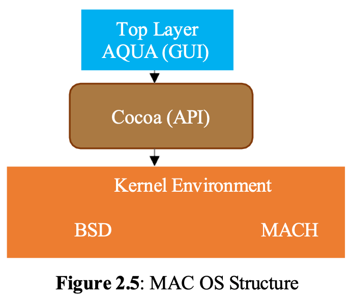
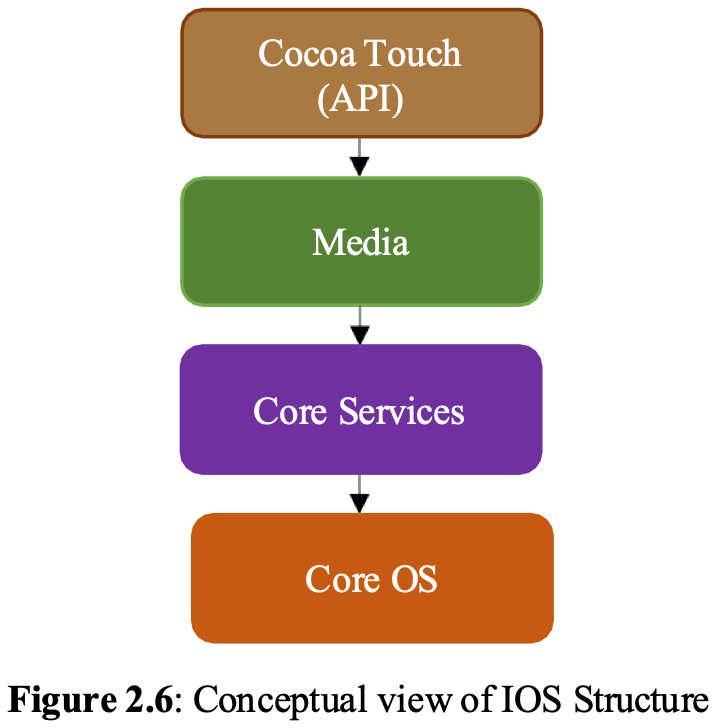

# Modern OS Structures 

## Learning Objectives

By the end of this topic, you should be able to:

- Describe the basic structure of macOS.
- Explain the major layers of iOS.
- Describe the Android operating system structure.
- Compare macOS, iOS, and Android structures.
- Explain the purpose of operating system debugging.
- Distinguish between failure analysis and performance tuning.
- Explain core dumps, crash dumps, and performance monitoring utilities.

---

## 1. Introduction to Modern OS Structures

Modern operating systems are large, complex systems that must support many different services at the same time. They manage hardware, run applications, support networking, protect user data, and provide graphical interfaces.

In this section, three modern operating systems are discussed:

1. macOS.
2. iOS.
3. Android.

These operating systems use structured designs so their components can be organized clearly. Modern OSs often combine several design ideas, such as layering, kernel services, APIs, graphical frameworks, and hardware abstraction.

Although macOS, iOS, and Android are different systems, they all separate user-level components from kernel-level components. This separation helps improve security, reliability, and system organization.

---

## 2. macOS Structure

macOS is the operating system used on Apple Mac computers. Like many other operating systems, macOS is divided into two major parts:

- User address space.
- Kernel environment.

The user address space contains user-facing services, graphical interface components, and APIs used by applications. The kernel environment contains lower-level system components that manage memory, communication, networking, and other core OS functions.

### User Address Space in macOS

The top layer of macOS provides the graphical user interface framework called Aqua.

Aqua is responsible for the visual appearance and interaction style of macOS. It includes graphical elements such as:

- Windows.
- Menus.
- Icons.
- Buttons.
- Dialog boxes.
- Visual effects.

Below Aqua, macOS uses the Cocoa API.

### Aqua GUI

Aqua is the graphical user interface layer of macOS. It provides the visual environment that users interact with when using Mac computers.

Aqua helps provide:

- A consistent desktop experience.
- Graphical windows and controls.
- User interaction through mouse, keyboard, and trackpad.
- Visual design elements specific to macOS.

### Cocoa API

Cocoa is an object-oriented framework used by macOS applications. It provides APIs that allow applications to interact with the operating system.

An API, or application programming interface, allows software to request OS services without needing to directly control the kernel or hardware.

Cocoa helps developers create macOS applications by providing tools for:

- User interface development.
- Event handling.
- File access.
- Application behavior.
- Interaction with system services.

Through Cocoa, applications communicate with deeper parts of macOS, including the kernel environment.

### Kernel Environment in macOS

The macOS kernel environment includes two important components:

- BSD.
- Mach.

These components provide many of the core services needed by the operating system.

### BSD in macOS

BSD stands for Berkeley Software Distribution. In macOS, BSD provides many UNIX-based services.

BSD is used for:

- Command-line interface routines.
- Networking routines.
- File system behavior.
- UNIX compatibility.
- Process-related services.

The command-line interface, or CLI, in macOS uses BSD framework features. Networking routines also rely heavily on BSD.

### Mach in macOS

Mach is another major part of the macOS kernel environment. Mach provides low-level kernel services.

Mach is responsible for:

- Memory management.
- Inter-process communication, IPC.
- Low-level scheduling support.
- Kernel-level abstractions.

Inter-process communication allows different processes to communicate and exchange information. Memory management allows the OS to allocate, track, and protect memory used by applications and system services.

Figure 2.5 shows the macOS structure. The top layer contains Aqua, the graphical user interface. Below it is Cocoa, the API framework. The kernel environment includes BSD and Mach.

---

## 3. iOS Structure

iOS is the operating system developed by Apple for mobile devices such as the iPhone. It uses a layered structure with four major layers:

1. Cocoa Touch.
2. Media.
3. Core Services.
4. Core OS.

The first two layers, Cocoa Touch and Media, are located in user address space. The lower two layers, Core Services and Core OS, are closer to the kernel and provide deeper system functionality.

### Cocoa Touch Layer

Cocoa Touch is the top layer of iOS. It provides APIs for building iOS applications and supports touch-screen interaction.

Cocoa Touch supports:

- Touch gestures.
- Mobile user interface controls.
- Application behavior.
- Event handling.
- Screen interaction.
- App lifecycle management.

Because iOS devices are touch-based, Cocoa Touch is especially important. It allows applications to respond to taps, swipes, pinches, and other gestures.

### Media Layer

The Media layer manages graphics, audio, and video support.

It provides services for:

- Graphics rendering.
- Audio playback.
- Video playback.
- Audio device control.
- Video device control.
- Multimedia application support.

Applications that play music, display images, record videos, or show animations use services provided by the Media layer.

### Core Services Layer

The Core Services layer provides important system services used by applications and higher layers.

One of its roles is to support device connectivity to iCloud, Apple's cloud computing service.

Core Services may support:

- Cloud connectivity.
- Data storage services.
- Application support services.
- System-level frameworks.
- Communication between apps and lower OS layers.

### Core OS Layer

The Core OS layer provides the fundamental operating system functions.

Core OS includes services such as:

- Process management.
- Memory management.
- Network routines.
- Low-level system services.
- Hardware-related support.

This is the deepest layer in the iOS structure and is responsible for many essential OS operations.

Figure 2.6 shows a conceptual view of the iOS structure. The layers are Cocoa Touch, Media, Core Services, and Core OS.

---

## 4. Android Structure

Android is a mobile operating system developed by Google. Its structure is similar to iOS because it also uses a layered stack.

At the bottom of the Android stack is the Linux kernel, customized by Google. This kernel provides many of the low-level operating system services needed by Android devices.

### Linux Kernel in Android

The Android operating system uses a customized Linux kernel.

The Linux kernel manages:

- Processes.
- Memory.
- Devices.
- Hardware communication.
- Low-level security.
- Power management.

Using the Linux kernel gives Android a strong foundation because Linux is known for stability, portability, and hardware support.

### Android as a Layered Stack

Android is organized in layers. Higher layers support applications and APIs, while lower layers manage hardware and system resources.

The layered stack design helps separate application development from low-level hardware control.

In general, Android includes:

- Application layer.
- Application framework or API layer.
- Runtime and libraries.
- Linux kernel.

The provided material emphasizes that Android's lower layer is the Linux kernel and that Google created a special API for Android application development.

### Android Application Development

Google provides a special API for Android application development. Developers use this API to build Android apps without needing to directly manage low-level hardware.

In Android development, Java files are first compiled into bytecode. This bytecode is then converted into an executable form that can run on Android devices.

This process allows Android applications to be portable and controlled by the Android runtime environment.

### Importance of Android's Structure

Android's structure helps support:

- Mobile application development.
- Device independence.
- Hardware management through the Linux kernel.
- Process and memory management.
- Support for many types of mobile devices.
- A consistent API for developers.

---

## 5. Comparison of macOS, iOS, and Android Structures

| Operating System | Main Structure | Important Components | Main Purpose |
|---|---|---|---|
| macOS | User address space plus kernel environment | Aqua, Cocoa, BSD, Mach | Desktop OS for Mac computers |
| iOS | Four-layer structure | Cocoa Touch, Media, Core Services, Core OS | Mobile OS for Apple devices |
| Android | Layered stack | Android API, runtime, customized Linux kernel | Mobile OS for Android devices |

### Similarities

macOS, iOS, and Android all:

- Separate user-level services from deeper system services.
- Use APIs to help applications communicate with the OS.
- Manage memory, processes, devices, and networking.
- Provide graphical or touch-based user interfaces.
- Use layered or hybrid design ideas.
- Hide hardware complexity from application developers.

### Differences

The systems differ in structure and purpose:

- macOS is designed mainly for desktop and laptop computers.
- iOS is designed for Apple's mobile touch-screen devices.
- Android is designed for mobile devices from many manufacturers.
- macOS uses Aqua and Cocoa above BSD and Mach.
- iOS uses Cocoa Touch, Media, Core Services, and Core OS.
- Android uses a customized Linux kernel and Android-specific APIs.

---

## 6. Operating System Debugging

Operating system debugging is the process of finding and correcting errors in hardware and software.

Debugging is one of the most important OS components because operating systems must remain reliable. If an OS fails, it can affect all applications and users on the system.

The debugging module helps detect problems, record error information, and support later analysis.

There are two main components of OS debugging:

1. Failure analysis.
2. Performance tuning.

---

## 7. Failure Analysis

Failure analysis is the process of studying errors after they occur. If a process fails, the operating system writes error information to a log file. This alerts users or administrators that an error has occurred.

Failure analysis helps developers and system administrators understand:

- What failed.
- When it failed.
- Which process or component caused the failure.
- What memory or system state existed at the time.
- How the error might be fixed.

### Log Files

A log file is a file that records system events, errors, warnings, and other important information.

When a failure occurs, the OS can write details to a log file so the issue can be investigated later.

Log files are useful for:

- Diagnosing system errors.
- Tracking repeated problems.
- Supporting firmware or software updates.
- Helping administrators troubleshoot systems.

### Core Dump

A core dump occurs when the OS captures the memory of a failed process and stores it in a file for later analysis.

The core dump may include:

- Process memory.
- Program state.
- Variable values.
- Stack information.
- Data needed to understand the failure.

Developers can examine a core dump to determine why a process crashed.

### Crash Dump

If the kernel fails, the failure is called a crash. The error log file created for a kernel crash is called a crash dump.

A crash dump is more serious than a core dump because it involves the kernel. Since the kernel controls the whole system, a kernel crash may stop the entire operating system.

Crash dumps help developers identify kernel-level problems.

### Firmware Updates and Error Logs

Firmware updates can use error logs, core dumps, and crash dumps to identify and fix problems. The information recorded by the OS helps developers understand the cause of errors and release updates that correct them.

---

## 8. Performance Tuning

Performance tuning is the process of monitoring and improving system performance.

Users and administrators can use performance tuning utilities to view the performance of hardware resources and manage tasks and processes.

Performance tuning helps identify:

- Programs using too much CPU.
- Programs using too much memory.
- Disk performance problems.
- Network performance problems.
- Processes that are not responding.
- Startup or background tasks slowing the system.

### Performance Tuning Utilities

Examples of performance tuning utilities include:

- Windows Task Manager in Microsoft Windows.
- Activity Monitor in macOS.

These tools allow users to monitor system activity and manage running processes.

### Windows Task Manager

Windows Task Manager shows information about:

- Running applications.
- Background processes.
- CPU usage.
- Memory usage.
- Disk usage.
- Network usage.
- Startup programs.
- User sessions.

Users can use Task Manager to end unresponsive tasks or identify programs that are consuming too many resources.

### macOS Activity Monitor

Activity Monitor is a macOS utility that shows system performance information.

It can display:

- CPU usage.
- Memory usage.
- Energy usage.
- Disk activity.
- Network activity.
- Running processes.

Activity Monitor helps users understand how system resources are being used and can help identify performance problems.

---

## 9. Key Terms

| Term | Meaning |
|---|---|
| macOS | Apple's desktop operating system for Mac computers |
| User address space | Area where user-level applications and services run |
| Kernel environment | Lower-level OS area that manages core system services |
| Aqua | macOS graphical user interface framework |
| Cocoa | Object-oriented API framework used by macOS applications |
| API | Application programming interface used by software to request OS services |
| BSD | Berkeley Software Distribution, used in macOS for UNIX services, CLI, and networking |
| Mach | Kernel component used in macOS for memory management and IPC |
| IPC | Inter-process communication |
| CLI | Command-line interface |
| iOS | Apple's mobile operating system |
| Cocoa Touch | iOS layer that provides APIs and touch-screen support |
| Media layer | iOS layer that manages graphics, audio, and video |
| Core Services | iOS layer that supports services such as iCloud connectivity |
| Core OS | iOS layer that provides fundamental OS functions |
| Android | Google's mobile operating system |
| Linux kernel | Kernel used as the foundation of Android |
| Bytecode | Intermediate compiled code used before final execution |
| Debugging | Finding and correcting hardware or software errors |
| Failure analysis | Studying failures after they occur |
| Log file | File that records system events and errors |
| Core dump | File containing memory information from a failed process |
| Crash dump | Error file created when the kernel fails |
| Performance tuning | Monitoring and improving system performance |
| Task Manager | Windows utility for monitoring and managing processes |
| Activity Monitor | macOS utility for monitoring system performance |

---

## 10. Summary

Modern operating systems use structured designs to organize complex system functions. macOS, iOS, and Android all separate user-level services from lower-level system functions, but they organize their components differently.

macOS uses a user address space with Aqua for the GUI and Cocoa as an object-oriented API framework. Its kernel environment includes BSD for command-line and networking services and Mach for memory management and inter-process communication.

iOS uses four layers: Cocoa Touch, Media, Core Services, and Core OS. Cocoa Touch supports APIs and touch interaction, Media manages graphics, audio, and video, Core Services supports connectivity such as iCloud, and Core OS provides essential functions like process management, memory management, and networking.

Android uses a layered stack based on a customized Linux kernel. The kernel manages processes, memory, and devices, while Android APIs support application development.

Operating system debugging is essential for reliability. Failure analysis records errors through logs, core dumps, and crash dumps, while performance tuning utilities such as Windows Task Manager and macOS Activity Monitor help users monitor hardware resources and manage tasks and processes.
