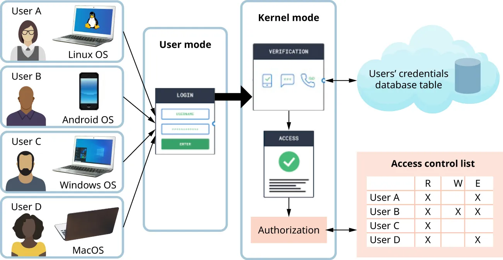
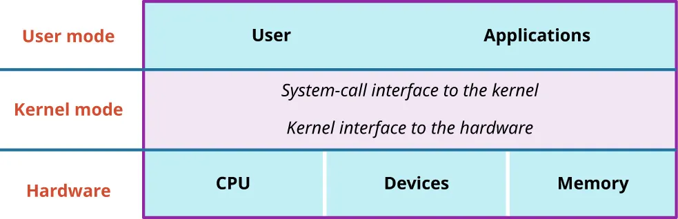
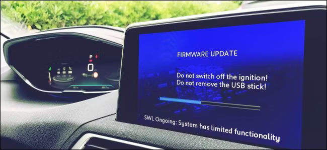

# What Is an Operating System? 

## Learning Objectives

By the end of this topic, you should be able to:

- Describe what an operating system is.
- Explain the role of an operating system in computing.
- Identify common operating systems used on computers and mobile devices.
- Explain how operating systems manage hardware, software, users, and resources.
- Describe the basic architecture and support layers of operating systems.
- Explain kernel features, hardware management, protected sharing, virtualization, and OS-level security.

---

## 1. Meaning of an Operating System

An operating system, or OS, is the core software that manages a computer or computerized device. It controls the connection between hardware and software and provides the services that applications need in order to run.

The OS is usually loaded when a device starts up. After it loads, it becomes the main software layer that allows the user, applications, and hardware to work together.

An operating system is important because it:

- Manages computer hardware.
- Provides services to applications.
- Controls input and output devices.
- Manages files and storage.
- Allocates memory and CPU time.
- Protects users and processes from one another.
- Provides a user interface.
- Makes computer systems easier to use and program.

Without an operating system, each application would need to know how to communicate directly with every hardware component. This would make software development much more difficult.

---

## 2. Common Operating Systems

There are many operating systems in use today. Anyone using a modern computer, phone, tablet, or smart device is using some form of operating system.

Common computer operating systems include:

- Microsoft Windows.
- macOS.
- Linux.
- Chrome OS.

Common mobile operating systems include:

- iOS.
- Android.

Microsoft Windows is widely used because it is user-friendly and supports a large range of software. macOS is used on Apple computers and is known for tight integration between Apple hardware and software. Linux is an open-source operating system known for reliability, security, flexibility, and adaptability.

Linux has many versions, called distributions. Examples include:

- Ubuntu, often used for ease of use.
- Fedora, often used for newer features.
- Debian, often used for stability.
- Kali Linux, often used for security-related tasks.

Modern commercial operating systems also manage user security, permissions, and access control.

### Figure 6.2 Space

Figure 6.2 shows that modern organizations, such as companies and universities, must support many users, devices, and operating systems while still allowing secure access to network systems.

---

## 3. Main Goal of an Operating System

The traditional role of the OS is to allow applications and hardware to communicate. Applications usually do not control hardware directly. Instead, they request services from the operating system, and the OS performs the necessary hardware operations.

For example:

- A word processor asks the OS to save a file.
- A browser asks the OS to access the network.
- A game asks the OS to display graphics and play sound.
- A printing application asks the OS to send data to a printer.

The OS acts as the middle layer between applications and hardware. This makes software easier to build because applications can rely on OS services instead of handling all hardware details themselves.

---

## 4. Isolation

One of the primary goals of an operating system is isolation. Isolation means that multiple programs running at the same time should operate independently without interfering with each other's execution or data.

Isolation helps provide:

- Stability.
- Security.
- Privacy.
- Reliability.
- Protection between users.
- Protection between processes.

For example, if a web browser crashes, it should not crash the entire computer. If one user runs a program, that program should not be able to read or modify another user's private files without permission.

Isolation also helps hardware manufacturers improve or update hardware without requiring application developers to rewrite their software each time. The OS hides hardware details behind stable interfaces.

---

## 5. Hardware Resources Managed by the OS

The operating system manages access to many hardware resources, including:

- CPU, used for computation.
- Memory, used for temporary volatile storage.
- Disk and flash memory, used for persistent storage.
- Network devices, such as Wi-Fi and Ethernet cards.
- TCP/IP network stacks.
- Keyboard.
- Display.
- Touch screen.
- Audio devices.
- Game controllers.
- Printers.
- Mice and other input devices.

The OS ensures that programs access these resources in a controlled and organized way.

---

## 6. Monitoring Access

Operating systems act as gatekeepers for hardware access. They monitor and control which applications and users can communicate with hardware devices.

This monitoring is important because many devices contain or provide access to sensitive information. For example, storage devices may contain private files, and network devices may transmit confidential data.

The OS helps ensure that:

- Hardware devices are accessed smoothly.
- Hardware devices are accessed securely.
- Users and applications follow permission rules.
- Unauthorized access is prevented.
- System stability is maintained.

### Authentication and Permissions

The OS helps enforce authentication mechanisms. Authentication verifies that a user or process is authorized to access certain resources.

The OS can manage:

- User accounts.
- Passwords or other login methods.
- Access levels.
- Device permissions.
- File permissions.
- Application permissions.

In companies, schools, and government environments, this control is especially important because hardware and data may have different sensitivity levels.

### Role of IT Administrators

IT administrators decide which hardware devices are available on a company network and how sensitive those devices are. They must understand both the technical details of the hardware and the security risks connected to using it.

---

## 7. Operating System Design Considerations

Operating system designers must answer many important questions. These questions relate to how the OS is organized, how resources are shared, and how the system remains secure and efficient.

| Property | Design Question |
|---|---|
| Structure | How is the OS organized? |
| Sharing | How are resources shared across users? |
| Naming | How are resources named, and what is the scope? |
| Protection | How is one user or process protected from another? |
| Security | How is the integrity of the OS and its resources ensured? |
| Performance | How does the OS avoid making applications run slowly? |
| Availability | Can applications always access the services they need? |
| Reliability | How often do things go wrong with hardware or programs? |
| Extensibility | Can new features be added? |
| Communication | How do programs exchange information, including across a network? |
| Concurrency | How are simultaneous activities such as computation and I/O created and controlled? |
| Scale | What happens as demands or resources increase? |
| Persistence | How can data last longer than program execution? |
| Distribution | How can computation span hardware or network boundaries? |
| Accounting | How can user resource usage be tracked and charged? |
| Auditing | Can actions and processes be reconstructed later? |

These design considerations show that an OS must do more than simply run programs. It must also protect resources, coordinate users, support growth, handle failures, and maintain records of system activity.

---

## 8. Efficiency Management

An OS manages system resources such as CPU, memory, disk, and network connections. Good resource management prevents resources from being underused or overloaded.

An efficient OS improves the user experience by:

- Reducing waiting time.
- Improving application responsiveness.
- Supporting multitasking.
- Allocating resources fairly.
- Preventing one program from taking over the system.
- Helping applications run smoothly.

### Runtime Efficiency

Runtime efficiency refers to how efficiently a program runs while it is executing. If an application were written to run directly on raw hardware, it might avoid some OS overhead. However, the application would also need to provide many features normally handled by the OS.

The OS may add some runtime cost, but it provides major benefits such as:

- Hardware sharing.
- Security.
- Isolation.
- Resource control.
- Error containment.
- Device management.

### Coding Time Efficiency

Coding time efficiency refers to how much effort developers need to build software. Operating systems provide abstractions, interfaces, and libraries that make application development easier.

Without an OS, developers would need to write many low-level functions from scratch, such as:

- File handling.
- Memory management.
- Device communication.
- Network communication.
- Error handling.
- User interface support.

The OS saves developers time by providing these services.

---

## 9. Policies and Mechanisms

In operating systems, a policy defines what should be done. A mechanism defines how it is done.

### Policy

A policy is a rule or decision about how the system should behave.

Examples of policies include:

- Which process should receive CPU time first?
- Which user should be allowed to access a file?
- How much memory should each process receive?
- Which network traffic should be prioritized?

### Mechanism

A mechanism is the method or tool used to enforce a policy.

Examples of mechanisms include:

- Queues.
- Access control lists.
- Schedulers.
- Page tables.
- Authentication systems.
- Permission checks.

For example, if the policy is first come, first served, the mechanism may be a queue of requests. The queue stores requests in the order they arrive so the OS can serve them in that same order.

### Car Analogy

A car can be compared to a mechanism because it provides actions such as moving, stopping, and turning. However, the car itself does not decide where to go. The driver provides the policy by choosing the route.

Similarly, an OS mechanism provides the ability to enforce decisions, while the policy determines which decisions should be made.

---

## 10. OS-Level and Server Virtualization

Virtualization is the ability of a system or server to run different applications or operating environments for multiple users at the same time on the same physical computer.

Virtualization allows one physical machine to act like multiple separate machines.

### Server Virtualization

Server virtualization uses a software layer called a hypervisor, also known as a virtual machine monitor or VMM.

The hypervisor sits between:

- The physical server hardware.
- The operating systems running on that hardware.

The hypervisor creates and manages virtual machines.

### Virtual Machine

A virtual machine, or VM, is software that behaves like a physical computer. It can run its own operating system and applications as though it were a separate physical server.

Each VM can be isolated from other VMs, even though they share the same underlying physical hardware.

### OS-Level Virtualization

OS-level virtualization is a simpler form of virtualization. In this approach, the server's operating system manages resources directly without using a separate hypervisor.

This model is commonly associated with container-like environments, where multiple isolated user spaces share the same OS kernel.

### Cloud Computing and Virtualization

Cloud computing uses server virtualization to let users commission virtual machines over the Internet.

When users create a cloud VM, they are effectively renting access to a virtual computer that runs their chosen operating system. The physical servers are located in distributed data centers managed by cloud providers.

Cloud customers usually pay based on usage, such as:

- CPU time.
- Storage.
- Network traffic.
- Memory.

---

## 11. OS Architecture and Support Layers

An operating system is system software that manages the programs running on a computer. It allows users to run multiple applications at the same time while preventing those applications from interfering with each other.

The OS provides convenient abstractions for different types of hardware and coordinates access to shared resources.

Operating systems also provide error-management features such as:

- Fault containment.
- Fault tolerance.
- Fault recovery.

### Fault Containment

Fault containment prevents an error in one part of a system from affecting the whole system.

For example, if one application crashes, the OS should prevent the crash from damaging unrelated processes or the entire computer.

### Fault Tolerance

Fault tolerance allows a system or application to continue operating even when some errors occur.

### Fault Recovery

Fault recovery helps the system repair itself or return to a previous stable state after an error.

These services reduce the burden on developers because they do not need to build all reliability features from scratch.

### Figure 6.3 Space

Figure 6.3 shows the UNIX/Linux system structure. It includes three main layers: user mode, kernel mode, and hardware.

---

## 12. UNIX/Linux Support Layers

The UNIX/Linux structure can be understood through three main layers:

- User mode.
- Kernel mode.
- Hardware.

### User Mode

User mode is where ordinary applications run. Applications in user mode have restricted rights and cannot directly control hardware or kernel memory.

Examples of user-mode programs include:

- Web browsers.
- Word processors.
- Games.
- Text editors.
- Email clients.

### Kernel Mode

Kernel mode is the privileged layer between user applications and hardware. The kernel can access hardware, memory management structures, and privileged CPU instructions.

Kernel mode supports:

- Process management.
- Memory management.
- Device management.
- File systems.
- Networking.
- Security enforcement.

### Hardware Layer

The hardware layer includes physical resources such as:

- CPU.
- Memory.
- Storage.
- Network cards.
- Input/output devices.

The operating system uses kernel-mode services to control and coordinate hardware on behalf of user-mode applications.

---

## 13. OS Kernel Features

The kernel is the core program of the operating system. It runs at all times while the computer is operating and provides basic services for the rest of the OS.

The kernel is usually one of the first OS components loaded during startup. It is essential because it manages the most important system resources.

The kernel handles:

- Memory allocation.
- CPU scheduling.
- Process management.
- Input and output operations.
- Device communication.
- File system support.
- Security enforcement.
- Communication between hardware and software.

### Processes

From the OS point of view, any program running on top of the OS is a process.

A process includes:

- Program code.
- Current activity.
- Program counter.
- Open files.
- Allocated memory.
- Address space.
- One or more threads.
- Additional system state.

The OS uses processes to manage running programs and keep them separated from one another.

### Process Abstraction

For a running application, the OS provides the abstraction of a machine. The application does not directly see the raw hardware. Instead, it sees an execution environment created by the operating system.

This environment provides:

- Restricted rights.
- Access to system services.
- Process isolation.
- Resource management.
- User-friendly interfaces.

### Threads and Multithreading

A thread is a path of execution inside a process. A process may contain one thread or multiple threads.

Multithreading is the execution of multiple threads within a process. Since threads share the same process resources, multithreading can improve responsiveness and efficiency.

For example, an application might use one thread for the user interface and another thread for downloading data. This allows the application to remain responsive while work continues in the background.

---

## 14. How Operating Systems Help Applications

Most software applications are written for a specific operating system or set of operating systems. This allows the OS to perform much of the low-level work.

For example, a game such as Minecraft does not need to understand every hardware component in a computer. It can use OS functions for graphics, sound, storage, networking, input, and memory.

The OS translates application requests into lower-level hardware instructions. This saves application developers from needing to write separate hardware-specific code for every device.

Applications depend on operating systems for:

- File access.
- Printing.
- Networking.
- Memory use.
- Display output.
- Keyboard and mouse input.
- Audio.
- Security permissions.
- Multitasking.

---

## 15. Operating Systems Beyond PCs

Operating systems are not limited to desktop and laptop computers. Many modern devices are computers and run operating systems.

Devices that may run operating systems include:

- Smartphones.
- Tablets.
- Smart TVs.
- Game consoles.
- Smart watches.
- Wi-Fi routers.
- Smart speakers.
- ATMs.
- GPS navigation devices.

Some devices use embedded operating systems. An embedded OS is a specialized operating system designed for a specific task or device.

For example:

- A router may use an embedded OS to manage network traffic.
- A GPS device may use an embedded OS for navigation.
- An ATM may use an embedded OS to run banking functions.

Embedded operating systems usually have fewer features than general-purpose operating systems because they are designed for focused tasks.

---

## 16. Where Operating Systems End and Programs Begin

The boundary between an operating system and an application program can sometimes be unclear.

Operating systems usually include:

- Kernel services.
- Device drivers.
- System libraries.
- APIs.
- System services.
- User interfaces.
- File managers.
- Utility programs.

Some components can be viewed both as part of the operating system and as programs that run on the operating system.

For example, Windows File Explorer is an essential part of the Windows experience because it manages file browsing and can draw parts of the desktop interface. At the same time, it is also an application that runs within Windows.

This shows that there is no single perfect boundary between OS software and application software.

---

## 17. The Kernel as the Core of the OS

At a low level, the kernel is the central computer program at the heart of the operating system.

The kernel is usually loaded early during startup and handles essential tasks such as:

- Allocating memory.
- Managing CPU instructions.
- Translating software requests into hardware operations.
- Handling input and output devices.
- Protecting the system from unauthorized changes.

The kernel generally runs in an isolated and protected area of memory. This prevents ordinary applications from tampering with it.

The kernel is extremely important, but it is only one part of a full operating system.

### Linux Kernel Example

Linux is technically a kernel. However, people often use the word "Linux" to refer to complete operating systems built around the Linux kernel.

For example, Ubuntu includes the Linux kernel plus many additional tools, libraries, user interfaces, and applications. This complete package is commonly called a Linux distribution.

Android is also built around the Linux kernel, but it includes many additional components that make it a mobile operating system.

---

## 18. Firmware and Operating Systems

Firmware is low-level software that is programmed directly into the memory of a hardware device. It usually performs basic hardware control tasks.

Firmware is generally smaller and more limited than a full operating system.

Examples of firmware include:

- UEFI firmware on a motherboard.
- Firmware inside an SSD.
- Firmware inside a router.
- Firmware in a TV remote control.

### UEFI Firmware

When a modern computer starts, it loads UEFI firmware from the motherboard. This firmware initializes the hardware and then boots the operating system from the computer's storage device.

The storage device, such as an SSD or hard drive, may also have its own firmware to manage how data is stored on physical sectors.

### Firmware vs. OS

The boundary between firmware and operating systems can sometimes be blurry.

Some systems call their operating system firmware. For example, mobile devices and game consoles may use the term firmware even when the software performs many OS-like functions.

A very basic firmware program, such as one in a simple remote control, is usually not considered a full operating system because it does not provide broad services to applications or manage many shared resources.

---

## 19. Industry Spotlight: Operating Systems and Health Care

Operating systems affect many industries, including health care. In health-care IT, OS decisions can influence patient care, medical research, privacy, data sharing, and access to medical services.

Health-care systems often need to operate across different countries, cultures, laws, and technical environments. A global perspective is important because the challenges of privacy, security, and access are different around the world.

Operating systems support health-care IT by helping manage:

- Patient records.
- Medical devices.
- Secure access to health data.
- Networked hospital systems.
- Research databases.
- Telemedicine services.
- Mobile health applications.
- Privacy controls.

### Global Thinking in Health-Care IT

A person entering health-care IT should understand both OS capabilities and global issues. This can help them design systems that:

- Protect patient privacy.
- Support reliable medical services.
- Work across different regions.
- Respect cultural differences.
- Improve access to health care.
- Support ethical AI and diagnosis tools.

Poor OS or IT design in health care can affect real people, so reliability, security, and ethical responsibility are especially important.

---

## 20. Hardware Management

Hardware management is one of the central responsibilities of an operating system.

### Instruction Set Architecture, ISA

The instruction set architecture, or ISA, defines how software controls the CPU. It abstracts hardware details so programs can run without needing to understand the internal design of the processor.

The OS provides an abstract machine interface to applications and uses the physical machine interface underneath.

### I/O Hardware Communication

The OS communicates with input and output hardware using:

- Device drivers.
- I/O ports.
- Interrupts.
- Direct memory access, DMA.
- I/O scheduling.

### OS Abstractions for Hardware

The OS provides abstractions that make hardware easier for applications to use.

Examples include:

- Files or streams for storage.
- Sockets for network communication.
- APIs for file I/O.
- APIs for socket communication.

Programming languages provide APIs and libraries that use these OS abstractions. This allows application programs to access resources managed by the OS without directly controlling hardware.

### Background Management Services

The OS isolates hardware from programs by providing common services such as:

- Storage manager.
- Network manager.
- Power manager.
- Memory manager.
- Device manager.

These services allow applications to use hardware safely and consistently.

---

## 21. Privileged Instructions and User Mode Restrictions

The OS should be the only system software allowed to directly access I/O devices and manipulate memory. This protects the system from unsafe or unauthorized actions.

The CPU provides privileged instructions that can only be executed by the operating system. These instructions allow the OS to establish restrictions and enforce security.

Applications cannot remove these restrictions because doing so would require privileged instructions.

### Operations Prohibited in User Mode

Certain operations are not allowed while running in user mode, including:

- Changing the page table pointer.
- Disabling interrupts.
- Directly interacting with hardware.
- Writing to kernel memory.

These restrictions protect the system from crashes, corruption, and security breaches.

### Controlled Transitions to Kernel Mode

Although applications cannot directly perform privileged operations, they can request OS services through controlled transitions.

Common transitions include:

- System calls.
- Interrupts.
- Exceptions.

### System Calls

A system call occurs when a program requests a service from the kernel.

For example, a program may use a system call to:

- Open a file.
- Read from storage.
- Send data over a network.
- Create a process.
- Allocate memory.

### Interrupts

An interrupt is a signal that helps manage communication between hardware and the operating system. Hardware devices use interrupts to notify the OS that they need attention.

### Exceptions

An exception is an error or unusual condition that occurs during runtime. The OS handles exceptions so the system can respond safely.

---

## 22. Think It Through: Ethics of Open-Source Operating Systems

Open-source operating systems are operating systems whose source code is released under a license that allows users to access, modify, and distribute it.

### Advantages of Open-Source Operating Systems

Open-source operating systems can provide:

- Transparency.
- User freedom.
- Community collaboration.
- Faster discovery of security issues.
- Opportunities for innovation.
- Lower cost of access.
- More educational value.
- Reduced dependence on a single company.

Because anyone can inspect the code, open-source operating systems can benefit from many people finding bugs, improving features, and strengthening security.

### Disadvantages of Open-Source Operating Systems

Open-source operating systems can also face problems such as:

- Limited funding.
- Inconsistent professional support.
- Slower updates in some projects.
- Fragmentation into many versions.
- Compatibility issues.
- Confusion for nontechnical users.
- Uneven quality across projects.

### Ethical Considerations

From an ethical point of view, open-source operating systems can democratize technology because they allow more people to understand, use, and modify software.

However, open-source systems still need sustainable development, support, security updates, and documentation. Openness alone is not enough; the project must also remain reliable and usable.

The question of whether all operating systems should be open source requires balancing transparency and freedom with funding, support, security, and compatibility needs.

---

## 23. Protected Sharing

An operating system must provide protection, isolation, and resource sharing. Protected sharing means users and processes can share system resources, but only in controlled and secure ways.

Protected sharing includes:

- Resource allocation.
- Communication.
- Authorization.
- Access control.
- Isolation.

### Sharing Processors

The OS allows processors to be shared so multiple computations can happen concurrently. Even if the system has limited hardware, the OS can schedule tasks so it appears that multiple programs are running at once.

In multiprocessor systems, multiple processors may work in parallel.

### Sharing Memory, Devices, and Files

The OS also supports sharing of:

- Memory.
- Input devices.
- Output devices.
- Files.
- Network connections.

Sharing must be protected so one process cannot damage another process's data or access unauthorized resources.

### Sharing Across Networks

Operating systems can allow groups of computers to work together and share resources across a network.

Examples include:

- Shared printers.
- Shared storage.
- Shared databases.
- Distributed applications.
- Network authentication systems.

All of these sharing capabilities should be controlled through secure channels.

---

## 24. Key Terms

| Term | Meaning |
|---|---|
| Operating system | Core software that manages hardware and software resources |
| OS | Abbreviation for operating system |
| Windows | A widely used Microsoft operating system |
| macOS | Apple's desktop operating system |
| Linux | An open-source kernel commonly used in many operating systems |
| Linux distribution | A complete OS built around the Linux kernel and additional software |
| iOS | Apple's mobile operating system |
| Android | Google's mobile operating system built around the Linux kernel |
| Isolation | Keeping programs and users from interfering with one another |
| Authentication | Verifying that a user or process is authorized |
| Policy | A decision about what should be done |
| Mechanism | The method used to enforce a policy |
| Virtualization | Making one physical system act like multiple systems |
| Hypervisor | Software that creates and manages virtual machines |
| Virtual machine | Software that behaves like a separate physical computer |
| Kernel | Core program at the heart of an operating system |
| User mode | Restricted mode where applications run |
| Kernel mode | Privileged mode where the kernel controls hardware and memory |
| Process | A running program managed by the OS |
| Thread | A path of execution within a process |
| Multithreading | Running multiple threads within a process |
| ISA | Instruction set architecture defining how software controls the CPU |
| Device driver | Software that allows the OS to communicate with hardware |
| I/O | Input and output |
| DMA | Direct memory access |
| System call | A request from a program to the kernel |
| Interrupt | A signal from hardware or software requiring OS attention |
| Exception | A runtime error or unusual condition handled by the OS |
| Firmware | Low-level software programmed into hardware |
| Embedded OS | Specialized OS designed for a specific device or task |
| Protected sharing | Secure sharing of system resources among users and processes |

---

## 25. Summary

An operating system is the main software that manages a computer or computerized device. It connects applications to hardware and provides services such as file management, memory allocation, device control, networking, multitasking, and security.

Operating systems are found not only on PCs but also on smartphones, tablets, routers, smart TVs, game consoles, watches, ATMs, and many embedded devices. Common examples include Windows, macOS, Linux, Chrome OS, iOS, and Android.

The OS improves computing by isolating processes, protecting users, managing access to hardware, and providing abstractions that make software development easier. It also supports virtualization, which allows one physical machine to act like multiple virtual machines.

At the center of the OS is the kernel, which runs with high privilege and manages memory, processes, devices, files, and hardware communication. Applications normally run in user mode with restricted permissions and request kernel services through system calls, interrupts, or exceptions.

Operating systems must balance many design goals, including performance, reliability, security, availability, extensibility, sharing, communication, persistence, and auditing. Because of this, OS design is both a technical and ethical challenge, especially in areas such as health care, open-source development, cloud computing, and secure resource sharing.
