# Fundamental OS Concepts 

## Learning Objectives

By the end of this topic, you should be able to:

- Explain key concepts and major components of operating systems.
- Describe how operating systems manage hardware and software resources.
- Explain process management, threads, memory management, device drivers, and I/O devices.
- Discuss different operating system designs, including monolithic, layered, microkernel, exokernel, and cloud-based structures.

---

## 1. Introduction to Operating Systems

An operating system, usually called an OS, is system software that manages the resources of a computer and provides services for application programs. It acts as the main interface between the user, the computer hardware, and the software applications running on the machine.

The OS controls and coordinates the use of hardware resources such as the CPU, memory, storage devices, keyboard, mouse, printer, display, and network devices. It also provides a platform on which software applications can run. Without an operating system, users and programs would need to communicate directly with hardware, which would be extremely difficult and inefficient.

The operating system is responsible for:

- Managing memory.
- Managing files and storage.
- Managing hardware devices.
- Managing software and applications.
- Handling input and output operations.
- Providing a user interface.
- Coordinating processes and tasks.
- Supporting security and access control.

For example, when a user opens an application, types on a keyboard, saves a file, or prints a document, the operating system manages the communication between the application and the hardware.

### Figure 6.4 Space

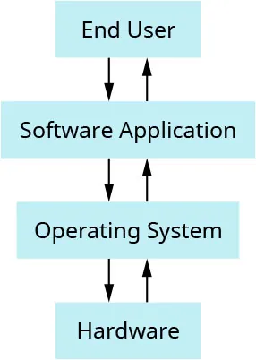

Figure 6.4 shows that the end user begins by using software applications, and those applications are built on top of the operating system. The operating system then communicates with and manages the computer hardware.

---

## 2. Operating System Components

An operating system is a complex system, so it is usually built using a divide-and-conquer approach. This means the system is divided into smaller components, with each component responsible for a specific part of the OS.

The structure of OS components is usually static, meaning the main components are defined as part of the system design. The OS and hardware are tightly connected because the OS must understand how to control and communicate with the hardware.

Important OS components include:

- File systems.
- Memory managers.
- Process managers.
- Network support.
- Device drivers.
- Interrupt handlers.
- Input/output management systems.

### Application Programming Interface, API

An application programming interface, or API, is a set of rules, procedures, and tools that allows software applications to communicate with each other or with the operating system.

Applications make requests to the operating system through APIs. For example, when an application wants to open a file, save data, print a document, or access the network, it does not directly control the hardware. Instead, it sends a request through the OS API, and the operating system performs the required action.

### Operating System Interface

Users interact with the OS through an operating system interface. This interface may be:

- A graphical user interface, GUI.
- A command-line interface.

A GUI allows users to interact with the computer using windows, icons, menus, buttons, and visual indicators. Examples include Microsoft Windows, macOS, and many Linux desktop environments.

A command-line interface allows users to type commands to interact with the operating system. Examples include DOS, Linux shells, macOS Terminal, and Windows Command Prompt or PowerShell.

### Figure 6.5 Space

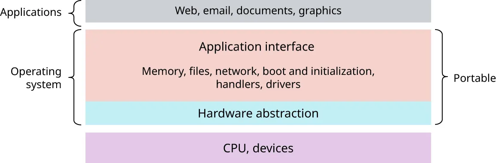

Figure 6.5 shows the relationship between the end user, applications, OS interface, API, OS components, and hardware. Applications such as Chrome, Photoshop, Acrobat, and JVM run on top of the OS. The user interacts through the OS interface and APIs, while OS components manage files, memory, processes, networking, devices, and interrupts.

---

## 3. Process Management and Threads

One of the most important jobs of an operating system is process management. When a user launches an application with a click, the OS creates and manages the process that runs that application.

An operating system executes many types of activities, including:

- User programs.
- Background jobs.
- Scripts.
- System programs.
- Print managers.
- Name servers.
- File servers.

Each running activity is represented as a process.

### What Is a Process?

A process is a running program. More formally, it is a runtime instance of a program plus its execution context.

A program by itself is passive. It is simply stored as bytes on a disk. A process is active because it is a program currently being executed by a processor.

A process includes:

- Program code.
- Program data.
- Program counter.
- CPU registers.
- Virtual memory maps.
- Operating system resources.
- Execution state.

The execution context stores the information needed to pause, resume, and manage the process. This allows the OS to switch between processes while giving the user the impression that many programs are running at the same time.

### Registers

A register is a small, high-speed storage unit located inside the CPU. Registers temporarily hold data, instructions, addresses, and control information needed during program execution.

Registers are much faster than main memory, so they are used for immediate processing tasks.

### Process States

A process can exist in several states:

- Running state: The process is currently being executed by the CPU.
- Ready state: The process is ready to run but is waiting for CPU time.
- Blocked state: The process is waiting for an event, such as input, output, or resource availability.

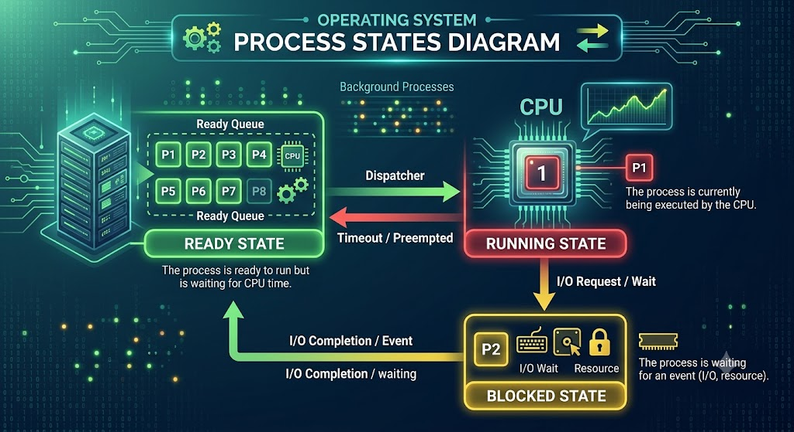

The OS moves processes between these states as it schedules CPU time, waits for devices, and handles system events.

### Process Creation, Destruction, and Scheduling

The OS process management module is responsible for:

- Creating processes.
- Destroying processes.
- Scheduling processes.
- Pausing and resuming processes.
- Allocating CPU time.
- Coordinating access to shared resources.

Scheduling is the process of deciding which process should run next on the CPU. Since there may be many processes competing for CPU time, the OS must make scheduling decisions quickly and fairly.

### Semaphores and Synchronization

A semaphore is a data type used by the OS to control access to shared resources. It helps prevent multiple processes from interfering with one another when they try to use the same resource.

Process synchronization is the management of shared resources so that processes do not create errors, conflicts, or inconsistent results. Synchronization is especially important when multiple processes or threads access the same data or hardware device.

### Think It Through: OS Failure Diagnosis

If a laptop does not fully boot, the failure may be related to the operating system, hardware, power supply, storage device, or boot configuration.

Before seeking professional help, a user could try:

- Checking whether the laptop has power.
- Restarting the laptop.
- Disconnecting unnecessary external devices.
- Checking for error messages during startup.
- Booting into safe mode or recovery mode.
- Checking whether the storage drive is detected.
- Running startup repair tools.
- Restoring from a recent restore point or backup.
- Checking whether recent updates or installed drivers caused the problem.

These steps help identify whether the issue is caused by the OS, hardware, drivers, or corrupted system files.

---

## 4. Processes vs. Threads

A process is an active program, while a thread is a smaller unit of execution within a process. A thread is sometimes called a lightweight process because it is managed independently but shares resources with other threads in the same process.

### Comparison of Processes and Threads

| Attribute | Process | Thread |
|---|---|---|
| Definition | An executed program | A part of a process |
| Weight | Heavier | Lightweight |
| Processing time | Usually takes more time | Usually takes less time |
| Resources | Needs more resources | Needs fewer resources |
| Sharing | Mostly isolated from other processes | Shares memory and data with threads in the same process |

Processes are more independent and isolated. Threads are more closely connected because threads within the same process share memory and data. This makes threads efficient, but it also means they must be carefully synchronized to avoid errors.

---

## 5. Processing: Program, Process, and Processor

Processing involves three related ideas:

- Program.
- Process.
- Processor.

A program is passive because it is stored on disk as instructions. A process is active because it is the execution of a program. A processor is the hardware or virtual hardware that executes the process.

The processor may be:

- A real physical CPU.
- A CPU core.
- A virtual processor assigned to a virtual machine.

At one time, there may be many processes running copies of the same program. For example, a user may open multiple windows of the same text editor. Each window may be represented by a separate process. These processes are usually independent even though they are based on the same program.

The operating system is responsible for managing all of these processes.

### Windows and UNIX Process Management

Different operating systems manage processes in different ways.

In Windows, the operating system provides system calls to create and operate processes. Applications request process-related services through these OS calls.

In UNIX, process creation is commonly split into two steps:

- `fork`
- `exec`

The `fork` function creates a complete copy of an existing process. This copy can be used to set up privileges or prepare the new process environment.

The `exec` function loads an executable file into memory and starts executing it.

Together, `fork` and `exec` allow UNIX systems to create new processes in a flexible way.

---

## 6. Address Space and Memory Space Management

The OS is responsible for managing both address space and memory space.

### Address Space

Address space is the set of addresses generated by a program when it refers to instructions and data. These addresses are used by the program to locate information it needs during execution.

### Memory Space

Memory space refers to the actual main memory locations that can be directly addressed and used during processing.

The address space is what the program sees. The memory space is where data and instructions are actually stored in main memory.

### Figure 6.6 Space

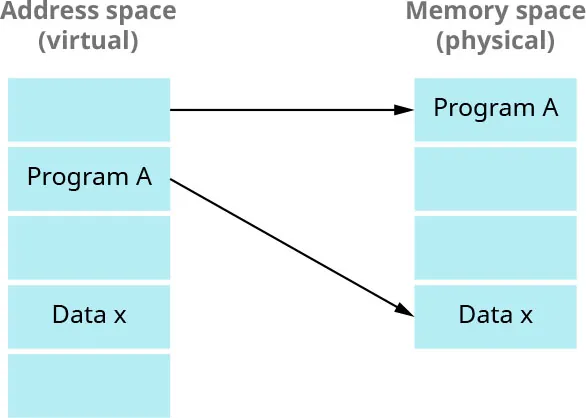

Figure 6.6 shows that addresses for data exist in the address space and are moved to memory space for execution.

### Virtual Memory

To improve performance and usability, computers use virtual memory. Virtual memory creates the illusion that applications and the operating system have access to a large, continuous block of memory.

Virtual memory combines:

- Physical memory, RAM.
- A section of the hard drive or SSD called a swap file or page file.

When there is not enough physical memory to hold all the data needed by running programs, the OS moves pages of memory between RAM and the swap or page file. This allows more programs to run than physical RAM alone would normally allow.

### Pages and Page Movement

Programs are divided into pages. Pages contain address space information and program data. The OS moves pages in and out of physical memory as needed.

If a page is needed but is not currently in RAM, the OS retrieves it from secondary storage. If RAM becomes full, the OS may move less-used pages out of RAM to make room for active pages.

This process helps ensure that enough physical memory is available for the programs currently running.

---

## 7. Primary and Secondary Memory

Computer memory is divided into two main types:

- Primary memory.
- Secondary memory.

### Primary Memory

Primary memory is the first point of access for the processor and provides direct storage for CPU operations. Programs must be loaded into primary memory before they can be executed.

Primary memory is usually volatile, meaning it loses its contents when power is turned off.

Common examples of primary memory include:

- RAM.
- Cache memory.
- CPU registers.

### Primary Memory in Multiprocessor Systems

In multiprocessor systems, primary memory can be organized in different architectures.

#### Uniform Memory Access, UMA

* Uniform memory access uses a single memory controller. Because of this, access time to any memory location is the same for all processors.
* UMA is simpler because all processors experience similar memory access times.

#### Non-Uniform Memory Access, NUMA

* Non-uniform memory access uses different memory controllers. Memory access time varies depending on where the memory is located relative to a processor.
* NUMA can improve scalability in larger systems, but it requires careful management because some memory locations are faster for certain processors than others.

#### Cache-Only Memory Architecture, COMA

* Cache-only memory architecture uses multiple interconnected processing nodes. Each node has a processor and cache.
* COMA allows data to be dynamically allocated for optimized access and performance in multiprocessor environments.

### Secondary Memory

* Secondary memory is used for long-term storage. It stores the operating system, applications, and user data that must remain available even when power is off.
* Secondary memory is nonvolatile, meaning it keeps data during power failures or shutdowns.
* Common examples include:

  - Hard disk drives, HDDs.
  - Solid-state drives, SSDs.
  - USB flash drives.
  - Memory cards.
  - Optical storage.

---

## 8. Memory Allocation and Deallocation

An operating system must decide how much physical memory to allocate to each process and when to remove a process or its data from memory.

The OS must enforce memory management policies using two major mechanisms:

- Memory allocation.
- Memory deallocation.

### Memory Allocation

Memory allocation is the process of setting aside sections of memory for a program to use. Programs need memory to store variables, data structures, objects, and instances of classes.

Memory allocation may be:

- Static memory allocation.
- Dynamic memory allocation.

Static memory allocation happens before program execution or at compile time. The amount of memory needed is known in advance.

Dynamic memory allocation happens during program execution. The program requests memory as needed while it runs.

### Memory Deallocation

Memory deallocation is the process of freeing memory that is no longer needed. When a process finishes or no longer needs certain memory, the OS makes that space available for other processes.

Without deallocation, memory would be wasted and the system could eventually run out of usable memory.

### Virtual-to-Physical Address Mapping

The operating system maintains mappings from virtual addresses to physical addresses. These mappings are commonly stored in page tables.

A virtual address is the address seen by a program. A physical address is the actual location in RAM. The OS and hardware work together to translate virtual addresses into physical addresses.

The OS also switches CPU context among address spaces when it changes from one running process to another.

---

## 9. Industry Spotlight: Windowing Systems

A windowing system is an operating system software component that manages graphical user interfaces on a computer screen.

Windowing systems allow users to interact with programs through windows, menus, icons, and graphical controls. They are essential for modern desktop environments.

Windowing systems affect many industries because they improve user experience and productivity. In retail marketing, for example, windowing systems can help integrate marketing messages with other media that customers are viewing. This can support targeted marketing over the Internet.

Benefits of windowing systems include:

- Better user experience.
- Easier multitasking.
- Improved visual organization.
- More accessible interaction with applications.
- Support for integrated media and marketing content.

---

## 10. Device Drivers and I/O Devices

Computers use many input and output devices. Input devices send data into the computer, while output devices present data from the computer to the user or another system.

Examples of input and output devices include:

- Keyboard.
- Mouse.
- Display.
- Printer.
- USB port.
- Network card.
- Storage device.

Some OS-specific devices include:

- File systems for disks.
- Sockets for networks.
- Frame buffers for video.

### Frame Buffer

A frame buffer is a portion of RAM that contains a bitmap used to drive a video display. The display hardware reads the frame buffer to determine what should appear on the screen.

### I/O Management

A large part of the OS kernel is responsible for input and output management. The OS provides a standard interface between applications, users, and hardware devices.

Instead of each application needing to understand the details of every hardware device, the OS communicates with device drivers. Device drivers then communicate with the hardware.

### Device Drivers

A device driver is specialized software that enables the operating system and applications to interact with a hardware device.

Device drivers perform tasks such as:

- Initializing devices.
- Requesting input or output operations.
- Handling device-specific commands.
- Responding to interrupts.
- Reporting errors.
- Translating OS requests into hardware-specific actions.

Examples of device drivers include:

- Ethernet card drivers.
- Video card drivers.
- Sound card drivers.
- PCIe device drivers.
- Printer drivers.
- Storage device drivers.

Device drivers are often created by hardware manufacturers or open-source contributors. They support a standard internal OS interface and may run in the OS address space with high privileges.

### Figure 6.7 Space

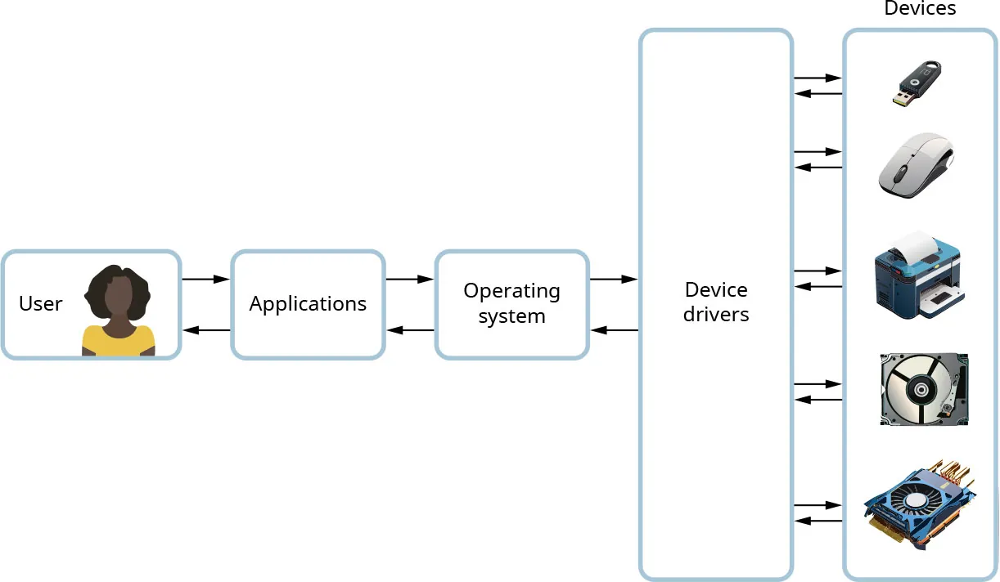

Figure 6.7 shows that multiple I/O devices can be connected to a computer. When an application uses a device, the OS identifies the correct driver and uses it to communicate with that device.

---

## 11. Hardware and Drivers

Device drivers allow higher-level programs to access hardware without needing to know the exact details of the hardware.

### CPU

The CPU is the main component responsible for executing instructions. CPUs usually do not require external device drivers for direct operation because CPU management is one of the fundamental responsibilities of the operating system.

### Memory

Memory is directly managed by the operating system. RAM stores temporary data while the computer is running.

Standard RAM modules, including dynamic RAM and static RAM, usually do not need separate drivers. However, specialized memory-related hardware such as SSDs, USB flash drives, and memory cards interact with the system through storage and file system drivers.

### Storage Devices

Storage devices require drivers so the OS can perform read and write operations. These devices include:

- HDDs.
- SSDs.
- External drives.
- Removable storage media.

### Network Devices

Network connectivity depends on drivers for network interfaces. These drivers manage communication between the operating system, network hardware, and network protocols.

---

## 12. Device Registers

A device register is an interface that a hardware device presents to the operating system or programmer. Each I/O device can appear in the physical address space of the machine as a memory address.

The operating system reads from and writes to device registers to control hardware devices.

There are three main types of device registers:

- Status register.
- Command register.
- Data register.

### Status Register

The status register provides information about the current state of the device. For example, it may indicate whether a device is ready, busy, or has completed an operation.

### Command Register

The command register is used to issue commands to the device. For example, the CPU may write a value to the command register to start an operation.

### Data Register

The data register is used to transfer data between the computer and the device.

### Device Register Bits

Device registers use bits for several purposes:

- Parameters provided by the CPU to the device.
- Status bits provided by the device.
- Control bits set by the CPU to start operations.

### Figure 6.8 Space

Figure 6.8 shows how device register bits can define the first sector to read, the status of an operation, and the operation itself.

### Special Behavior of Device Registers

Device registers behave differently from ordinary memory locations.

For example:

- A start operation bit may always read as 0.
- Some bits may change without being written by the CPU.
- An operation complete bit may change automatically when a device finishes its task.

This behavior is different from normal memory, where values usually change only when written by a program or the OS.

### How the OS Uses Device Registers

The OS communicates with I/O devices through device registers in the following way:

1. The CPU writes to device registers to start an operation.
2. The CPU polls the ready bit in the device register.
3. The device sets the ready bit when the operation is finished.
4. The CPU loads a buffer address into a device register before starting the operation.
5. The device uses the buffer address to know where to copy data read from disk or another source.

### Direct Memory Access, Programmed I/O, and Interrupts

Fast storage media can move data directly to or from physical memory using direct memory access, or DMA. DMA allows devices to transfer data without requiring constant CPU involvement.

Other devices may require CPU intervention using:

- Programmed I/O.
- Interrupt-initiated I/O.

Interrupts allow the CPU to do other work while a device is operating. When the device needs attention, it sends an interrupt signal. The OS then determines which device caused the interrupt and handles it.

---

## 13. Concepts in Practice: Printing and Networking

Operating systems make common tasks such as printing and networking much easier for users.

### Printing

When an application wants to print a document, it gives the task to the operating system. The OS sends instructions to the printer driver. The printer driver then sends the correct signals and commands to the printer.

This process allows applications to print without needing to know the exact technical details of each printer model.

### Networking

When a user uses an application that communicates over the Internet, the application sends messages using the operating system's transport layer socket API.

The OS then:

- Takes messages from the application.
- Splits messages into packets.
- Passes packets to the network interface card.
- Uses the network device driver to transmit data to the Internet.

Networking depends heavily on OS support because the OS manages network protocols, sockets, network drivers, and communication between processes.

### Keyboard Device Register Example

A keyboard can use a device register with 2 bytes, or 16 bits. The first byte contains the data, and the second byte includes zeros from bit 8 to bit 15. When the user starts typing, the ready bit, bit 15, is set to 1.

### Figure 6.9 Space

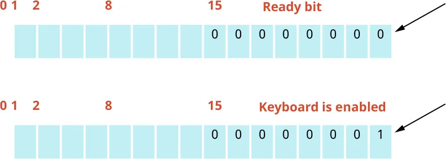

Figure 6.9 shows a keyboard device register. The ready bit is set to 1 when the keyboard is being used.

---

## 14. Operating System Structure

Operating system structure refers to how the OS is organized internally. An OS contains many core components as well as privileged and non-privileged system programs.

Because the OS controls important resources, it must enforce security and authority. One major way it does this is through dual-mode operation.

### Dual-Mode Operation

Dual-mode operation separates:

- User mode.
- Kernel mode.

This separation helps protect the system from accidental or malicious actions by user programs.

### Kernel Mode

Kernel mode is the privileged mode of operation. Code running in kernel mode can access hardware directly and execute privileged instructions.

Privileged system programs can run only in kernel mode.

An example of a privileged system program is the bootstrap code. The bootstrap code is the first code executed when the OS starts. The OS depends on the bootstrap program to load correctly and begin system operation.

If a user program attempts to execute privileged instructions, the operating system blocks that execution.

### User Mode

User mode is the restricted mode used by ordinary applications and non-privileged system programs.

A non-privileged system program can run only in user mode. Examples include reading processor status or reading the system time. These operations are generally safe for users and applications.

### Figure 6.10 Space

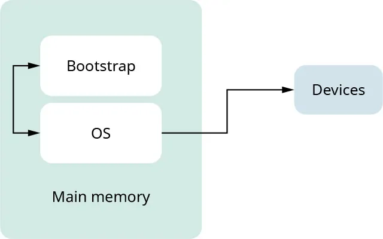

Figure 6.10 shows the role of the bootstrap program when the OS starts and begins using devices.

---

## 15. Operating System Design

Designing an operating system is a major software engineering challenge. An OS must be:

- Fast.
- Reliable.
- Secure.
- Extensible.
- Maintainable.
- Backward compatible.

Operating system design has developed through experimentation and evolution. There is no single correct way to structure an OS because different systems have different goals and trade-offs.

Common OS architectures include:

- Monolithic design.
- Layered design.
- Hardware abstraction layer.
- Microkernel design.
- Hybrid kernel design.
- Exokernel design.
- Cloud infrastructure.
- Virtual machine monitors.

The best OS architecture depends on the intended use, performance requirements, security needs, hardware environment, and design goals.

---

## 16. Monolithic OS Design

A monolithic OS design is an architecture where the entire operating system operates in kernel space. All major OS components are organized within the same address space.

In a monolithic architecture, the OS works as a single large program. Components such as process management, memory management, file systems, and device drivers all run in kernel space and can directly call one another.

### Advantages of Monolithic Design

Monolithic OS design has several advantages:

- Communication between OS components is fast.
- Components share the same address space.
- Procedure calls between modules are low cost.
- The architecture is familiar and historically common.
- Performance can be strong because fewer boundaries need to be crossed.

### Disadvantages of Monolithic Design

Monolithic OS design also has important disadvantages:

- The system can be hard to understand.
- The system can be hard to modify.
- The system can be hard to maintain.
- Fault containment is weak.
- A failure in one component can crash the whole system.
- It is less modular than some alternative designs.

Traditional UNIX systems were built using monolithic architecture.

### Figure 6.11 Space

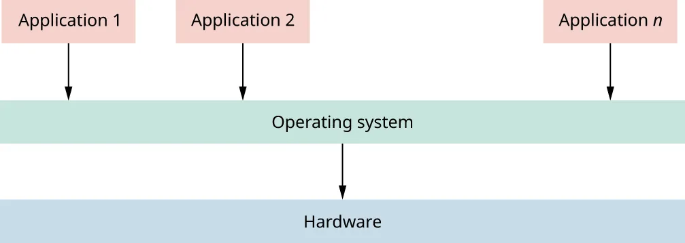

Figure 6.11 shows the monolithic architecture, where the entire operating system works as one large integrated unit.

---

## 17. Layered OS Design

Layered OS design organizes the operating system as a set of layers. Each layer provides services to the layer above it and depends on services from the layer below it.

Each layer exposes an enhanced virtual machine to the next layer. This means higher layers do not need to know every detail of lower layers.

### Figure 6.12 Space

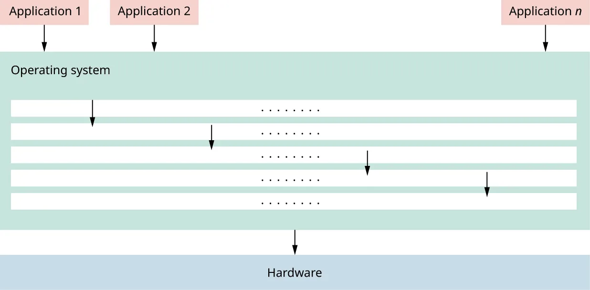

Figure 6.12 shows a layered OS architecture where the operating system is divided into layers, and each layer is responsible for a specific task.

### Dijkstra's THE System

One of the first examples of a layered OS was Dijkstra's THE system, designed in 1968.

It had six layers:

| Layer | Purpose |
|---|---|
| Layer 5 | Job manager executes users' programs |
| Layer 4 | Device manager handles devices and buffering |
| Layer 3 | Console manager implements virtual consoles |
| Layer 2 | Page manager implements virtual memories for each process |
| Layer 1 | Kernel implements a virtual processor for each process |
| Layer 0 | Hardware, the physical computer components |

### Advantages of Layered Design

Layered design has several advantages:

- Each layer can be tested independently.
- Each layer can be verified separately.
- Implementation can be easier to organize.
- Formal verification may be easier.
- Restricting calls to lower layers can prevent circular dependencies.

### Disadvantages of Layered Design

Layered design also has disadvantages:

- Real systems are often more complex than strict layers allow.
- Some components need services from layers that do not fit neatly below them.
- A file system may require virtual memory services.
- Virtual memory may use files as backing storage.
- Crossing layers can create performance overhead.
- The model may not match how the system is actually built.

Layering is useful as a design idea, but strict layering may be difficult in practical operating systems.

---

## 18. Hardware Abstraction Layer, HAL

The hardware abstraction layer, or HAL, is an example of layering in modern operating systems.

The HAL allows the OS to interact with hardware at a general or abstract level rather than requiring core OS code to handle every hardware detail directly.

### Purpose of HAL

The purpose of HAL is to separate hardware-specific routines from the core operating system.

Benefits of HAL include:

- Better readability.
- Better maintainability.
- Easier portability across hardware platforms.
- Less hardware-specific code in the core OS.

HAL enables the same core OS code to run on different hardware with fewer changes.

---

## 19. Microkernels

A microkernel is an OS architecture that keeps the kernel as small as possible. Only the most essential functions are placed in the kernel. Other operating system services are implemented as user-level processes or plug-ins.

Microkernel architecture is sometimes called plug-in architecture because OS functionality is added as separate components.

### Figure 6.13 Space

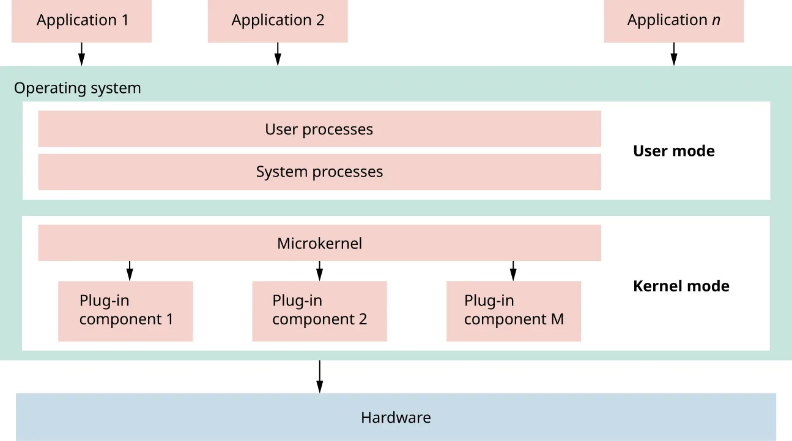

Figure 6.13 shows microkernel architecture, where kernel mode is divided into multiple plug-ins to process operations.

### Goal of Microkernel Architecture

The goal of a microkernel is to minimize what runs inside the kernel. Services that traditionally run inside the OS kernel are moved to user-level processes when possible.

### Advantages of Microkernels

Microkernels can provide:

- Improved reliability.
- Better isolation between components.
- Less code running with full privilege.
- Easier extension.
- Easier customization.
- Better fault containment.

If one user-level service fails, it may be possible to restart it without crashing the whole system.

### Disadvantages of Microkernels

Microkernels also have disadvantages:

- Performance may be lower.
- Communication across user-kernel boundaries adds overhead.
- Boundary crossings can create security concerns.
- Design and implementation can be complex.

### Examples of Microkernel Systems

Early and important microkernel-related systems include:

- Hydra, developed at Carnegie Mellon University in 1970.
- Mach, also developed at Carnegie Mellon University.
- Chorus, a French UNIX-like operating system.
- OS X, which uses architecture influenced by Mach.

Windows previously used a microkernel-style design but now uses a hybrid kernel architecture.

### Windows Hybrid Kernel

A hybrid kernel combines ideas from several OS architectures, including:

- Monolithic design.
- Microkernel design.
- Plug-in architecture.

This approach attempts to balance performance, modularity, and reliability.

### Figure 6.14 Space

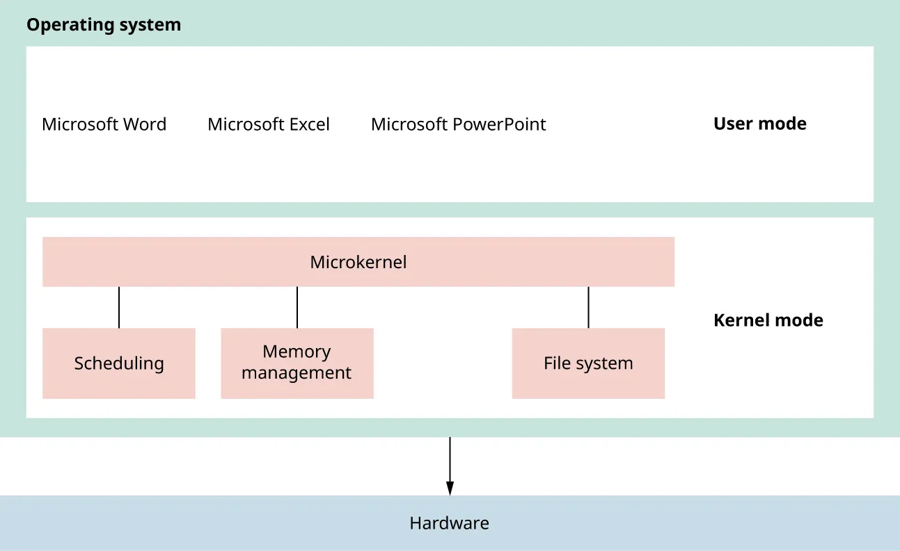

Figure 6.14 shows Windows as a plug-in architecture. Applications run in user mode, while OS operations are divided into plug-ins in kernel mode.

---

## 20. Cloud Infrastructure and Exokernel

Cloud infrastructure and exokernels are two important concepts in modern computing. They represent different approaches to resource abstraction, allocation, and management.

### Exokernel

An exokernel is an OS architecture that keeps the kernel extremely small and gives applications more direct control over hardware resources.

Traditional operating systems hide hardware details behind abstractions. An exokernel exposes hardware details to applications so they can manage resources in ways that best fit their needs.

### Benefits of Exokernels

Exokernels can provide:

- Reduced unnecessary abstraction.
- More application control over hardware.
- Improved performance for specialized tasks.
- More efficient use of hardware resources.
- Greater flexibility for application developers.

This architecture is especially useful for specialized computing tasks where applications can benefit from managing hardware directly.

### Limitations of Exokernels

Exokernels also have limitations:

- They lack common OS service abstractions.
- Consistency across applications can be difficult.
- Application developers must manage resource allocation.
- Developers must handle protection and security mechanisms.
- Incorrect application-level management can create risks.

---

## 21. Cloud Infrastructure

Cloud infrastructure refers to virtualized and scalable hardware resources delivered over the Internet as a service.

Cloud infrastructure includes:

- Servers.
- Storage devices.
- Network equipment.
- Virtualization software.
- Data centers.
- Cloud management platforms.

These resources are hosted and managed by cloud service providers.

Unlike traditional physical infrastructure, cloud infrastructure is flexible and scalable. Users can access computing resources remotely through the Internet.

### Cloud Service Models

Cloud infrastructure is commonly divided into three service models:

| Service Model | Meaning | Examples |
|---|---|---|
| Infrastructure as a Service, IaaS | Provides virtualized computing resources over the Internet | AWS EC2, Google Compute Engine, Microsoft Azure VMs |
| Platform as a Service, PaaS | Provides hardware and software tools for developers over the Internet | Google App Engine, Microsoft Azure |
| Software as a Service, SaaS | Delivers software applications through a browser without local installation | Google Workspace, Microsoft Office 365 |

### Advantages of Cloud Infrastructure

Cloud infrastructure provides:

- Flexibility.
- Scalability.
- Remote accessibility.
- Reduced need for local hardware.
- Easier deployment of applications.
- Support for virtual machines.
- On-demand computing resources.

### Disadvantages of Cloud Infrastructure

Cloud infrastructure also has disadvantages:

- Possible downtime.
- Security concerns.
- Privacy concerns.
- Vulnerability to attacks.
- Limited control.
- Limited flexibility in some cases.
- Vendor lock-in.
- Cost concerns.
- Latency issues.
- Dependence on Internet access.
- Technical problems.
- Lack of support in some situations.
- Bandwidth limitations.
- Inconsistent performance.

---

## 22. Technology in Everyday Life: Remote Emailing

Virtual machines are used across many industries because they allow companies to run many business applications efficiently.

Cloud email services such as Google Mail and Microsoft Outlook are examples of Software as a Service. These services run email software on virtual machines located in Google and Microsoft cloud data centers.

### Advantages of SaaS Email

SaaS email has several advantages:

- It is portable.
- It can run on any device with a compatible browser.
- It works across laptops, desktops, tablets, and mobile phones.
- Data can be backed up automatically.
- Users do not need complicated installation.
- Users do not need complex configuration.

### Disadvantages of SaaS Email

SaaS email also has disadvantages:

- Data may face security risks.
- Unauthorized access is a concern.
- Users may be unable to access email without a network connection.
- Weak Internet connections can reduce usability.
- Users depend on the cloud provider's availability.

---

## 23. Key Terms

| Term | Meaning |
|---|---|
| Operating system | Software that manages computer hardware and provides services for programs |
| API | A set of rules and tools that allows software to communicate with the OS or other software |
| GUI | A visual interface using windows, icons, and graphical controls |
| Command line | A text-based interface where users type commands |
| Process | A running program with an execution context |
| Thread | A lightweight unit of execution within a process |
| Register | High-speed storage inside the CPU |
| Semaphore | A data type used to control access to shared resources |
| Process synchronization | Coordination of shared resource access among processes or threads |
| Address space | The set of addresses generated by a program |
| Memory space | Actual main memory locations used during processing |
| Virtual memory | A memory technique that combines RAM and storage to appear as larger memory |
| Page table | A structure used to map virtual addresses to physical addresses |
| Primary memory | Memory directly accessible by the CPU, usually volatile |
| Secondary memory | Long-term nonvolatile storage |
| Device driver | Software that allows the OS to communicate with hardware |
| Interrupt | A signal that tells the CPU an event needs immediate attention |
| Device register | A hardware interface used by the OS to control a device |
| DMA | Direct memory access, which lets devices transfer data directly to memory |
| Kernel mode | Privileged OS execution mode |
| User mode | Restricted execution mode for applications |
| Bootstrap | First code executed when the OS starts |
| Monolithic OS | OS design where major components run together in kernel space |
| Layered OS | OS design organized into layers |
| HAL | Hardware abstraction layer that separates hardware-specific code from core OS code |
| Microkernel | Minimal kernel design with many services outside the kernel |
| Exokernel | Minimal kernel design that gives applications more direct hardware control |
| Cloud infrastructure | Virtualized computing resources delivered over the Internet |

---

## 24. Summary

An operating system is the central software layer that manages computer hardware and provides services for applications. It handles memory, files, processes, input/output devices, device drivers, networking, and user interaction.

Processes and threads allow programs to run and perform tasks. Processes are independent running programs, while threads are lighter units within processes that share memory and data. The OS schedules processes, manages synchronization, and controls access to shared resources.

Memory management allows programs to use address spaces and virtual memory while the OS maps those addresses to physical memory. The OS allocates and deallocates memory, manages pages, and supports primary and secondary storage.

Device drivers and I/O systems allow the OS and applications to communicate with hardware devices without needing to know every hardware detail. Device registers, interrupts, and DMA help coordinate efficient communication between the CPU, memory, and devices.

Operating systems can be structured in many ways. Monolithic systems place most OS functionality in kernel space for speed but can be difficult to maintain. Layered systems organize the OS into levels for clarity but may suffer from performance overhead. Microkernels keep the kernel small and improve isolation but may be slower due to boundary crossings. Exokernels give applications more direct control over hardware but require developers to manage more complexity. Cloud infrastructure extends OS and virtualization concepts by delivering computing resources over the Internet through IaaS, PaaS, and SaaS models.

Overall, operating systems are essential because they make computers usable, efficient, secure, and capable of running many applications at the same time.
