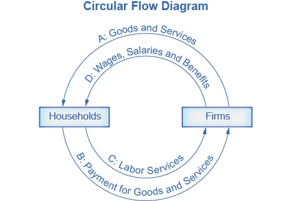

---

# **Economic Theories, Models, and the Circular Flow Diagram**

## **Learning Objectives**

By the end of this section, you will be able to:

* **Interpret a circular flow diagram**
* **Explain the importance of economic theories and models**
* **Describe goods and services markets and labor markets**

---

# **1. Economics as a Way of Thinking**

Economics is not only a subject but a **method of reasoning**.
One of the most influential economists of the 20th century, **John Maynard Keynes (1883–1946)**, emphasized that economics teaches people **how to think**, not **what to think**. He wrote:

> “[Economics] is a method rather than a doctrine, an apparatus of the mind, a technique of thinking, which helps its possessor to draw correct conclusions.”

This reflects the core idea that economics provides a **mental toolkit** for analyzing decisions, patterns, and problems in society.

### **Why Economists Think Differently**

Economists rely on assumptions about human behavior that differ from those of:

* Anthropologists
* Biologists
* Sociologists
* Psychologists

For example:

* A psychologist may study how emotions affect behavior.
* An economist focuses on how **incentives, costs, and benefits** shape choices.

Thus, economics offers a unique lens for understanding human actions and social systems.

---

# **2. Theories and Models in Economics**

### **2.1 What Is a Theory?**

A **theory** is a simplified explanation of how two or more variables interact.
Its purpose is not to mirror the real world exactly, but to clarify the **essential elements** of a complex issue.

**Characteristics of a good economic theory:**

* **Simplified** enough to understand
* **Comprehensive** enough to capture key behavior
* **Useful** for explaining and predicting outcomes

### **Example of a Theory**

A theory might state that:

* When the **price of a good rises**, the **quantity demanded falls** (the law of demand).

This does not capture all human behavior, but it identifies a **predictable pattern** applicable to most markets.

---

### **2.2 What Is a Model?**

A **model** is a more applied, often more empirical version of a theory.

* A **theory** is abstract.
* A **model** may include diagrams, equations, or real-world data.

Economists often use “theory” and “model” interchangeably in introductory courses.

### **Non-Economic Examples**

* **Architect’s model:** A miniature version of a building to visualize how it fits in a city block.
* **Product prototype:** A simplified version of a new device used to demonstrate function.

These examples highlight how models help us understand, test, or communicate ideas before dealing with the full complexity of reality.

---

# **3. The Circular Flow Diagram**

One of the most fundamental models in economics is the **circular flow diagram**.
It shows how **households** and **firms** interact in two basic markets:

1. **The goods and services market** (product market)
2. **The labor market** (factor market)

Although simplified, this model captures the essence of how economic activity is organized.

---

## **3.1 Components of the Circular Flow**

### **Households**

* Own labor and other resources (land, capital, raw materials)
* Purchase goods and services
* Receive income through wages, salaries, and benefits

### **Firms**

* Produce goods and services
* Hire labor and use other inputs
* Sell products to households for revenue

---

## **3.2 Understanding the Arrows in the Circular Flow**

The diagram features two loops:

### **A. Outer Loop — Goods and Services Market**

* **Firms → Households:** Firms sell goods and services (Arrow A).
* **Households → Firms:** Households pay for these goods and services (Arrow B).

These arrows represent the **product market**, where:

* Households **demand** goods and services
* Firms **supply** them

### **Example**

A household buys a laptop from a firm like HP or Apple.

* The laptop moves from the firm to the household.
* Money flows from the household to the firm.

---

### **B. Inner Loop — Labor Market**

* **Households → Firms:** Households provide labor (Arrow C).
* **Firms → Households:** Firms pay wages, salaries, and benefits (Arrow D).

These arrows represent the **factor market**, where:

* Households **supply** labor
* Firms **demand** labor

### **Example**

A household member works as a nurse at a hospital.

* The nurse provides labor to the firm (the hospital).
* The hospital pays income in the form of wages and benefits.

---

# **4. Goods and Services Markets vs. Labor Markets**

## **4.1 Goods and Services Market**

Often called the **product market**, this is where:

* Firms sell goods and services
* Households buy them

**Examples of product markets:**

* Grocery stores
* Clothing outlets
* Streaming services (Netflix)
* Ride-sharing (Uber, Grab)

In each case:

* Firms supply the product
* Households demand it

---

## **4.2 Labor Market**

This is where:

* Households supply labor
* Firms hire workers

**Examples of labor markets:**

* A software company hiring a developer
* A school hiring teachers
* A restaurant hiring cooks

Here:

* Households provide labor
* Firms create the demand for labor

---

# **5. Why Economic Models Matter**

Economists use models to analyze problems with clarity and precision.
Models are as essential to economists as:

* Tools are to carpenters
* Maps are to geographers
* Lenses are to scientists

### **Why Models Are Useful**

* They focus attention on **key relationships**
* They help identify **causes and effects**
* They allow us to make **predictions**

### **Examples of Common Economic Models**

* **Supply and demand curves** (predict prices and quantities)
* **Production possibility frontiers** (illustrate trade-offs)
* **Circular flow diagrams** (show the structure of an economy)

Economists do not draw models to decorate their work—they use models to **figure out answers**.
In higher-level economics, it becomes impossible to analyze problems without formal models and graphs.

---

# **6. Extending the Circular Flow**

The basic circular flow model includes:

* Households
* Firms
* Product markets
* Labor markets

But economies also include:

* **Financial markets** (banks, stock markets)
* **Governments** (taxation, spending)
* **Foreign sectors** (imports, exports)

These can be added to make the model more realistic.

### Example:

If the government collects taxes and hires workers, it becomes both a buyer in the labor market and a seller of public services (education, defense).

---

# **Conclusion**

The circular flow diagram provides a simplified yet powerful visualization of how households and firms interact through markets. Economic theories and models allow economists to think clearly about these interactions, identify patterns, and solve complex problems. Understanding these foundations prepares students to explore more advanced concepts such as supply and demand, market efficiency, and macroeconomic policy.

---

