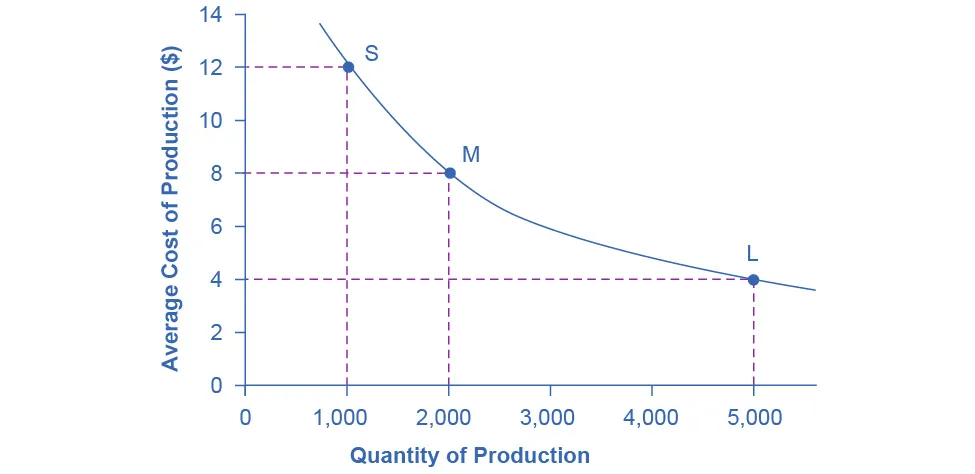
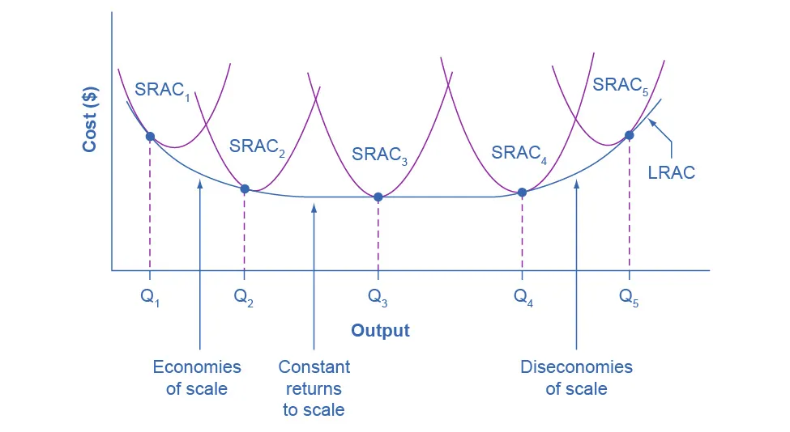

---

# **Lesson Notes: Costs in the Long Run**

## **Learning Objectives**

By the end of this lesson, you should be able to:

* **Calculate long-run total cost** using alternative production technologies
* **Identify** economies of scale, diseconomies of scale, and constant returns to scale
* **Interpret** long-run average cost (LRAC) curves and their relationship to short-run average cost (SRAC) curves
* **Analyze** how production decisions differ in the short run vs. long run

---

# **1. Understanding the Long Run**

### **Definition**

* The **long run** is a planning period in which **all inputs are variable**.
* There are **no fixed costs**; firms can:

    * Build or close factories
    * Buy or sell machinery
    * Hire more or fewer workers
    * Change production technology entirely

### **Important Note**

The long run is **not defined by calendar time**. It depends on the firm’s ability to adjust all inputs.

* Example: If a firm has a one-year factory lease, any period **longer than a year** counts as the long run.

---

# **2. Choice of Production Technology**

### **What is “Technology” in Economics?**

In microeconomics, *technology* means:

> The **method of combining inputs** (labor, capital, land) to produce output.

It does **not** necessarily mean a “new invention.”
Different production processes can produce the same output using different input combinations.

---

## **2.1 Substitution Between Labor and Capital**

Firms often face trade-offs:

* Human workers (labor)
* Machines (capital)

**Capital may substitute for labor** when wages rise.
**Labor may substitute for capital** when machines are expensive.

### **Examples of Input Substitution**

* Phones answered by:

    * Human receptionist
    * Automated voicemail system

* Inventory management by:

    * File clerks
    * Automated software system

* Factory transport using:

    * Workers pushing carts
    * Motorized vehicles
    * Robots

Firms choose **the least-cost method** of producing a given output.

---

# **3. Practical Example: Cleaning a Park**

Three technologies can produce **one cleaned-up park**:

| Technology | Workers | Machines |
| ---------- | ------- | -------- |
| 1          | 10      | 2        |
| 2          | 7       | 4        |
| 3          | 3       | 7        |

Now compare total cost under different wage levels.

---

## **3.1 Example A — Workers cost \$40, Machines \$80**

| Technology | Labor Cost | Machine Cost | Total Cost |
| ---------- | ---------- | ------------ | ---------- |
| 1          | 10×40=400  | 2×80=160     | **560**    |
| 2          | 7×40=280   | 4×80=320     | 600        |
| 3          | 3×40=120   | 7×80=560     | 680        |

➡️ **Technology 1 is cheapest** when labor is relatively cheap.

---

## **3.2 Example B — Wages rise to \$55**

| Technology | Labor Cost | Machine Cost | Total Cost |
| ---------- | ---------- | ------------ | ---------- |
| 1          | 550        | 160          | 710        |
| 2          | 385        | 320          | **705**    |
| 3          | 165        | 560          | 725        |

➡️ **Technology 2 becomes cheapest** as labor becomes more expensive.

---

## **3.3 Example C — Wages rise to \$90**

| Technology | Labor Cost | Machine Cost | Total Cost |
| ---------- | ---------- | ------------ | ---------- |
| 1          | 900        | 160          | 1,060      |
| 2          | 630        | 320          | 950        |
| 3          | 270        | 560          | **830**    |

➡️ **Technology 3 is cheapest** when labor is very expensive.

---

### **Key Insight**

> As the price of an input rises, firms substitute away from that input.

This explains why:

* The **demand curve for labor is downward sloping.**
* Multinational firms use:

    * Capital-intensive production in high-wage countries
    * Labor-intensive production in low-wage countries

---

# **4. Economies of Scale**

### **Definition**

Economies of scale occur when:

> **Average cost (AC) decreases as output increases.**

This happens because large-scale production spreads costs over more units.

### **Examples**

* Warehouse stores (Walmart, Costco)
* Large manufacturing plants
* Software companies with high fixed costs and low marginal costs

---

## **4.1 Numerical Example: Alarm Clock Factory**

| Factory Size | Output | Avg Cost |
| ------------ | ------ | -------- |
| S (small)    | 1,000  | $12      |
| M (medium)   | 2,000  | $8       |
| L (large)    | 5,000  | $4       |

Graph: **Downward-sloping long-run average cost curve (LRAC)** as output increases.

---

# **5. Why Economies of Scale Happen**

### Common Sources:

1. **Specialization of Labor and Capital**
   Larger firms can divide tasks more efficiently.

2. **Bulk Buying**
   Large firms negotiate discounts on materials.

3. **Spreading fixed costs**
   Factories, design costs, and R&D are amortized over more units.

4. **Technological Advantages**
   Some machines or methods only make sense at large scale.

---

## **5.1 Example: Chemical Industry and the “Six-Tenths Rule”**

* Pipe **circumference** doubles → material cost doubles
* Pipe **cross-sectional area** quadruples → capacity quadruples

| Pipe Size | Circumference | Area        |
| --------- | ------------- | ----------- |
| 4-inch    | 12.5 in       | 12.5 sq in  |
| 8-inch    | 25.1 in       | 50.2 sq in  |
| 16-inch   | 50.2 in       | 201.1 sq in |

**Conclusion:** A small increase in material cost leads to a large increase in capacity.
Hence, chemical plants benefit significantly from economies of scale.

---

# **6. Long-Run Average Cost (LRAC) Curve**

The LRAC curve represents:

> The **lowest possible cost** of producing each output level when the firm can adjust all inputs.

It is constructed from **many short-run average cost curves (SRACs)**.

---

## **6.1 How LRAC is Built**

Imagine:

* SRAC₁ = small factory
* SRAC₂ = medium factory
* SRAC₃ = large factory
* SRAC₄ = very large
* SRAC₅ = ultra-large

The **LRAC is the envelope curve**—the lower boundary of all SRAC curves.

Visual:

* The LRAC touches the lowest point of each SRAC curve.

---

# **7. Three Regions of the LRAC Curve**

The LRAC typically has a **U-shape** with three segments:

---

## **7.1 Region 1: Economies of Scale (Q₁ → Q₂ → Q₃)**

LRAC slopes **downward**.
Reasons:

* Specialization
* Bulk purchasing
* Spreading fixed costs

---

## **7.2 Region 2: Constant Returns to Scale (around Q₃)**

LRAC is **flat**.
Meaning:

* Increasing output does **not** change average cost much.

Industries with constant returns to scale include:

* Food processing
* Clothing manufacturing

---

## **7.3 Region 3: Diseconomies of Scale (Q₄ → Q₅)**

LRAC slopes **upward**.

Reasons:

* Coordination problems
* Too many layers of management
* Communication breakdown
* Bureaucratic inefficiency

Large plants in centrally planned economies often experienced diseconomies of scale because competition did not force them to stay efficient.

---

# **8. Economies of Scale vs. Diminishing Marginal Returns**

These concepts apply in **different time frames**:

| Concept                          | Time Frame | Inputs Variable?                   | What Changes?                 |
| -------------------------------- | ---------- | ---------------------------------- | ----------------------------- |
| **Diminishing marginal returns** | Short run  | *One* variable input (e.g., labor) | Marginal & average costs rise |
| **Economies of scale**           | Long run   | *All* inputs                       | Average cost may fall or rise |

Thus:

* A firm may have **diminishing returns** in the short run
* And **economies of scale** in the long run

Both ideas are compatible.

---

# **9. Practical Example: Calculating Long-Run Cost**

### Suppose:

* Factory A: cost $1 million/year, can produce 100,000 units (AC = $10/unit)
* Factory B: cost $3 million/year, can produce 500,000 units (AC = $6/unit)
* Factory C: cost $9 million/year, can produce 1.5 million units (AC = $6/unit)

### Interpretation:

* Economies of scale from A → B
* Constant returns to scale from B → C
* If at some size average cost rises, that is diseconomies of scale.

---

# **10. Short-Run vs. Long-Run Decisions: Summary**

| Characteristic | Short Run     | Long Run                |
| -------------- | ------------- | ----------------------- |
| Fixed inputs?  | Yes           | No                      |
| Fixed costs?   | Yes           | None                    |
| SRAC           | One curve     | Many curves             |
| LRAC           | Not available | Envelope of SRAC curves |
| Adjustment     | Limited       | Full flexibility        |

---

# **11. Key Takeaways**

* In the long run, firms choose the **cost-minimizing production technology**.
* **All costs are variable**; no input is fixed.
* **Economies of scale** lower average costs as output rises.
* **Diseconomies of scale** increase average costs due to coordination problems.
* **Constant returns to scale** occur when increasing inputs increases output proportionally.
* The **LRAC curve** is the boundary of all SRAC curves—representing the lowest possible cost at each output level.
* Firms plan long-term production and investment decisions using the LRAC.

---

