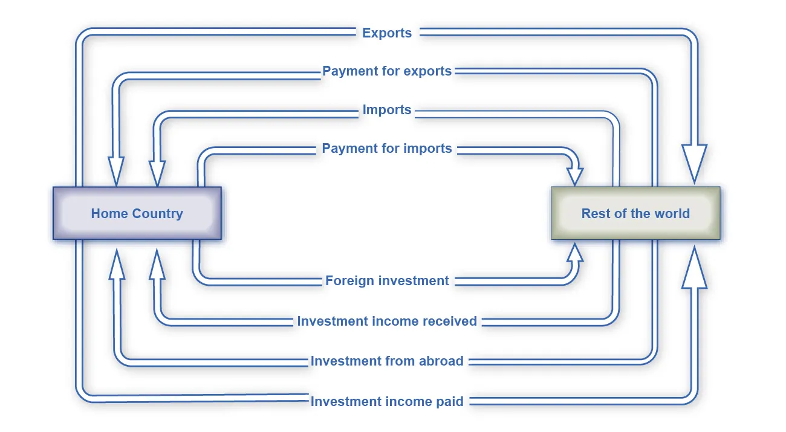

---

# Trade Balances and Flows of Financial Capital

---

## Learning Objectives

By the end of this section, you will be able to:

* Explain the connection between **trade balances** and **financial capital flows**
* Calculate **comparative advantage**
* Explain **balanced trade** in terms of investment and capital flows

---

## 1. Trade Balances: Good or Bad?

Economists do not view trade surpluses or trade deficits as inherently good or bad. Whether a surplus or deficit is beneficial depends on the **circumstances**. The key challenge is understanding how **international flows of goods and services** are connected to **international flows of financial capital**.

In this section, the relationship between trade balances and financial capital flows is illustrated in two ways:

1. A **parable** involving Robinson Crusoe and Friday
2. A **circular flow diagram** showing trade and payment flows between countries

---

## 2. A Two-Person Economy: Robinson Crusoe and Friday

To understand trade surpluses and deficits, consider a simple two-person economy consisting of **Robinson Crusoe** and **Friday**.

Robinson and Friday trade goods and services. For example:

* Robinson catches fish and trades them for coconuts
* Friday weaves a hat and trades it for help carrying water

In these voluntary exchanges:

* Each trade is complete and self-contained
* Each person’s **exports equal imports**
* Trade is always **balanced**
* Neither Robinson nor Friday runs a trade surplus or deficit

---

## 3. How Trade Imbalances Arise

A trade imbalance occurs when trade is **not settled immediately**.

Suppose Robinson wants to dig irrigation ditches for his garden. While working on this project, he will not have enough time to fish or gather coconuts. He proposes that:

* Friday supplies fish and coconuts for several months
* Robinson promises to repay Friday later using produce from his improved garden

If Friday agrees:

* **Friday runs a trade surplus**, exporting more than he imports
* **Robinson runs a trade deficit**, importing more than he exports

In economic terms:

* Friday is **lending** fish and coconuts
* Robinson is **borrowing**

---

## 4. What Can Go Wrong?

This arrangement introduces **uncertainty**:

* Robinson may fail to complete the irrigation system
* The irrigation system may not increase production as expected
* Robinson may refuse or be unable to repay Friday

Friday’s response will depend on why repayment fails. If Robinson worked hard but failed due to bad luck, Friday may be sympathetic. If Robinson loafed or refuses to pay, Friday may react negatively.

---

## 5. Trade Balances and Financial Capital Flows

The Robinson–Friday parable highlights a key economic insight:

* A **trade surplus** is the same as **lending to another country**
* A **trade deficit** is the same as **borrowing from another country**

More precisely:

* Friday’s trade surplus equals the amount he lends to Robinson
* Robinson’s trade deficit equals the amount he borrows from Friday

To economists:

* A **trade surplus** means an **outflow of financial capital**
* A **trade deficit** means an **inflow of financial capital**

---

## 6. Comparative Advantage and Trade

The story of Robinson and Friday also helps explain the **law of comparative advantage**, which shows why countries benefit from specializing and trading.

### Example: United States and Britain in the 1800s

In the 1800s, the United States and Britain traded **wheat** and **cloth**.

### Table 23.5 Hours of Labor per Unit of Output

| Country       | Wheat (bushels) | Cloth (yards) | Relative Labor Cost of Wheat (Pw/Pc) | Relative Labor Cost of Cloth (Pc/Pw) |
| ------------- | --------------- | ------------- | ------------------------------------ | ------------------------------------ |
| United States | 8               | 9             | 8/9                                  | 9/8                                  |
| Britain       | 4               | 3             | 4/3                                  | 3/4                                  |

* Britain has an **absolute advantage** in both goods (lower labor cost)
* Britain has a **comparative advantage in cloth** (lower opportunity cost)
* The United States has a **comparative advantage in wheat**

The relative price of wheat in terms of cloth reflects opportunity cost and determines the basis for mutually beneficial trade.

---

## 7. The Balance of Trade as the Balance of Payments

Because trade and financial flows are so closely linked, economists often describe the **balance of trade** as the **balance of payments**.

Each component of the **current account balance** has a corresponding flow of financial payments between a country and the rest of the world.

---

## 8. Flow of Goods, Services, and Capital

---

---

The diagram shows:

* Exports of goods and services leaving the home country
* Payments received from abroad for those exports
* Imports of goods, services, and investment entering the home country
* Payments sent abroad in exchange for imports

Flows of goods and services appear in the **current account**, while flows of funds appear in the **financial account**.

---

## 9. Investment Income and Capital Flows

The diagram also shows investment flows:

* Domestic funds invested abroad
* Investment income returning to the home country
* Foreign investment flowing into the home country
* Investment income paid to foreign investors

Investment income is recorded in the **current account**, while the investment itself is recorded in the **financial account**.
Unilateral transfers are not shown in the diagram.

---

## 10. Trade Deficits, Surpluses, and Capital Flows

* A **current account deficit** means a country is a **net borrower** from abroad
* A **current account surplus** means a country is a **net lender** to the rest of the world

Just like Robinson and Friday:

* A trade surplus corresponds to an **outflow of financial capital**
* A trade deficit corresponds to an **inflow of foreign investment capital**

These capital flows involve **private investment**, such as real estate, companies, stocks, and bonds—not just government debt.

---

## 11. Key Takeaways

* Trade balances and financial capital flows are two sides of the same transaction
* Trade deficits reflect borrowing; trade surpluses reflect lending
* Comparative advantage explains why trade can benefit all parties
* Balanced trade must be understood in terms of **investment and capital flows**, not just goods and services

---

