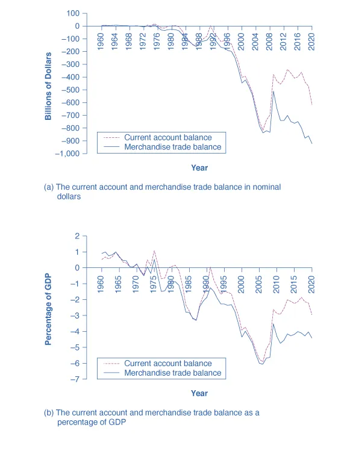

---

# The National Saving and Investment Identity

---

## Learning Objectives

By the end of this section, you will be able to:

* Explain the **determinants of the trade and current account balance**
* Identify and calculate **supply and demand for financial capital**
* Explain how a nation’s **domestic saving and investment** determine its balance of trade
* Predict **rising and falling trade deficits** using the national saving and investment identity

---

## 1. Trade Balances as a Macroeconomic Phenomenon

The close connection between **trade balances** and **international flows of saving and investment** leads to a macroeconomic approach to trade. Rather than focusing on individual industries, this approach examines trade balances within the broader framework of **saving, investment, and financial capital markets**.

From this perspective, trade balances and capital flows are determined by **economy-wide decisions** about saving and investment.

---

## 2. Determinants of the Trade and Current Account Balance

The **national saving and investment identity** provides a framework for understanding the determinants of a country’s trade and current account balance.

In a nation’s financial capital market:

* The **quantity of financial capital supplied** must equal
* The **quantity of financial capital demanded**

This equality must always hold by definition.

---

## 3. Supply and Demand for Financial Capital

### Supply of Financial Capital

The supply of financial capital comes from:

* **Private domestic saving (S)** by households and firms
* **Foreign financial capital inflows**, which occur when a country runs a trade deficit

If a country runs a trade deficit, foreign funds enter the country and are counted as part of the supply of financial capital.

---

### Demand for Financial Capital

The demand for financial capital comes from:

* **Private investment (I)** by businesses
* **Government borrowing**, which occurs when government spending exceeds taxes

If government spending (G) is greater than taxes (T), the government must borrow funds and becomes a demander of financial capital.

---

## 4. The National Saving and Investment Identity

The relationship between saving, investment, government budgets, and trade can be written as:

```
Supply of financial capital = Demand for financial capital

S + (X - M) = I + (G - T)
```

Where:

* `S` = private domestic saving
* `I` = private domestic investment
* `G` = government spending
* `T` = taxes
* `X` = exports
* `M` = imports

This identity must always hold for the macroeconomy.

---

## 5. Government Budgets and Trade Balances

Some components of the identity can shift between the supply and demand sides.

* If `G > T`, then `(G - T) > 0` and the government **borrows**, appearing on the demand side.
* If `T > G`, then `(T - G) > 0` and the government **saves**, contributing to the supply of financial capital.

Similarly:

* A **trade deficit** implies an inflow of financial capital
* A **trade surplus** implies an outflow of financial capital to other countries

---

## 6. Domestic Saving and Investment Determine the Trade Balance

A key insight of the national saving and investment identity is that a nation’s **own saving and investment decisions** determine its trade balance.

### Trade Deficit Case

Rewriting the identity:

```
(M - X) = I - S - (T - G)
```

A trade deficit occurs when **domestic investment exceeds domestic saving** (both private and public). The extra financial capital required must come from abroad.

---

### Trade Surplus Case

Alternatively:

```
(X - M) = S + (T - G) - I
```

A trade surplus occurs when **domestic saving exceeds domestic investment**, causing excess financial capital to flow abroad.

---

## 7. Why Trade Balances Are Macroeconomic

The national saving and investment identity shows that:

* Trade balances are **not determined** by individual industries
* Trade balances are **not determined** by trade laws alone
* Trade balances are determined by **saving and investment decisions** across the entire economy

---

## 8. Exploring Changes in the Trade Balance

Rewriting the identity:

```
I - S - (T - G) = (M - X)
```

Holding other factors constant:

| Change                  | Result for Trade Deficit |
| ----------------------- | ------------------------ |
| Investment rises        | Trade deficit rises      |
| Private saving rises    | Trade deficit falls      |
| Government saving falls | Trade deficit rises      |

### Table 23.6 Causes of a Changing Trade Balance

---

## 9. Historical Examples

* **Late 1990s (U.S.)**: Rising business investment led to large trade deficits, financed by foreign capital inflows.
* **Mid-1980s (U.S.)**: A sharp rise in the government budget deficit increased demand for financial capital, leading to a larger trade deficit.

---

## 10. Solving Problems Using the Identity

The national saving and investment identity can be used to calculate how changes in saving, investment, or government budgets affect the trade balance.

Example equation used:

```
(X - M) = S + (T - G) - I
```

To reduce a trade deficit, **saving must rise**, **investment must fall**, or **government deficits must shrink**, holding other variables constant.

---

## 11. Business Cycles and Trade Balances

In the short run:

* **Recessions** tend to reduce trade deficits or increase trade surpluses
* **Economic expansions** tend to increase trade deficits or reduce trade surpluses

---

---

Examples:

* **2006–2009 recession**: U.S. trade deficit fell as imports declined
* **2020 recession**: Trade deficit expanded due to increased reliance on foreign goods

---

## 12. Absorbing Foreign Financial Capital

When a trade deficit rises, the inflow of foreign capital must be absorbed by the economy through one or more channels:

* Lower private saving
* Higher domestic investment
* Increased government borrowing

The identity does not predict **which** outcome will occur—only that **one or more must occur**.

---

## Key Takeaways

* Trade balances reflect saving and investment decisions
* Trade deficits mean net borrowing from abroad
* Trade surpluses mean net lending to the rest of the world
* The national saving and investment identity is a core macroeconomic tool for understanding trade

---