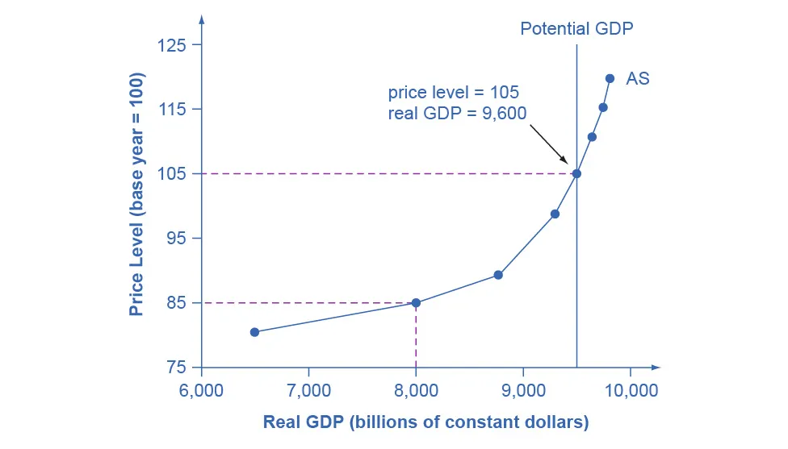
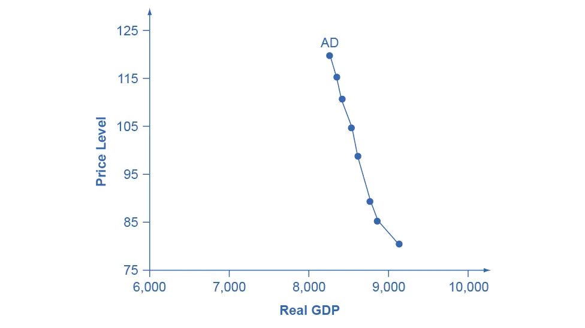
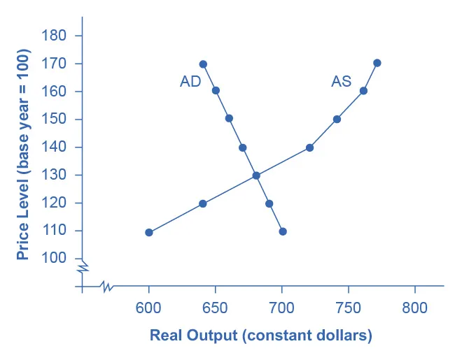
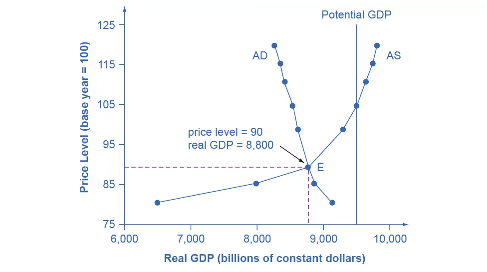

---

# Building a Model of Aggregate Demand and Aggregate Supply

## Learning Objectives

By the end of this section, you will be able to:

* Explain the aggregate supply curve and how it relates to real GDP and potential GDP
* Explain the aggregate demand curve and how it is influenced by price levels
* Interpret the aggregate demand/aggregate supply (AD–AS) model
* Identify the point of equilibrium in the AD–AS model
* Define short-run aggregate supply (SRAS) and long-run aggregate supply (LRAS)

---

## Introduction: The Aggregate Demand/Aggregate Supply Model

To build a useful macroeconomic model, we need a framework that explains:

* What determines **total supply** in the economy
* What determines **total demand** in the economy
* How total supply and total demand **interact at the macroeconomic level**

This framework is known as the **aggregate demand/aggregate supply (AD–AS) model**.
This model explains:

* Aggregate supply
* Aggregate demand
* The equilibrium between aggregate supply and aggregate demand

Later modules build on this foundation by explaining **what causes shifts** in aggregate supply and aggregate demand.

---

## The Aggregate Supply Curve and Potential GDP

### Definition of Aggregate Supply

Firms decide how much to produce based on **expected profits**. Profits depend on:

* The prices firms receive for their outputs
* The prices they must pay for inputs such as labor, energy, and raw materials

**Aggregate supply (AS)** refers to the **total quantity of output (real GDP)** that firms will produce and sell in the economy.

The **aggregate supply curve** shows the total quantity of real GDP firms will produce and sell **at each price level**.

---

### Figure 24.3: The Aggregate Supply Curve

---

---

Figure 24.3 shows:

* An **upward-sloping aggregate supply (AS) curve**
* A **vertical line representing potential GDP**

Key features of the graph:

* The AS curve slopes upward gradually between **6,500 and 9,000**
* It becomes **steeper between 9,500 and 9,900**
* The vertical line indicates **potential GDP**

**Explanation:**
Aggregate supply slopes upward because, when the price level of outputs rises while input prices remain fixed, firms can earn higher profits by increasing production.

---

### Axes of the Aggregate Supply Diagram

* **Horizontal axis:** Real GDP (GDP adjusted for inflation)
* **Vertical axis:** Price level

The price level represents the **average price of all final goods and services**, measured by an index such as the **GDP deflator**.

> The price level is different from the inflation rate:
>
> * The **price level** is an index number (like the CPI or GDP deflator)
> * The **inflation rate** is the percentage change in the price level over time

---

### Why Does Real GDP Rise as the Price Level Rises?

The price level in the AD–AS model refers to prices of **final goods and services**, not input prices.

When:

* Output prices rise
* Input prices (wages, energy, raw materials) remain constant

Firms experience higher profits and expand production.
Thus, the AS curve shows how producers respond to higher aggregate demand.

---

### Shape of the Aggregate Supply Curve

The slope of the AS curve changes across different output levels:

#### 1. Flat Region (Low Output)

* Output is far **below potential GDP**
* High unemployment
* Factories operate below capacity

A small increase in prices leads to a **large increase in output** because many unused resources are available.

#### 2. Intermediate Region

* Some firms reach capacity constraints
* Skilled labor becomes scarce
* Output still rises with prices, but by a **smaller amount**

#### 3. Near-Vertical Region (High Output)

* Economy is at or near **potential GDP**
* Labor and capital are fully employed

Higher prices **cannot increase output**, so the AS curve becomes nearly vertical.

---

### Potential GDP and Full Employment

**Potential GDP** is the level of real GDP an economy can produce when:

* Labor is fully employed (at the natural rate of unemployment)
* Capital and technology are fully utilized
* Existing legal and market institutions are in place

Potential GDP is also called **full-employment GDP**.

---

### Clear It Up: Why Does AS Cross Potential GDP?

Economists draw the AS curve crossing the potential GDP line because:

* In the short run, firms can push production beyond sustainable limits
* Workers may work overtime
* Machines may run 24 hours a day

This level of production is **not sustainable in the long run**, but it can occur temporarily.

---

## The Aggregate Demand Curve

### Definition of Aggregate Demand

**Aggregate demand (AD)** is the total spending on domestic goods and services in an economy.

It includes four components:

* Consumption (C)
* Investment (I)
* Government spending (G)
* Net exports (X – M)

Thus:
[
AD = C + I + G + (X - M)
]

The **aggregate demand curve** shows total planned spending at each price level.

---

### Figure 24.4: The Aggregate Demand Curve

---

---

Figure 24.4 shows:

* A **downward-sloping AD curve**
* Real GDP on the horizontal axis
* Price level on the vertical axis

As the price level rises, total spending falls.

---

### Why Does Aggregate Demand Slope Downward?

#### 1. Wealth Effect

* Higher price levels reduce the real value of savings
* Lower real wealth leads to lower consumption spending

#### 2. Interest Rate Effect

* Higher prices increase demand for money and credit
* Interest rates rise
* Borrowing for consumption and investment decreases

#### 3. Foreign Price Effect

* Higher domestic prices make exports more expensive
* Imports become cheaper
* Net exports fall

These effects are generally small, so the AD curve slopes downward **steeply**.

---

## Interpreting the AD–AS Model: Work It Out

### Table 24.1: Aggregate Demand and Aggregate Supply in Xurbia

| Price Level | Aggregate Demand | Aggregate Supply |
| ----------- | ---------------- | ---------------- |
| 110         | $700             | $600             |
| 120         | $690             | $640             |
| 130         | $680             | $680             |
| 140         | $670             | $720             |
| 150         | $660             | $740             |
| 160         | $650             | $760             |
| 170         | $640             | $770             |

---

### Steps to Find Equilibrium

1. Draw axes:

    * X-axis: Real GDP
    * Y-axis: Price Level

2. Plot the AD curve

3. Plot the AS curve

---

### Figure 24.5: AD and AS Curves for Xurbia

---

---

* The curves intersect at **Price Level = 130**
* Real GDP = **$680**

This is the **short-run macroeconomic equilibrium**.

---

### Interpreting the Equilibrium

* Equilibrium occurs in the **flat portion of AS**
* Economy is far from potential GDP
* High unemployment
* Stable price levels

If equilibrium were in the steep portion of AS:

* Economy would be near potential GDP
* Inflationary pressures would exist
* Unemployment would be low

---

## Equilibrium in the AD–AS Model

Equilibrium occurs where:

* Aggregate demand equals aggregate supply

At low prices:

* Firms produce little
* Consumers want to buy more

At high prices:

* Firms produce more
* Consumers buy less

---

### Figure 24.6: Aggregate Supply and Aggregate Demand

---

---

In Figure 24.6:

* Equilibrium occurs at point **E**
* Price level = **90**
* Real GDP = **8,800**

---

## Clear It Up: Are AS and AD Macro or Micro?

Although AD–AS diagrams resemble microeconomic supply and demand diagrams, they differ fundamentally:

### Key Differences

* **Vertical axis (macro):** Price level (GDP deflator or CPI)

* **Vertical axis (micro):** Price of a specific good

* **Horizontal axis (macro):** Real GDP

* **Horizontal axis (micro):** Quantity of a specific good

### Different Economic Logic

* Micro demand slopes downward due to substitution effects
* Aggregate demand slopes downward due to wealth, interest rate, and foreign price effects

Thus, AD–AS is a **macroeconomic model**, not a microeconomic one.

---

## Defining SRAS and LRAS

* The **short-run aggregate supply (SRAS)** curve shows how output responds to price changes when some prices are fixed.
* The **long-run aggregate supply (LRAS)** curve is vertical at **potential GDP**.

In the short run:

* Output can deviate from potential GDP

In the long run:

* Output is constrained by labor, capital, and technology

---

### Summary

The AD–AS model explains:

* How total demand and supply interact
* How equilibrium price level and output are determined
* The difference between short-run and long-run economic outcomes

This model is a core foundation for understanding inflation, unemployment, and economic growth.
