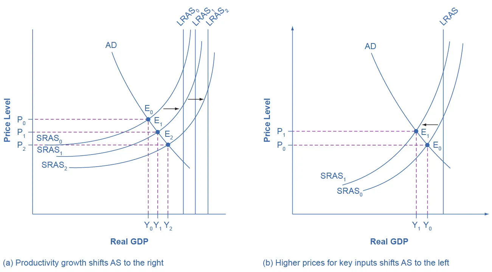

---

# Shifts in Aggregate Supply

## Learning Objectives

By the end of this section, you will be able to:

* Explain how productivity growth changes the aggregate supply curve
* Explain how changes in input prices change the aggregate supply curve

---

## Introduction: Shifts in the Aggregate Supply Curve

In the aggregate demand/aggregate supply (AD–AS) model, the economy is initially in equilibrium at the point where the aggregate demand (AD) curve intersects the aggregate supply (AS) curve. However, this equilibrium can change.

* If the **aggregate supply (AS) curve shifts to the right**, producers supply a **greater quantity of real GDP at every price level**.
* If the **aggregate supply curve shifts to the left**, producers supply a **lower quantity of real GDP at every price level**.

This section focuses on **two of the most important factors** that cause shifts in the aggregate supply curve:

1. **Productivity growth**
2. **Changes in input prices**

---

## How Productivity Growth Shifts the AS Curve

### Meaning of Productivity

**Productivity** refers to how much output can be produced with a given quantity of labor.
A common measure of productivity is:

* **Output per worker**, or
* **GDP per capita**

Over time, productivity tends to increase, allowing the same number of workers to produce more output.

Historically:

* In advanced economies such as the United States, real GDP per capita has grown at an average rate of **2% to 3% per year**
* Productivity growth was faster during periods such as:

    * The **1960s**
    * The **late 1990s through the early 2000s**
* Productivity growth was slower during periods such as:

    * The **1970s**

---

### Effect of Productivity Growth on Aggregate Supply

An increase in productivity means that firms can produce **more output at every price level**. As a result:

* The **short-run aggregate supply (SRAS) curve shifts to the right**
* Potential GDP increases
* The **long-run aggregate supply (LRAS) curve also shifts to the right**

---

---

Figure 24.7(a) illustrates:

* SRAS shifting from **SRAS₀ to SRAS₁ to SRAS₂**
* Equilibrium shifting from **E₀ to E₁ to E₂**
* LRAS shifting from **LRAS₀ to LRAS₁ to LRAS₂**, reflecting higher potential GDP

As productivity increases:

* Workers produce more GDP
* Full employment corresponds to a **higher level of potential GDP**
* Output increases
* There is **downward pressure on the price level**

---

### Key Result of Productivity Growth

If aggregate demand remains unchanged:

* A **rightward shift in SRAS** leads to:

    * **Higher real GDP**
    * **Lower or stable price levels**

However, because productivity growth usually occurs gradually (a few percentage points per year), its short-term effects on output and prices tend to be **relatively small** over months or a few years.

This phenomenon mirrors what we learned earlier:

* The **production possibilities frontier (PPF)** is fixed in the short run
* The PPF shifts outward in the long run due to productivity growth

The AS model captures the same idea using a different framework.

---

## How Changes in Input Prices Shift the AS Curve

### Role of Input Prices

Inputs that are widely used throughout the economy can significantly affect aggregate supply. Examples include:

* **Labor (wages)**
* **Energy products (such as oil)**
* **Imported intermediate goods**

---

### Higher Input Prices and Aggregate Supply

When the price of key inputs rises:

* Production costs increase
* Profitability declines
* Firms reduce output at each price level

As a result:

* The **short-run aggregate supply (SRAS) curve shifts to the left**

---

Figure 24.7(b) shows:

* SRAS shifting from **SRAS₀ to SRAS₁**
* Equilibrium moving from **E₀ to E₁**

The new equilibrium features:

* **Lower real GDP**
* **Higher price level**

---

### Macroeconomic Consequences of Rising Input Prices

A leftward shift of SRAS leads to:

* Reduced GDP (recession)
* Higher unemployment (output is further below potential GDP)
* Higher inflation (rising price level)

This combination of stagnation and inflation is particularly harmful.

---

### Historical Example: Oil Price Shocks

The U.S. economy experienced recessions associated with rising oil prices in:

* **1974–1975**
* **1980–1982**
* **1990–1991**
* **2001**
* **2007–2009**

In the **1970s**, this pattern of:

* Low growth
* High unemployment
* High inflation

was labeled **stagflation**.

---

### Falling Input Prices and Aggregate Supply

A decline in the price of key inputs has the opposite effect:

* Production becomes cheaper
* Firms expand output
* SRAS shifts to the **right**

Examples:

* **1985–1986:** Oil prices fell from about **$24 per barrel to $12 per barrel**
* **1997–1998:** Oil prices fell from about **$17 per barrel to $11 per barrel**

In both cases:

* SRAS shifted rightward
* Output increased
* Unemployment fell
* Inflation declined

This situation resembles the outward shift shown earlier in **Figure 24.7(a)**.

---

### Other Important Input Prices

In addition to energy prices, changes in:

* **Wages (labor costs)**
* **Prices of imported intermediate goods**

can also shift SRAS.

General rule:

* **Lower input prices → SRAS shifts right**
* **Higher input prices → SRAS shifts left**

Unlike productivity changes:

* Changes in input prices usually affect **SRAS only**
* **LRAS does not shift** because long-run productive capacity is unchanged

---

## Other Supply Shocks

### Shocks to Input Goods

Unexpected events can reduce the availability of key inputs. For example:

* An early freeze that destroys agricultural crops

Such a shock:

* Reduces available output
* Shifts the AS curve **to the left**

---

### Shocks to Labor Supply

Events that reduce the number of available workers can also affect aggregate supply.

#### Example: War

* Large numbers of workers leave civilian production
* Both **SRAS and LRAS shift left**
* Fewer workers are available to produce goods and services

---

### Example: Pandemic (COVID-19)

A pandemic can severely disrupt labor supply:

* Workers become sick
* Workers may avoid workplaces due to health concerns
* Production capacity falls

During the COVID-19 pandemic:

* Shortages occurred in:

    * Computer chips for automobiles
    * Meat
    * Various consumer services

These shortages reflected:

* Reduced labor availability
* A **leftward shift in SRAS**

Although such shocks may be temporary, they can significantly reduce output in the short run.

---

## Summary: Shifts in Aggregate Supply

* **Productivity growth** shifts both **SRAS and LRAS to the right**
* **Higher input prices** shift **SRAS to the left**
* **Lower input prices** shift **SRAS to the right**
* Supply shocks (natural disasters, war, pandemics) can reduce output and shift AS left
* Understanding AS shifts helps explain recessions, inflation, and economic recovery

---

