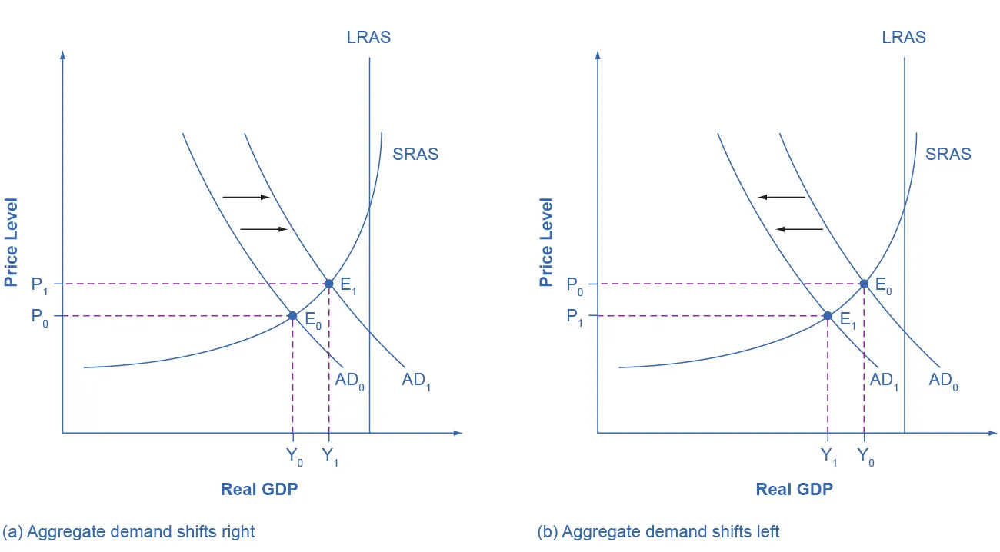

---

# Shifts in Aggregate Demand

## Learning Objectives

By the end of this section, you will be able to:

* Explain how imports influence aggregate demand
* Identify ways in which business confidence and consumer confidence can affect aggregate demand
* Explain how government policy can change aggregate demand
* Evaluate why economists disagree on the topic of tax cuts

---

## Introduction: Aggregate Demand and Its Components

Aggregate demand (AD) represents **total spending on domestically produced goods and services** in an economy. It consists of four components:

* **Consumption spending (C)**
* **Investment spending (I)**
* **Government spending (G)**
* **Net exports (X − M)**, where exports (X) are spending on domestically produced goods by foreigners and imports (M) are spending by domestic residents on foreign-produced goods

Thus, aggregate demand is defined as:

[
AD = C + I + G + X - M
]

A **rightward shift** of the AD curve means that **total spending has increased at every price level**.
A **leftward shift** of the AD curve means that **total spending has decreased at every price level**.

Shifts in aggregate demand occur when one or more of its components—C, I, G, or X − M—change. This section focuses on two broad sources of such shifts:

1. **Changes in consumer or firm behavior**
2. **Changes in government tax or spending policy**

---

## Clear It Up: Do Imports Diminish Aggregate Demand?

Aggregate demand is defined as demand for **domestically produced** goods and services. This explains why imports (M) are subtracted in the AD formula.

When a consumer buys a foreign-produced good:

* That purchase is initially counted as consumption (C)
* However, the income generated goes to **foreign producers**, not domestic ones

Therefore, imports must be subtracted so that AD reflects only domestic production.

Although imports appear with a minus sign, this **does not mean imports are “bad” for the economy**. Every dollar subtracted as imports corresponds to a dollar added to consumption, investment, or government spending. The terms cancel out correctly to avoid overstating domestic demand.

---

## How Changes by Consumers and Firms Can Affect Aggregate Demand

### Consumer Confidence and Aggregate Demand

When consumers feel optimistic about the future:

* They are more likely to spend
* **Consumption (C) increases**
* Aggregate demand shifts **to the right**

When consumer confidence falls:

* Households reduce spending
* Consumption declines
* Aggregate demand shifts **to the left**

The **University of Michigan Consumer Sentiment Index** provides a widely used measure of consumer confidence:

* Before the Great Recession, confidence averaged around **90**
* It fell below **60 in late 2008**, the lowest since 1980
* During the 2010s, it rose back into the **upper 90s**
* It fell to the **lower 70s in 2020** due to the COVID-19 pandemic, a level economists consider close to a healthy state

---

### Business Confidence and Aggregate Demand

When business confidence is high:

* Firms expect strong future demand
* Investment spending (I) increases
* Aggregate demand shifts **to the right**

When business confidence declines:

* Firms cut back on investment
* Aggregate demand shifts **to the left**

The **Organization for Economic Cooperation and Development (OECD)** publishes business tendency surveys, which measure expectations about:

* Selling prices
* Employment
* General business conditions

During the Great Recession:

* Business confidence declined sharply
  Afterward:
* It rose back to long-term averages
* The indicator dips below zero when business outlook is weaker than usual

Although these measures are imprecise, they are useful for identifying broad trends in confidence.

---

---

Figure 24.8(a) shows:

* Aggregate demand shifting from **AD₀ to AD₁**
* Equilibrium moving from **E₀ to E₁**
* Higher real GDP
* Higher price level
* Equilibrium closer to **potential GDP**

An increase in:

* Consumer confidence
* Business confidence
* Government spending
* Tax cuts that raise consumption

can all generate this rightward shift.

---

### Confidence Declines and Aggregate Demand

Consumer and business confidence often reflect current economic conditions:

* High during expansions
* Low during recessions

However, confidence can also change due to:

* Risk of war
* Election outcomes
* Foreign policy events
* Pessimistic forecasts by prominent public figures

Public statements by political leaders can influence confidence. Excessive pessimism may reduce spending, shifting AD left and potentially triggering the recession being warned about—a **self-fulfilling prophecy**.

---

Figure 24.8(b) shows:

* Aggregate demand shifting from **AD₀ to AD₁**
* Equilibrium moving from **E₀ to E₁**
* Lower real GDP
* Lower price level
* Equilibrium farther below potential GDP

---

## How Government Macroeconomic Policy Choices Can Shift AD

### Government Spending and Aggregate Demand

Government spending (G) is a direct component of aggregate demand:

* Higher government spending → AD shifts **right**
* Lower government spending → AD shifts **left**

Historical examples from the United States:

* Government spending fell from **21% of GDP in 1991** to **17.8% in 1998**
* From **2005 to 2009**, during the Great Recession, it rose from **19% to 21.4% of GDP**
* Since 2009, spending declined to **17–18% of GDP**
* In **2020**, it increased again to **18.5% of GDP**

Because U.S. GDP in 2009 was about **$14.4 trillion**, a change of just **2% of GDP** amounts to nearly **$300 billion**, which can significantly affect aggregate demand.

---

### Tax Policy and Aggregate Demand

Tax policy affects aggregate demand by influencing:

* Consumption (C)

* Investment (I)

* **Tax cuts for individuals** increase disposable income and consumption

* **Tax increases** reduce consumption

* **Corporate tax cuts or investment incentives** increase investment spending

Any change in C or I shifts the entire AD curve.

---

### Tax Cuts during Recessions

During recessions, governments often enact tax cuts. For example:

* During the **2001 recession**, the U.S. Congress passed a tax cut
* Political rhetoric emphasizes relief for households
* The AD/AS model provides an additional justification

---
During a recession, when unemployment is high and many businesses are suffering low profits or even losses, the U.S. Congress often passes tax cuts. During the 2001 recession, for example, the U.S. Congress enacted a tax cut into law. At such times, the political rhetoric often focuses on how people experiencing hard times need relief from taxes. The aggregate supply and aggregate demand framework, however, offers a complementary rationale, as Figure 24.9 illustrates. The original equilibrium during a recession is at point E0, relatively far from the full employment level of output. The tax cut, by increasing consumption, shifts the AD curve to the right. At the new equilibrium (E1), real GDP rises and unemployment falls and, because in this diagram the economy has not yet reached its potential or full employment level of GDP, any rise in the price level remains muted. Read the following Clear It Up feature to consider the question of whether economists favor tax cuts or oppose them.
---

Figure 24.9 illustrates:

* Initial equilibrium **E₀**, far below potential GDP (recession)
* Tax cuts increase consumption
* AD shifts right
* New equilibrium **E₁** has:

    * Higher real GDP
    * Lower unemployment
    * Only muted price-level increases because the economy is still below potential GDP

---

## Clear It Up: Do Economists Favor Tax Cuts or Oppose Them?

Economists do not uniformly support or oppose tax cuts—the answer is **“it depends.”**

Key considerations include:

1. **Whether tax cuts are accompanied by spending cuts**
   Economists differ on the appropriate size and role of government spending.

2. **Where the economy is relative to full employment**

    * During a recession, tax cuts can shift AD right and reduce unemployment
    * Near full employment, tax cuts may cause inflation with little output gain

Historical examples:

* **1981 Reagan tax cuts** followed two major recessions
* **2001 Bush tax cuts** occurred during recession
* **2009 Obama tax cuts** occurred during the Great Recession

Many economists support tax cuts in recessions but oppose them when the economy is already strong.

---

## Other Policies That Shift Aggregate Demand

Beyond fiscal policy:

* **Monetary policy** can shift AD
* The Federal Reserve influences:

    * Interest rates
    * Credit availability

Effects:

* Higher interest rates → less consumption and investment → AD shifts left
* Lower interest rates → more consumption and investment → AD shifts right
* Interest rates also affect exchange rates, influencing exports and imports

These mechanisms will be explored further in later chapters.

---

## Key Takeaways on Shifts in Aggregate Demand

* AD shifts right when total spending increases
* AD shifts left when total spending decreases
* Rightward shifts raise real GDP and price levels
* Leftward shifts lower real GDP and price levels
* The size of these effects depends on whether equilibrium lies on the flat or steep portion of the AS curve

Understanding shifts in aggregate demand is essential for analyzing recessions, recoveries, inflation, and macroeconomic policy decisions.
