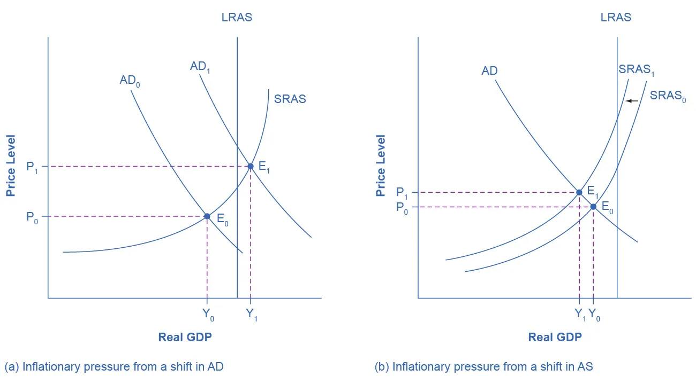

---

## How the AD/AS Model Incorporates Growth, Unemployment, and Inflation

### Learning Objectives

By the end of this section, you will be able to:

* Use the aggregate demand/aggregate supply (AD/AS) model to show periods of economic growth and recession
* Explain how unemployment and inflation impact the aggregate demand/aggregate supply model
* Evaluate the importance of the aggregate demand/aggregate supply model

---

## Introduction: The AD/AS Model and Macroeconomic Goals

The aggregate demand/aggregate supply (AD/AS) model conveys a number of **interlocking relationships** between the three major macroeconomic goals:

* **Economic growth**
* **Low unemployment**
* **Low inflation**

The AD/AS framework is flexible enough to:

* Incorporate **Keynes’ law**, which emphasizes aggregate demand and short-run economic fluctuations
* Incorporate **Say’s law**, which emphasizes aggregate supply and long-run economic growth

While the model is powerful, it is also a **simplified representation** of reality. As a result, the links between growth, unemployment, and inflation are sometimes indirect or incomplete. In this section, we examine how the AD/AS model illustrates these three macroeconomic goals.

---

## Growth and Recession in the AD/AS Diagram

### Long-Run Economic Growth

* Long-run economic growth caused by **productivity increases over time** is shown as a **gradual rightward shift of aggregate supply (AS)**.
* The **vertical line representing potential GDP**, also known as the *full employment level of GDP*, also shifts gradually to the right over time.
* Earlier examples showed economic growth occurring over several years, with the AS curve shifting slightly rightward each year.

However, the **underlying determinants of long-term growth**—such as:

* Investment in physical capital
* Investment in human capital
* Technological progress
* Catch-up growth

do **not appear directly** in the AD/AS diagram.

### Short-Run Fluctuations: Recession and Expansion

* In the short run, real GDP rises and falls as the economy expands or enters recession.
* A **recession** is illustrated when equilibrium real GDP is **substantially below potential GDP**.
* In such cases, the equilibrium point lies to the **left of potential GDP**, indicating underutilized resources.
* During periods of strong economic growth, equilibrium real GDP is typically **close to potential GDP**, indicating a healthy economy.

---

## Unemployment in the AD/AS Diagram

### Types of Unemployment

* **Cyclical unemployment** results from short-run economic fluctuations caused by the business cycle.
* Over the long run, economies experience a **natural rate of unemployment**, which persists even when the economy is healthy.

    * In the United States, this rate is typically around **5%**, give or take one percentage point.
    * In many European economies, unemployment rates have often remained closer to **10%**, even during good years.

The natural rate of unemployment depends on how effectively labor market institutions match workers with employers.

### Unemployment and Potential GDP

* Potential GDP reflects **full employment**, but full employment can correspond to **different unemployment rates** across countries due to differences in the natural rate of unemployment.
* The AD/AS model shows **cyclical unemployment** by comparing actual output to potential GDP:

    * When output is **close to potential GDP**, cyclical unemployment is low.
    * When output is **far below potential GDP**, cyclical unemployment is high.
* Although the AD/AS model does not separately show the natural rate of unemployment, it is **implicitly embedded** in the concept of potential GDP.

---

## Inflationary Pressures in the AD/AS Diagram

### Inflation over the Business Cycle

* Inflation tends to **rise during or just after economic booms**.
* Inflation generally **falls during recessions**, and in extreme cases may turn negative (deflation).
* Historical examples show inflation declining during recessions, including:

    * The Great Depression
    * The 1991–1992 recession
    * The 2001 recession
    * The 2007–2009 recession

Since the mid-1980s, inflation in the U.S. economy has generally remained within a **1–5% annual range**.

---

---

### Sources of Inflationary Pressure in the AD/AS Model

The AD/AS framework implies **two main sources** of inflationary pressure:

#### 1. Demand-Pull Inflation

* Occurs when **aggregate demand shifts to the right** while the economy is already **at or near potential GDP**.
* In this situation:

    * Labor and capital are fully employed.
    * Firms cannot increase output further.
    * Increased demand results primarily in **higher prices**, not higher output.
* The new equilibrium occurs at a **higher price level**, creating inflationary pressure.

---

#### 2. Cost-Push Inflation

* Occurs when **input prices rise** across much of the economy (for example, oil or labor).
* Rising input costs cause the **short-run aggregate supply (SRAS) curve to shift left**.
* This results in:

    * Lower real GDP
    * A higher price level
* The increase in production costs is passed on to consumers in the form of higher output prices.

---

### Inflation Persistence and Expectations

* The AD/AS diagram shows only a **one-time change in the price level**.
* It does not directly explain why inflation might:

    * Disappear after one year, or
    * Persist for several years

Two explanations for persistent inflation include:

1. **Continual government stimulation of aggregate demand** when the economy is already near full employment.
2. **Inflationary expectations**, where people expect inflation to continue and adjust wages, prices, and interest rates accordingly.

These explanations are closely related, but they are **not directly illustrated** in the AD/AS diagram.

---

## Importance of the Aggregate Demand/Aggregate Supply Model

Macroeconomics takes a broad view of the economy and must integrate many concepts, including:

* The three macroeconomic goals: growth, low unemployment, and low inflation
* The four components of aggregate demand:

    * Consumption
    * Investment
    * Government spending
    * Exports minus imports
* Aggregate supply, which shows how firms respond to changes in the price level
* Economic events and policy decisions such as:

    * Tax and spending policies
    * Consumer and business confidence
    * Changes in key input prices like oil
    * Technological improvements

The AD/AS model is one of the **fundamental diagrams in macroeconomics** because it:

* Brings together multiple economic forces in a single framework
* Helps explain both short-run fluctuations and long-run growth
* Appears repeatedly throughout the study of macroeconomics

Some version of the AD/AS model will be used in **every remaining chapter**, underscoring its central importance to understanding the economy as a whole.

---

