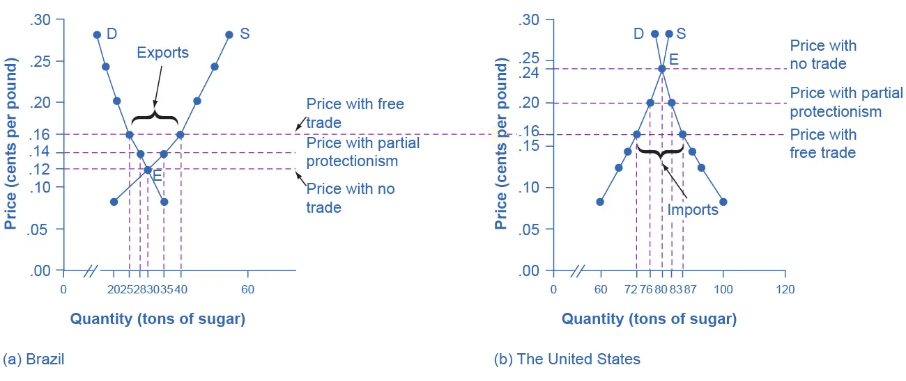
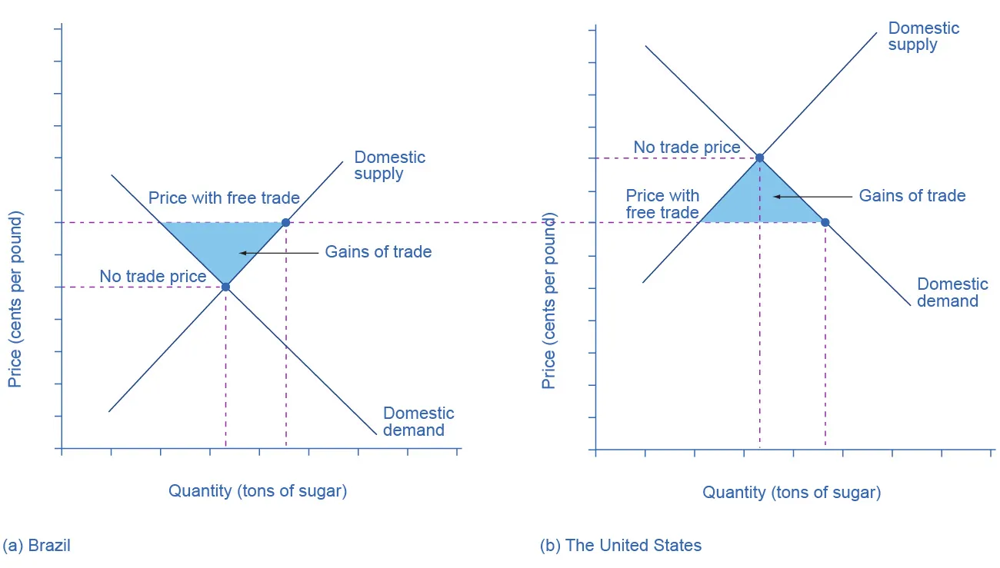
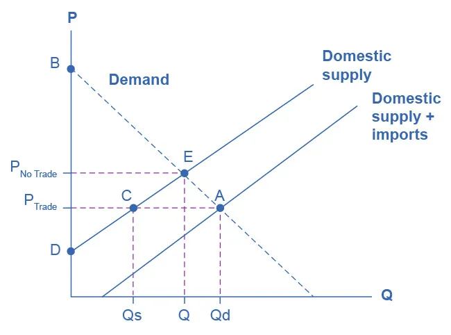

---

# Protectionism: An Indirect Subsidy from Consumers to Producers

---

## Learning Objectives

By the end of this section, you will be able to:

* Explain protectionism and its three main forms
* Analyze protectionism using demand and supply, noting its effects on equilibrium
* Calculate the effects of trade barriers

---

## 1. What Is Protectionism?

**Protectionism** occurs when a government enacts policies that reduce or block international trade. These policies are intended to protect **domestic producers and workers** from foreign competition.

Although protectionism may seem to simply transfer sales from foreign producers to domestic producers, demand and supply analysis shows that it also imposes **substantial costs on domestic consumers** and reduces overall economic efficiency.

---

## 2. The Three Main Forms of Protectionism

### 2.1 Tariffs

A **tariff** is a tax imposed on imported goods and services. By raising the price of imports, tariffs discourage consumers from purchasing foreign goods and increase demand for domestically produced substitutes.

Tariffs were widely used in recent years on a range of imported manufactured goods with the intention of protecting domestic industries.

---

### 2.2 Import Quotas

An **import quota** is a numerical limit on the quantity of a good that may be imported over a given period of time.

Historically, quotas have been used in industries such as automobiles, textiles, and sugar to limit foreign competition and maintain higher domestic prices.

---

### 2.3 Nontariff Barriers

**Nontariff barriers** include regulations, inspections, documentation requirements, and rules-of-origin laws that make importing goods more costly or difficult.

These barriers can restrict trade just as effectively as tariffs or quotas, even though they do not directly raise prices through taxation.

---

## 3. Protectionism and Employment

Protectionist policies often aim to preserve domestic jobs. While some jobs may be saved in protected industries, consumers pay higher prices, and employment losses may occur in other sectors where consumers would otherwise spend their savings.

Protectionism can also harm workers in low-income exporting countries by restricting their access to high-income markets.

---

## 4. International Trade Cooperation

To manage trade conflicts, countries established international trade agreements, beginning with the **General Agreement on Tariffs and Trade (GATT)** and later the **World Trade Organization (WTO)**.

These institutions provide frameworks for negotiating tariffs, quotas, and nontariff barriers.

---

## 5. Demand and Supply Analysis of Protectionism

Demand and supply analysis helps illustrate how protectionism affects prices, quantities, and economic surplus in both importing and exporting countries.

---

## 6. Example: Sugar Trade Between Brazil and the United States

Before trade, sugar prices differ between countries. When trade is allowed, sugar flows from the low-price country to the high-price country until prices converge.

---

---

## 7. Table: Sugar Trade Between Brazil and the United States

---

### Table 34.1 The Sugar Trade between Brazil and the United States

| Price (cents per pound) | Brazil: Quantity Supplied (tons) | Brazil: Quantity Demanded (tons) | U.S.: Quantity Supplied (tons) | U.S.: Quantity Demanded (tons) |
| ----------------------- | -------------------------------- | -------------------------------- | ------------------------------ | ------------------------------ |
| 8                       | 20                               | 35                               | 60                             | 100                            |
| 12                      | 30                               | 30                               | 66                             | 93                             |
| 14                      | 35                               | 28                               | 69                             | 90                             |
| 16                      | 40                               | 25                               | 72                             | 87                             |
| 20                      | 45                               | 21                               | 76                             | 83                             |
| 24                      | 50                               | 18                               | 80                             | 80                             |
| 28                      | 55                               | 15                               | 82                             | 78                             |

---

## 8. Gains from Trade

Free trade increases **total surplus** in both countries:

* Producers in the exporting country gain
* Consumers in the importing country gain
* Some producers and consumers lose due to income redistribution

Despite these distributional effects, total economic welfare rises under free trade.

---

---

## 9. Introducing Protectionism: Import Quotas

When a country imposes an import quota, the quantity of imports is restricted. This causes domestic prices to rise above the free-trade level and reduces the volume of trade.

Partial protectionism leads to outcomes between free trade and no trade.

---

## 10. Measuring the Effects of Trade Barriers

Trade barriers cause:

* A loss of **consumer surplus** due to higher prices
* A gain in **producer surplus** for protected domestic producers
* A net loss in **social surplus**, known as deadweight loss

---

---

## 11. Who Benefits and Who Pays?

* **Domestic producers** benefit from protectionism
* **Domestic consumers** pay higher prices
* **Foreign producers**, especially in low-income countries, often lose market access

Protectionism also eliminates gains from comparative advantage, specialization, and economies of scale.

---

## 12. Protectionism as an Indirect Subsidy

Protectionism functions as an **indirect subsidy** to domestic producers. Instead of receiving direct government payments, producers benefit because consumers are forced to pay higher prices.

The subsidy is indirect, but its economic effects are real and measurable.

---

